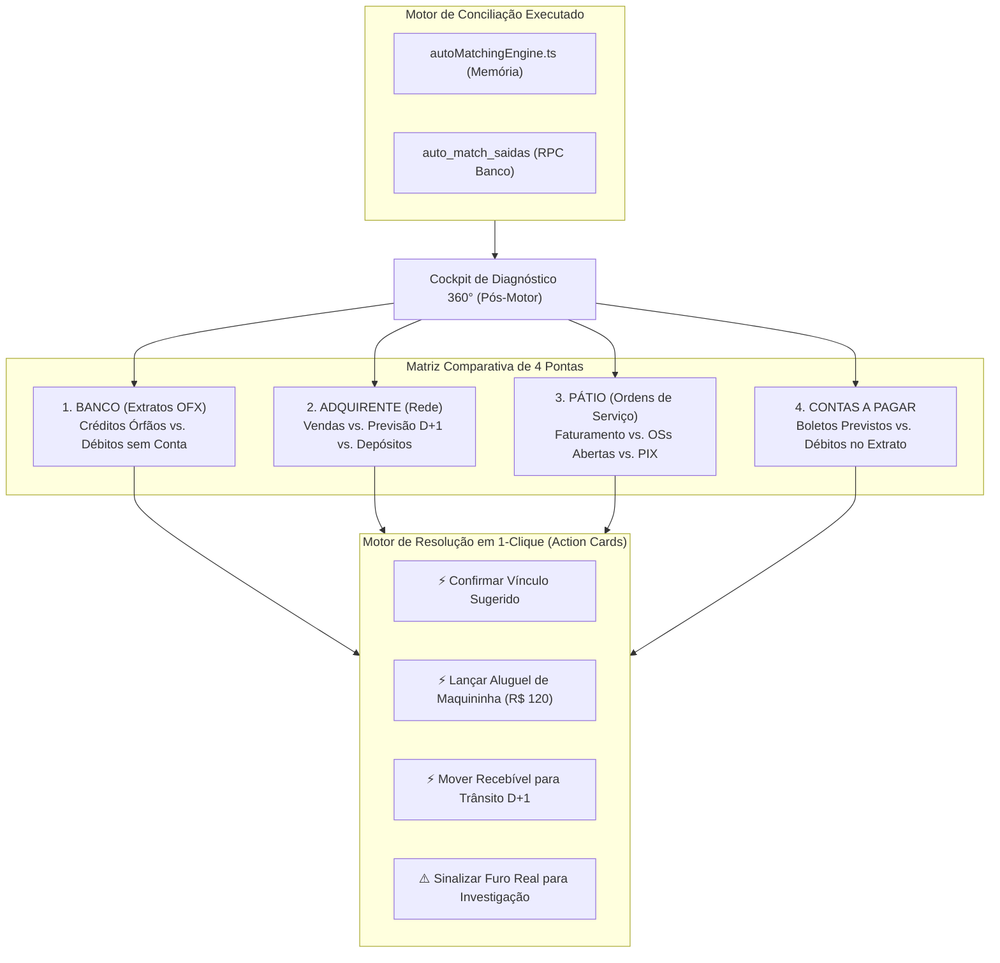

# Decisão do Conselho Técnico Deliberativo

**Tema:** Comparador e Diagnóstico Global Pós-Motor de Conciliação — Auditoria Cruzada 360°, Detecção Automática de Falhas e Resolução Guiada de Bugs
**Data:** 09/09/2026  
**Status:** **APROVADO UNANIMEMENTE [GO COM ESPECIFICAÇÃO DE COCKPIT DE AUDITORIA]**

---

## 🎭 Rodada 1 — Posições das Personas

### 1. O Pragmático
- **Diagnóstico:** Hoje, o motor de conciliação (`autoMatchingEngine.ts` e o pipeline do `CentralImportWizard.tsx`) executa o batimento, grava os dados no banco e encerra com logs textuais simplificados. O operador fica no escuro: para saber o que casou, o que sobrou órfão e por que o caixa não bateu, ele precisa navegar por 4 telas diferentes (Resumo do Dia, Contas a Pagar, Pátio e Conciliação de Lojas).
- **Solução Pragmática:**
  1. Criar uma visualização pós-motor imediata: **Cockpit de Diagnóstico 360° (Audit Strip & Discrepancy Matrix)**.
  2. Apresentar os 4 Quadrantes da Operação lado a lado:
     - **Banco (OFX):** Entradas e Saídas (Casadas vs. Órfãs).
     - **Cartões (Rede):** Vendas vs. Líquido Previsto vs. Lotes Creditados no Banco.
     - **Pátio (OSs):** Faturamento e Recebimentos (PIX e Cartão vinculados vs. OSs em aberto).
     - **Contas a Pagar:** Despesas do ERP vs. Débitos efetivos do extrato.
  3. Para cada discrepância detectada, oferecer um **Action Button de 1-Clique** (ex: *[Vincular PIX sugerido]*, *[Classificar tarifa de maquininha de R$ 120]*, *[Mover venda para D+1]*). Menos digitação, zero perda de tempo às 17h.

### 2. O Cético
- **Diagnóstico:** O maior risco de um "comparador pós-motor" é transformar o sistema em um gerador de maquiagem contábil (P-Hacking). Se o comparador permitir que o operador altere números arbitrariamente para "forçar o caixa a fechar", a verdade patrimonial da empresa é destruída. Além disso, rodar comparativos cruzados pesados em memória no frontend pode travar o navegador do cliente em dias com mais de 500 OSs e 1.000 linhas de extrato.
- **Solução Cética:**
  1. A comparação não pode ser cálculo volátil no cliente; ela deve ser calculada via **RPC Determinística no PostgreSQL** (`get_post_engine_reconciliation_audit(target_date)`), com garantia transacional ACID.
  2. Classificação rígida por **Severidade e Natureza da Falha**:
     - 🔴 **Inconsistência Crítica (Bug ou Furo Real):** Saldo contábil difere do extrato; débito bancário sem qualquer contrapartida; OS baixada sem entrada de dinheiro.
     - 🟡 **Latência Temporal Normal (Não é Bug):** Venda em cartão em $D$ com vencimento em $D+1$ ou $D+30$.
     - 🔵 **Variação Heurística:** Desconto de centavos de MDR ou arrendondamento.
  3. Toda e qualquer ação de correção via interface deve exigir registro em `audit_trail` com carimbo de data, usuário e evidência lógica.

### 3. O Arquiteto
- **Diagnóstico:** Falta de um **Single Source of Truth (SSOT)** para o diagnóstico. Atualmente, o frontend calcula matches no `autoMatchingEngine.ts`, o backend tem a RPC `get_daily_reconciliation_summary` e as telas de contas usam `auto_match_saidas`. Quando o usuário pergunta *"onde o sistema está falhando?"*, cada módulo fornece um diagnóstico ligeiramente discordante.
- **Solução Arquitetural:**
  1. **Audit Run Snapshot Pattern:** Após a execução do motor, o sistema gera uma entidade imutável de diagnóstico: `reconciliation_audit_runs`.
  2. **Motor de Regras de Causa-Raiz (Root-Cause Engine):** Desacoplar a detecção da discrepância da sua interpretação semântica:
     - `TEMPORAL_DRIFT`: Venda realizada hoje, mas data de liquidação prevista para amanhã (Regime de Competência vs. Caixa).
     - `MDR_OR_RENTAL_GAP`: Diferença entre o lote da Rede e o crédito do Itaú coincide com tarifa de terminal POS (ex: R$ 119/R$ 238) ou juros RAV.
     - `CLIENT_TOKEN_MISMATCH`: Valor idêntico entre PIX e OS na mesma filial, mas com divergência fonética no nome do depositante (ex: cônjuge pagou).
     - `CROSS_STORE_DEPOSIT`: PIX pago na filial Mauá caiu na conta bancária de Santo André.
     - `UNLINKED_EXPENSE`: Saída do banco sem boleto correspondente no Contas a Pagar.

### 4. O Advogado do Diabo
- **Diagnóstico:** O usuário diz *"preciso que compare também tudo, para ver onde o sistema está falhando e como podemos ajustar esses bugs"*. Mas atenção: **a maioria das falhas NÃO é bug de código, é sujeira e atrito do mundo real da oficina**.
  - O mecânico libera o carro sem dar baixa na OS;
  - O cliente faz PIX com a conta da mãe ou do primo;
  - A Rede cobra taxa de conectividade de R$ 49,90 não cadastrada no sistema;
  - A filial esquece de subir a planilha de contas do dia.
- **A Provocação:** Se o comparador apenas cuspir uma tela com "87 erros encontrados", o operador vai ficar paralisado e fechar o sistema. O comparador precisa atuar como um **Perito Investigador**, e não como um acusador. Ele deve separar com clareza cristalina:
  1. *O que é pendência normal de ciclo (não mexa, vai cair amanhã);*
  2. *O que é erro de processo da loja (ligue para a filial X e cobre a OS);*
  3. *O que é ajuste financeiro automático (clique aqui para aprovar a tarifa).*

---

## ⚖️ Rodada 2 — Refutação Cruzada e Trade-offs

- **Pragmático vs. Cético:** O Pragmático queria resolver o comparador com cálculos em memória no React. O Cético provou que se o operador recarregar a página ou outro usuário acessar de outra máquina, o diagnóstico se perde e os números divergem.  
  **Consenso:** O processamento inicial roda em memória para feedback instantâneo no wizard (< 200ms), mas o resultado consolidado é persistido no Supabase via RPC, garantindo que o relatório de auditoria fique salvo e consultável a qualquer momento.

- **Arquiteto vs. Advogado do Diabo:** O Arquiteto queria criar uma ontologia complexa com 12 tipos de anomalias contábeis e grafos de probabilidade. O Advogado do Diabo refutou: *"O operador da oficina às 17h15 tem 10 minutos para fechar o caixa e pegar o ônibus. Ele precisa de 4 caixas claras e botões óbvios, não de uma tese de doutorado."*  
  **Consenso:** O motor de diagnóstico classifica as divergências em **apenas 4 Categorias Acionáveis**:
  1. **Tempo (D+1 em Trânsito):** Dinheiro que vai entrar amanhã (Informativo, não altera delta).
  2. **Vínculo Provável (Fuzzy Match):** PIX com valor igual e nome aproximado (Requer 1 clique para confirmar).
  3. **Despesa Retida (Tarifa/Aluguel POS):** Lote menor pela taxa da maquininha (Requer 1 clique para lançar na DRE).
  4. **Furo Real (Sem Par):** Débito ou crédito totalmente órfão (Exige conferência manual).

---

## 🏁 Rodada 3 — Síntese Final e Decisão do Conselho

**Veredito Unânime:** **GO (Aprovado com Arquitetura de Cockpit de Diagnóstico 360° Pós-Motor)**

O conselho estabelece as seguintes diretrizes para implementação imediata:

### 1. Estrutura do Relatório Comparativo 360° (Os 4 Quadrantes)

### 2. Catálogo de Diagnósticos de Falhas & Ações Corretivas

| Categoria da Falha | Sintoma no Sistema | Causa-Raiz Real | Como o Sistema Ajusta (Ação de 1-Clique) |
| :--- | :--- | :--- | :--- |
| **Descasamento Temporal (D x D+1)** | Venda de cartão do dia $D$ aparece como "Não Entrou", mas o caixa de $D+1$ acusa entrada fantasma. | Regime de competência x caixa da Rede (venda hoje, depósito amanhã). | O comparador agrupa pelo `expected_credit_date`. Marca como `"Em Trânsito Normal (D+1)"` e exclui do alerta de furo. |
| **Tarifa Retida no Lote da Rede** | O depósito do Itaú veio R$ 119 ou R$ 238 menor que a soma líquida das vendas. | A Rede reteve o aluguel mensal da maquininha POS direto no crédito bancário. | Exibe Action Card: *"[⚡ Baixar Lote e Lançar Despesa de R$ 119,00 de Aluguel POS]"*. Caixa fecha no centavo. |
| **PIX com Nome de Terceiro** | PIX bancário de R$ 450 não vinculou com a OS de R$ 450 do cliente João. | O pagamento foi feito pelo cônjuge ou parente (nome bancário diferente). | O comparador detecta mesmo valor na mesma loja no mesmo dia e sugere: *"[⚡ Vincular PIX de Maria Silva à OS #1042 de João]"*. |
| **Débito Bancário Órfão** | Saída no extrato OFX (ex: R$ 380 de auto-peças) sem boleto no contas a pagar. | Operador pagou no balcão e não lançou o boleto no ERP antes de importar. | Exibe opção: *"[⚡ Criar Conta Paga Avulsa e Classificar Despesa]"*. |
| **PIX em Conta Trocada** | PIX da OS de Mauá caiu no banco Itaú de Santo André. | Cliente utilizou a chave PIX da matriz ou de outra filial do grupo. | Exibe opção: *"[⚡ Reconhecer como Transferência Intercompany e Equalizar Lojas]"*. |

### 3. Implementação Técnica

1. **Backend / Supabase:**
   - Criar RPC `get_daily_audit_diagnostics(p_date DATE)` que consolida em um único JSON estruturado:
     - Total de transações processadas vs. conciliadas;
     - Lista detalhada de transações órfãs (banco, cartão, OS e contas);
     - Sugestões heurísticas de amarração com score de confiança (0 a 100%);
     - Diferença matemática de cada loja e os 5 Pilares.
2. **Frontend:**
   - Adicionar o componente `PostEngineDiagnosticModal.tsx` ou tab de auditoria no final do fluxo do `CentralImportWizard.tsx`.
   - Exibir os cards de resolução de falhas antes de selar o fechamento definitivo do dia.
