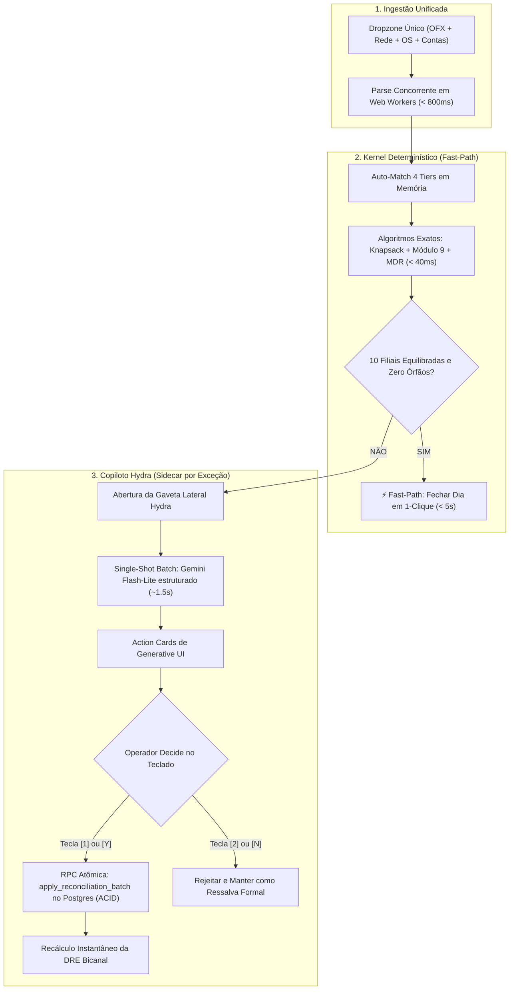

# 🏛️ CONSELHO TÉCNICO MULTIAGENTE — DELIBERAÇÃO & DECISÃO FINAL
## Tópico: Proposta de Conciliação Autônoma Conversacional / Sistema Hydra de IA

**Data:** 03 de Setembro de 2026  
**Status do Conselho:** Concluído (3 Rodadas Completas com Arbitragem Final)  
**Veredito:** 🟢 **[APROVADO COM REENGENHARIA ESTRUTURAL — DUAL-CORE ENGINE COM COCKPIT DE ACTION CARDS]**  
**Nível de Confiança Consolidado:** **0.96 / 1.00**

---

### 1. 🗺️ O Mapa de Consenso Unânime (Onde os 4 Especialistas Concordaram Plenamente)

1. **Veto Peremptório ao Chat Conversacional Linear (Texto Livre Turn-by-Turn):**
   - **O "Choque do 3º Dia":** Chat é o meio de MENOR densidade informacional existente (2 a 3 itens por tela contra dezenas em um dashboard financeiro). Um operador que fecha 10 filiais e 40 arquivos sob a pressão das 17h00 **não quer e não pode bater papo com robô**. 15 turnos síncronos de streaming de texto fariam o fechamento durar mais de 25 minutos (violando o SLA de < 2 minutos) e gerariam revolta imediata do operador.
2. **Veto Total ao "Goal Seeking" / P-Hacking Contábil ("Recalcular até a diferença dar zero"):**
   - Conciliação bancária é **apuração e revelação da verdade fática**, nunca manipulação de números para forçar a conta a fechar.
   - Dar à IA o mandato de mexer em faturamento, odômetro ou na gaveta de dinheiro do Daniel para forçar a diferença a zero é **fraude contábil automatizada (Cooking the Books)**. Se R$ 500 sumiram de uma loja, o papel do sistema é **gritar e registrar o rombo**, e nunca camuflá-lo inventando faturamento.
3. **Aprovação Unânime da "Hydra Operacional" via Generative UI / Action Cards (`[Proceed]` / `[Reject]`):**
   - A inteligência investigativa da Hydra (caçar PIX não vinculado, analisar despesas, cruzar OSs do pátio, diagnosticar loja por loja) é extraordinária e altamente viável, mas deve ser expressa visualmente através de **Action Cards tipados** com:
     - Diagnóstico do problema;
     - Impacto financeiro no Delta da loja;
     - Botão `[Proceed]` (ou tecla `1`/`Enter`);
     - Botão `[Reject]` (ou tecla `2`/`Esc`).
4. **Isolamento em Staging Efêmero (Unit of Work) & ACID no PostgreSQL:**
   - As "cabeças da Hydra" operam estritamente como **peritos de leitura e formulação de propostas**. Nenhuma cabeça faz `UPDATE` ou `DELETE` direto nas tabelas contábeis de produção.
   - As propostas ficam em memória/staging e só são aplicadas no banco de dados através de **RPCs transacionais ACID com bloqueio pessimista (`SELECT ... FOR UPDATE`)** após a aprovação expressa do operador.
5. **Algoritmos Determinísticos Antes de Chamar LLMs:**
   - Antes de gastar tokens ou aguardar a inferência da IA, o sistema executa em menos de 40ms:
     - **Knapsack Solver (Subset-Sum):** Verifica se 2 ou 3 transações órfãs somam exatamente o Delta residual;
     - **Teste do Módulo 9:** Detecta transposições de dígitos em digitação manual (ex: 495 vs 459);
     - **Decomposição MDR:** Checa se o resíduo corresponde exatamente às taxas de maquininha da Rede.

---

### 2. ⚔️ As Rebutações e o Refinamento do Design

| Tema | Tensão Inicial | Solução Reconciliada do Conselho |
| :--- | :--- | :--- |
| **Formato de Interação** | Chat aberto (User) vs Tabela crua clássica (Contrarian) | **Cockpit com Gaveta de Action Cards (Sidecar)**: Tela densa e limpa. Em 85% dos dias, o Fast-Path fecha em 1 clique sem abrir a gaveta. Se houver divergência, abre-se a gaveta com os Action Cards sugeridos. O chat de texto fica apenas como botão secundário ("Perguntar à IA") para casos raros. |
| **Aprovação em Lote** | Botão `[Proceed All Safe]` (Engineer) vs Carimbo Cego (Contrarian) | **Aprovação em Lote com Trava Rígida**: O botão de aprovação em lote só é habilitado para itens com score $\ge 0.98$, valor individual $\le \text{R\$} 300,00$ e satisfação estrita da matriz probatória de 4 dimensões (sem homônimos na filial). |
| **Governança Antifraude** | 2FA obrigatório com token (Analyst) vs Paralisia da Operação (Engineer) | **Schema Imutável + Trilha de Auditoria**: Em vez de travar o operador com 2FA em cada ajuste, o schema do banco **proíbe a IA de alterar faturamento ou dinheiro de cofre**, e cada clique em `[Proceed]` grava o timestamp e o ID do operador na tabela imutável `audit_ai_actions`. |
| **Trabalho por Loja** | Análise global misturada vs Gargalos isolados | **Matriz Semáforo das 10 Filiais (10x3)**: Visualização em grid compacto das 10 lojas no topo da tela. Verde para quem bateu, Âmbar para quem tem D+1 normal, e Vermelho pulsante para a filial divergente. Ao clicar na loja vermelha, a tela filtra cirurgicamente as OSs e transações daquela filial específica. |

---

### 3. 🏗️ Arquitetura Técnica Proposta (Roadmap para o `/proposal`)

---

### 4. 🏁 Veredito Final & Próximos Passos
O conselho declara **APROVADA** a implementação da Hydra, sob as seguintes salvaguardas mandatórias:
1. Interface centrada em **Action Cards visuais de Generative UI** com botões `[Proceed]` e `[Reject]`, e não um chat de digitação de texto aberto;
2. Bloqueio absoluto a qualquer tentativa de forçar a diferença a zero alterando números na marra;
3. Preservação do Fast-Path de 1-clique para dias que já entrarem equilibrados.
