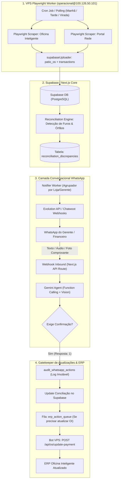

# 🏛️ Conselho Deliberativo Técnico: Playwright Scraper + Agente Autônomo WhatsApp (Chatwoot/Evo) para Conciliação e ERP

**Data:** 04 de Setembro de 2026  
**Tema:** Automação de extração e ingestão de dados via Playwright (Oficina Inteligente + Rede) integrada a um Agente Autônomo no WhatsApp (Chatwoot + Evolution API) para resolução de pendências e operação do ERP Oficina Inteligente.  
**Status:** CONCLUÍDO  
**Veredito:** 🟢 **[GO COM SALVAGUARDAS CRÍTICAS — ARQUITETURA DE 4 CAMADAS COM GATEKEEPER DE ESCRITA]**  
**Nível de Confiança:** **0.94 / 1.00**

---

## 🎯 1. Contexto e Premissa da Proposta

O usuário propõe uma evolução radical no fluxo de conciliação financeira:
1. **Robô Playwright Contínuo:** Executar scraping autônomo no ERP *Oficina Inteligente* e no portal da *Rede*, extraindo relatórios de OSs, contas e transações, e ingerindo tudo automaticamente na base da conciliação.
2. **Agente de IA no WhatsApp (Chatwoot + Evolution API):** Um agente proativo que detecta pendências e divergências contábeis (ex: PIX não identificado, OS sem baixa, diferença de caixa), entra em contato com o responsável/gerente da loja via WhatsApp, solicita dados/comprovantes ("e pede infos e os krl") e faz as atualizações.
3. **Agente com Acesso Ilimitado ao Oficina Inteligente:** O robô/agente teria permissão e credenciais para interagir diretamente com o ERP para buscar dados aprofundados e aplicar alterações/baixas solicitadas.

---

## 👥 2. Rodada 1 — Posições das Personas

### 🛠️ 1. O Pragmático (Simplicidade, Latência & Entrega Imediata)
> *"A ideia é excelente na ponta da dor, mas tem uma armadilha fatal de latência e acoplamento que precisamos matar no ninho: **NUNCA deixe o agente do WhatsApp acionar o Playwright de forma síncrona**.*
> 
> - *O Playwright leva de 8 a 25 segundos para abrir Chromium headless, contornar sessões, navegar nas páginas do ERP e raspar dados. Se o webhook do WhatsApp/Evolution esperar essa resposta, o usuário vai achar que o bot travou, vão ocorrer timeouts de webhook (5s padrão) e haverá enfileiramento caótico de mensagens.*
> - *O bot Playwright já existe na nossa VPS (`bot/src/server.ts`) com endpoints prontos (`/api/sync`, `/api/os/:id`, `/api/contas-pagar`). Ele deve rodar em **Background Batch / Scheduled Cron** (ex: 06h, 12h, 18h e sob demanda via fila).*
> - *Todos os dados do Oficina Inteligente e da Rede devem estar previamente gravados no **Supabase (`patio_os`, `transactions`, `contas_pagar`)**. O Agente do WhatsApp consulta o banco PostgreSQL em 5 milissegundos e responde instantaneamente.*
> - *Para inputs no WhatsApp: suporte a OCR de comprovante de PIX (envio de foto pelo gerente) e botões de resposta rápida da Evolution API em vez de conversas longas e abertas."*

### 🔒 2. O Cético (Segurança, Concorrência, Integridade & Risco ERP)
> *"O conceito de 'acesso ilimitado ao Oficina Inteligente' é uma bomba-relógio para o financeiro e fiscal da empresa se não houver um cerco rigoroso:*
> 
> 1. **Concorrência com Balcão Físico:** O Oficina Inteligente não possui controle de concorrência otimista (optimistic locking). Se um balconista na loja de Taguatinga estiver editando uma OS #4090 e o robô Playwright salvar uma alteração ao mesmo tempo via browser, quem salvou por último corrompe ou apaga o que o outro estava digitando.
> 2. **Alucinação Contábil e Prompt Injection:** No WhatsApp, qualquer operador pode mandar: *'Essa OS aí de 500 reais o cliente não pagou não, cancela ela aí pra mim'*. Se a IA tiver permissão autônoma de cancelar OS ou dar baixa em dinheiro sem aprovação de alçada, abrimos uma brecha direta para fraude interna ou desvio de caixa.
> 3. **Riscos Fiscais Irreversíveis:** No Oficina Inteligente, fechar certas OSs dispara faturamento fiscal (NFC-e / NFS-e). O agente NUNCA pode ter permissão de emitir documento fiscal ou cancelar vendas seladas.
> 4. **Autenticação no WhatsApp:** O bot precisa checar o número remetente contra uma tabela de `authorized_managers`. Números desconhecidos recebem recusa imediata."*

### 🏛️ 3. O Arquiteto (State Machine, Event-Driven & Type-Safety)
> *"Para essa engrenagem funcionar sem colapsar, precisamos de uma **Arquitetura Desacoplada Orientada a Eventos (EDA)** dividida em 4 camadas bem demarcadas:*
> 
> - **Camada 1 (Ingestor / Worker VPS):** O Playwright roda na VPS (`100.126.50.101`) gerenciado por PM2. Faz a extração e sobe os snapshots no Supabase com idempotência (`upsert`).
> - **Camada 2 (Motor de Pendências & State Machine):** Criamos a tabela `reconciliation_discrepancies` no Supabase. O motor de conciliação detecta desvios (ex: PIX de R$ 300 órfão) e cria uma pendência com status `PENDING_INFO`.
> - **Camada 3 (Dispatcher & Conversational Agent):** Um webhook intermediário (Next.js / Edge Function) conecta a Evolution API / Chatwoot. Quando uma nova pendência surge, o dispatcher envia uma mensagem estruturada com identificador único (`#PEND-1042`).
> - **Camada 4 (Execution Gatekeeper):** O agente interpreta a resposta do operador (texto, áudio via Whisper, ou comprovante de imagem via Gemini Vision). Se a resolução exigir alteração no ERP, a ação entra em uma fila de execução controlada (`erp_action_queue`) com validação de payload Zod e execução atômica."*

### ⚡ 4. O Advogado do Diabo (Adoção Operacional, Usabilidade & Efeito Spam)
> *"Vamos falar a verdade sobre o operador na ponta da linha:*
> 
> - *Se o bot mandar 20 mensagens por dia picadas no WhatsApp para cada gerente de loja ('Olá, temos a pendência 123...'), em 48 horas os gerentes vão colocar o contato no mudo ou responder 'veja com o financeiro'.*
> - *Conversa em texto livre ('e os krl') gera ambiguidade desgraçada. O gerente manda: 'aquela lá de 200 é do seu zé da saveiro'. Aí a IA alucina qual Saveiro é e altera a OS errada.*
> - *A solução DEVE utilizar os **Componentes Nativos da Evolution API**: List Messages (menus de opções), Buttons interativos (`[Aprovar]`, `[Rejeitar]`, `[Enviar Comprovante]`) e agrupar pendências em uma 'Pauta Diária da Loja' enviada em horários programados (ex: 11h30 e 17h00), em vez de tiros soltos a cada 5 minutos."*

---

## ⚔️ 3. Rodada 2 — Refutação Cruzada & Conflitos Diretos

### Conflito 1: Playwright em Tempo Real vs Cache no Supabase
- **O Usuário / Ideia Inicial:** Agente consulta o Oficina Inteligente na hora que precisar, diretamente pelo Playwright.
- **Refutação do Pragmático e Arquiteto:** Inviável. Tempo de carregamento do OI via Playwright varia de 10s a 30s. Navegar pelo DOM sob demanda via chat causa timeout e estouro de memória na VPS (múltiplas instâncias do Chrome abertas simultaneamente).
- **Consenso:** **Single Source of Truth (SSOT) no Supabase**. O Playwright alimenta o Supabase periodicamente. O agente responde dúvidas em 100ms consultando o banco. Se for estritamente necessária uma consulta ao vivo de uma OS não encontrada no banco, o agente aciona a rota `GET /api/os/:id` da VPS de forma assíncrona, avisando: *"Buscando a OS no Oficina Inteligente, um instante..."*.

### Conflito 2: "Acesso Ilimitado ao ERP" vs Salvaguardas de Risco
- **O Cético:** Veto absoluto a escrita desgovernada no ERP por IA.
- **O Pragmático:** Se o agente não puder atualizar nada, perde metade do valor.
- **Consenso Reconciliado (A Matriz de Alçada):**
  - **LEITURA no OI:** Ilimitada (OSs, clientes, peças, pagamentos, contas a pagar/receber).
  - **ESCRITA de Baixo Risco (Vinculação de Forma de Pagamento / Observações):** Permitida com confirmação explícita do operador (`Confirmar 1`).
  - **ESCRITA de Alto Risco (Descontos, Exclusão de Itens, Cancelamento de OS, Emissão Fiscal):** **TERMINANTEMENTE PROIBIDA** para o agente. Deve gerar link para o operador fazer manualmente na tela do ERP.

### Conflito 3: Conversação Livre vs Ações Estruturadas no WhatsApp
- **O Advogado do Diabo:** Conversa aberta é fábrica de bugs contábeis.
- **Consenso:** Abordagem híbrida. O agente aceita linguagem natural, áudio e fotos de comprovante, mas **SEMPRE fecha a transação com um Card de Confirmação Rígido**:
  > *"Identifiquei o comprovante de R$ 250,00 como pagamento da OS #8821 (Cliente: Carlos Silva - Placa: ABC-1234).  
  > Deseja que eu vincule este PIX à OS no sistema?  
  > 1️⃣ Sim, vincular agora  
  > 2️⃣ Não, verificar manualmente"*  
  A ação só é despachada após o recebimento do dígito `1` ou clique no botão.

---

## 🏗️ 4. Rodada 3 — Síntese Arquitetural Recomendada

---

## 📋 5. A Matriz de Permissões do Agente (RBAC do ERP)

| Operação no Oficina Inteligente | Permissão do Agente | Requisito de Execução |
| :--- | :---: | :--- |
| **Buscar OS por número / placa / cliente** | 🟢 **Total (Livre)** | Consulta direta ao banco local ou rota `GET /api/os/:id` |
| **Consultar Contas a Pagar / Receber** | 🟢 **Total (Livre)** | Rota `GET /api/contas-pagar` da VPS |
| **Ingerir Comprovante de PIX via WhatsApp** | 🟢 **Total (Livre)** | OCR/Vision -> Vinculação no Supabase |
| **Atualizar Forma de Pagamento da OS no ERP** | 🟡 **Controlado** | Confirmação explícita no WhatsApp (Dígito 1 ou Botão) |
| **Lançar Observação / Histórico na OS** | 🟡 **Controlado** | Registrado com tag `[ConciliaMEC-IA via WhatsApp]` |
| **Dar Desconto ou Abatimento Financeiro** | 🔴 **VETADO** | O agente avisa que desconto exige alçada de diretoria |
| **Excluir OS ou Cancelar Serviço** | 🔴 **VETADO** | Proibido terminantemente |
| **Emitir ou Cancelar Nota Fiscal (NFS-e/NFC-e)** | 🔴 **VETADO** | Risco fiscal irreversível |

---

## 📱 6. Fluxo de Experiência do Usuário (WhatsApp UX)

### Exemplo 1: Resolução de PIX Órfão
1. **Bot (17h05):**
   > *"🚗 **ConciliaMEC Alerta (Loja Taguatinga):**  
   > Recebemos um PIX de **R$ 380,00** às 15:42 (Titular: *Marcos Paulo Vieira*) que não está vinculado a nenhuma OS do pátio.  
   > 
   > Você sabe a qual OS pertence esse pagamento?  
   > Responda com o **número da OS** ou envie a **foto da ordem/comprovante**."*
2. **Gerente:**
   > *"É da OS 5122 do Palio"*
3. **Bot:**
   > *"Localizei a OS **#5122** (Fiat Palio - Placa: JHG-8910 - Total: R$ 380,00 - Status: Aguardando Pagamento).  
   > 
   > Posso confirmar a baixa de R$ 380,00 via PIX para esta OS no Oficina Inteligente?  
   > 1️⃣ Confirmar baixa agora  
   > 2️⃣ Cancelar"*
4. **Gerente:**
   > *"1"*
5. **Bot:**
   > *"✅ Pronto! OS #5122 conciliada e atualizada no Oficina Inteligente. A diferença da Loja Taguatinga foi zerada."*

---

## 🏁 7. Veredito Final & Diretrizes para o `/proposal`

O Conselho delibera **GO (Aprovado)** para o desenvolvimento do ecossistema Playwright + WhatsApp Bot, estabelecendo as seguintes prioridades para o `/proposal`:

1. **Fase 1 (Aproveitamento dos Ativos Existentes):**
   - O bot Playwright na VPS já possui os scrapers (`bot/src/server.ts`). Criar o cron de execução diária e os webhooks de status para o Supabase.
2. **Fase 2 (Endpoint de Webhook para Evolution API / Chatwoot):**
   - Criar rota de API no Next.js (`/api/webhooks/whatsapp`) com autenticação, rate-limit e suporte a mensagens de texto, áudio (Whisper) e imagens (Gemini Vision).
3. **Fase 3 (State Machine de Pendências):**
   - Tabela `reconciliation_discrepancies` com disparos inteligentes para os gerentes responsáveis por cada loja.
4. **Fase 4 (Worker de Execução no ERP):**
   - Rota no servidor Playwright (`POST /api/os/update-payment`) com lock exclusivo por OS para evitar conflito com o uso manual das oficinas.
