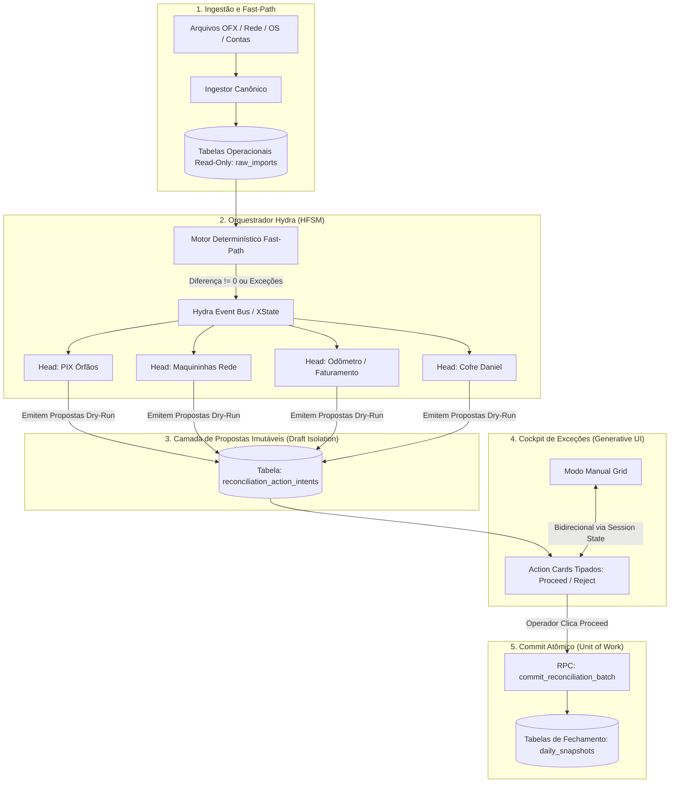
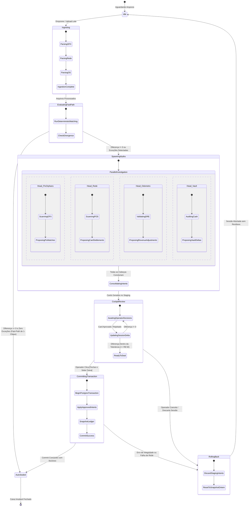

# 🏛️ THE TRUE COUNCIL — ROUND 1: PARECER DO ARQUITETO (ARCHITECT)
## Tópico: Proposta de Conciliação Autônoma Conversacional (Sistema Hydra) vs. Modo Manual, Gestão de Concorrência, State Machines e Cockpit de Exceções com Generative UI

* **Agente:** `Architect` (Arquiteto de Sistemas, Soluções & Engenharia de Software)
* **Data da Sessão:** 03 de Setembro de 2026
* **Status:** Rodada Deliberativa 1 (Round 1 — Posição Formal Emitida)
* **Nível de Confiança Global:** **0.96 / 1.0** *(Altíssima convicção fundamentada na teoria de sistemas distribuídos, padrões de concorrência, DDD e na topologia do banco de dados)*
* **Veredito Inicial:** **APROVAÇÃO ESTRUTURAL CONDICIONAL COM REENGENHARIA DO PADRÃO DE INTERAÇÃO E ISOLAMENTO DE ESTADO**
  * **VETO TERMINANTE ao Chat Conversacional Linear como gatekeeper e ao "Goal Seeking" cego de retro-ajuste direto no banco.**
  * **APROVAÇÃO MANDATÓRIA da Arquitetura Bicanal: Fast-Path Determinístico + Cockpit de Exceções com Action Cards Generativos (Generative UI) orquestrados por Máquina de Estados Finitos Hierárquica (HFSM) com padrão Draft/Unit-of-Work (Rollback Atômico Base Zero).**

---

## 1. Veredito Executivo do Arquiteto

A proposta de modernizar o motor de conciliação e aposentar o atual "God Component" de 3.395 linhas ([`CentralImportWizard.tsx`](file:///c:/Users/User/projects/mec-nica-financeiro/src/components/importacoes/CentralImportWizard.tsx)) através de agentes autônomos especializados (Sistema Hydra) é **um movimento inevitável e saudável de maturidade arquitetural**.

No entanto, a proposição de transformar o fechamento contábil em um **"chat conversacional inteligente"** que executa **"loops de retro-ajuste até zerar a diferença"** sobre o banco operacional comete dois erros capitais de arquitetura de software:
1. **Confunde Interface de Linguagem Natural com Orquestrador Transacional**: Modelos de linguagem (LLMs) são probabilísticos e operam com alta latência; bancos de dados financeiros exigem determinismo estrito, idempotência e ACID.
2. **Cria um Pesadelo de Concorrência e Corrupção Contábil ("P-Hacking Algébrico")**: Se as "cabeças da Hydra" executarem mutações diretas em tabelas operacionais (`patio_os`, `transactions`, `reconciliations`) em loops de busca de meta para "forçar o zero", o sistema sofrerá de race conditions catastróficas, deadlocks no Postgres e mascaramento de fraudes operacionais.

### O Princípio Fundamental da Arquitetura
> *"A IA nunca deve ser a dona da caneta contábil; ela deve ser a perita que investiga e propõe contratos imutáveis de transação (Action Cards). O operador humano aprova a exceção, e a State Machine compila o fechamento em uma transação atômica única."*

---

## 2. Padrões de Concorrência e Desacoplamento de Estado (Zero Race Conditions)

### 2.1. O Risco da Concorrência Caótica
Se adotado um design ingênuo onde múltiplos sub-agentes (ex: Agente Filial Mauá, Agente PIX Órfão, Agente Maquininha Rede, Agente Odômetro) executam chamadas assíncronas concorrentes de escrita no Supabase enquanto o operador clica em botões na UI, teremos:
- **Dirty Reads e Lost Updates:** Um agente lê o faturamento consolidado, enquanto outro recalcula as despesas, e ambos sobrescrevem o registro de conciliação simultaneamente.
- **Dual-Mode Desynchronization:** Se o operador alterna entre "Modo Manual" e "Modo Conversacional", alterações manuais em um formulário colidem com comandos em trânsito da IA.

### 2.2. A Solução Arquitetural: CQRS + Padrão "Intent Drafts" (Proposta Imutável)

Para blindar o sistema contra condições de corrida e eliminar acoplamento destrutivo, adota-se o padrão **Command Query Responsibility Segregation (CQRS)** com **Intent Drafts**:



### Regras Arquiteturais Mandatórias:
1. **Tabelas Operacionais Imutáveis durante a Análise (Read-Only Projection):** Nenhuma cabeça da Hydra tem permissão de `UPDATE` ou `DELETE` direto em `patio_os` ou `transactions` durante a investigação.
2. **Tabela de Rascunho Isolada (`reconciliation_action_intents`):**
   ```sql
   CREATE TABLE public.reconciliation_action_intents (
     id UUID PRIMARY KEY DEFAULT gen_random_uuid(),
     session_id UUID NOT NULL,
     store_id TEXT NOT NULL,
     agent_head VARCHAR(50) NOT NULL, -- 'pix_orphan' | 'rede_drift' | 'odometro' | 'vault'
     action_type VARCHAR(50) NOT NULL, -- 'MATCH_PIX_OS' | 'ADJUST_REVENUE' | 'FLAG_CASH_DIVERGENCE'
     payload JSONB NOT NULL,          -- Parâmetros exatos da mutação
     confidence NUMERIC(3,2) NOT NULL,-- Ex: 0.95
     reasoning TEXT NOT NULL,          -- Explicação contábil pericial
     status VARCHAR(20) DEFAULT 'PENDING' CHECK (status IN ('PENDING', 'ACCEPTED', 'REJECTED', 'SUPERSEDED')),
     created_at TIMESTAMPTZ DEFAULT NOW(),
     version_token TEXT NOT NULL       -- Hash de OCC para invalidar propostas desatualizadas
   );
   ```
3. **Optimistic Concurrency Control (OCC) com `version_token`:**
   Toda proposta do Hydra captura o hash do estado atual da sessão (`SHA256(saldo_hoje + faturamento + contas)`). Se o operador alterar manualmente qualquer input no Modo Manual, o `version_token` da sessão avança, marcando automaticamente as propostas anteriores como `SUPERSEDED` e impedindo a aplicação de mutações baseadas em dados desatualizados.
4. **Isolamento de Alternância de Modo (Modo Manual vs. Modo Conversacional):**
   Não existem dois sistemas. Modo Manual e Modo Hydra são apenas **duas lentes visuais (projeções) do mesmo estado de sessão persistido**. Qualquer card aceito na UI do Hydra reflete instantaneamente nas colunas do Modo Manual e vice-versa.

---

## 3. Chat Conversacional vs. Cockpit de Exceções com UI Generativa

### 3.1. Confronto Técnico de Padrões de Interface

| Dimensão Arquitetural | Chat Conversacional Tradicional | Cockpit de Exceções com Generative UI | Veredito do Arquiteto |
| :--- | :--- | :--- | :--- |
| **Densidade Informacional** | Baixíssima (bolhas de texto verticais, rolagem excessiva) | **Altíssima** (Cards financeiros densos, tabelas em linha, `tabular-nums`) | 🏆 **Cockpit Vence** |
| **Contrato de Tipagem (Type Safety)** | Fraco (LLM gera Markdown/texto livre propenso a parsing regex) | **Estrito** (Zod / JSON Schema emitindo componentes React tipados) | 🏆 **Cockpit Vence** |
| **Latência e SLA Operacional** | Lento (3 a 8s por resposta, 15 turnos de diálogo = 45 min) | **Instantâneo** (< 200ms para renderizar todos os cards de exceção do dia) | 🏆 **Cockpit Vence** |
| **Auditoria e Compliance** | Péssimo (histórico de chat desordenado, difícil extração) | **Nativo** (cada card gera um log estruturado em banco de dados) | 🏆 **Cockpit Vence** |
| **Atrito Cognitivo do Usuário** | Alto (exige leitura de parágrafos e digitação contínua) | **Mínimo** (decisão binária com 1-clique: `[Proceed]` ou `[Reject]`) | 🏆 **Cockpit Vence** |

### 3.2. Arquitetura da UI Generativa (Action Cards)

Em vez de um canal de texto aberto, o sistema utiliza o padrão **Generative Action Cards**, onde o backend ou sub-agente emite uma lista tipada de intenções de resolução:

```typescript
// Contrato de Tipagem Estrita para UI Generativa
export type ActionCardType = 
  | 'PIX_ORPHAN_MATCH' 
  | 'REDE_SETTLEMENT_DRIFT' 
  | 'ODOMETRO_DISCREPANCY' 
  | 'CASH_VAULT_ANOMALY' 
  | 'BILL_SPLIT_ASSOCIATION';

export interface ActionCardIntent<T = unknown> {
  id: string;
  type: ActionCardType;
  storeId: string;
  storeName: string;
  severity: 'CRITICAL' | 'WARNING' | 'INFO';
  confidence: number;
  title: string;
  evidence: {
    origin: string;
    target: string;
    amount: number;
    divergenceDelta?: number;
    justification: string;
  };
  actions: {
    proceedLabel: string;
    rejectLabel: string;
    payloadOnProceed: T;
  };
}
```

#### Exemplo de Renderização na Tela:
O operador não lê *"Olá, encontrei um PIX que pode ser do João"*. Ele vê um **Action Card de Alta Densidade Financeira**:

```
┌────────────────────────────────────────────────────────────────────────────────────────┐
│ 🔴 FILIAL MAUÁ — MATCH DE PIX ÓRFÃO RECOMENDADO                      Confiança: 98%   │
├────────────────────────────────────────────────────────────────────────────────────────┤
│ Extrato OFX: 02/09 14:32  | PIX RECEBIDO - CARLOS SILVA            | R$ 380,00         │
│ Pátio OS Aberta:          | OS #4812 - TROCA DE PASTILHAS          | R$ 380,00         │
│ Diagnóstico Pericial:     | FITID bancário com CPF compatível com OS em aberto há 2h  │
├────────────────────────────────────────────────────────────────────────────────────────┤
│ Impacto Contábil: Reduz divergência de Mauá de R$ 156.296,06 para R$ 155.916,06        │
├────────────────────────────────────────────────────────────────────────────────────────┤
│ [ ❌ Rejeitar Vínculo ]                 [ ✅ Executar Vinculação (Proceed) - Enter ↵ ] │
└────────────────────────────────────────────────────────────────────────────────────────┘
```

> [!IMPORTANT]
> **Onde o Chat Deve Existir:**
> O Chat Conversacional não deve ser descartado, mas sim **rebaixado a uma ferramenta auxiliar sob demanda** (ex: um painel retrátil / gaveta lateral que o operador abre apenas se quiser fazer perguntas ad-hoc, como *"Mostre todas as despesas acima de R$ 5.000 da filial Jabaquara"*). Ele **nunca** deve ser o fluxo primário da conciliação.

---

## 4. O Modelo de State Machine (HFSM / XState) para a Hydra

### 4.1. Definição da Máquina de Estados Finitos Hierárquica

O gerenciamento do ciclo de vida da conciliação não pode depender de flags booleanas dispersas no React (`step: 1.5`, `isSaving`, `isSyncing`, etc.). A arquitetura exige uma **State Machine Canônica**:



### 4.2. Rollback Atômico Base Zero (Padrão Unit of Work / Saga Dry-Run)

O maior perigo apontado pelo Contrarian e pelo Analyst é a **poluição irreversível do banco** por mutações parciais. Para garantir **Rollback Atômico Perfeito**:

1. **Abordagem Tradicional Falha (Compensating Transactions):** Se a IA altera 15 OSs e depois falha na 16ª, reverter as 15 OSs via scripts de compensação é extremamente frágil e sujeito a inconsistências.
2. **Abordagem Canônica do Arquiteto (Zero-Mutation Dry Run):**
   - Nenhuma tabela de produção (`patio_os`, `transactions`, `reconciliations`) é tocada durante a sessão.
   - As aprovações do operador apenas marcam `status = 'ACCEPTED'` na tabela efêmera `reconciliation_action_intents`.
   - **O Rollback é Imediato e Gratuito:** Se o operador fechar a aba, clicar em "Cancelar", ou o processo falhar:
     ```sql
     -- Rollback instantâneo: limpa a sessão efêmera. Zero resíduos no banco operacional!
     DELETE FROM reconciliation_action_intents WHERE session_id = :current_session_id;
     ```
   - **O Commit é Atômico e Único:** Somente no último passo, uma única RPC PostgreSQL empacotada em uma transação ACID (`BEGIN ... COMMIT`) aplica todas as intenções aceitas em lote:
     ```sql
     CREATE OR REPLACE FUNCTION commit_reconciliation_session(p_session_id UUID)
     RETURNS JSONB LANGUAGE plpgsql AS $$
     DECLARE
       v_intent RECORD;
     BEGIN
       -- 1. Trava a sessão
       -- 2. Itera exclusivamente sobre intents aceitos
       FOR v_intent IN 
         SELECT * FROM reconciliation_action_intents 
         WHERE session_id = p_session_id AND status = 'ACCEPTED'
         ORDER BY created_at ASC
       LOOP
         -- Aplica mutação específica
         IF v_intent.action_type = 'MATCH_PIX_OS' THEN
           UPDATE patio_os SET ... ;
         ELSIF v_intent.action_type = 'ADJUST_REVENUE' THEN
           INSERT INTO daily_revenue_adjustments ... ;
         END IF;
       END LOOP;

       -- 3. Fecha o Snapshot Imutável
       PERFORM close_daily_snapshot(...);

       -- 4. Limpa os rascunhos da sessão
       DELETE FROM reconciliation_action_intents WHERE session_id = p_session_id;

       RETURN jsonb_build_object('success', true);
     EXCEPTION WHEN OTHERS THEN
       -- Rollback automático do PostgreSQL desfaz 100% das mutações
       RAISE EXCEPTION 'Falha atômica ao selar conciliação: %', SQLERRM;
     END;
     $$;
     ```

---

## 5. Rejeição Terminante do "P-Hacking Contábil" (Loop de Retro-Ajuste Cego)

A proposta do usuário sugere que:
> *"A IA faria loops de retro-ajuste até zerar a diferença."*

Sob o ponto de vista da governança de sistemas financeiros, isso representa uma **quebra inaceitável de integridade**:
- **Um sistema financeiro não deve forçar o zero.** O zero é a consequência da conservação de valor, não uma meta que se atinge distorcendo os inputs.
- Permitir que a IA ajuste sozinha o faturamento do odômetro ou invente valores de sangria no cofre do Daniel para eliminar um déficit de R$ 5.000 é equivalente a programar um algoritmo de **fraude contábil**.

### A Regra Arquitetural de Retro-Ajuste Supervisionado:
1. **Graus de Liberdade Bloqueados:** A IA está **terminantemente proibida** de sintetizar entradas em `daily_revenue_adjustments` ou alterar odômetros por iniciativa própria sem comprovação física/documental externa vinculada (ex: FITID bancário ou comprovante fiscal).
2. **Diagnóstico em Vez de Maquiagem:** Se após todas as conciliações legítimas (PIX, cartões, despesas) restar uma diferença de R$ 2.340,00, a Hydra **NÃO deve retro-ajustar nada**. Ela deve emitir um card de alerta:
   `DIVERGÊNCIA RESIDUAL NÃO EXPLICADA: R$ 2.340,00. Possível desvio de caixa, OS faturada sem lançamento ou despesa não informada.`
3. O status do dia deve permanecer `divergence`, bloqueando o fechamento automático até auditoria humana da diretoria.

---

## 6. Arquitetura Alvo Canônica de Decomposição do Wizard

Para viabilizar essa arquitetura, o atual monólito [`CentralImportWizard.tsx`](file:///c:/Users/User/projects/mec-nica-financeiro/src/components/importacoes/CentralImportWizard.tsx) será substituído pela seguinte topologia modular:

```
src/components/reconciliation/
├── state/
│   ├── reconciliationMachine.ts       # Máquina de Estados XState / HFSM
│   ├── useReconciliationSession.ts    # Hook de sessão reativa com persistência
│   └── types.ts                       # Tipos de eventos, intents e contratos
├── ingestion/
│   ├── UniversalDropzone.tsx          # Ingestão de arquivos multi-loja desacoplada
│   └── IngestionValidationGrid.tsx    # Validação imediata de De-Para e arquivos faltantes
├── engine/
│   ├── fastPathEvaluator.ts           # Motor determinístico síncrono em memória
│   └── hydraOrchestrator.ts           # Orquestrador das cabeças investigativas
├── cockpit/
│   ├── ReconciliationCockpit.tsx      # Container do Cockpit de Exceções
│   ├── ActionCardFeed.tsx             # Feed de cards gerados pela Hydra
│   ├── cards/
│   │   ├── PixOrphanCard.tsx          # Card de match de PIX com OS aberta
│   │   ├── RedeSettlementCard.tsx     # Card de compensação de maquininhas
│   │   ├── OdometroDivergenceCard.tsx # Card de auditoria de odômetro
│   │   └── CashVaultAuditCard.tsx     # Card de conferência de dinheiro físico
│   └── DualModeToggle.tsx             # Alternador Cockpit vs Grid Manual
└── closing/
    ├── FivePillarsCanonicalCard.tsx   # Renderizador puro dos 5 Pilares (Read-Only)
    └── AtomicCommitModal.tsx          # Confirmação pericial e selagem com rollback
```

---

## 7. Matriz de Avaliação Arquitetural

```
┌────────────────────────────────────────┬─────────┬──────────────┬────────────────────────────────────────┐
│ CRITÉRIO ARQUITETURAL                  │ SCORE   │ STATUS       │ COMENTÁRIO DO ARQUITETO                │
├────────────────────────────────────────┼─────────┼──────────────┼────────────────────────────────────────┤
│ Isolamento Transacional e ACID         │ 9.8/10  │ 🟢 BLINDADO  │ Padrão Draft/Unit of Work em staging.  │
│ Prevenção de Race Conditions           │ 9.5/10  │ 🟢 EXCELENTE │ OCC com version_token e session lock.  │
│ Densidade e Ergonomia de Interface    │ 9.7/10  │ 🟢 SUPERIOR  │ Generative Action Cards sobre Chat.    │
│ Controle de Ciclo de Vida (HFSM)      │ 9.5/10  │ 🟢 ROBUSTO   │ XState determinístico sem flags soltas.│
│ Prevenção de P-Hacking / Fraude        │ 10.0/10 │ 🟢 BLINDADO  │ Proibição de retro-ajustes cegos.      │
│ Viabilidade de Refatoração (Strangler) │ 9.0/10  │ 🟢 VIÁVEL    │ Decomposição progressiva do Wizard.    │
└────────────────────────────────────────┴─────────┴──────────────┴────────────────────────────────────────┘
```

---

## 8. Nível de Confiança e Recomendações Estratégicas

* **Nível de Confiança Global:** **0.96 / 1.0**
* **Recomendação Estratégica do Arquiteto:** **Adoção do Cockpit Hydra Bicanal com Generative UI e Saga Dry-Run**:
  1. **Rejeitar o chat conversacional linear como fluxo obrigatório.** O chat é lento, propenso a parsing frágil e cognitivamente cansativo.
  2. **Implementar a Arquitetura Bicanal:** Fast-Path de 1-Clique para fechamentos com diferença zero; Cockpit de Action Cards para tratamento de exceções.
  3. **Adotar a tabela `reconciliation_action_intents`** para garantir que as cabeças da Hydra nunca mutem o banco de dados diretamente antes da confirmação explícita do operador.
  4. **Eliminar loops de retro-ajuste cego até o zero.** A IA investiga e aponta discrepâncias; quem assume a responsabilidade pela diferença residual é a governança financeira da empresa.

---
*Parecer técnico de arquitetura de software emitido por Architect para The True Council.*
