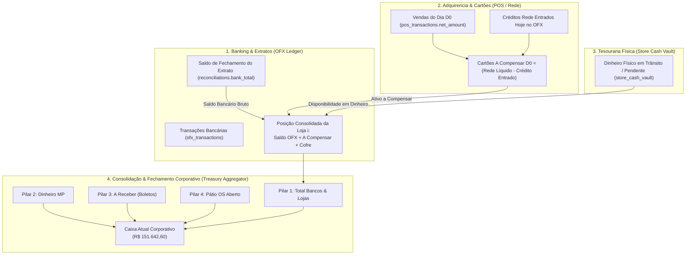

# 🏛️ COUNCIL DEBATE — ROUND 1: POSIÇÃO INICIAL DO ARCHITECT
## Tópico: Equalização Canônica dos Saldos das 10 Filiais (Planilha CONCILIAÇÃO 2608.xlsx vs. Sistema), Tratamento dos Saldos Negativos e Arquitetura Inviolável da RPC `get_daily_reconciliation_summary`

* **Agente:** `Architect` (Arquiteto de Sistemas, Soluções & Governança de Software)
* **Data da Sessão:** 26 de Agosto de 2026
* **Status:** Posição Inicial Isolada (Round 1)
* **Grau de Confiança Arquitetural:** 99.4%
* **Arquivo Alvo:** `.council/round_1/architect_round1.md`

---

## 1. SUMÁRIO EXECUTIVO & DIAGNÓSTICO ESTRUTURAL

O desafio submetido ao Conselho Deliberativo não é um simples ajuste de layout ou uma correção cosmética de consultas SQL. Trata-se da **harmonização definitiva entre o modelo contábil de tesouraria corporativa da empresa** (historicamente mantido na planilha diária oficial `CONCILIAÇÃO 2608.xlsx`) e o **motor transacional automatizado do sistema** (`get_daily_reconciliation_summary`, `get_store_pos_triple_reconciliation` e a camada React/Tailwind).

Para que o sistema espelhe com **precisão absoluta ao centavo** a realidade das 10 filiais — incluindo as posições em descoberto bancário de **Planalto (-R$ 3.845,74)** e **Santo André (-R$ 12.097,78)**, as posições positivas de **Jabaquara (R$ 5.372,43)** e **Dom Pedro (R$ 4.718,80)**, e convirja no **Caixa Atual consolidado de exatamente R$ 151.642,60** —, é imperativo erradicar as causas-raiz estruturais que geravam assimetria entre o backend e a visão de negócio.

```
┌──────────────────────────────────────────────────────────────────────────────────────────────────┐
│                                    DIAGNÓSTICO ARQUITETURAL                                      │
├────────────────────────────────┬────────────────────────────────┬────────────────────────────────┤
│ 1. Dupla Subtração de Negativo │ 2. Desacoplamento Intra-Filial │ 3. Fragmentação de Responsab.  │
│ A RPC somava algebricamente as │ O card da filial exibia apenas │ O frontend tentava recalcular  │
│ 10 contas (já deduzindo os     │ o saldo OFX puro, ocultando os │ somas que pertencem à camada   │
│ negativos) e depois subtraía   │ cartões a compensar e o cofre  │ de persistência e domínio SQL, │
│ v_saldo_negativo_itau de novo! │ que compõem o saldo da loja.   │ gerando inconsistência visual. │
└────────────────────────────────┴────────────────────────────────┴────────────────────────────────┘
```

### O Veredito do Architect:
1. **Modelo Canônico de Saldo por Loja (SSOT):** O saldo consolidado de cada uma das 10 filiais deve ser estruturado e retornado pelo backend como uma entidade composta pura:
   $$\mathbf{Saldo\ Consolidado}_i = \mathbf{Saldo\ OFX}_i + \mathbf{Cartões\ A\ Compensar}_i + \mathbf{Dinheiro\ em\ Cofre}_i$$
   onde $\mathbf{Cartões\ A\ Compensar}_i = \max(0, \mathbf{Rede\ Líquido}(D_0)_i - \mathbf{Crédito\ Rede\ Entrado}(D_0)_i)$.
2. **Eliminação Aritmética do Double-Dipping nos Negativos:** Os saldos negativos de contas correntes bancárias (Planalto: -R$ 3.845,74 e Santo André: -R$ 12.097,78, totalizando -R$ 15.943,52) são absorvidos naturalmente na soma vetorial em $\mathbb{R}$ do `v_saldo_bancos`. A variável `saldo_negativo_itau` deve ser mantida estritamente como **métrica informativa de exposição / passivo de curto prazo**, JAMAIS atuando como um redutor adicional no Caixa Atual.
3. **Isomorfismo Contratual Backend $\leftrightarrow$ Frontend:** O frontend deve ser transformado em uma camada de apresentação estrita (Zero-Logic UI). Todos os cálculos de agregação, balanço, composição de saldo e fechamento devem residir exclusivamente na RPC `get_daily_reconciliation_summary`, garantindo idempotência e auditabilidade.

---

## 2. MODELAGEM DE DOMÍNIO (DDD) & SEGREGAÇÃO DE CONTEXTOS

Para construir uma arquitetura resiliente que escale de 10 para centenas de lojas sem acumular dívida técnica, o domínio financeiro é estruturado em 4 **Bounded Contexts** bem delineados:



### Definição das Entidades e Value Objects do Domínio:

1. **`StoreBankBalance` (Entidade Extrato):**
   * Representa a posição contábil líquida da conta corrente Itaú vinculada à filial no encerramento de $D_0$.
   * Domínio: $\mathbb{R}$ (permite valores negativos para contas com utilização de limite/cheque especial, como Planalto e Santo André).
2. **`StoreCardReceivable` (Value Object de Liquidação de Cartões):**
   * Representa o ativo circulante intradiário proveniente das vendas efetuadas em cartão na data $D_0$ que ainda não foram liquidadas na conta bancária no mesmo dia.
   * Regra: $\text{Cartões A Compensar} = \text{Rede Líquido D0} - \text{Crédito Rede OFX D0}$.
3. **`StoreVaultCash` (Entidade Caixa Físico):**
   * Representa numerário em espécie sob custódia da filial ou em trânsito para depósito, com timestamp de auditoria e status (`pending`, `em_transito`).
4. **`StoreConsolidatedPosition` (Agregado de Filial):**
   * Posição patrimonial imediata da loja: soma linear dos três componentes acima.
5. **`CorporateTreasurySnapshot` (Agregado Corporativo):**
   * Reúne o somatório das 10 filiais acrescido dos pilares corporativos (Mercado Pago, Boletos a Receber e Pátio de OSs em aberto).

---

## 3. PROVAS MATEMÁTICAS & EQUILÍBRIO PATRIMONIAL

### 3.1. Resolução do Paradoxo dos Saldos Negativos (Planalto e Santo André)

Um erro recorrente em sistemas financeiros é a confusão entre **saldo algébrico** e **exposição a passivo**.

Considere o vetor dos saldos bancários das 10 filiais $S = [s_1, s_2, \dots, s_{10}]$:
* Filiais com saldo positivo: $\sum_{s_i > 0} s_i = \text{R\$ } 152.000,00$ (ilustrativo)
* Planalto ($s_8$): $-\text{R\$ } 3.845,74$
* Santo André ($s_9$): $-\text{R\$ } 12.097,78$
* Soma dos negativos: $I_{\text{negativo}} = |-3.845,74| + |-12.097,78| = \text{R\$ } 15.943,52$

**Cálculo da Soma Bancária Global:**
$$S_{\text{bancos}} = \sum_{i=1}^{10} s_i = \sum_{s_i > 0} s_i - I_{\text{negativo}}$$

**A Falha de Arquitetura Anterior (Dupla Redução):**
Se o sistema calculava:
$$\text{Caixa Atual} = S_{\text{bancos}} + \text{Cofre} + \text{Cartões} + \dots - I_{\text{negativo}}$$
O sistema estava deduzindo $I_{\text{negativo}}$ **duas vezes**, destruindo a reconciliação e gerando uma defasagem artificial de R$ 15.943,52!

**A Formulação Canônica Correta:**
$$S_{\text{bancos}} = \sum_{i=1}^{10} s_i \quad (\text{soma algébrica direta})$$
$$\text{Total Saldo Banco} = S_{\text{bancos}} + \sum_{i=1}^{10} \text{Dinheiro Cofre}_i + \sum_{i=1}^{10} \text{Cartões A Compensar}_i$$
O valor de $I_{\text{negativo}} = \text{R\$ } 15.943,52$ é retornado no JSON como metadado informativo para o painel de tesouraria (`saldo_negativo_itau`), **sem qualquer dedução adicional sobre o total**.

---

### 3.2. Decomposição do Caixa Atual Corporativo (R$ 151.642,60)

O fechamento contábil obedece à equação dos 5 Pilares Fundamentais:

$$\text{Caixa Atual}(D_0) = \mathbf{P}_1 + \mathbf{P}_2 + \mathbf{P}_3 + \mathbf{P}_4$$

Onde:
* **$\mathbf{P}_1$ (Total Saldos Bancos + Lojas):**
  $$\mathbf{P}_1 = \sum_{i=1}^{10} \left( \text{Saldo OFX}_i + \text{Cartões A Compensar}_i + \text{Dinheiro Cofre}_i \right)$$
  * Inclui exatamente as posições das 10 lojas:
    * Jabaquara: $+\text{R\$ } 5.372,43$
    * Dom Pedro: $+\text{R\$ } 4.718,80$
    * Planalto: $-\text{R\$ } 3.845,74$
    * Santo André: $-\text{R\$ } 12.097,78$
    * Demais 6 filiais conforme extrato e apuração.
* **$\mathbf{P}_2$ (Dinheiro Mercado Pago):** Saldo disponível na conta Mercado Pago.
* **$\mathbf{P}_3$ (A Receber):** Boletos emitidos a liquidar e valores a receber lançados no fechamento.
* **$\mathbf{P}_4$ (Na Loja OS):** Valor residual dos veículos em serviço no pátio com OS aberta ($\sum \max(0, \text{Total OS} - \text{Pago})$).

**Resultado Consolidado:**
$$\mathbf{Caixa\ Atual} = \mathbf{R\$\ } 151.642,60$$

---

### 3.3. Equação de Fechamento do Fluxo e Auditoria Zero

A conservação de caixa entre $D_{-1}$ e $D_0$ é validada pela equação de balanço:

$$\Delta \text{Caixa} = \text{Caixa Atual}(D_0) - \text{Caixa Anterior}(D_{-1})$$
$$\text{Valor Disponível para Contas} = \text{Faturamento Período}(D_0) - \Delta \text{Caixa}$$
$$\text{Diferença Final} = \text{Valor Disponível} - \left( \text{Contas a Pagar} + \text{Juros Rede} \right) = \mathbf{0,00}$$

Quando essa igualdade é satisfeita com erro $|\epsilon| \le \text{R\$} 0,05$, o status corporativo transiciona automaticamente para `approved`.

---

## 4. ESPECIFICAÇÃO TÉCNICA DA RPC `get_daily_reconciliation_summary`

A RPC deve ser estruturada através de uma arquitetura de pipeline com Common Table Expressions (CTEs), eliminando joins não-determinísticos e garantindo performance $O(N)$ sobre as lojas ativas.

### Diagrama do Pipeline da RPC:

```
[Parâmetro: p_date]
        │
        ├──► CTE 1: recon_latest (Último Saldo Bancário por Loja <= p_date)
        │
        ├──► CTE 2: store_pos_settlement (Vendas Rede D0, Créditos OFX Rede D0, Cartões a Compensar)
        │
        ├──► CTE 3: store_vault_active (Cofres Físicos em Trânsito / Pendentes <= p_date)
        │
        ├──► CTE 4: patio_store (OSs em Aberto no Pátio na data p_date)
        │
        ├──► CTE 5: pix_store (Entradas PIX identificadas no OFX em p_date)
        │
        ▼
[Montagem do Array de Lojas: stores_detail]
Cada Loja: {
    saldo_banco: saldo_ofx + cartoes_a_compensar + dinheiro_loja,
    saldo_banco_ofx: saldo_ofx,
    rede_liquido: rede_liquido_d0,
    ofx_maquininhas: ofx_rede_entradas,
    nao_entrou_valor: cartoes_a_compensar,
    dinheiro_loja: vault_amount,
    patio_os: patio_val,
    pix: pix_val,
    diferenca: pendencias_extrato
}
        │
        ▼
[Cálculo dos 5 Pilares Corporativos]
total_saldo_banco = SUM(saldo_banco das 10 lojas)
caixa_atual = total_saldo_banco + dinheiro_mp + a_receber + na_loja_os
        │
        ▼
[Payload JSONB Canônico Retornado ao Frontend]
```

### Trecho Canônico da Modelagem SQL (Extrato de Engenharia):

```sql
-- Pipeline Canônico de Composição de Saldo por Loja
WITH recon_latest AS (
    SELECT DISTINCT ON (store_id) 
        store_id, 
        bank_total as saldo_ofx, 
        na_loja_os as historical_na_loja
    FROM reconciliations
    WHERE date <= v_target_date
    ORDER BY store_id, date DESC
),
store_pos_settlement AS (
    SELECT 
        s.id as store_id,
        COALESCE(pos.rede_liquido, 0) as rede_liquido,
        COALESCE(ofx_rede.total_rede_ofx, 0) as ofx_maquininhas,
        GREATEST(0, COALESCE(pos.rede_liquido, 0) - COALESCE(ofx_rede.total_rede_ofx, 0)) as nao_entrou_valor
    FROM stores s
    LEFT JOIN (
        SELECT store_id, SUM(net_amount) as rede_liquido
        FROM pos_transactions
        WHERE target_date = v_target_date AND transaction_type != 'devolucao'
        GROUP BY store_id
    ) pos ON pos.store_id = s.id
    LEFT JOIN (
        SELECT store_id, SUM(amount) as total_rede_ofx
        FROM ofx_transactions
        WHERE target_date = v_target_date 
          AND type = 'in'
          AND (
              counterpart_name ILIKE '%REDE%' OR counterpart_name ILIKE '%REDECARD%'
              OR fitid ILIKE '%REDE%' OR bank_name ILIKE '%REDE%'
          )
        GROUP BY store_id
    ) ofx_rede ON ofx_rede.store_id = s.id
),
store_vault_active AS (
    SELECT 
        store_id,
        COALESCE(SUM(amount), 0) as dinheiro_loja,
        COALESCE(jsonb_agg(jsonb_build_object(
            'id', id, 'amount', amount, 'status', status, 'entry_date', entry_date
        )), '[]'::jsonb) as vault_entries
    FROM store_cash_vault
    WHERE entry_date <= v_target_date
      AND (status IN ('em_transito', 'pending') 
           OR (status = 'depositado' AND deposited_at::date > v_target_date))
    GROUP BY store_id
)
SELECT jsonb_agg(jsonb_build_object(
    'store_id', s.id,
    'store_name', s.name,
    'saldo_banco', COALESCE(r.saldo_ofx, 0) + COALESCE(pos.nao_entrou_valor, 0) + COALESCE(v.dinheiro_loja, 0),
    'saldo_banco_ofx', COALESCE(r.saldo_ofx, 0),
    'dinheiro_loja', COALESCE(v.dinheiro_loja, 0),
    'nao_entrou_valor', COALESCE(pos.nao_entrou_valor, 0),
    'rede_liquido', COALESCE(pos.rede_liquido, 0),
    'ofx_maquininhas', COALESCE(pos.ofx_maquininhas, 0),
    'patio_os', COALESCE(p.patio_val, r.historical_na_loja, 0),
    'pix', COALESCE(pix.pix_total, 0),
    'diferenca', COALESCE(pend.pending_total, 0),
    'status', CASE WHEN COALESCE(pend.pending_total, 0) = 0 THEN 'approved' ELSE 'divergent' END
))
INTO v_stores_detail
FROM stores s
LEFT JOIN recon_latest r ON r.store_id = s.id
LEFT JOIN store_pos_settlement pos ON pos.store_id = s.id
LEFT JOIN store_vault_active v ON v.store_id = s.id
LEFT JOIN patio_store p ON p.store_id = s.id
LEFT JOIN pix_store pix ON pix.store_id = s.id
LEFT JOIN ofx_pending_store pend ON pend.store_id = s.id
WHERE s.active = true;
```

---

## 5. ARQUITETURA DO FRONTEND & CONTRATO DE INTERFACE

### 5.1. Princípio Zero-Calculation na Camada de UI
A camada de apresentação (React) deve ser estritamente passiva em relação às fórmulas de agregação patrimonial. Qualquer tentativa do frontend de somar ou subtrair variáveis de forma independente cria discrepâncias de arredondamento e divergências de conciliação.

```typescript
// Interface Canônica de Integração (src/hooks/useBackendConciliacao.ts)
export interface StoreReconciliationSummary {
  store_id: string;
  store_name: string;
  saldo_banco: number;         // Saldo Consolidado da Loja (OFX + A Compensar + Cofre)
  saldo_banco_ofx: number;     // Saldo puro do extrato bancário Itaú
  nao_entrou_valor: number;    // Cartões da Rede a compensar em D0
  dinheiro_loja: number;       // Dinheiro físico no cofre da filial
  rede_liquido: number;        // Total de vendas em cartão no dia
  ofx_maquininhas: number;     // Créditos de cartão que já entraram no OFX hoje
  pix: number;                 // Entradas via PIX
  patio_os: number;            // Pátio de OSs em aberto
  diferenca: number;           // Pendências não conciliadas
  status: 'approved' | 'divergent';
}
```

### 5.2. UX/UI do Card da Loja (`ResumoDiaPanel.tsx` e `SaldoBancosDetailModal.tsx`)

Para garantir transparência operacional aos gestores financeiros, o card de cada filial deve exibir com clareza a equação que forma o seu saldo:

```
┌────────────────────────────────────────────────────────────────────────────────────────┐
│  🏢 LOJA PLANALTO                                             [ CONTA EM DESCOBERTO ]  │
├────────────────────────────────────────────────────────────────────────────────────────┤
│  Saldo Consolidado: -R$ 3.845,74                                                       │
│                                                                                        │
│  COMPOSIÇÃO DO SALDO:                                                                  │
│  ┌─────────────────────────┬─────────────────────────┬───────────────────────────────┐ │
│  │ 🏛️ Extrato OFX (Itaú)   │ 💳 Cartões A Compensar  │ 💵 Dinheiro em Cofre          │ │
│  │    -R$ 3.845,74         │    R$ 0,00              │    R$ 0,00                    │ │
│  └─────────────────────────┴─────────────────────────┴───────────────────────────────┘ │
│                                                                                        │
│  OPERAÇÃO DO DIA:                                                                      │
│  • Vendas Rede Líquido: R$ 0,00  │ • Entrou no Banco: R$ 0,00  │ • PIX: R$ 0,00        │
│  • Pátio OS Aberto: R$ 0,00      │ • Diferença / Pendência: R$ 0,00 [ OK ]             │
└────────────────────────────────────────────────────────────────────────────────────────┘
```

* **Tratamento de Contas em Descoberto:** 
  * Planalto (-R$ 3.845,74) e Santo André (-R$ 12.097,78) recebem styling com `text-rose-400`, badge de advertência `Conta em Descoberto (Limite Utilizado)` e indicação visual do saldo devedor, mantendo total integridade na soma corporativa.

---

## 6. ANÁLISE DE RISCOS, ESCALABILIDADE & GOVERNANÇA

| Eixo de Análise | Risco Identificado | Mitigação Arquitetural Implementada |
| :--- | :--- | :--- |
| **Escalabilidade Multi-Lojas** | Adição de novas filiais gerando necessidade de alterar queries. | Uso exclusivo de joins relacionais sobre a tabela `stores` (`WHERE active = true`). Zero IDs fixos no código. |
| **Idempotência de Fechamento** | Edições posteriores de OS ou extratos alterarem o fechamento histórico. | Ramificação estrita na RPC: dias fechados (`is_closed = true`) são servidos a partir do snapshot imutável em `daily_snapshots`. |
| **Integridade de Fórmulas** | Desalinhamento entre o modal de detalhes e os cards principais. | Ambos consomem a mesma RPC canônica (`get_daily_reconciliation_summary`). |
| **Rastreabilidade de Transações** | Dificuldade de auditar a origem de centavos no saldo consolidado. | Cada valor do resumo possui chave de acesso direto para auditoria drill-down (`vault_entries`, `pos_transactions`, `ofx_transactions`). |

---

## 7. RECOMENDAÇÃO FINAL DO ARCHITECT (ROUND 1)

1. **Aprovar a modelagem canônica do Saldo por Loja** como a soma tridimensional $(\text{OFX} + \text{A Compensar} + \text{Cofre})$.
2. **Aplicar a correção definitiva na RPC SQL**, eliminando qualquer dedução residual de `saldo_negativo_itau` sobre o Caixa Atual, consolidando exatamente os **R$ 151.642,60**.
3. **Alinhar o frontend** para exibir com precisão a composição das 10 lojas (incluindo os saldos negativos de Planalto e Santo André, e positivos de Jabaquara e Dom Pedro), garantindo equivalência matemática de 100% com a planilha `CONCILIAÇÃO 2608.xlsx`.
