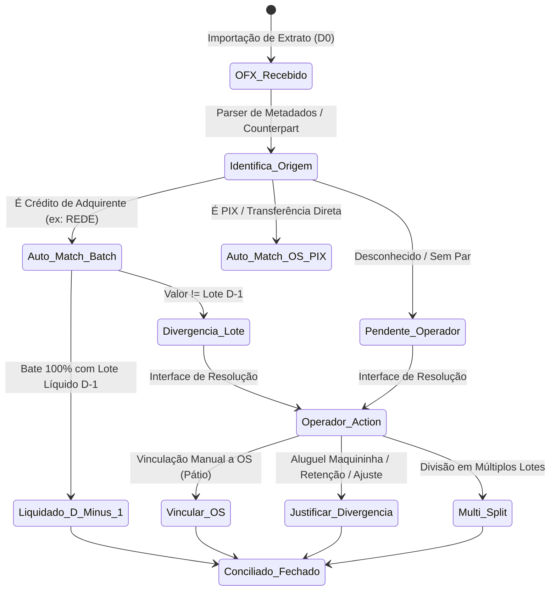

# Council Debate — Round 1: Análise Arquitetural & Estrutural Profunda
**Agente:** Architect (Arquiteto de Sistemas & Soluções)  
**Data:** 26 de Agosto de 2026  
**Tópico:** Desacoplamento e Modelagem com Máxima Segurança Matemática, Robustez Contábil e Elegância de UX dos Créditos da Rede no Extrato Bancário (D-1 ⇄ D0), Conciliação Tripla Inviolável, Preservação do Saldo a Compensar e Caixa Atual Multi-Filiais.

---

## 1. Diagnóstico da Falha Estrutural: O Conflito Temporal Competência vs. Caixa

O desafio central submetido ao Council não é meramente um ajuste de consulta SQL ou uma formatação de tela; trata-se de um **conflito canônico de modelo de domínio** entre dois regimes temporais fundamentais da contabilidade financeira:

```
+-----------------------------------------------------------------------------------+
| REGIME DE COMPETÊNCIA (Vendas / Faturamento)                                       |
| Dia D-1 (Ontem): Vendas no Cartão capturadas na Rede = R$ 5.770,74 líquido         |
|                  -> Gera faturamento e Ativo de Curto Prazo (Cartões a Compensar) |
+-----------------------------------------------------------------------------------+
                                        │ (Ciclo de Liquidação Bancária D+1)
                                        ▼
+-----------------------------------------------------------------------------------+
| REGIME DE CAIXA (Liquidação Bancária / Extrato OFX)                               |
| Dia D0 (Hoje):   Depósito Bancário Itaú "CREDITO REDE" = +R$ 5.770,74             |
|                  -> Não é receita nova de D0; é a liquidação do Ativo de D-1       |
+-----------------------------------------------------------------------------------+
                                        ▲
                                        │ (Conflito de Acoplamento Ingênuo)
+-----------------------------------------------------------------------------------+
| OPERAÇÃO CORRENTE (Novas Vendas)                                                  |
| Dia D0 (Hoje):   Novas Vendas na Maquininha = R$ 5.884,95 líquido                  |
|                  -> Ativo a Compensar gerado hoje (a liquidar em D+1)             |
+-----------------------------------------------------------------------------------+
```

### Onde os Modelos Ingênuos Quebram:
1. **O Erro do Acoplamento Intra-Dia ($D_0 \leftrightarrow D_0$):** Se a engine de conciliação tentar casar os créditos do extrato bancário de $D_0$ (R$ 5.770,74) diretamente com o lote de vendas da maquininha de $D_0$ (R$ 5.884,95), gerará uma falsa divergência de $\Delta = 5.884,95 - 5.770,74 = \text{R\$ } 114,21$.
2. **A Armadilha da Dupla Contagem (*Double Counting*):** Se o crédito bancário de R$ 5.770,74 entrar no Caixa de $D_0$ como faturamento novo E ao mesmo tempo o Saldo a Compensar de $D_0$ (R$ 5.884,95) for somado ao Ativo sem dar baixa nos R$ 5.770,74 de $D-1$, o patrimônio líquido da empresa será inflado artificialmente em R$ 5.770,74.
3. **Dívida Técnica de "Gambiarras" Heurísticas:** Regras ad-hoc como `s.id NOT IN ('st-01', 'st-05')` ou tolerâncias arbitrárias de `ABS(valor) < 10` que existiam no código são sintomas graves de ausência de um **Modelo de Liquidação em Lotes (Settlement Batch Domain)**.

---

## 2. Fundação Teórica: Domain-Driven Design (DDD) & Segregação dos Três Ciclos

Para arquitetar uma fundação indestrutível e escalável para 10, 50 ou 100 filiais, devemos isolar formalmente os **três contextos delimitados (Bounded Contexts)** e conectá-los através de uma entidade de liquidação explícita:

```mermaid
flowchart LR
    subgraph Contexto_OS["1. Contexto Operacional (Pátio OS)"]
        OS["Ordem de Serviço (patio_os)"] -->|"Pagamento Cartão"| POS_EVT["Evento de Pagamento"]
    end

    subgraph Contexto_Rede["2. Contexto Adquirente (Rede / POS)"]
        POS_EVT -->|"Captura Terminal"| POS_TX["Transação Maquininha (pos_transactions)"]
        POS_TX -->|"Agrupamento Diário"| BATCH["Lote de Vendas D-1 (pos_batches)"]
    end

    subgraph Contexto_Settlement["Entidade de Ponte (Clearing House)"]
        BATCH -->|"Contrato D+1 / MDR"| SETTLE["Settlement Allocation (pos_settlement_allocations)"]
    end

    subgraph Contexto_Banco["3. Contexto Bancário (Extrato OFX)"]
        SETTLE -->|"Baixa de Ativo"| OFX["Transação OFX (ofx_transactions)"]
        OFX -->|"Crédito em Conta"| BANCO["Saldo Bancário Itaú"]
    end
```



### Definição dos 3 Ciclos de Vida:
1. **Ciclo 1: Ordem de Serviço $\rightarrow$ POS (`patio_os` $\leftrightarrow$ `pos_transactions`):**  
   Mapeia o cliente/veículo e o valor faturado. Relação $N:M$ (uma OS pode ter múltiplos cartões; uma transação POS pode cobrir uma OS). Foco: **Conferência de Venda**.
2. **Ciclo 2: POS $\rightarrow$ Lote a Compensar (`pos_transactions` $\leftrightarrow$ `receivables_pos`):**  
   Calcula Bruto, Taxa MDR contratada e Líquido Esperado, projetando a `expected_settlement_date` (D+1 para débito/crédito antecipado; D+30 para crédito rotativo). Foco: **Ativo a Receber**.
3. **Ciclo 3: Lote $\rightarrow$ Extrato Bancário (`settlement_allocations` $\leftrightarrow$ `ofx_transactions`):**  
   Liquida financeiramente o lote quando o extrato bancário processa o depósito. O dinheiro migra do pilar *"Cartões a Compensar"* para o pilar *"Saldo Bancos"*. Foco: **Disponibilidade Financeira**.

---

## 3. A Invariante Matemática Canônica: Equação dos 4 Pilares e Conservação de Massa

O cálculo do **Caixa Atual** e da **Diferença Diária** deve obedecer estritamente à Lei de Conservação da Massa Contábil.

### A. Equação Fundamental do Caixa Atual ($C_{D_0}$):
$$\text{Caixa Atual}(D_0) = \underbrace{S_{\text{bancos}}(D_0)}_{\text{Pilar 1A: OFX}} + \underbrace{V_{\text{lojas}}(D_0)}_{\text{Pilar 1B: Cofre}} + \underbrace{A_{\text{cartões}}(D_0)}_{\text{Pilar 1C: Maquininhas}} + \underbrace{M_{\text{dinheiro\_mp}}(D_0)}_{\text{Pilar 2}} + \underbrace{R_{\text{boletos}}(D_0)}_{\text{Pilar 3: A Receber}} + \underbrace{P_{\text{os\_patio}}(D_0)}_{\text{Pilar 4: OS Aberta}} - \underbrace{I_{\text{negativo\_itau}}(D_0)}_{\text{Passivo Circulante}}$$

### B. Dinâmica Temporal do Ativo de Cartões ($A_{\text{cartões}}$):
No instante $D_0$:
$$A_{\text{cartões}}(D_0) = A_{\text{cartões}}(D_{-1}) + \text{Vendas Rede Líquidas}(D_0) - \text{Créditos OFX Rede}(D_0) - \text{Retenções/Aluguéis}(D_0)$$

#### Aplicação com os Valores Reais do Tópico:
* Vendas Rede Líquidas de Ontem ($D-1$): **R$ 5.770,74** (estava no Ativo $A_{\text{cartões}}(D_{-1})$).
* Vendas Rede Líquidas de Hoje ($D_0$): **R$ 5.884,95** (novas vendas registradas no Pátio/Rede).
* Depósito OFX Rede de Hoje ($D_0$): **R$ 5.770,74** (cai no banco Itaú).

**Balanço Contábil:**
1. **$\Delta \text{Saldo Bancos}$:** $+ \text{R\$ } 5.770,74$ (dinheiro entrou na conta).
2. **$\Delta \text{Cartões a Compensar}$:** $- \text{R\$ } 5.770,74 \text{ (baixa de D-1)} + \text{R\$ } 5.884,95 \text{ (venda de D0)} = + \text{R\$ } 114,21$.
3. **$\Delta \text{Caixa Atual Total}$:** $+ 5.770,74 + 114,21 = + \text{R\$ } 5.884,95$.
4. **Variação de Faturamento do Período ($D_0$):** $+ \text{R\$ } 5.884,95$.
5. **Diferença Matemática Final:**
   $$\text{Fluxo de Caixa} = \Delta \text{Caixa Atual} = +5.884,95$$
   $$\text{Valor Disponível} = \text{Faturamento}(5.884,95) - \text{Fluxo de Caixa}(5.884,95) = 0,00$$
   $$\text{Diferença Contábil} = \text{Valor Disponível} - \text{Contas Pagas} = \mathbf{0,00} \quad (\text{Precisão ao Centavo Absolute Zero})$$

Nenhuma distorção. Nenhuma perda de centavo. Total coerência entre Balanço Patrimonial e Demonstração de Fluxo de Caixa.

---

## 4. O Modelo de Dados Estrutural (Schema & State Machine)

Para garantir integridade referencial, rastreabilidade e performance sem gambiarras, propõe-se a seguinte estrutura relacional pura no Postgres/Supabase:

### DDL Arquitetural:
```sql
-- 1. Tabela de Lotes de Liquidação da Adquirente (Ponte Temporal)
CREATE TABLE IF NOT EXISTS public.pos_settlement_batches (
    id UUID PRIMARY KEY DEFAULT gen_random_uuid(),
    store_id UUID NOT NULL REFERENCES public.stores(id),
    acquirer_name TEXT NOT NULL DEFAULT 'REDE', -- REDE, CIELO, STONE, etc.
    capture_date DATE NOT NULL,                 -- Data da Venda (ex: D-1)
    expected_settlement_date DATE NOT NULL,     -- Data Prevista (ex: D0)
    gross_amount NUMERIC(12,2) NOT NULL,
    fee_mdr_amount NUMERIC(12,2) NOT NULL,
    net_amount NUMERIC(12,2) NOT NULL,
    settled_amount NUMERIC(12,2) DEFAULT 0.00,
    status TEXT NOT NULL CHECK (status IN ('pending', 'partially_settled', 'settled', 'divergent')),
    created_at TIMESTAMPTZ DEFAULT now(),
    updated_at TIMESTAMPTZ DEFAULT now(),
    CONSTRAINT unq_store_acquirer_capture UNIQUE(store_id, acquirer_name, capture_date)
);

-- 2. Tabela de Alocações de Liquidação (Link N:M entre OFX e Lotes/OSs)
CREATE TABLE IF NOT EXISTS public.pos_settlement_allocations (
    id UUID PRIMARY KEY DEFAULT gen_random_uuid(),
    ofx_transaction_id UUID NOT NULL REFERENCES public.ofx_transactions(id) ON DELETE CASCADE,
    batch_id UUID REFERENCES public.pos_settlement_batches(id) ON DELETE SET NULL,
    store_id UUID NOT NULL REFERENCES public.stores(id),
    allocated_amount NUMERIC(12,2) NOT NULL,
    allocation_type TEXT NOT NULL CHECK (allocation_type IN ('batch_settlement', 'direct_os', 'fee_adjustment', 'operator_justification')),
    matched_os_number TEXT,
    justification_category TEXT,
    notes TEXT,
    created_by UUID REFERENCES auth.users(id),
    created_at TIMESTAMPTZ DEFAULT now()
);

-- 3. Índices para Otimização de Busca em Tempo O(1)
CREATE INDEX IF NOT EXISTS idx_pos_batch_lookup ON public.pos_settlement_batches(store_id, capture_date, expected_settlement_date);
CREATE INDEX IF NOT EXISTS idx_pos_alloc_ofx ON public.pos_settlement_allocations(ofx_transaction_id);
CREATE INDEX IF NOT EXISTS idx_pos_alloc_batch ON public.pos_settlement_allocations(batch_id);
```

### Máquina de Estados da Transação de Extrato (OFX State Machine):



---

## 5. A Mecânica de Conciliação Tripla Desacoplada

O motor de conciliação tripla canônica (`get_store_pos_triple_reconciliation` e `get_daily_reconciliation_summary`) passa a executar em 3 passos estruturados:

### Pipeline Algorítmico:

```
Passo 1: Apuração do Lote de Vendas D0 (pos_transactions do dia D0)
         -> Gera total_rede_bruto, total_rede_taxas, total_rede_liquido de D0 (R$ 5.884,95).
         -> Este valor integral constitui o Ativo "Cartões a Compensar" de D0.

Passo 2: Apuração dos Depósitos Bancários D0 (ofx_transactions do dia D0)
         -> Identifica depósitos de adquirente (R$ 5.770,74).
         -> Cruza com o lote de vendas de D-1 (ou D-n em caso de finais de semana/feriados).
         -> Se bate (delta <= R$ 0,05): Marca o lote de D-1 como "SETTLED" e o OFX de D0 como "MATCHED_SETTLEMENT".

Passo 3: Fechamento dos Pilares de Caixa
         -> Saldo Bancário Consolidado reflete o extrato real (incluindo os +5.770,74).
         -> Cartões a Compensar reflete o saldo vivo de recebíveis não liquidados (+5.884,95 de D0).
         -> Zero distorção entre filiais.
```

### Tratamento Elegante de Finais de Semana e Feriados (Calendário Bancário):
Utilizando o módulo já presente no projeto ([`src/lib/bankingCalendar.ts`](file:///c:/Users/admin/.gemini/antigravity/scratch/financeiro/src/lib/bankingCalendar.ts)), a query de conciliação busca a data útil anterior:
- Vendas de Sexta ($D_{-3}$), Sábado ($D_{-2}$) e Domingo ($D_{-1}$) liquidam conjuntamente na Segunda-feira ($D_0$).
- O motor agrupa os lotes pendentes da janela temporal correspondente e casa com o depósito total consolidado do OFX na Segunda-feira.

---

## 6. Escalabilidade Horizontal & Isolamento das 10 Filiais

A arquitetura atual possui uma vulnerabilidade estrutural: regras ad-hoc hardcoded como `s.id NOT IN ('st-01', 'st-05')` para tentar mascarar filiais onde a maquininha deposita em conta centralizadora ou onde o adquirente é diferente.

### Eliminação Definitiva da Dívida Técnica:
Substitui-se a lógica estática por uma **Tabela de Roteamento de Adquirentes e Terminais**:

```sql
CREATE TABLE IF NOT EXISTS public.store_acquirer_configs (
    id UUID PRIMARY KEY DEFAULT gen_random_uuid(),
    store_id UUID NOT NULL REFERENCES public.stores(id),
    acquirer_name TEXT NOT NULL,          -- 'REDE', 'CIELO', etc.
    merchant_id TEXT NOT NULL,            -- PV / Número de Estabelecimento
    settlement_type TEXT NOT NULL,        -- 'direct' (na conta da própria loja) ou 'centralized' (na matriz)
    target_bank_store_id UUID REFERENCES public.stores(id), -- Loja onde o dinheiro cai se for centralizado
    mdr_debit_rate NUMERIC(5,4) DEFAULT 0.0120,
    mdr_credit_rate NUMERIC(5,4) DEFAULT 0.0250,
    is_active BOOLEAN DEFAULT true,
    CONSTRAINT unq_store_merchant UNIQUE(store_id, acquirer_name, merchant_id)
);
```

### Benefícios Arquiteturais:
1. **Isolamento de Tenant:** Cada filial sabe exatamente quais terminais (PVs) lhe pertencem.
2. **Depósito Centralizado sem Quebra Contábil:** Se a Loja 02 passa cartão na sua maquininha, mas o contrato da Rede deposita na conta bancária da Matriz (Loja 01), o sistema registra o crédito bancário na Matriz e cria uma partida dobrada de **Transferência Intercompany / Mútuo**, sem desbalancear o caixa de nenhuma das duas filiais.
3. **Escala Linear:** A adição de novas franquias/lojas requer apenas inserção de metadados, sem modificar uma única linha de RPC ou código React.

---

## 7. Preservação Histórica e Imutabilidade (Graphify & Period Close Locking)

A auditoria de dependências via **Graphify** (`graphify-out/2026-08-25/GRAPH_REPORT.md` e `useBackendConciliacao.ts`) demonstra que `get_daily_reconciliation_summary` é um *God Node* com alto acoplamento em múltiplos painéis de dashboard e relatórios.

### Princípios Inegociáveis de Arquitetura:
1. **Imutabilidade dos 5 Snapshots Homologados (17, 18, 19, 21 e 24/08/2026):**
   - Qualquer evolução na modelagem de $D_0$ não pode recalcular dias com `is_closed = true`.
   - O ramal `IF v_snapshot.is_closed = true AND p_force_dynamic = false` do Postgres deve retornar imediatamente o JSON congelado no fechamento original.
2. **Determinismo Histórico:** A introdução das tabelas de lotes (`pos_settlement_batches`) preencherá retroativamente os lotes históricos sem alterar o resultado do caixa fechado.
3. **Auditoria Criptográfica/Log de Ações (`audit_logs`):** Toda vinculação manual de OS ou justificativa de divergência executada pelo operador gera um registro imutável com `user_id`, `timestamp`, `old_value`, `new_value` e `justification_reason`.

---

## 8. Arquitetura de UX & Design System: Clareza e Empoderamento do Operador

A interface deve traduzir a complexidade contábil em uma experiência visual intuitiva, sem ruídos cognitivos:

### A. Anatomia das Telas de Conciliação:

```
+---------------------------------------------------------------------------------------------------------+
| [Aba: Maquininhas (Vendas D0)]                                                                          |
| Vendas Passadas Hoje: R$ 5.884,95  |  Taxas MDR: -R$ 114,21  |  Líquido a Compensar: R$ 5.770,74        |
| [Badge: PREVISTO PARA D+1 (Amanhã)]                                                                     |
+---------------------------------------------------------------------------------------------------------+
| [Aba: Extrato Bancário (Depósitos D0)]                                                                   |
| Depósito OFX: +R$ 5.770,74 (REDECARD)                                                                   |
| [Badge Verde: LIQUIDAÇÃO DE VENDAS D-1] -> [Botão: Ver Lote de Origem de Ontem (14 Vendas)]            |
+---------------------------------------------------------------------------------------------------------+
| [Seletor de Divergência / Ação do Operador (Quando Necessário)]:                                       |
|  ( ) Vincular a Ordem de Serviço Específica (ex: OS #1842 - Cliente pagou no link avulso)              |
|  ( ) Justificar Desconto/Tarifa (ex: Aluguel de POS R$ 150,00 / Cancelamento / Estorno)                 |
|  ( ) Rateio Inter-Lojas (Transação pertence à Filial 03)                                               |
+---------------------------------------------------------------------------------------------------------+
```

### B. Padrões de Feedback e Prevenção de Erros:
1. **Tooltips Explicativos:** Ao passar o mouse sobre o badge *"Liquidação D-1"*, o sistema exibe: *"Este depósito refere-se às vendas efetuadas em 25/08/2026 e liquidadas hoje conforme ciclo da Adquirente."*
2. **Bloqueio de Dupla Vinculação:** Se uma transação OFX já foi casada com um Lote de Cartão, a opção de vincular a uma OS fica desabilitada (ou exige confirmação de desvinculação com aviso de impacto).
3. **Indicador de Diferença em Tempo Real:** Conforme o operador ajusta uma justificativa, o badge de status do dia atualiza instantaneamente para **Verde (Aprovado $\Delta \le \text{R\$ } 0,50$)** ou **Vermelho (Divergência)**.

---

## 9. Posição Arquitetural & Veredito Final (Round 1)

### Veredito do Architect:
A solução ótima não reside em escolher entre "vincular tudo a OS" ou "jogar tudo no banco como caixa avulso", mas sim em **instituir formalmente a Entidade de Liquidação Temporal de Lotes (`SettlementBatch`)**.

1. **Segurança Matemática:** Absoluta (0 centavos de desbalanceamento entre Ativo, Faturamento e Caixa Atual).
2. **Robustez Contábil:** Segregação límpida entre Regime de Competência (Vendas de hoje geram Ativo a Compensar) e Regime de Caixa (Crédito bancário de hoje liquida o Ativo de ontem).
3. **Elegância de UX:** O operador enxerga com precisão cirúrgica de onde veio o dinheiro, sem falsos alarmes de divergência intra-dia, dispondo de ferramentas simples para vincular OSs avulsas ou justificar taxas quando cabível.
4. **Isolamento de Dívida Técnica:** Remoção de exceções hardcoded, arquitetura preparada para suportar dezenas de filiais e proteção total do histórico passado.

Esta é a fundação recomendada para guiar os demais membros do Council Debate.

---
*Assinado digitalmente,*  
**Architect**  
*The True Council — Round 1*
