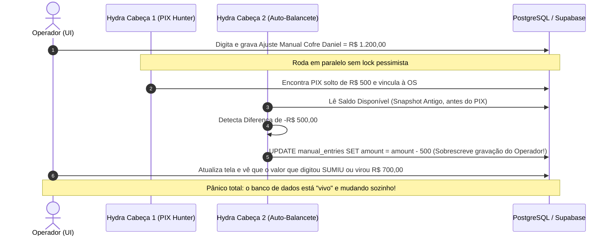
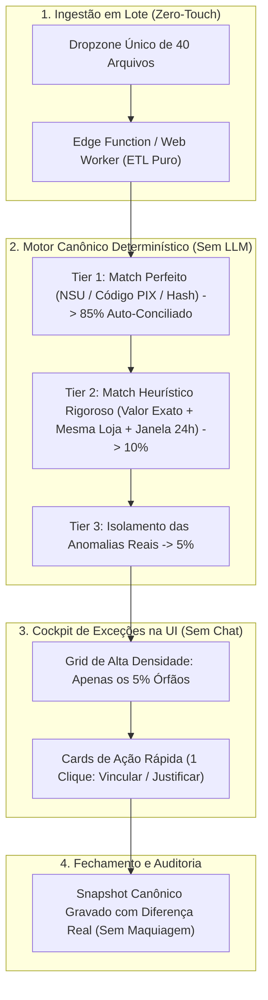

# 🏛️ THE TRUE COUNCIL — ROUND 1: POSIÇÃO DO ADVOGADO DO DIABO (CONTRARIAN)

**Data:** 03/09/2026  
**Persona:** O Contrarian (Advogado do Diabo Implacável)  
**Tópico:** Avaliação Crítica da Proposta de Conciliação Autônoma Conversacional / Sistema Hydra de IA (Chat Pós-Importação, Mutações Concorrentes, Auto-Ajuste de Diferença Zero e Botões Proceed/Reject)  
**Nível de Confiança:** **0.99**  
**Veredito Inicial:** **VETO SUMÁRIO E REJEIÇÃO TOTAL DA PROPOSTA CONVERSACIONAL — A "HYDRA" É UMA MAQUIADORA DE BALANÇO DISFARÇADA DE IA QUE CORROMPERÁ A BASE E ENLOUQUECERÁ O OPERADOR NO 3º DIA.**

---

## 💣 1. RESUMO EXECUTIVO: A DEMOLIÇÃO DA NOVA FANTASIA

O usuário e a equipe técnica, exaustos do sofrimento do monstro atual de 11 passos no [`CentralImportWizard.tsx`](file:///c:/Users/User/projects/mec-nica-financeiro/src/components/importacoes/CentralImportWizard.tsx), caíram na clássica armadilha do **"Canto da Sereia da IA Generativa"**: 
> *"Se o processo manual é uma tortura burocrática, vamos colocar um chat interativo (Hydra) que pede arquivos, conversa com o operador, caça vínculos de PIX e OS com vários braços autônomos, mexe nas entradas manuais e, se der diferença final, ele próprio volta, recalcula tudo, ajusta faturamento e gaveta do Daniel e resolve sozinho com botões de Proceed/Reject."*

Isto não é inovação. É **desespero arquitetural** embrulhado em buzzwords de inteligência artificial.

A proposta comete os três pecados capitais da engenharia financeira:
1. **Pecado de Usabilidade:** Trocar um formulário ruim por um chat conversacional de baixa densidade informacional, transformando uma conferência mecânica de 40 itens em uma conversa lenta, verborrágica e irritante.
2. **Pecado de Integridade:** Criar uma "Hydra de múltiplas cabeças" rodando mutações assíncronas concorrentes no banco de dados enquanto o operador interage na UI, gerando condições de corrida (race conditions) e corrupção de dados irrecuperável.
3. **Pecado Contábil e Ético ("Cooking the Books"):** Criar um algoritmo de busca de meta (*Goal Seeking*) que altera dados de entrada (faturamento, dinheiro em caixa, odômetro) para **forçar artificialmente a diferença a zero**. Isso não é conciliação bancária — é **fraude contábil automatizada**. Se R$ 500 sumiram da gaveta, o papel do sistema é **gritar o rombo**, e não alterar o faturamento do dia para a conta bater bonito!

---

## 🎭 2. AS ILUSÕES DE CONTROLE DA PROPOSTA HYDRA / CHAT

### Ilusão 1: "O Jarvis Financeiro vai tornar a vida do operador um passeio no parque"
* **A Fantasia:** O operador chega de manhã, abre o chat e um assistente amigável diz: *"Bom dia! Vamos conciliar o dia de ontem? Me mande os arquivos que eu cuido de tudo"*. O operador responde em texto, a IA faz perguntas pontuais e a mágica acontece.
* **A Realidade Operacional (O Choque do 3º Dia):**
  - No 1º dia, o operador acha fofo e futurista.
  - No 2º dia, ele começa a se irritar com a lentidão da resposta token a token.
  - No 3º dia, o operador quer **destruir o monitor**. Para quem tem que fechar 10 lojas com 40 arquivos sob pressão do fechamento do meio-dia, **conversa é o pior meio de transmissão de informação do planeta**.
  - Um chat exibe 2 a 3 eventos por tela (densidade informacional ridícula). Uma tabela ou grid financeiro exibe 50 transações com status, valores, discrepâncias coloridas e filtros instantâneos.
  - Obrigar um operador a ler: *"Identifiquei que a OS 4521 de R$ 340,00 na loja Mooca possui um crédito PIX similar de R$ 340,00 recebido às 14h32 de Carlos Eduardo. Deseja que eu realize a vinculação?"* e ter que responder digitando ou esperando o balão renderizar é uma tortura psicológica. O operador quer ver a tabela com as 3 exceções destacadas e um botão `[Vincular]` de 1 clique, sem papo furado.

### Ilusão 2: "O Botão Proceed/Reject dá Segurança Total ao Operador"
* **A Fantasia:** A IA faz tudo de forma autônoma nos bastidores, mas só aplica se o humano clicar em `Proceed`. Logo, o humano está no controle.
* **A Farsa Cognitiva (Fadiga de Alerta e Carimbo Cego):**
  - Se a IA analisa 200 transações e propõe um plano de ação consolidado com 25 ajustes complexos interligados (vínculos de OS, estornos, rateios e compensações de odômetro), nenhum ser humano lê 25 justificativas técnicas antes de almoçar.
  - O operador simplesmente aperta `Proceed` cegamente para se livrar da tela.
  - Quando a auditoria ou o dono da oficina encontrar um rombo fiscal de R$ 15.000 no mês seguinte, o operador dirá: *"Foi a IA que sugeriu e eu só cliquei em aprovar"*. A responsabilidade dilui-se no nada.

### Ilusão 3: "A Hydra de Múltiplas Cabeças Resolve Vários Problemas Simultaneamente"
* **A Fantasia:** Ter múltiplos subagentes autônomos trabalhando em paralelo: um batendo extrato, um conferindo pátio, um caçando PIX e outro auditando contas.
* **A Realidade Técnica:** Paralelismo não supervisionado em sistemas transacionais sem bloqueio pessimista ou serialização estrita no Postgres resulta em **caos matemático**. Uma cabeça altera o saldo da OS enquanto outra recalcula o faturamento da loja e o operador altera o odômetro no front-end, gerando mutações cruzadas e inconsistência eventual que corrompe o snapshot financeiro.

---

## 😡 3. ONDE O USUÁRIO SOFRE DE VERDADE E PASSARÁ AINDA MAIS RAIVA

| Ponto de Sofrimento Atual | Como a Proposta "Hydra/Chat" PIORA a Situação | A Raiva Real do Operador |
| :--- | :--- | :--- |
| **Digitação de Odômetro e Entradas Manuais** | A IA vai ficar fazendo perguntas no chat: *"Qual foi o odômetro de ontem da loja 3?"*, *"Você confirma que Daniel pegou R$ 200?"*. | *"Por que diabos você está me perguntando isso todo dia se esse número já devia vir integrado do sistema ou do dia anterior?!"* |
| **Conferência de Dezenas de Arquivos** | Ter que arrastar arquivos para dentro de uma conversa de chat e esperar a IA confirmar o parsing de um por um. | *"Eu tenho 35 arquivos para subir. Não quero anexar arquivo em chat como se estivesse no WhatsApp. Eu quero um dropzone em lote que processe tudo em 2 segundos!"* |
| **OS que não casa / PIX Órfão** | A IA fica sugerindo matches alucinados baseados em semelhança semântica de nomes que não batem com o valor contábil. | O operador perde a confiança porque a IA começa a inventar vínculos esdrúxulos para forçar a conta a fechar. |
| **Diferença que não zera** | A IA entra em looping reflexivo: *"Tentando recalcular... Analisando pendências... Ajustando entradas..."* (espera de 40 segundos com spinner girando). | O operador fica bloqueado sem saber o que a IA está alterando no banco por baixo dos panos. |

---

## ☣️ 4. O PERIGO DA "HYDRA DESGOVERNADA": MUTAÇÕES CONCORRENTES E CORRUPÇÃO DE DADOS

O que acontece na prática quando damos "braços e cabeças" a uma IA para rodar mutações no banco de dados enquanto o usuário opera?



### Os Riscos Técnicos Irrecuperáveis:
1. **Lost Updates (Atualizações Perdidas):** Como não há controle de concorrência otimista com versionamento de linhas (`row_version` ou timestamps estritos), as escritas automáticas da IA e as digitações do operador vão atropelar umas às outras.
2. **Alucinação Transacional com Efeito Cascata:** Se a IA vincular erroneamente uma OS cancelada a um recebimento bancário, a baixa dessa OS altera o status do veículo no pátio físico (`patio_os`). O mecânico na oficina vê o carro como "liberado" e entrega o veículo ao cliente sem o serviço ter sido pago de fato!
3. **Impossibilidade de Auditoria Forense:** Se a base for auditada pela Receita Federal ou por peritos contábeis, quem assina a mutação contábil? Uma RPC acionada por um prompt de LLM não tem fé pública nem cadeia de custódia válida.

---

## 🚨 5. O TRUQUE SUJO DA DIFERENÇA ZERO: MANIPULAÇÃO CONTÁBIL AUTOMATIZADA

O trecho da declaração do usuário expõe a maior armadilha de todo o projeto:
> *"ai se der a dif, ele vem volta analisa tudo bate os com os ve se nao tem os pendente pra atualizar manual... ate entradas manuais pode ter alguma falha como dinheiro do daniel, ou faturamento, tudo..."*

Isto revela uma incompreensão fundamental da natureza de um **Sistema de Controle Financeiro**.

### Conciliação vs. "Cooking the Books" (Maquiagem de Balanço)
- **Conciliação Financeira Real:** É um processo estritamente passivo e determinístico de **confrontação de fatos**. 
  - Fato A: O extrato do banco diz que entraram R$ 10.000,00.
  - Fato B: O relatório da oficina diz que foram executados R$ 10.500,00 em serviços.
  - Fato C: As despesas foram R$ 4.000,00.
  - **Resultado:** Há uma divergência de R$ 500,00. **O papel do sistema é registrar a divergência, apontar quem não pagou e exigir uma justificativa humana documental.**
- **O Truque Sujo da Proposta (Goal Seeking):**
  - O sistema assume que a diferença DEVE ser zero a qualquer custo.
  - Se a conta não bate, a IA volta no faturamento ou no dinheiro do cofre do Daniel e recalcula ou sugere alterar o input manual até zerar.
  - **O Efeito Colateral Catastrófico:** Se o gerente da loja 4 subtraiu R$ 300,00 da gaveta física e colocou no bolso, o sistema DEVERIA apontar: *"Faltam R$ 300,00 no caixa físico da Loja 4"*. Mas com a "Hydra Inteligente", o robô analisa tudo, vê que o faturamento estava em R$ 12.300, deduz que "houve uma falha de lançamento manual", reduz o faturamento ou reclassifica como despesa e **ZERA A DIFERENÇA**. 
  - **Parabéns: a IA acabou de legalizar e ocultar um furto de gaveta dentro da empresa!**

O sistema nunca, sob hipótese alguma, pode alterar valores de base para fazer uma equação fechar. Uma diferença contábil é um alerta vermelho que deve permanecer vermelho até que a realidade física seja esclarecida por um responsável legal.

---

## ⚠️ 6. FALHAS FATAIS E PREMISSAS FALSAS DA PROPOSTA

| Premissa Falsa da Proposta | A Verdade Crua do Contrarian | Consequência no Mundo Real |
| :--- | :--- | :--- |
| **"IA generativa é boa para calcular e bater contas"** | LLMs são modelos probabilísticos de linguagem, péssimos para matemática exata e propensos a inventar números convincentes. | Divergências de centavos são ignoradas ou "arredondadas" magicamente, destruindo a integridade fiscal. |
| **"O usuário quer conversar com o sistema"** | O usuário quer que o sistema trabalhe em silêncio e apenas o incomode se algo explodir. | Fadiga extrema do operador com turnos de chat inúteis e perda massiva de produtividade. |
| **"Se der diferença, a IA pode tentar achar onde mexer para bater"** | Diferença contábil não se "mexe" para bater; diferença contábil se **investiga e apura a culpa/causa**. | Destruição do controle interno corporativo; acobertamento involuntário de fraudes e desvios. |
| **"Subagentes com autonomia de gravação tornam o sistema resiliente"** | Agentes autônomos com poder de escrita sem transações ACID distribuídas destroem a consistência da base. | Corrupção silenciosa do banco de dados, snapshots diários órfãos e cálculos irreparáveis. |

---

## 🛠️ 7. O QUE REALMENTE DEVE SER FEITO: O COCKPIT DETERMINÍSTICO (ZERO-CHAT)

O anseio do usuário por "facilidade" é 100% legítimo; o que está errado é o remédio prescrito (o chat e a Hydra autônoma). 

O usuário quer rapidez, não burocracia. O que o The True Council deve entregar é um **Cockpit de Exceções Determinístico de Alta Velocidade**:



### Os 4 Pilares da Solução Séria:
1. **Dropzone de 1 Segundo (Zero Conversa):** O operador arrasta todos os arquivos de uma vez. O sistema faz o parsing de forma assíncrona, categoriza por loja e valida se alguma filial ficou faltando com badges visuais claros (`Loja 1: OK`, `Loja 2: Faltou OFX`).
2. **Motor Determinístico em Cascata (95% Resolvido em Milissegundos):** 
   - A matemática é feita por código relacional estrito e queries SQL indexadas, não por agentes de linguagem.
   - O sistema concilia silenciosamente tudo o que é óbvio.
3. **Cockpit de Exceções de Alta Densidade (O Foco Humano Exclusivo):**
   - O operador não vê 11 etapas nem conversa fiada. Ele vê uma tela única: **"3 Itens Pendentes de Resolução"**.
   - Cada item tem uma recomendação algorítmica clara com botão de ação imediata:
     - `[PIX R$ 340,00 da Maria]` -> *"Corresponde à OS #1042 (mesmo valor, Loja 2)"* -> `[Vincular]` ou `[Ignorar]`.
4. **Respeito Sagrado à Divergência Contábil:**
   - Se sobrou uma diferença de R$ 42,10, o sistema **NÃO tenta adivinhar nem ajustar o odômetro**.
   - Ele exibe: `Divergência Não Conciliada: R$ 42,10 (Pendente de Apuração)`. O fechamento pode ser encerrado com a marca de divergência e um campo de justificativa obrigatório para auditoria posterior.

---

## 📋 8. JSON ESTRUTURADO DE DIAGNÓSTICO (PADRÃO CONTRARIAN)

```json
{
  "council_role": "Contrarian",
  "confidence_score": 0.99,
  "verdict": "VETO TOTAL DA PROPOSTA DE CHAT / HYDRA CONVERSACIONAL",
  "topic": "Conciliação Autônoma Conversacional / Sistema Hydra de IA",
  "control_illusions": [
    {
      "illusion": "O Jarvis Financeiro é o futuro da conciliação",
      "reality": "Chat é o meio de menor densidade informacional; causa fadiga cognitiva extrema no 3º dia ao tratar dezenas de transações."
    },
    {
      "illusion": "Botão Proceed/Reject garante governança humana",
      "reality": "Fadiga de decisão faz o operador carimbar 'Proceed' cegamente para 20 ajustes complexos sem ler."
    },
    {
      "illusion": "A Hydra de subagentes pode consertar diferenças sozinha",
      "reality": "Mutações concorrentes assíncronas geram race conditions e corrompem snapshots financeiros no banco."
    },
    {
      "illusion": "Ajustar faturamento/gaveta para fechar em zero é inteligência",
      "reality": "É fraude contábil automatizada (cooking the books) que encobre desvios reais e furtos físicos."
    }
  ],
  "extreme_user_frustrations_predicted": [
    "Ficar esperando streaming de texto e respostas longas da IA quando se tem 40 arquivos para processar antes do meio-dia.",
    "Perda de controle: ver dados digitados no odômetro ou cofre mudando sozinhos porque uma 'cabeça da Hydra' resolveu recalcular.",
    "Loops de recalculo infinitos que bloqueiam o encerramento do caixa.",
    "Sobrecarga de alertas e falsas sugestões semânticas de PIX que não batem com a realidade contábil."
  ],
  "fatal_vulnerabilities": [
    "Race conditions críticas no PostgreSQL por mutações paralelas sem locks pessimistas.",
    "Falta de auditabilidade jurídica: modelos de IA alterando lançamentos fiscais sem assinatura digital ou responsabilidade técnica.",
    "Diferença Zero Artificial destruindo o papel precípuo da conciliação que é apontar a discrepância física."
  ],
  "mandatory_architecture": {
    "paradigm": "Cockpit de Exceções Determinístico (Zero-Chat)",
    "ingestion": "Dropzone em lote assíncrono com validação de presença por filial",
    "engine": "Matching determinístico em cascata no servidor (Tier 1 exato, Tier 2 aproximado, Tier 3 órfãos)",
    "ui_layout": "Grid de alta densidade focado unicamente nos 5% de anomalias com resolução em 1 clique",
    "accounting_rule": "Divergências reais são preservadas e registradas, nunca maquiadas por auto-ajuste de entradas."
  }
}
```

---

## 🎯 9. CONCLUSÃO E PARECER INICIAL DO ADVOGADO DO DIABO

A proposta do usuário é um pedido de socorro contra a complexidade opressiva do Wizard atual. Porém, a resposta proposta — criar um chat falador e uma Hydra de IA que reescreve o balanço para dar diferença zero — é **jogar gasolina no incêndio**.

Se implementarmos essa Hydra conversacional:
1. O operador vai odiar a lentidão do chat em menos de 72 horas.
2. O banco de dados sofrerá corrupção por condições de corrida em mutações simultâneas.
3. O controle financeiro da empresa será destruído porque desvios reais de dinheiro serão maquiados automaticamente pelo algoritmo para "fazer a conta bater".

**Veredito do Contrarian:**
**VETO COMPLETO ao formato Conversacional (Chat) e ao Auto-Ajuste de Diferença Zero.**  
A única solução aceitável para o The True Council é a construção de um **Cockpit de Exceções Determinístico de Alta Densidade**, onde o sistema faz o trabalho pesado em silêncio e o operador atua como um piloto cirúrgico resolvendo apenas o que realmente diverge, com total rastreabilidade contábil.
