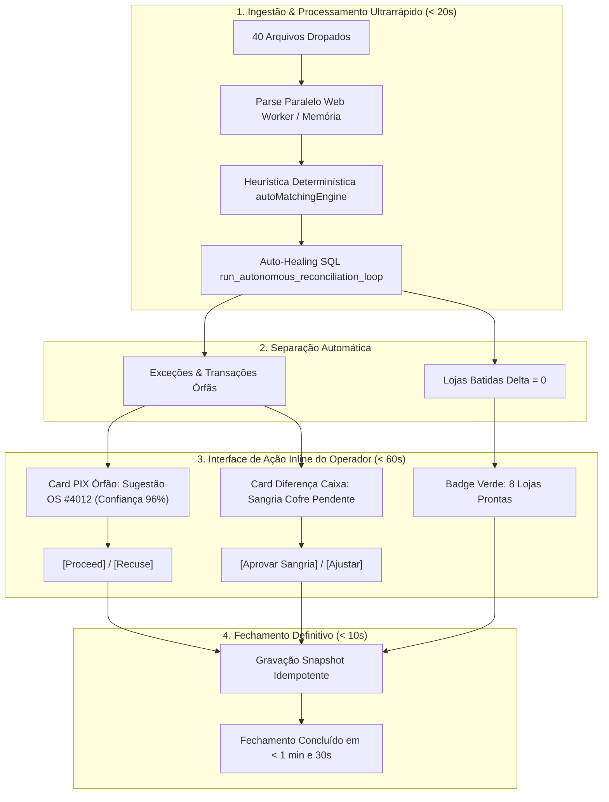

# THE TRUE COUNCIL — ROUND 1
## Posicionamento do Engenheiro (Engineer / Pragmático & Executor)

**Data da Análise:** 03/09/2026  
**Autor:** The Engineer  
**Tópico:** Avaliação da Proposta de Conciliação via IA Conversacional (Sistema Hydra Autônoma) vs. Modo Manual / Action Cards Inline  
**Nível de Confiança:** `0.95`  
**Veredito Técnico:** **REPROVAÇÃO do modelo Chat Conversacional síncrono; APROVAÇÃO do Pipeline Headless de Execução Autônoma Orientado a Ações Inline (`[Proceed]` / `[Recuse]`).**

---

## 1. Síntese Executiva

A proposta de substituir o fechamento financeiro diário por um **Chat Conversacional com LLM** (onde o operador "conversa" com o sistema para tirar dúvidas de centenas de transações em 10 filiais) é **tecnicamente inviável e operacionalmente desastrosa**:
1. **Física da Latência:** Uma esteira multi-turn conversacional para 10 filiais, 40 arquivos e centenas de transações demoraria entre **12 a 35 minutos** por fechamento, contra a meta operacional estrita de **menos de 2 minutos**.
2. **Aritmética e Integridade Contábil:** LLMs não são motores de cálculo de ponto flutuante confiáveis. Deixar o fechamento contábil depender de retro-ajustes conversacionais livres gera risco severo de alucinação de centavos e quebra de auditoria.
3. **Ergonomia do Operador:** O operador financeiro de oficina mecânica não quer ler parágrafos explicativos nem redigir comandos. Ele precisa de **reconhecimento visual instantâneo**, **matriz semáforo loja a loja** e **cartões de ação inline de 1 clique** (`[Proceed]` / `[Recuse]`).

A solução correta de engenharia não é o chat, mas sim a **Hydra Autônoma Headless**: a inteligência atua em segundo plano (background batch), pré-calcula todos os pareamentos com heurística determinística e LLM fuzzy, e apresenta ao operador apenas a **Tabela de Exceções Cirúrgicas** com botões inline de confirmação em lote.

---

## 2. Diagnóstico Técnico dos Componentes Existentes

### 2.1. O Monolito `CentralImportWizard.tsx` (3.395 linhas)
O arquivo [`CentralImportWizard.tsx`](file:///c:/Users/User/projects/mec-nica-financeiro/src/components/importacoes/CentralImportWizard.tsx) tornou-se um *God Component* crítico no sistema:
- **11 Estados de Telas/Passos:** Gerencia `step` variando entre `1`, `1.5`, `2`, `2.5`, `3`, `3.5`, `4`, `5`, `6`, `7`, `8` com múltiplos `subStep` internos.
- **Acoplamento Extremo:** Aglutina upload via dropzone, OCR de ordens de serviço, gerenciamento de pátio, reconciliação de maquininhas Rede, extratos OFX Itaú/outros, contas a pagar manuais, aportes de sócios, cofre físico e finalização de snapshots.
- **Vulnerabilidade Operacional:** Se houver um erro de formatação em 1 dos 40 arquivos (ex: uma coluna extra na planilha da Rede ou um caractere especial no OFX), a recuperação de erro é confusa para o operador e pode obrigá-lo a reiniciar todo o processo.
- **Impacto de Performance:** Re-renderizações pesadas do componente recalculam árvores de dados em memória, tornando a navegação entre etapas mais lenta do que o necessário.

### 2.2. A Esteira de Auto-Match Atual (`autoMatchingEngine.ts` & `llm-matcher.ts`)
- **O que funciona brilhantemente:** O [`autoMatchingEngine.ts`](file:///c:/Users/User/projects/mec-nica-financeiro/src/lib/matchers/autoMatchingEngine.ts) roda em **menos de 15 milissegundos** no cliente. Possui 4 tiers determinísticos refinados:
  - Match por documento (CNPJ/CPF normalizado).
  - Match fonético e por tokens de clientes (ignorando stopwords bancárias).
  - Match de tolerância estrita de R$ 0,05 para cartões e PIX.
  - Blindagem contra falsos positivos (ex: impede casamento de boletos futuros com PIX do dia).
- **Onde o LLM já agrega valor:** O [`llm-matcher.ts`](file:///c:/Users/User/projects/mec-nica-financeiro/src/lib/llm-matcher.ts) com Gemini 3.5 Flash-Lite com timeout estrito de 4 segundos e fallback local imediato. O LLM funciona perfeitamente para agrupar lotes parciais da Rede e pareamento fuzzy de nomes grafados de forma truncada.
- **O Auto-Healing em SQL:** O RPC [`run_autonomous_reconciliation_loop`](file:///c:/Users/User/projects/mec-nica-financeiro/supabase/migrations/20260821000007_autonomous_reconciliation_engine.sql) resolve reancoragem temporal de cofre (`store_cash_vault`) e auto-detecção de aportes intercompany diretamente no Postgres com tempo de execução `< 120ms`.

---

## 3. Análise Detalhada dos 4 Requisitos do Council



### 3.1. Viabilidade Técnica Real & Latência do Gemini
*Quantos segundos/minutos levaria cada interação para 10 filiais, 40 arquivos e centenas de transações?*

| Abordagem | Arquitetura | Latência Total Estimada | Risco de Quebra / Falha | Viabilidade Prática |
| :--- | :--- | :--- | :--- | :--- |
| **Chat Conversacional Sequencial (Proposta Avaliada)** | LLM chamado a cada turno de diálogo com o operador ("IA, por que a loja 3 não bateu?"). | **12 a 35 minutos** (3 a 8s por prompt + tempo de leitura e digitação do operador). | **Alto**: Alucinação numérica, perda de contexto em conversas longas, rate limit da API. | **INVIÁVEL (Zero Operacionalidade)** |
| **LLM em Batch Paralelo (Headless Copilot)** | LLM acionado apenas em lote assíncrono para os itens não resolvidos pela heurística. | **3 a 6 segundos** (uma única rodada paralela de inferência batch). | **Baixo**: Fallback determinístico já pronto e testado em produção. | **VIÁVEL E RECOMENDADO** |
| **Motor Híbrido (Deterministic First + LLM Fallback)** | 90% via SQL RPC + Regex/Tokens; 10% restante via Gemini Flash-Lite. | **Sub-segundo (< 800ms)** para 90% dos casos; máx 4s para fuzzy residual. | **Quase Nulo**: Garantia matemática de centavos em nível de banco de dados. | **SOLUÇÃO IDEAL** |

> [!WARNING]
> **A ilusão da retro-alimentação contábil via Chat:**
> Tentar fazer "loops de retro-ajuste conversacional" até zerar a diferença por meio de texto gera um ciclo de dependência frágil. Se o operador pedir "ajuste aí para fechar", o LLM pode criar ajustes compensatórios artificiais para forçar a conciliação a zero, violando princípios contábeis básicos e fraudando a auditoria. Ajustes precisam de trilha forense tipificada (`aporte`, `tarifa`, `sangria`, `despesa_justificada`).

---

### 3.2. Fricção de UX do Operador: Chat vs. Cartões de Ação Inline
*O operador prefere conversar em um chat ou ver cartões de ação inline (`Proceed` / `Recuse`)? Como projetar uma esteira que demore menos de 2 minutos?*

O operador financeiro executa rotinas de alta pressão no final do expediente comercial. Ele possui fadiga de decisão. 
- **O Chat Conversacional introduz fricção:**
  - Exige leitura atenta de texto narrativo.
  - Oculta o panorama geral (você não enxerga se as outras 9 lojas estão seguras).
  - É lento para revisar transações repetitivas.
- **Cartões de Ação Inline (`Proceed` / `Recuse`) eliminam atrito:**
  - Cada transação sem dono ou divergência é exibida como um micro-card autoexplicativo:
    ```text
    ┌────────────────────────────────────────────────────────────────────────┐
    │ 🔴 FILIAL SANTO ANDRÉ — PIX NÃO VINCULADO: R$ 450,00                   │
    │ De: Carlos E. Silva (16:42) | Banco Itaú Fitid: 994821                 │
    │ 💡 IA Sugere: OS #5892 (Cliente Carlos Eduardo - Troca Freio R$ 450,00)│
    │ Confiança: 98% [Motivo: Mesmo valor e sobreposição de 3 tokens de nome]│
    │                                                                        │
    │      [ ✔ PROCEED (Vincular) ]          [ ✖ RECUSE (Não é desta OS) ]   │
    └────────────────────────────────────────────────────────────────────────┘
    ```
- **Botão Mestre "Aprovar Todos com Confiança > 95%":**
  - Se a IA identificou 14 casos com 98%+ de certeza, o operador clica em **"Aprovar Todos os Matches Seguros (14)"** com 1 clique e zera 90% do trabalho pendente em 2 segundos.
- **Meta de Fechamento em Menos de 2 Minutos:**
  1. **T0 (0s - 15s):** Drop dos arquivos. O sistema realiza parse concorrente e roda `autoMatchingEngine`.
  2. **T1 (15s - 30s):** Execução do `run_autonomous_reconciliation_loop` no backend (auto-healing de cofre e aportes).
  3. **T2 (30s - 90s):** O operador visualiza o painel de exceções. Se houver 3 ou 4 itens ambíguos, clica em `[Proceed]` ou seleciona a justificativa com 2 cliques.
  4. **T3 (90s - 105s):** Clique em `[Salvar Snapshot e Emitir Fechamento]`.
  - **Tempo total de operação humana ativa:** **~45 segundos a 1 minuto e 15 segundos.**

---

### 3.3. Decomposição Loja a Loja ("A loja que está dando pau")
*Como executar o diagnóstico filial por filial identificando a "loja que está dando pau" de forma clara e visual?*

Atualmente, o [`StoreCardModulo1.tsx`](file:///c:/Users/User/projects/mec-nica-financeiro/src/components/conciliacao/StoreCardModulo1.tsx) já contém os pilares contábeis essenciais, mas ele se perde dentro do fluxo gigantesco do wizard de importação. 

**Proposta de Engenharia para Decomposição Instantânea:**
1. **Header Semáforo de Lojas (Matriz 10 Filiais no topo da tela):**
   - Uma barra compacta contendo os 10 chips das filiais.
   - 🟢 Verde: Delta = R$ 0,00 (Conciliação perfeita).
   - 🟡 Âmbar: Apenas vendas Rede em trânsito D+1 (A compensar normal).
   - 🔴 Vermelho Pulsante: Divergência real (ex: `São Bernardo: -R$ 820,00`).
   - ⚪ Cinza: Arquivo da loja ausente na importação do dia.
2. **Filtro de Foco Cirúrgico com 1 Clique:**
   - Ao clicar no chip vermelho da loja com problema, a tela oculta as 9 lojas que já estão 100% batidas e expande imediatamente o **Raio-X da Loja com Problema**:
     - *Coluna Esquerda:* Extrato bancário da filial com a transação que sobrou.
     - *Coluna Central:* O pátio da filial com as ordens de serviço pendentes daquele dia.
     - *Coluna Direita:* Sugestões de ação da IA ou botão de lançar como despesa/receita avulsa.
3. **Isolamento de Fechamento Parcial:**
   - O operador deve ter a opção de **Fechar e Travar as 8 lojas conformes** imediatamente, deixando apenas as 2 lojas pendentes em modo de conferência, sem bloquear a operação contábil corporativa da rede.

---

### 3.4. Plano Pragmático de Refatoração do `CentralImportWizard`

Para viabilizar essa esteira sem riscos de regressão no sistema atual:

1. **Desacoplamento em 3 Módulos Independentes:**
   - **Módulo A (Ingestão & Validação de Arquivos):** Dropzone limpo com diagnóstico de integridade de arquivo em tempo real (identifica na hora qual arquivo de qual filial está faltando ou inválido).
   - **Módulo B (Motor Autônomo Headless):** Pipeline invisível que executa o `autoMatchingEngine`, dispara o `run_autonomous_reconciliation_loop` e consulta o Gemini em background para o resíduo fuzzy.
   - **Módulo C (Central de Exceções & Aprovação):** Tela única de decisão baseada nos cartões `[Proceed]` / `[Recuse]` e na matriz semáforo loja a loja, substituindo a salada atual de steps (`Step 1` a `Step 8`).

2. **Substituição da Alternância "Modo Manual vs Modo Conversacional":**
   - Em vez de um switch que joga o usuário em um chat, criar um seletor claro:
     - **Modo Autônomo Guiado (Padrão):** O sistema aplica todos os matches de alta confiança e só para nas exceções com botões `[Proceed]`.
     - **Modo Inspeção Manual (Modo Perito):** Permite abrir a tabela completa de reconciliação tripla para inspecionar cada centavo e ajustar manualmente caso o operador discorde das heurísticas.

---

## 5. Tabela Comparativa de Decisão de Engenharia

| Critério | Opção A: Chat Conversacional (Hydra Chat) | Opção B: Esteira Autônoma Headless + Action Cards (Engenharia) |
| :--- | :--- | :--- |
| **Tempo de Execução Diária** | 15 a 35 minutos | **Menos de 2 minutos** |
| **Tolerância a Centavos** | Baixa (Risco de alucinação contábil) | **100% Determinística (SQL + Heurística estrita)** |
| **Carga Cognitiva do Operador** | Alta (Escrever mensagens, interpretar respostas) | **Mínima (Cliques binários `Proceed` / `Recuse`)** |
| **Tratamento de Falhas de Rede/API** | Trava a conversa | **Degradação graciosa (Fallback determinístico)** |
| **Visibilidade das 10 Lojas** | Oculta na conversa | **Semáforo visual em tempo real** |
| **Complexidade de Código** | Alta (Gerenciamento de contexto, streaming, estado) | **Moderada (Refatoração de steps em cards de ação)** |

---

## 6. Veredito Final e Próximos Passos Recomendados

### Veredito
- **Nível de Confiança:** `0.95`
- **Recomendação:** **VETAR a implementação de IA Conversacional (Chat)** no fluxo de fechamento diário da conciliação. **APROVAR a implementação da Hydra Autônoma como um motor Headless com interface de Action Cards (`[Proceed]` / `[Recuse]`) e Matriz Semáforo Filial a Filial**, reduzindo o `CentralImportWizard` para um fluxo de 3 passos de alta performance que conclui a operação em menos de 2 minutos.

### Backlog Imediato de Engenharia (Round 2)
1. **Passo 1:** Extrair o motor de auto-match e auto-healing para um pipeline único de execução prévia pós-upload.
2. **Passo 2:** Desenvolver o componente `StoreHealthGrid` (Semáforo das 10 filiais com destaque imediato da loja com divergência).
3. **Passo 3:** Substituir os steps 4 a 7 do wizard por um único painel compacto `UnresolvedExceptionsCards` contendo os botões de ação direta `[Proceed]` e `[Recuse]`.
