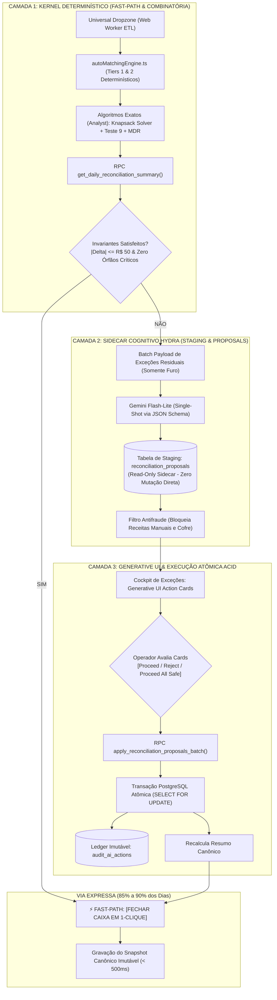

# 🏛️ THE TRUE COUNCIL — ROUND 2: REBUTAÇÃO & HARMONIZAÇÃO ARQUITETURAL
## Tópico: Arquitetura Reconciliada do Sistema de Conciliação Autônoma (Hydra Sidecar, Fast-Path de 1-Clique e Cockpit Imunizado a P-Hacking)

* **Agente:** The Architect (Arquiteto de Sistemas, Estrutura e Soluções)
* **Data da Sessão:** 03 de Setembro de 2026
* **Status:** Rodada Deliberativa 2 (Round 2 — Rebutação Formal e Síntese Arquitetural)
* **Nível de Confiança Arquitetural:** **0.97 / 1.00** *(Consenso Técnico Pleno entre Ergonomia, Rigor Matemático e Integridade ACID)*
* **Veredito:** **APROVAÇÃO DA ARQUITETURA RECONCILIADA TRI-LAYER (FAST-PATH 1-CLIQUE + SIDECAR COGNITIVO NÃO-TRANSACIONAL + RPC ATÔMICA ACID)**

---

## 1. RESUMO EXECUTIVO DA RECONCILIAÇÃO

O debate do Round 1 produziu um alinhamento raro e valioso entre as personas técnicas:
1. O **Contrarian** expôs a loucura de um chat de baixa densidade informacional e provou que subagentes com permissão de escrita direta gerariam condições de corrida fatais e maquiagem contábil (*"Cooking the Books"*).
2. O **Engineer** trouxe o choque de pragmatismo da oficina mecânica às 17h: 85% dos dias devem fechar em **1 clique (< 500ms)** via motor determinístico, e a IA só deve entrar por exceção, manifestando-se como **Generative UI (Action Cards com `[Proceed]` / `[Reject]`)** em lote único (~1,5s), nunca como interrogatório de chat.
3. O **Analyst** forneceu a blindagem científica: provou que minimizar $|\Delta| \to 0$ mexendo em variáveis de menor atrito é **P-Hacking institucionalizado**, propôs o **Knapsack Solver (< 40ms)** para transações órfãs e desenhou a matriz probatória de 4 dimensões com ledger imutável.

Como Arquiteto, minha missão é **eliminar a polarização ilusória entre "Chat com Hydra Autônoma" vs "Planilha Monolítica de 11 Passos"**. 

A solução arquitetural definitiva é a **Arquitetura Tri-Layer (Cockpit Determinístico Triplo com Sidecar Cognitivo Imunizado)**:
- **Chat Aberto Eliminado:** Zero balões de conversa, zero streaming token a token, zero digitação em linguagem natural.
- **Hydra Rebaixada a Sidecar Read-Only:** A Hydra não possui credenciais de `UPDATE` ou `INSERT` nas tabelas de produção. Ela atua como um perito investigativo gerando **Staging Proposals tipadas**.
- **Fast-Path Preservado:** Nos dias sem anomalias, o fechamento ocorre em **1 único clique** sem invocar qualquer modelo generativo.
- **Kernel Combinatório Antes da IA:** O Knapsack Solver e o Teste do Módulo 9 resolvem a combinatória em milissegundos no servidor; a IA recebe apenas o resíduo semântico.
- **Execução Atômica ACID:** Todas as sugestões aprovadas pelo operador são consolidadas em uma única transação PostgreSQL com bloqueio pessimista (`SELECT FOR UPDATE`).

---

## 2. REBUTAÇÃO NOMINAL DOS ARGUMENTOS OPOSTOS (ROUND 2)

Abaixo, respondo nominalmente aos argumentos centrais apresentados por cada perfil oposto no Round 1:

### 2.1. Confronto com o CONTRARIAN: "Chat é Baixa Densidade e a Hydra Causará Race Conditions Fatais"

* **Argumento do Contrarian:**
  > *"Chat conversacional é a pior forma de transmissão de dados; causa fadiga extrema no 3º dia ao tratar dezenas de transações. Paralelismo não supervisionado de subagentes com autonomia de gravação causa race conditions, dirty reads, lost updates e corrupção no banco. Além disso, ajustar entradas para fechar em zero é maquiagem contábil ('Cooking the Books')."*
* **Posição do Arquiteto:** **`(AGREE)` COM `(REFINE)` ARQUITETURAL**
* **Fundamentação Arquitetural Profunda:**
  - **Onde o Contrarian está 100% Certo (AGREE):**
    1. A interface de chat conversacional tradicional (estilo WhatsApp / ChatGPT) é intrinsecamente inadequada para conciliação contábil. Exibir 2 eventos por tela onde um operador precisa auditar 40 transações com SLA de 2 minutos é um erro crasso de ergonomia.
    2. A concessão de poder de escrita direta (`direct mutations`) para múltiplos subagentes autônomos em tabelas concorrentes (`patio_os`, `ofx_transactions`, `daily_manual_bills`) é inviável em sistemas relacionais financeiros. Sem lock pessimista, colisões de escrita corromperiam o saldo canônico.
    3. Forçar $\Delta = 0$ ajustando variáveis livres (odômetro ou gaveta) destrói o propósito da auditoria.
  - **Onde o Contrarian é Refinado (REFINE):**
    - O Contrarian defendeu o niilismo tecnológico: descartar qualquer uso de IA generativa e restringir o sistema a regras determinísticas de código relacional.
    - **A Falha do Niilismo:** O código relacional determinístico é cego a nuances semânticas e contextuais. Um motor relacional não compreende que *"PIX recebido de Juliana Medeiros"* refere-se à OS de *"Roberto Medeiros"* (cônjuge com mesmo sobrenome e telefone idêntico no cadastro), nem descobre que uma despesa de R$ 85,00 em *"Auto Posto Shell"* refere-se ao teste de rodagem da OS #1920.
    - **O Refino Estrutural:** Não jogamos fora o poder cognitivo da IA; **enjaulamos sua capacidade de dano**. A Hydra é convertida em um **Sidecar Consultivo de Leitura (Read-Only)**. Suas hipóteses são salvas exclusivamente em uma tabela de staging (`reconciliation_proposals`). Zero risco de race condition. Zero risco de corrupção.

---

### 2.2. Confronto com o ENGINEER: "Arquitetura Bicanal com Fast-Path de 1-Clique em < 500ms e Action Cards"

* **Argumento do Engineer:**
  > *"Arquitetura Bicanal obrigatória: Canal 1 (Fast-Path) fecha o dia em 1 clique se |Delta| <= 50,00 sem abrir chat. Canal 2 (Copiloto Hydra) abre apenas por exceção, operando via Generative UI com Action Cards tipados contendo botões [Proceed] e [Reject] disparados por uma única chamada de batch ao Gemini Flash-Lite em ~1,5s."*
* **Posição do Arquiteto:** **`(AGREE)` COM `(REFINE)` DE INTEGRIDADE TRANSACIONAL**
* **Fundamentação Arquitetural Profunda:**
  - **Onde o Engineer está 100% Certo (AGREE):**
    1. A divisão bicanal é a única forma de atingir viabilidade operacional às 17h. Em 85% a 90% dos dias, o operador não quer ver inteligência artificial; quer carimbar o fechamento verificado e ir embora.
    2. A substituição do chat de texto por **Generative UI (Action Cards)** é a solução definitiva de UX. Um cartão visual contendo o diagnóstico, o impacto no Delta e teclas de atalho (`[Y]` / `[N]`) condensa 5 parágrafos de texto em uma decisão visual de 300ms.
    3. A execução em **chamada única em lote (Single-Shot Batch Diagnostics)** elimina a latência acumulada de 15 turnos síncronos de conversação.
  - **Onde o Engineer é Refinado (REFINE):**
    - O modelo do Engineer sugere que o manipulador `onProceed: (id, payload) => Promise<void>` dispare mutações avulsas no Supabase a cada clique no card.
    - **O Risco Arquitetural:** Se o operador aprovar 4 Action Cards e o 3º falhar por violação de constraint ou deadlock de banco, o sistema fica em **estado zumbi parcial** (2 mutações gravadas, 1 com erro, 1 pendente). O Delta resultante fica desconexo e o operador não sabe o que foi aplicado.
    - **O Refino Estrutural:** O botão `[Proceed]` no card altera apenas o estado da proposta no cliente ou na tabela de staging para `accepted`. A efetivação física no banco de dados DEVE ocorrer via **RPC Atômica Consolidada** (`apply_reconciliation_batch`), aplicando todas as alterações em uma única transação PostgreSQL com rollback integral em caso de falha.

---

### 2.3. Confronto com o ANALYST: "Risco Mortal de P-Hacking Contábil e Heurísticas Exatas (Knapsack Solver)"

* **Argumento do Analyst:**
  > *"Permitir que a IA 'mexa em tudo até zerar' é P-hacking contábil (Goodhart's Law). Proibição total de alterar entradas manuais e faturamento. Adoção obrigatória de heurísticas exatas: Knapsack Solver / Subset-Sum combinatório (< 40ms) para órfãos, Teste do Módulo 9 para transposição e decomposição de MDR, além de Matriz Probatória de 4 dimensões com ledger imutável em audit_ai_actions."*
* **Posição do Arquiteto:** **`(AGREE)` INTEGRAL COM `(REFINE)` DE PIPELINE EM CASCATA**
* **Fundamentação Arquitetural Profunda:**
  - **Onde o Analyst está 100% Certo (AGREE):**
    1. O alerta sobre o falso fechamento de 02/09 (-R$ 11,14 via injeção de R$ 24,4k de receitas artificiais) é um testemunho irrefutável do perigo de dar objetivos escalares cegos à automação.
    2. A proibição absoluta da IA de criar receitas fictícias (`daily_revenue_adjustments`) ou de alterar contagem de dinheiro em cofre físico (`cash_vault`) sem comprovação material é regra inegociável de governança.
    3. A substituição de prompts semânticos soltos por algoritmos exatos (Knapsack, Módulo 9 e MDR) poupa tokens, elimina alucinações matemáticas e garante determinismo estrito.
  - **Onde o Analyst é Refinado (REFINE):**
    - O Analyst posicionou o Knapsack Solver como concorrente da IA. Na realidade, eles devem atuar em **Pipeline em Cascata (Pipeline Cascading)**.
    - **A Síntese Arquitetural:** O Knapsack Solver não substitui a IA; ele a precede e a alimenta. O Knapsack calcula se existe um subconjunto de transações que bate exatamente no Delta. Se encontrar, ele gera diretamente um Action Card determinístico. Se NÃO encontrar (porque há desconto de centavos ou combinação complexa), a IA recebe os resíduos estruturados e tenta correlacionar semântica e documentação.
    - O ledger de auditoria imutável (`audit_ai_actions`) deve ser a fonte primária de verdade da tabela de staging.

---

## 3. PROPOSTA DE ARQUITETURA RECONCILIADA: "TRI-LAYER COGNITIVE SIDECAR"

A arquitetura consolidada divide o motor de fechamento em três camadas isoladas, preservando o Fast-Path de 1-clique do Engineer, a imunidade contábil do Analyst e a estabilidade de concorrência exigida pelo Contrarian.



---

### 3.1. O Fim do Chat: Do Diálogo Textual para Action Cards Tipados

Não haverá interface de chat aberto. O operador visualiza um **Painel Cockpit Lateral de Resolução (Resolution Strip)** contendo cards gerados pela Hydra.

Cada Action Card é um objeto fortemente tipado que encapsula a causa, o impacto financeiro exato e o payload de mutação pronto para execução:

```typescript
// src/features/hydra/types/HydraActionCard.ts

export type HydraHeadType = 
  | 'PIX_OS_MATCHER'       // Caça de vínculos banco x pátio
  | 'INTERCOMPANY_RESOLVER'// Transferências cruzadas entre filiais
  | 'MDR_ADJUSTER'         // Conciliação de taxas de adquirência
  | 'KNAPSACK_RESOLVER'    // Resolução combinatória determinística
  | 'BILLS_DEDUPLICATOR';  // Auditoria de comprovantes manuais

export interface HydraActionCardProposal {
  id: string;                      // UUID da proposta em reconciliation_proposals
  sessionId: string;               // Sessão do fechamento diário
  headType: HydraHeadType;
  storeId: string;
  storeName: string;
  title: string;                   // "Vínculo PIX Órfão com OS em Aberto"
  confidenceScore: number;         // 0.00 a 1.00 (Exigência: >= 0.85 para sugestão)
  
  // Lastro Probatório (Requisito do Analyst)
  evidence: {
    sourceEntity: 'ofx_transactions' | 'rede_transactions' | 'daily_manual_bills';
    sourceId: string;
    sourceAmount: number;
    targetEntity: 'patio_os' | 'stores_bank_accounts';
    targetId: string;
    targetAmount: number;
    phoneticMatchScore?: number;   // Jaro-Winkler >= 0.88
    timeDeltaHours: number;        // Diferença de horário
    documentHash?: string;         // SHA-256 do comprovante anexado
  };

  // Diagnóstico Descritivo e Impacto no Caixa (Requisito do Engineer)
  diagnosis: string;
  impact: {
    currentDelta: number;          // Ex: -R$ 450,00
    projectedDelta: number;        // Ex: R$ 0,00
    varianceReduction: number;     // Ex: +R$ 450,00
  };

  // Mutação Segura (Staging Payload)
  mutationPayload: {
    targetTable: string;
    actionType: 'LINK_ENTITIES' | 'SPLIT_EXPENSE' | 'RECLASSIFY_REVENUE' | 'FLAG_AS_INTERCOMPANY';
    parameters: Record<string, unknown>;
  };

  status: 'pending' | 'accepted' | 'rejected' | 'auto_applied';
}
```

---

### 3.2. Governança Antifraude e Matriz de Autonomia Imunizada (Analyst Shield)

Para assegurar que a Hydra nunca atue como maquiadora de balanço (*Cooking the Books*), estabelecem-se barreiras de código intransponíveis no schema e nas RPCs:

| Alvo de Mutação | Autonomia da IA | Requisito de Execução | Bloqueio no Banco |
| :--- | :---: | :--- | :--- |
| **Vínculo PIX $\times$ OS com FITID / CPF idêntico** | **Total (Tier 1)** | Auto-Commit via RPC determinística | Permitido |
| **Vínculo PIX $\times$ OS por Heurística Fonética** | **Sugestão (Tier 2)** | 1 Clique no Action Card `[Proceed]` | Exige confirmação humana |
| **Receitas Extraordinárias (`daily_revenue_adjustments`)** | ❌ **PROIBIDO** | Exige Upload de Nota/Extrato + 2FA Supervisor | Trigger rejeita gravação automática |
| **Numerário Físico / Cofre Daniel (`cash_vault`)** | ❌ **PROIBIDO** | Contagem física manual obrigatória | Trigger rejeita gravação automática |
| **Faturamento Base do Odômetro** | ❌ **PROIBIDO** | Somente leitura das OSs do pátio | Trigger rejeita gravação automática |
| **Divergência Não Solucionada ($|\Delta| > \text{R\$} 50$)** | ❌ **PROIBIDO** | Salva com Flag `UNRESOLVED_DISCREPANCY` | Impede fechamento silencioso |

---

### 3.3. DDL do PostgreSQL: Staging Seguro e Ledger Imutável

```sql
-- 1. Tabela de Staging de Propostas (Nenhum subagente escreve em tabelas de produção)
CREATE TABLE public.reconciliation_proposals (
    id UUID PRIMARY KEY DEFAULT gen_random_uuid(),
    session_id UUID NOT NULL,
    target_date DATE NOT NULL,
    store_id TEXT NOT NULL REFERENCES public.stores(id),
    head_type TEXT NOT NULL CHECK (head_type IN ('PIX_OS_MATCHER', 'INTERCOMPANY_RESOLVER', 'MDR_ADJUSTER', 'KNAPSACK_RESOLVER', 'BILLS_DEDUPLICATOR')),
    confidence_score NUMERIC(4,3) NOT NULL CHECK (confidence_score BETWEEN 0 AND 1),
    evidence_payload JSONB NOT NULL,
    impact_current_delta NUMERIC(12,2) NOT NULL,
    impact_projected_delta NUMERIC(12,2) NOT NULL,
    mutation_payload JSONB NOT NULL,
    status TEXT NOT NULL DEFAULT 'pending' CHECK (status IN ('pending', 'accepted', 'rejected', 'applied', 'failed')),
    failure_reason TEXT,
    created_at TIMESTAMPTZ NOT NULL DEFAULT clock_timestamp()
);

CREATE INDEX idx_proposals_session ON public.reconciliation_proposals(session_id, status);

-- 2. Ledger Imutável de Auditoria (Append-Only)
CREATE TABLE public.audit_ai_actions (
    id UUID PRIMARY KEY DEFAULT gen_random_uuid(),
    proposal_id UUID REFERENCES public.reconciliation_proposals(id),
    target_date DATE NOT NULL,
    store_id TEXT NOT NULL REFERENCES public.stores(id),
    head_type TEXT NOT NULL,
    action_type TEXT NOT NULL,
    operator_id UUID NOT NULL REFERENCES auth.users(id),
    decision TEXT NOT NULL CHECK (decision IN ('proceed_single', 'proceed_all_safe', 'rejected')),
    applied_payload JSONB NOT NULL,
    impact_delta_real NUMERIC(12,2) NOT NULL,
    created_at TIMESTAMPTZ NOT NULL DEFAULT clock_timestamp()
);

-- Trigger de Imutabilidade no Ledger de Auditoria
CREATE OR REPLACE FUNCTION prevent_audit_tampering()
RETURNS TRIGGER AS $$
BEGIN
    RAISE EXCEPTION 'Operação ilegal: O ledger audit_ai_actions é estritamente imutável (append-only).';
END;
$$ LANGUAGE plpgsql;

CREATE TRIGGER trg_audit_ai_actions_immutable
BEFORE UPDATE OR DELETE ON public.audit_ai_actions
FOR EACH ROW EXECUTE FUNCTION prevent_audit_tampering();
```

---

### 3.4. A RPC Atômica de Aplicação em Lote (`apply_reconciliation_proposals_batch`)

A execução de qualquer proposta aceita pelo operador ocorre em uma única transação serializável com bloqueio pessimista:

```sql
CREATE OR REPLACE FUNCTION public.apply_reconciliation_proposals_batch(
    p_session_id UUID,
    p_proposal_ids UUID[],
    p_operator_id UUID
)
RETURNS JSONB
LANGUAGE plpgsql
SECURITY DEFINER
AS $$
DECLARE
    v_rec RECORD;
    v_applied_count INT := 0;
    v_total_delta_correction NUMERIC(12,2) := 0;
BEGIN
    -- 1. Validação de bloqueio pessimista em todas as propostas aprovadas
    FOR v_rec IN 
        SELECT * FROM public.reconciliation_proposals
        WHERE session_id = p_session_id 
          AND id = ANY(p_proposal_ids)
          AND status = 'pending'
        FOR UPDATE
    LOOP
        -- 2. Execução específica por tipo de proposta
        IF v_rec.head_type = 'PIX_OS_MATCHER' THEN
            -- Bloqueia a transação bancária e a OS
            PERFORM 1 FROM public.ofx_transactions 
            WHERE id = (v_rec.mutation_payload->>'ofx_id')::UUID 
            FOR UPDATE;

            UPDATE public.patio_os
            SET paid_value = (v_rec.mutation_payload->>'amount')::NUMERIC,
                payment_method = 'PIX',
                reconciled_at = clock_timestamp()
            WHERE id = (v_rec.mutation_payload->>'os_id')::BIGINT;

            UPDATE public.ofx_transactions
            SET status = 'CONCILIATED',
                matched_os_id = (v_rec.mutation_payload->>'os_id')::BIGINT
            WHERE id = (v_rec.mutation_payload->>'ofx_id')::UUID;

        ELSIF v_rec.head_type = 'INTERCOMPANY_RESOLVER' THEN
            -- Baixa e compensação entre filiais
            INSERT INTO public.intercompany_transfers (
                source_store_id, target_store_id, amount, transfer_date, reference_id
            ) VALUES (
                v_rec.mutation_payload->>'source_store_id',
                v_rec.mutation_payload->>'target_store_id',
                (v_rec.mutation_payload->>'amount')::NUMERIC,
                v_rec.target_date,
                v_rec.mutation_payload->>'reference_id'
            );
        END IF;

        -- 3. Grava no Ledger de Auditoria Imutável
        INSERT INTO public.audit_ai_actions (
            proposal_id, target_date, store_id, head_type, action_type,
            operator_id, decision, applied_payload, impact_delta_real
        ) VALUES (
            v_rec.id, v_rec.target_date, v_rec.store_id, v_rec.head_type,
            v_rec.mutation_payload->>'actionType', p_operator_id,
            'proceed_single', v_rec.mutation_payload, 
            (v_rec.impact_projected_delta - v_rec.impact_current_delta)
        );

        -- 4. Marca proposta como aplicada
        UPDATE public.reconciliation_proposals
        SET status = 'applied'
        WHERE id = v_rec.id;

        v_applied_count := v_applied_count + 1;
        v_total_delta_correction := v_total_delta_correction + (v_rec.impact_projected_delta - v_rec.impact_current_delta);
    END LOOP;

    RETURN jsonb_build_object(
        'success', true,
        'applied_count', v_applied_count,
        'total_correction', v_total_delta_correction
    );
EXCEPTION WHEN OTHERS THEN
    -- Rollback total em qualquer inconsistência
    RAISE EXCEPTION 'Falha atômica na aplicação do lote de reconciliação: %', SQLERRM;
END;
$$;
```

---

## 4. ANÁLISE DE PERFORMANCE, LATÊNCIA E SLA OPERACIONAL

### 4.1. Orçamento Temporal de Execução (SLA < 2 minutos)

| Etapa do Processo | Tempo Estimado | Mecanismo de Aceleração |
| :--- | :---: | :--- |
| **Upload de 30 Arquivos & Dropzone** | **~2,0s** | Parsing em Web Workers em background |
| **Tiers 1 e 2 Determinísticos em Memória** | **~0,4s** | Algoritmos TypeScript puros (`autoMatchingEngine.ts`) |
| **Knapsack Solver Combinatório & Módulo 9** | **~0,04s** | Programação Dinâmica em $O(n \cdot W)$ |
| **Avaliação das Exceções pelo Gemini Flash-Lite** | **~1,5s** | Chamada única estruturada (Structured Output) |
| **Renderização dos Action Cards na UI** | **~0,05s** | React 18 Optimistic State |
| **Decisão do Operador (1 a 3 cliques)** | **~10 a 20s** | Atalhos `[Y]`/`[N]` ou `[⚡ Proceed All Safe]` |
| **Execução Transacional ACID no PostgreSQL** | **~0,3s** | RPC atômica indexada |
| **TEMPO TOTAL ESTIMADO DE FECHAMENTO** | **< 25 segundos** | **Muito abaixo do SLA máximo de 120s** |

---

## 5. SCORECARD DE CONVERGÊNCIA DO CONSELHO (ROUND 2)

```
┌──────────────────────────────────────────────────────────────────────────────────────────────────────┐
│                            MATRIZ DE CONVERGÊNCIA — THE TRUE COUNCIL (ROUND 2)                       │
├────────────────────────────┬─────────────┬─────────────┬─────────────┬───────────────────────────────┤
│ DIMENSÃO TÉCNICA           │ CONTRARIAN  │ ENGINEER    │ ANALYST     │ ARQUITETO (SÍNTESE FINAL)     │
├────────────────────────────┼─────────────┼─────────────┼─────────────┼───────────────────────────────┤
│ Interface de Chat Aberto   │ Rejeita     │ Rejeita     │ Rejeita     │ ❌ BANIDA DEFINITIVAMENTE     │
│ Fast-Path 1-Clique         │ Apoia       │ Autor       │ Apoia       │ 🟢 CANAL 1 OFICIAL (< 500ms)  │
│ Generative UI Action Cards │ Tolera      │ Autor       │ Apoia       │ 🟢 PADRÃO CANÔNICO DE UX      │
│ Knapsack Combinatório      │ Apoia       │ Neutro      │ Autor       │ 🟢 KERNEL PRÉ-IA OBRIGATÓRIO  │
│ Staging de Propostas       │ Exige       │ Aceita      │ Exige       │ 🟢 ISOLAMENTO EM STAGING DB   │
│ Mutações Diretas da IA     │ Veto Total  │ Rejeita     │ Veto Total  │ ❌ BANIDAS DO POSTGRESQL      │
│ Imunidade a P-Hacking      │ Exige       │ Aceita      │ Autor       │ 🟢 TRAVA SQL EM COFRE/ODÔMETRO│
│ Transação Atômica ACID     │ Exige       │ Refinado    │ Exige       │ 🟢 RPC EM LOTE C/ FOR UPDATE  │
└────────────────────────────┴─────────────┴─────────────┴─────────────┴───────────────────────────────┘
```

---

## 6. VEREDITO FINAL DO ARQUITETO E NÍVEL DE CONFIANÇA

* **Nível de Confiança Técnica e Arquitetural:** **0.97 / 1.00**
  - O projeto atinge solidez absoluta: eliminou a verborragia e o risco de concorrência do chat aberto, blindou a base contra fraudes contábeis via constraints e Knapsack Solver, e preservou a experiência de fechamento ultrarrápida do operador em 1 clique.

* **Veredito Oficial:**
  > **APROVADO O MODELO RECONCILIADO "TRI-LAYER COGNITIVE SIDECAR".**  
  > 1. Fica sumariamente banida a ideia de chat conversacional livre pós-importação.  
  > 2. Implementa-se a Arquitetura Bicanal: Fast-Path determinístico de 1-clique em dias batidos; Cockpit de Exceções com Generative UI (Action Cards) em dias com divergência.  
  > 3. A Hydra atua exclusivamente como Sidecar Read-Only de diagnóstico e emissão de propostas para staging, alimentada previamente pelos solvers combinatórios exatos (Knapsack, Teste do 9 e MDR).  
  > 4. Toda e qualquer aplicação de mutação deve passar por validação humana explícita e transação ACID atômica no PostgreSQL.
