# 🏛️ THE TRUE COUNCIL — ROUND 2: REBUTAÇÃO DO ADVOGADO DO DIABO (CONTRARIAN)

**Data da Sessão:** 03 de Setembro de 2026  
**Persona:** O Contrarian (O Advogado do Diabo Implacável)  
**Tópico Deliberativo:** Proposta de Conciliação Autônoma Conversacional / Sistema Hydra de IA (Chat interativo, Fast-Path, Staging Proposals, Action Cards e Governança Anti-P-Hacking)  
**Status:** Round 2 (Rebutação e Desconstrução de Novas Ilusões Coletivas)  
**Nível de Confiança:** **0.98** *(Ceticismo implacável contra o otimismo tecnocrático dos pares)*  
**Veredito de Posição:** **REBUTAÇÃO ENÉRGICA DO "PROCEED ALL SAFE" DO ENGENHEIRO; REFINAMENTO COM ALERTA DE DEADLOCK DO STAGING DO ARQUITETO; AGREE COM HEURÍSTICAS EXATAS PORÉM REBUTAÇÃO TOTAL DA PARALISIA 2FA DO ANALYST.**

---

## 💣 1. SÍNTESE DO ATAQUE: O NOVO PACTO DE AUTO-ENGANO DO CONSELHO

Após dissecar os pareceres de **Architect**, **Engineer** e **Analyst** no Round 1, o diagnóstico do Contrarian é implacável:  
**O conselho matou o "Chat Falador Ingênuo", mas no lugar pariu um Frankenstein Burocrático-Tecnocrático ainda mais perigoso.**

Os três agentes caíram na clássica ilusão da sofisticação progressiva:
1. O **Architect** desenhou um belíssimo castelo de cartas: o *"Dual-Core Pattern"* com propostas em staging (`reconciliation_proposals`) e commit atômico all-or-nothing no PostgreSQL. Parece seguro no papel de arquiteto; no chão de fábrica, um único conflito em 1 das 10 lojas derruba o lote inteiro, cospe um erro de transação concorrente na cara do operador e anula 20 minutos de trabalho.
2. O **Engineer** percebeu a loucura do chat síncrono e inventou o *"Fast-Path de 1-Clique"* e os *"Action Cards"* na gaveta deslizante. Mas não resistiu à tentação de brincar de mágico e criou o botão suicida: **`[⚡ Proceed All Safe]`**. Às 17h45, com o telefone tocando e a oficina fechando, nenhum operador vai ler cartões periciais: ele vai marretar o botão de aprovação em lote para zerar o dia e ir para casa. O carimbo cego foi apenas promovido de chat para Tailwind CSS.
3. O **Analyst**, embriagado por teorias de auditoria contábil de Big Four e teoria dos grafos, propôs resolver divergências com um **"Knapsack / Subset-Sum Solver"** (como se a vida real de oficina não tivesse ruído, descontos de balcão e arredondamentos) e, em seguida, decretou a morte da produtividade com sua **"Matriz de 2FA / Tier 3"** com hash SHA-256 de documento físico para autorizar uma sangria de R$ 50 do cofre do Daniel.

```
┌─────────────────────────────────────────────────────────────────────────────────────────────────┐
│                           O NOVO TRIÂNGULO DAS BERMUDAS DO CONSELHO                             │
├──────────────────────────────┬──────────────────────────────────┬───────────────────────────────┤
│ ARQUITETURA DE MARFIM        │ ENGENHARIA DA CONVENIÊNCIA CEGA  │ AUDITORIA PARALISANTE         │
│ (Architect)                  │ (Engineer)                       │ (Analyst)                     │
├──────────────────────────────┼──────────────────────────────────┼───────────────────────────────┤
│ "Staging Proposals com Batch │ "Botão [Proceed All Safe] na     │ "Subset-Sum Exato + 2FA com   │
│ Atômico All-or-Nothing"      │ gaveta lateral com confiança"    │ SHA-256 para sangria de caixa"│
│                              │                                  │                               │
│ 💥 FALHA REAL:               │ 💥 FALHA REAL:                   │ 💥 FALHA REAL:                │
│ Se 1 loja colidir, o lote    │ Operador aperta sem ler; IA      │ Algoritmo falha por R$ 0,10;  │
│ inteiro dá Rollback e trava. │ erra match e corrompe balanço.   │ 2FA gera post-it no monitor.  │
└──────────────────────────────┴──────────────────────────────────┴───────────────────────────────┘
```

---

## ⚔️ 2. CONFRONTO DIRETO E NOMINAL DOS ARGUMENTOS DOS PARES

```mermaid
flowchart TD
    subgraph ARQUITETO ["1. Arquitetura (Architect)"]
        A_PROP["Dual-Core Pattern & Staging Proposals em Batch Atômico"]
        A_EVAL["Veredito Contrarian: (REFINE)"]
        A_RISK["Risco: Batch All-or-Nothing causa Rollback total em cascata se 1 loja colidir"]
    end

    subgraph ENGENHEIRO ["2. Engenharia (Engineer)"]
        E_PROP["Copiloto Hydra em Gaveta + Action Cards + Botão [Proceed All Safe]"]
        E_EVAL["Veredito Contrarian: (REBUT no Proceed All Safe / REFINE na Gaveta)"]
        E_RISK["Risco: Institucionaliza o carimbo cego com atalhos e Single-Shot cego"]
    end

    subgraph ANALISTA ["3. Análise de Risco (Analyst)"]
        AN_PROP["Knapsack Solver Combinatório + Matriz 2FA / Tier 3 com SHA-256"]
        AN_EVAL["Veredito Contrarian: (AGREE Heurísticas / REBUT Veemente 2FA)"]
        AN_RISK["Risco: Subset-Sum não tolera ruído real; 2FA paralisa a empresa às 18h"]
    end

    A_PROP --> A_EVAL --> A_RISK
    E_PROP --> E_EVAL --> E_RISK
    AN_PROP --> AN_EVAL --> AN_RISK
```



---

### 2.1. Confronto com o ARCHITECT: A Ilusão do Staging Asséptico e do Lote Atômico

#### Argumento Nominal sob Ataque:
> **Architect (Round 1, Seções 2 e 5):**  
> *"Nenhum braço da Hydra tem permissão de UPDATE ou DELETE nas tabelas canônicas: todas as intenções são gravadas na tabela temporária/staging reconciliation_proposals (...). Ao clicar em [Aprovar e Executar], uma única RPC PostgreSQL atômica (`apply_reconciliation_proposals_batch`) roda com bloqueio transacional (`SELECT ... FOR UPDATE` nas linhas afetadas). Se qualquer item violar constraint, a transação inteira dá ROLLBACK."*

#### Declaração de Posicionamento: **(REFINE com Alerta Crítico de Usabilidade e Concorrência)**

#### Onde está a Nova Ilusão e Auto-Engano:
1. **O Pesadelo do Rollback Global em 10 Filiais:**
   - Imagine o cenário: são 10 filiais, 30 arquivos processados. A Hydra gerou 14 propostas de vinculação (4 em Mauá, 3 em Santo André, 2 em Mooca, etc.). O operador revisa e clica no botão de aprovar.
   - Ocorre que, nos 40 segundos em que o operador analisava a tela, o gerente da filial Santo André lançou no ERP local uma baixa de peça na OS #1042.
   - Quando a RPC do Architect executa o lote, ela tenta obter o lock `FOR UPDATE` na OS #1042 de Santo André. Conflito! Erro de concorrência ou foreign key violada.
   - Pelo modelo do Architect (*"transação inteira dá ROLLBACK"*), **todas as 14 propostas caem por terra**. O operador toma um alerta vermelho na cara: *"Transação concorrente detectada. O lote foi cancelado com segurança"*.
   - O que o operador sente? **Ódio visceral**. Ele acabou de perder o batimento das outras 9 lojas porque o sistema é incapaz de comitar por loja de forma particionada!
2. **O Chamariz Perigoso do "Impact Delta":**
   - O Architect prevê uma coluna `impact_delta` e sugere exibir: *"Impacto: A diferença passará de -R$ 1.420,00 para R$ 0,00 (STATUS: APROVADO)"*.
   - Isso é uma ratoeira psicológica. O operador de caixa olha para o totalizador: se a promessa é zerar o delta, ele nem abre os detalhes das 14 propostas. Ele apenas autoriza a transação. O staging tornou-se apenas um biombo elegante para mascarar a mesma irresponsabilidade operacional.
3. **Refinamento Obrigatório do Contrarian:**
   - **Mutações Particionadas por Loja:** A transação atômica NUNCA pode ser global (`session_id`). Ela deve ter escopo estrito de loja (`apply_reconciliation_store_batch(p_store_id)`). Uma falha em Santo André jamais pode abortar a conciliação aprovada de Mauá.
   - **Degradação Elegante (Partial Success Handling):** Se de 5 propostas de uma loja, 1 colidir, o motor comita as 4 válidas e isola apenas a 5ª como pendente na gaveta. Nada de `ROLLBACK` histérico de tudo.

---

### 2.2. Confronto com o ENGINEER: A Ilusão do `[Proceed All Safe]` e o Vício da Pressa

#### Argumento Nominal sob Ataque:
> **Engineer (Round 1, Seções 4.3 e 6.2):**  
> *"Botão Global `[⚡ Proceed All Safe]`: Se o Hydra gerar 4 Action Cards com confiança > 95%, exibe no topo do chat: [✓ Aplicar Todas as 4 Sugestões com Alta Confiança (Zerar Caixa)] — Transforma 4 decisões individuais em 1 único clique (...). O Gemini Flash-Lite processa com Structured Outputs em uma única requisição de ~1,5 segundo."*

#### Declaração de Posicionamento: **(REBUT VEEMENTE no `[Proceed All Safe]` / REFINE no Single-Shot da Gaveta)**

#### Onde está a Nova Ilusão e Auto-Engano:
1. **O Crime Perfeito Institucionalizado (`Proceed All Safe`):**
   - O Engineer entende a dor do operador, mas sua solução entrega o veneno como remédio. Ele colocou um botão verde gigante que diz: *"Aperte aqui e todos os seus problemas acabam"*.
   - Quem é o ser humano que, sob pressão de horário, vai auditar individualmente os 4 cards se existe um atalho de 1 clique que promete zerar o caixa com "95% de confiança"? Ninguém.
   - E quem gera esse score de 95%? Um LLM (Gemini Flash-Lite) que é calibrado para parecer hiper-confiante mesmo quando está delirando em associações semânticas de nomes!
   - Se o LLM alucinar que "José de Oliveira" é o mesmo que "José Oliveira da Silva" numa troca de óleo de R$ 250, o operador clica em `Proceed All Safe`, a OS errada é baixada, o cliente verdadeiro fica com débito em aberto no pátio e o sistema sela um snapshot fraudulento.
2. **A Falácia do "Single-Shot Batch Diagnostics" em 1.5s:**
   - O Engineer propõe empacotar todas as divergências num único JSON e mandar para o Gemini Flash-Lite resolver de uma tacada só.
   - Mas conciliação financeira de oficina é um problema **com dependências emaranhadas**:
     - O PIX de R$ 800 pode ser o pagamento de duas OSs menores (R$ 350 + R$ 450);
     - Uma sangria de R$ 200 no cofre do Daniel pode ser exatamente o valor que falta para cobrir uma compra urgente de bateria lançada sem nota.
   - Em uma chamada única (Single-Shot) sem loop de resolução em grafo, o modelo avalia os itens de forma desconectada e propõe cartas contraditórias (ex: Card 1 gasta o saldo bancário para cobrir uma despesa e Card 2 gasta o mesmo saldo bancário para baixar uma OS).
3. **Refinamento Obrigatório do Contrarian:**
   - **Veto Absoluto ao Botão Global `Proceed All`:** Todo vínculo de dinheiro ou baixa de pátio exige uma ação consciente e individual (`[Proceed]` card a card). Não pode existir "aprovação por atacado" em sistema contábil.
   - **Validação Algébrica Pré-Renderização:** Antes de renderizar um `HydraActionCard`, o sistema determinístico em TypeScript valida se duas propostas da IA não estão disputando o mesmo centavo (concorrência de recursos).

---

### 2.3. Confronto com o ANALYST: O Delírio do Knapsack Acadêmico e a Paralisia Burocrática do 2FA

#### Argumentos Nominais sob Ataque:
> **Analyst (Round 1, Seções 4.1 e 5.1):**  
> *"Heurística 1: Algoritmo de Soma de Subconjuntos (Subset-Sum / Knapsack Problem) (...) resolve-se via Programação Dinâmica / Meet-in-the-Middle em menos de 40 milissegundos (...). Tier 3: Alteração Manual & Caixa: BLOQUEIO COMPULSÓRIO DE AUTO-APLICAÇÃO. Duplo Fator (2FA) + Upload de documento com SHA-256 para mexer em receitas extraordinárias, Cofre do Daniel ou Odômetro."*

#### Declaração de Posicionamento: **(AGREE com Heurísticas Determinísticas / REBUT TOTAL na Paralisia do 2FA / Tier 3)**

#### Onde está a Nova Ilusão e Auto-Engano:
1. **O Subset-Sum no Vácuo vs A Oficina Suja de Graxa:**
   - O algoritmo Knapsack é conceitualmente impecável se o mundo fosse uma equação discreta pura: $\sum t_i - \sum s_j = \Delta$.
   - Mas na oficina real, **a conta quase NUNCA fecha sem resíduo de centavos ou ruído operacional**:
     - Um cliente negocia no balcão e paga R$ 480 num serviço tabelado de R$ 500 (desconto de R$ 20 não lançado no sistema);
     - A maquininha da Rede desconta R$ 3,45 de tarifa de conectividade não parametrizada;
     - O operador dá R$ 5 de troco arredondado.
   - Ao rodar o Knapsack estrito buscando exatamente $\Delta$, o solver retorna **Vazio (Solução Não Encontrada)** em 90% dos casos reais com ruído. O algoritmo que prometia resolver tudo em 40ms vira um peso-morto que não ajuda em nada onde o operador mais precisa.
2. **A Morte da Operação pelo 2FA (A Paralisia Burocrática):**
   - O Analyst quer que para lançar uma despesa de R$ 35 de um almoço de mecânico no "Cofre do Daniel" ou para ajustar o Odômetro da filial Mauá cujo link de internet caiu, o operador pegue o smartphone pessoal, abra um aplicativo de autenticação (2FA), digite um token de 6 dígitos e ainda faça upload de um arquivo PDF com hash SHA-256 gerado na hora!
   - Isso é **desconhecimento total da antropologia do trabalho de uma oficina mecânica**.
   - O que vai acontecer na vida real?
     - **Cenário A:** O operador anota a semente do 2FA em um post-it colado na moldura do monitor ou compartilha a senha mestre com todos os 10 caixas;
     - **Cenário B:** O operador desiste de lançar o gasto no sistema e passa a operar o cofre do Daniel em um caderno espiral embaixo do balcão (criação espontânea de caixa 2);
     - **Cenário C:** O fechamento diário, que deveria levar 3 minutos, passa a demorar 2 horas por filial aguardando o gerente geral autorizar o 2FA.
3. **Refinamento Obrigatório do Contrarian:**
   - **Knapsack com Tolerância Fuzzy ($\epsilon$-Subset-Sum):** O algoritmo combinatório deve buscar somas aproximadas com tolerância ajustável ($\pm \text{R\$} 50,00$), sugerindo o conjunto mais provável acompanhado da margem de desvio residual.
   - **Substituição do 2FA por "Trilha de Responsabilidade com Alçada Auditada":** Em vez de paralisar a operação com 2FA síncrono e SHA-256, adota-se o modelo de **Quarentena Noturna e Alçada**: o operador registra o ajuste com justificativa obrigatória de texto (> 20 caracteres); o dia é fechado em status `CLOSED_WITH_VARIANCE`; e o relatório de auditoria destaca todas as anomalias num dashboard matinal para o CFO/Dono validar em lote. A empresa não para, e a auditoria não é sacrificada.

---

## 💥 3. O QUE AINDA PODE DAR ERRADO SE IMPLEMENTARMOS O PLANO CONSOLIDADO DO CONSELHO?

Mesmo que o conselho adote o Fast-Path do Engineer, o Staging do Architect e os Filtros do Analyst, **o sistema ainda enfrentará 5 armadilhas fatais não resolvidas**:

### 1. O Pátio Zumbi Eterno (O Pilar 4 Viciado)
* O Pilar 4 ($P_4$) contabiliza o saldo de Ordens de Serviço abertas como "Ativo Circulante Garantido" (dinheiro a receber).
* Se uma OS de R$ 4.200 aberta há 40 dias na filial Piraporinha estiver abandonada (carro desmontado, cliente que sumiu ou OS que o mecânico esqueceu de fechar), essa OS continua inflando o $P_4$.
* Como a equação canônica soma $P_4$ ao Caixa Atual, o Delta ($\Delta$) parece lindo e saudável ($|\Delta| \le \text{R\$} 50$).
* **O Desastre:** O Fast-Path do Engineer fecha o dia com 1 clique. O Architect grava o snapshot. O Analyst não vê desvio. Mas no mundo real, a empresa está sem caixa para pagar o boleto da Shell amanhã porque R$ 40.000 do saldo do dia são carros zumbis parados no pátio!
* *Correção Necessária:* Envelhecimento compulsório de OS (Aging de Pátio): OS aberta há mais de 7 dias sem movimentação deve ser expurgada do cálculo do $P_4$ de liquidez imediata.

### 2. A Ilusão da Ingestão Silenciosa (Dropzone que "Come" Arquivos)
* O plano assume que o operador joga os 30 arquivos na dropzone e tudo é magicamente classificado por regex e store alias.
* Mas o ERP da oficina mecânica costuma exportar relatórios com encoding quebrado (ISO-8859-1 vs UTF-8) ou formatos de coluna que mudam sem aviso prévio.
* Se 1 dos 10 arquivos OFX falhar silenciosamente no parser do Web Worker, a filial correspondente ficará com faturamento zerado no banco.
* A Hydra entrará em desespero tentando conciliar despesas sem extrato, gerando centenas de falsos Action Cards absurdos.
* *Correção Necessária:* Gatekeeper de Ingestão com Matriz de Presença Obrigatória (10/10 OFX, 10/10 Rede, 10/10 Pátio) antes de qualquer chamada de cálculo ou de IA.

### 3. O Ponto Cego das Transferências Intercompany em Matriz Desacoplada
* Se a filial Mauá paga uma fatura de peças de R$ 3.500 que pertence à filial Mooca:
  - No extrato de Mauá: sai R$ 3.500 (Déficit em Mauá).
  - No extrato de Mooca: não há movimentação bancária, mas a OS foi baixada (Superávit em Mooca).
* O Architect propôs isolar a análise por loja (`Store Worker Mauá` vs `Store Worker Mooca`).
* O Engineer propôs Single-Shot local.
* **O Desastre:** O worker de Mauá nunca enxerga os dados de Mooca! A IA vai achar que Mauá foi assaltada e propor registrar uma despesa não identificada. O trabalhador de Mooca vai achar que a OS foi paga milagrosamente.
* *Correção Necessária:* Módulo Transversal Intercompany em primeiro nível determinístico, confrontando saídas de uma filial com compensações cruzadas antes de segmentar o contexto por loja.

### 4. A Falsa Sensação de Segurança dos Tiers de Auto-Match
* O Analyst propôs 4 dimensões (Identificador forte, Similaridade fonética >= 0.88, Janela 24h, Cardinalidade 1:1).
* Parece infalível. Mas observe a realidade de uma sexta-feira:
  - Duas clientes diferentes chamadas "Juliana Santos" fazem serviços idênticos de "Troca de Pastilha" de R$ 380 em lojas vizinhas ou na mesma loja com 2 horas de diferença.
  - Ambas pagam via PIX sem CPF na descrição do extrato do Itaú.
  - O algoritmo determinístico acha que tem cardinalidade 1:1 ao olhar a primeira transação, amarra a OS da Juliana errada, e quando a segunda transação chega, ela fica órfã com colisão.
* *Correção Necessária:* Bloqueio de auto-match determinístico se o nome do pagador no PIX for composto apenas por patronímicos comuns (Silva, Santos, Oliveira, Souza) sem identificador fiscal unívoco (CPF).

### 5. O Efeito Represa do "Reject": O Beco sem Saída
* Se o operador rejeitar os Action Cards do Engineer clicando em `[Reject]` (tecla Esc):
  - O card desaparece da gaveta.
  - A diferença continua em R$ 850.
  - O Fast-Path está bloqueado porque $|\Delta| > \text{R\$} 50$.
  - O operador não pode forçar o fechamento porque o Analyst vetou ajustes manuais sem 2FA.
* O que o operador faz? **Ele fica preso na tela sem ter para onde ir.**
* O sistema não oferece uma saída operacional de contingência (*\"Salvar Rascunho com Ressalva e Notificar Gerência\"*). O operador fecha a aba do navegador, o snapshot não é gravado, e o dia seguinte começa com o caixa quebrado em dobro.

---

## 📊 4. MATRIZ CONTRARIAN DE AVALIAÇÃO DOS COMPONENTES

| Componente Proposto | Autor | Status Contrarian | Vulnerabilidade Fatal Remanescente | Remédio Inegociável do Contrarian |
| :--- | :--- | :---: | :--- | :--- |
| **Dual-Core & Staging** | Architect | 🟡 **REFINE** | Rollback global atômico cancela fechamento de 10 lojas por erro de 1. | Mutações particionadas estritamente por filial (`store_batch`). |
| **Modularização Monólito** | Architect | 🟢 **AGREE** | Arquivo de 3.400 linhas é o maior risco operacional de bugs hoje. | Executar divisão em `ingestion`, `reconciliation`, `cockpit`. |
| **Fast-Path 1-Clique** | Engineer | 🟢 **AGREE** | Pode carimbar falsos fechamentos se o Pilar 4 tiver OSs zumbis. | Aging de OS: expurgar OSs paradas há > 7 dias do cálculo de caixa. |
| **Botão `Proceed All Safe`** | Engineer | 🔴 **REBUT** | Induz ao carimbo cego irresponsável às 17h50; acoberta alucinações. | **Veto total**. Cada ação de dinheiro exige 1 clique consciente individual. |
| **Single-Shot Diagnostics** | Engineer | 🟡 **REFINE** | Falha em capturar dependências cruzadas (PIX único pagando 2 OSs). | Pré-processador relacional agrupa lotes antes do prompt único. |
| **Knapsack Heuristic** | Analyst | 🟡 **REFINE** | Subset-Sum exato falha com qualquer ruído de balcão ou taxas MDR. | $\epsilon$-Knapsack com tolerância fuzzy de resíduo ($\pm \text{R\$} 50$). |
| **Matriz 2FA / Tier 3** | Analyst | 🔴 **REBUT** | Burocracia extrema que paralisa a oficina e incentiva senhas em post-it. | Trocar 2FA por Log de Auditoria com Quarentena e Justificativa textual. |
| **Tabela `audit_ai_actions`** | Analyst | 🟢 **AGREE** | Nenhuma ação pode ser tomada sem rastreabilidade do autor e da evidência. | Append-only ledger imutável no PostgreSQL com hash de payload. |

---

## 🎯 5. SÍNTESE EXECUTIVA DO CONTRARIAN (O VEREDITO REALISTA)

### Nível de Confiança Consolidado: **0.98**

### Veredito Final para o Round 2:
> **APROVAÇÃO CONDICIONAL DA ARQUITETURA PRAGMÁTICA DE ALTA VELOCIDADE COM BANIMENTO DO CARIMBO CEGO E DA BUROCRACIA PARALISANTE:**
> 
> 1. **Derrubar o Chat e Manter o Cockpit de Alta Densidade:** O conselho já convergiu na morte do chat conversacional obrigatório. A interface deve ser um cockpit financeiro focado em exceções, com o Fast-Path para dias saudáveis.
> 2. **Extirpar o Botão `[Proceed All Safe]`:** O conselho não pode criar um atalho para a preguiça do operador. A aprovação deve ser atômica por exceção, com teclado rápido (`1, 2, 3`), mas exigindo decisão individual sobre cada transação.
> 3. **Substituir o 2FA Acadêmico por Governança Assíncrona:** A oficina mecânica precisa operar. Não trave a operação diária com tokens 2FA e hashes de arquivo para sangrias corriqueiras. Deixe o operador registrar com justificativa formal, preserve o Delta real sem maquiagem e envie o relatório de desvios para validação executiva na manhã seguinte.
> 4. **Isolar o Staging por Loja:** Nenhuma transação pode dar `ROLLBACK` nas 10 lojas ao mesmo tempo. Cada filial é uma unidade de fechamento isolada.
> 5. **Resolver o Pátio Zumbi:** Sem expurgar OSs velhas do Pilar 4, toda essa discussão sobre centavos de PIX é perfumaria diante de um rombo patrimonial oculto de dezenas de milhares de reais em carros abandonados.
