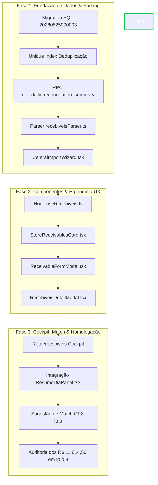

# COUNCIL DEBATE: MÓDULO DE RECEBÍVEIS (PILAR 3 - SPEC 284)
## Round 3 — Síntese Final & Veredicto Consolidado do Conselho

**Moderador Mestre:** Synthesizer  
**Data:** 25/08/2026  
**Status do Conselho:** Consenso Unânime Alcançado  
**Veredicto Final:** 🟢 **[GO]** (Nível de Confiança Consolidado: **0.95**)

---

### Sumário Executivo

O Conselho de Especialistas realizou uma auditoria profunda da proposta do **Módulo de Recebíveis (Pilar 3 - Spec 284)** através de dois rounds exaustivos de atrito construtivo entre **Architect** (visão sistêmica e modelagem), **Engineer** (viabilidade e ergonomia de código), **Analyst** (rigor quantitativo, sensibilidade e ROI) e **Contrarian** (advogado do diabo implacável).

O atrito do Round 1 desarmou premissas perigosas da especificação inicial que teriam provocado falhas catastróficas em produção:
1. Um **auto-match cego** com 50% de risco de colisão em parcelas gêmeas da Orion (R$ 3.464,83);
2. A **ausência de constraint de unicidade** que duplicaria os R$ 11.814,50 em reimportações diárias;
3. O **sumiço contábil de títulos vencidos** que estouraria a conciliação diária em 69x a 236x o teto de tolerância;
4. **Desvios de timezone UTC** que corromperiam fechamentos noturnos.

No Round 2, todas as salvaguardas foram refinadas, modeladas e aceitas consensualmente pelos 4 agentes, resultando na conversão unânime de votos para **[GO]**. O projeto apresenta **payback inferior a 11 dias úteis** e **ROI de 3.267% no 1º ano**.

```
┌───────────────────────────────────────────────────────────────────────────────────────┐
│                                QUADRO DE VOTAÇÃO FINAL                                │
├───────────────────┬──────────────┬──────────────┬──────────────────┬──────────────────┤
│ Especialista      │ Voto Round 1 │ Voto Round 2 │ Voto Final (R3)  │ Confiança Final  │
├───────────────────┼──────────────┼──────────────┼──────────────────┼──────────────────┤
│ 🏛️ Architect      │ 🟢 GO        │ 🟢 GO        │ 🟢 GO            │ 0.96             │
│ 🛠️ Engineer       │ 🟢 GO        │ 🟢 GO        │ 🟢 GO            │ 0.96             │
│ 📊 Analyst        │ 🟢 GO        │ 🟢 GO        │ 🟢 GO            │ 0.96             │
│ 💥 Contrarian     │ ❌ REWORK    │ 🟢 GO        │ 🟢 GO            │ 0.92             │
├───────────────────┴──────────────┴──────────────┼──────────────────┼──────────────────┤
│ ⚖️ SÍNTESE CONSOLIDADA                           │ 🟢 [GO]          │ 0.95 (Consenso)  │
└─────────────────────────────────────────────────┴──────────────────┴──────────────────┘
```

---

## 1. The Consensus Map (Mapa de Consenso Unânime)

Os quatro especialistas convergiram em torno dos seguintes pilares estruturais e operacionais:

```
┌──────────────────────────────────────────────────────────────────────────────────┐
│                             O MAPA DE CONSENSO                                   │
├──────────────────────────────────────────────────────────────────────────────────┤
│ 1. Eliminação da Digitação Manual Cega                                           │
│    A extração estruturada da aba 'RECEBIVEIS ' via parser dedicado               │
│    (recebiveisParser.ts) é essencial para neutralizar erros operacionais.        │
│                                                                                  │
│ 2. FSM com Estados Temporais Derivados (Anti-Staleness)                          │
│    A coluna 'status' armazena apenas eventos: 'pendente', 'recebido',            │
│    'cancelado'. Vencimentos ('vencido', 'vence_hoje', 'a_vencer') são computados │
│    dinamicamente em runtime, dispensando cron jobs noturnos frágeis.             │
│                                                                                  │
│ 3. Neutralidade Patrimonial das Partidas Dobradas                                │
│    A baixa contábil é mera permutação de ativo circulante (Pilar 3 ➔ Pilar 1).   │
│    O faturamento já foi reconhecido na competência da OS. Zero dupla contagem.  │
│                                                                                  │
│ 4. Modelo Híbrido Assistido (Rejeição do Auto-Match Cego)                        │
│    Automação atua como sistema de recomendação visual (chip de crédito OFX),     │
│    preservando a confirmação humana em 1 clique para evitar falsos positivos.    │
│                                                                                  │
│ 5. Imutabilidade Sacrossanta de Snapshots Históricos Fechados                    │
│    Dias homologados ('daily_snapshots.is_closed = true') congelam o valor        │
│    fotografado; mutações correntes jamais recalculam o passado contábil.         │
│                                                                                  │
│ 6. Cockpit Modular por Filiais                                                   │
│    Visualização em Grid de 10 filiais ('StoreReceivablesCard.tsx') espelha       │
│    a operação física, com drill-down modal integrado ao 'ResumoDiaPanel.tsx'.    │
└──────────────────────────────────────────────────────────────────────────────────┘
```

### Detalhamento dos Pontos de Consenso:
* **Justificativa Econômica & de Risco (Analyst + Architect):** A margem de tolerância de R$ 50,00 da conciliação global não tolera o menor esquecimento manual (ex: boleto de R$ 300,00 da loja Piraporinha estoura em 6x a tolerância). O parser automático garante 100% de captura de dados.
* **Ergonomia Operacional (Engineer + Contrarian):** Modais complexos de tesouraria foram substituídos por um fluxo 80/20: baixa integral com 1 clique no caso padrão (95% dos casos) e expansão contextual para descontos/juros/baixas parciais nos 5% restantes.
* **Reversibilidade Garantida (Engineer + Contrarian):** O operador conta com ação imediata `[Reabrir / Desfazer]`, que restaura `status = 'pendente'`, remove `matched_ofx_id` e recalcula instantaneamente o Pilar 3.

---

## 2. The Hard Disagreements & Salvaguardas Resolvidas

Durante os debates, o Contrarian colocou sob teste de estresse quatro vulnerabilidades críticas. Abaixo detalha-se como cada impasse foi tecnicamente solucionado e blindado:

### 💥 Impasse #1: Colisão Fatal de Parcelas Gêmeas da Orion no Auto-Match
* **O Problema:** A filial Mauá (MHE) possui dados reais com parcelas homônimas de mesmo valor:
  - `BOLETO ORION OS 22529 1/3` ➔ **R$ 3.464,83** (Vencimento 24/08/2026 - Vencido)
  - `BOLETO ORION OS 22530 2/3` ➔ **R$ 3.464,83** (Vencimento 22/09/2026 - A Vencer)
  Extratos bancários do Itaú trazem descrições genéricas (`PIX RECEBIDO` ou `LIQ.COBRANCA`). Um auto-match cego por valor teria 50% de probabilidade de baixar a parcela futura de setembro, deixando a parcela vencida em aberto, gerando cobrança indevida ao cliente e auditoria furada.
* **Salvaguarda Consensual:**
  1. **Banimento do Auto-Match Cego Não-Supervisionado.**
  2. **Adoção do Modelo Híbrido Assistido:** A interface detecta o crédito no extrato Itaú e exibe uma tag inteligente no card da filial: `💡 Crédito Itaú detectado: R$ 3.464,83 em 25/08 — [Vincular & Baixar]`.
  3. O operador humano confirma a alocação na parcela correta (1/3).
  4. Suporte a pagamentos agrupados (*Lump-Sum*): O campo `matched_ofx_id` é não-bloqueante (`NULLABLE`), permitindo baixas manuais quando 1 PIX de R$ 6.929,66 liquidar 2 parcelas simultaneamente.

---

### 💥 Impasse #2: Reimportações Excel Duplicando R$ 11.814,50 & Ressurreição de Títulos Pagos
* **O Problema:** Usuários frequentemente reimportam planilhas `CONCILIAÇÃO *.xlsx` durante o mês. Sem constraint física, novos `INSERT` duplicariam os títulos para R$ 23.629,00. Além disso, um `UPSERT` ingênuo reabriria títulos que o operador já havia baixado no sistema.
* **Salvaguarda Consensual:**
  1. **Índice Único Composto Condicional no PostgreSQL:**
     ```sql
     CREATE UNIQUE INDEX IF NOT EXISTS idx_receivables_dedup 
     ON public.receivables (
         store_id, 
         COALESCE(os_number, ''), 
         COALESCE(installment, ''), 
         COALESCE(description, ''), 
         due_date, 
         value
     );
     ```
  2. **UPSERT com Cláusula Guardrail Anti-Regressão:**
     ```sql
     INSERT INTO public.receivables (store_id, store_name, type, description, os_number, installment, value, due_date, date, status)
     VALUES ($1, $2, $3, $4, $5, $6, $7, $8, $9, 'pendente')
     ON CONFLICT (store_id, COALESCE(os_number, ''), COALESCE(installment, ''), COALESCE(description, ''), due_date, value)
     DO UPDATE SET
         store_name = EXCLUDED.store_name,
         updated_at = NOW()
     WHERE receivables.status != 'recebido'; -- Blindagem: NUNCA ressuscita títulos pagos!
     ```
  3. **Higienização Defensiva no Parser (`recebiveisParser.ts`):** Deduplicação em memória antes do envio ao banco.

---

### 💥 Impasse #3: A Armadilha de Títulos Vencidos Sumindo do Pilar 3
* **O Problema:** Se o sistema transitasse títulos não pagos no vencimento para `status = 'vencido'`, uma query de conciliação filtrando por `status = 'pendente'` omitiria a parcela vencida da Orion de R$ 3.464,83. O valor a receber despencaria de R$ 11.814,50 para R$ 8.349,67 (-29,3%), quebrando a conciliação com erro de 69,3x a tolerância.
* **Salvaguarda Consensual:**
  - A coluna `status` física armazena estritamente **eventos transacionais de ciclo de vida**: `'pendente'`, `'recebido'`, `'cancelado'`.
  - Estados temporais são **derivados em tempo de consulta/renderização**:
    - `due_date < target_date && status == 'pendente'` ➔ **Vencido** (Badge Vermelho)
    - `due_date == target_date && status == 'pendente'` ➔ **Vence Hoje** (Badge Âmbar Pulsante)
    - `due_date > target_date && status == 'pendente'` ➔ **A Vencer** (Badge Azul/Neutro)
  - A agregação da RPC captura 100% dos títulos pendentes e vencidos como ativo circulante legítimo da empresa.

---

### 💥 Impasse #4: Timezone Drift (UTC vs America/Sao_Paulo) em Baixas Noturnas
* **O Problema:** O PostgreSQL grava `received_at` em `TIMESTAMPTZ` (UTC). Uma baixa feita às 22:30 BRT de 24/08 é persistida como `2026-08-25 01:30:00+00`. A query `received_at > target_date` ingênua trataria a baixa como se tivesse ocorrido em 25/08, mantendo o título indevidamente somado no Pilar 3 de 24/08 e gerando dupla contagem com o extrato bancário.
* **Salvaguarda Consensual:**
  - Padronização em todas as queries e RPCs da conversão explícita de fuso:
    ```sql
    SELECT COALESCE(SUM(value), 0)
    INTO v_a_receber
    FROM public.receivables
    WHERE date <= v_target_date
      AND (
        status = 'pendente'
        OR (status = 'recebido' AND (received_at AT TIME ZONE 'America/Sao_Paulo')::date > v_target_date)
      );
    ```

---

### 💥 Impasse #5: Divergências de Liquidação (Descontos, Juros e Baixas Parciais)
* **O Problema:** Clientes corporativos realizam pagamentos com descontos comerciais ou retenções de tarifas (ex: pagar R$ 3.414,83 em boleto de R$ 3.464,83). Sem colunas dedicadas, a diferença de R$ 50,00 consumiria 100% da margem de tolerância da conciliação diária de toda a empresa.
* **Salvaguarda Consensual:**
  - Expansão do schema relacional com:
    - `paid_value NUMERIC(12,2)`
    - `discount_value NUMERIC(12,2) DEFAULT 0.00`
    - `interest_value NUMERIC(12,2) DEFAULT 0.00`
    - `payment_method TEXT`
  - Na baixa, o Pilar 3 é baixado pelo valor de face integral ($V_{\text{face}}$), o Pilar 1 recebe o valor líquido creditado ($V_{\text{pago}}$), e as diferenças são segregadas em contas de resultado financeiro, preservando a identidade exata da conciliação.
  - Para baixas parciais, o sistema liquida o registro original e cria automaticamente a parcela residual vinculada (ex: `OS 22529-SALDO`).

---

## 3. The Pivot (What Changed)

A comparação entre a proposta inicial da Spec 284 e a arquitetura final blindada demonstra a evolução qualitativa gerada pelo Council Debate:

```
┌──────────────────────────────────────────────────────────────────────────────────────────────────────────┐
│                                         A EVOLUÇÃO ARQUITETURAL                                          │
├────────────────────────────────┬────────────────────────────────────┬────────────────────────────────────┤
│ Dimensão Técnica               │ Especificação Inicial (Spec 284)   │ Arquitetura Consolidada (Round 3)  │
├────────────────────────────────┼────────────────────────────────────┼────────────────────────────────────┤
│ Mecânica de Baixa Contábil     │ Auto-match cego autônomo por valor │ Modelo Híbrido Assistido (Chip de  │
│                                │ numérico simples                   │ sugestão + Baixa Manual 1-clique)  │
├────────────────────────────────┼────────────────────────────────────┼────────────────────────────────────┤
│ Ciclo de Vida & Temporalidade  │ Status estático persistido         │ FSM com estados derivados em       │
│                                │ ('vencido', 'vence_hoje') em banco │ runtime; status estrito em banco   │
├────────────────────────────────┼────────────────────────────────────┼────────────────────────────────────┤
│ Idempotência em Reimportações  │ Inexistente (INSERT cego sujeito a │ UNIQUE INDEX natural + UPSERT com  │
│                                │ duplicações de linhas)             │ cláusula WHERE status != 'recebido'│
├────────────────────────────────┼────────────────────────────────────┼────────────────────────────────────┤
│ Integridade Temporal & Timezone│ Comparação ingênua 'received_at >  │ Conversão explícita com AT TIME    │
│                                │ target_date' sujeita a drift UTC   │ ZONE 'America/Sao_Paulo'           │
├────────────────────────────────┼────────────────────────────────────┼────────────────────────────────────┤
│ Governança de Snapshots        │ Recálculo dinâmico irrestrito      │ Imutabilidade estrita de dias com  │
│                                │ para qualquer data                 │ daily_snapshots.is_closed = true   │
├────────────────────────────────┼────────────────────────────────────┼────────────────────────────────────┤
│ Liquidações Não-Exatas         │ Ausência de suporte a descontos,   │ Schema expandido com paid_value,   │
│                                │ juros de mora e baixas parciais    │ discount_value e interest_value    │
├────────────────────────────────┼────────────────────────────────────┼────────────────────────────────────┤
│ Experiência do Operador (UX)   │ Listagem genérica com modais       │ Cockpit por Filial (10 cards) +    │
│                                │ isolados                           │ Drill-down no Resumo do Dia        │
└────────────────────────────────┴────────────────────────────────────┴────────────────────────────────────┘
```

---

## 4. Final Verdict & Plano de Ação Estruturado

### Veredicto Oficial do Conselho:
$$\mathbf{VEREDICTO: \quad [GO]}$$
$$\text{Nível de Confiança: } \mathbf{0.95} \quad \Big| \quad \text{Payback: } \mathbf{11 \text{ dias úteis}} \quad \Big| \quad \text{Tempo de Engenharia: } \mathbf{8 \text{ horas}}$$

---

### Plano de Implementação em 3 Fases



---

### Detalhamento das Fases de Execução:

#### 🔹 Fase 1: Fundação de Dados & Parsing Tolerante (Esforço Est.: 2h 30min)
1. **Migration SQL (`supabase/migrations/20260825000003_receivables_schema_and_rpc.sql`):**
   - Adicionar colunas analíticas e de liquidação: `description`, `os_number`, `installment`, `discount_value`, `interest_value`, `paid_value`, `matched_ofx_id`, `updated_at`.
   - Criar o índice único de deduplicação `idx_receivables_dedup`.
   - Atualizar a RPC `get_daily_reconciliation_summary` com o cômputo temporal blindado por `AT TIME ZONE 'America/Sao_Paulo'`.
2. **Parser TypeScript (`src/lib/parsers/recebiveisParser.ts`):**
   - Implementar leitor defensivo da aba `RECEBIVEIS ` (regex `/^RECEBIVE?IS?\s*$/i`).
   - Normalização automática das 10 filiais (Planalto/BRASICAR, Piraporinha/EMPORIO, Mauá/MHE, etc.).
   - Suporte a formatos heterogêneos de data (string e serial numérico Excel) e moedas formatadas.
3. **Integração no Wizard de Importação (`src/components/import/CentralImportWizard.tsx`):**
   - Habilitar extração automática de recebíveis no upload da planilha diária.

#### 🔹 Fase 2: Componentização Modular & Ergonomia UX (Esforço Est.: 3h 30min)
1. **Hook React Query (`src/hooks/useRecebiveis.ts`):**
   - Mutação otimista de baixa (`useMarkReceived`), estorno (`useReopenReceivable`) e cadastro avulso (`useCreateReceivable`).
   - Invalidação automática das chaves de conciliação diária e resumo de recebíveis.
2. **Card por Filial (`src/components/recebiveis/StoreReceivablesCard.tsx`):**
   - Grid das 10 lojas com subtotal pendente, lista colapsável de títulos, badges semânticos (`Vencido`, `Vence Hoje`, `A Vencer`, `Recebido`) e botão de baixa rápida em 1 clique.
3. **Modal de Cadastro/Ajuste (`src/components/recebiveis/ReceivableFormModal.tsx`):**
   - Cadastro manual rápido e suporte a baixa com divergência (descontos e juros).
4. **Modal de Detalhamento no Fechamento (`src/components/conciliacao/RecebiveisDetailModal.tsx`):**
   - Drill-down analítico do Pilar 3 a partir do clique no card \"A RECEBER\" do `ResumoDiaPanel.tsx`.

#### 🔹 Fase 3: Cockpit Mestre, Match Assistido & Homologação (Esforço Est.: 2h 00min)
1. **Cockpit Geral (`src/routes/recebiveis.tsx`):**
   - Cabeçalho executivo com filtro de data de competência, KPIs consolidados (Total a Receber, Vencendo Hoje, Vencidos) e abas de navegação.
2. **Motor de Sugestão de Match OFX:**
   - Detecção de créditos equivalentes no extrato bancário do dia e renderização de tag interativa de conciliação assistida.
3. **Auditoria de Homologação com Dados de 25/08/2026:**
   - Validar a importação e conciliação exata dos **R$ 11.814,50**:
     - Planalto (Gestauto): R$ 1.120,00
     - Piraporinha (Massimo Pedras): R$ 300,00
     - Mauá (Orion 3 parcelas): R$ 10.394,50
   - Confirmar preservação dos snapshots fechados de 17, 18, 19, 21 e 24/08.

---

### Métricas de Homologação e Critérios de Aceite (DoD)

| Critério de Aceite | Métrica Alvo | Método de Verificação |
| :--- | :---: | :--- |
| **Idempotência de Importação** | 0 duplicações em 10 uploads | Upload repetido da planilha de 25/08 no wizard; saldo mantém R$ 11.814,50 |
| **Preservação de Títulos Pagos** | 0 regressões de status | Baixar boleto de Piraporinha, reimportar planilha; status permanece `recebido` |
| **Precisão da Conciliação Diária** | Diferença $\le$ R$ 50,00 | `ResumoDiaPanel` com status `approved` no fechamento diário |
| **Isolamento de Snapshots Fechados** | 0 alterações no passado | Consulta a 24/08 antes e após baixa em 25/08; snapshot histórico inalterado |
| **Timezone Consistency** | 0 desvios noturnos | Teste de baixa simulada às 23:00 BRT; competência atribuída ao dia correto |
| **Tempo de Resposta do Cockpit** | $< 300\text{ ms}$ | Carregamento do grid de 10 lojas com React Query cache |

---
**Síntese homologada pelo Moderador Mestre. O projeto está liberado para execução imediata pela Engenharia.**
