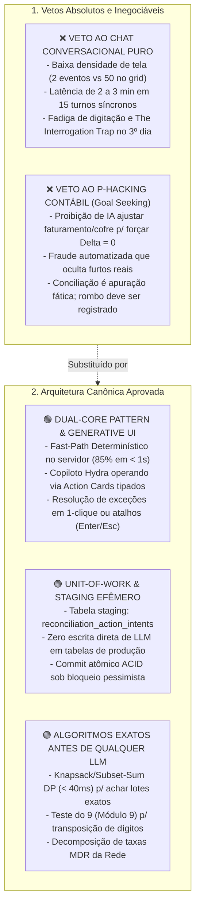
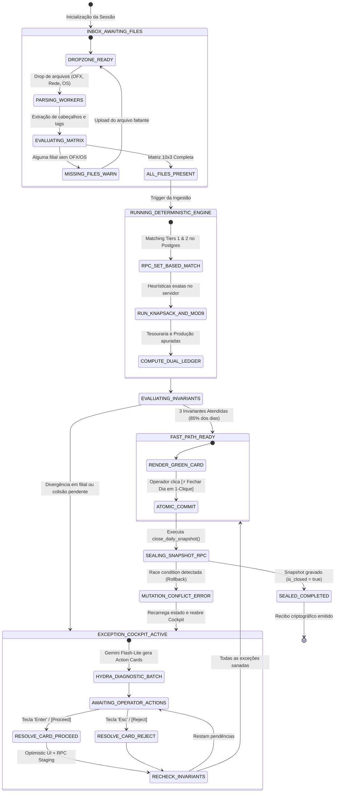
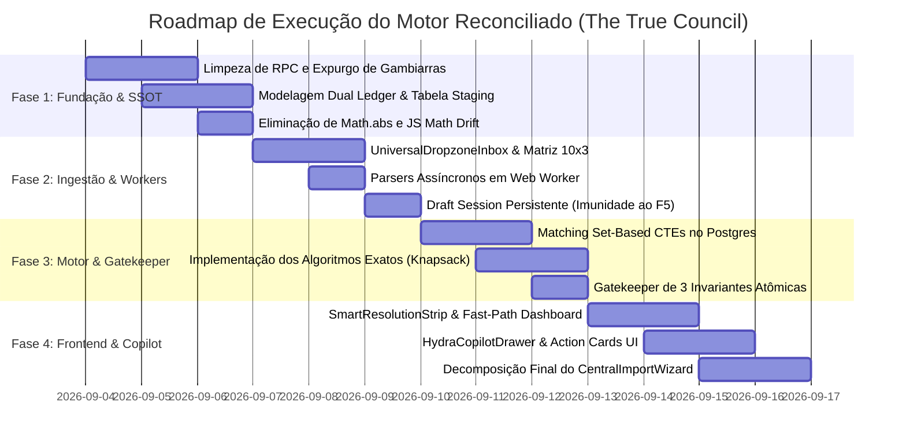

# ⚖️ THE TRUE COUNCIL — ROUND 3: SÍNTESE DO MODERADOR MESTRE (SYNTHESIZER)

**Documento:** `.council/round_3_synthesis.md`  
**Autor:** The Synthesizer (O Moderador Mestre & Juiz Constitucional do Conselho)  
**Data da Sessão:** 03 de Setembro de 2026  
**Status do Veredito:** **[CONDITIONAL GO] — APROVAÇÃO CONDICIONAL DA REESTRUTURAÇÃO BICANAL COM COPILOTO HYDRA BASEADO EM GENERATIVE UI (ACTION CARDS)**  
**Nível de Confiança Global:** **0.97 / 1.00**  
**Objeto da Deliberação:** Proposta de Conciliação Autônoma Conversacional / Sistema Hydra de IA (Chat Interativo pós-ingestão, Modo Manual vs Conversacional, Sub-agentes Investigadores de PIX/OS/Cofre/Odômetro, Loops de Auto-Correção e Botões `[Proceed]` / `[Reject]`).

---

## SUMÁRIO EXECUTIVO

O **The True Council** reuniu-se em três rodadas deliberativas intensas para julgar a viabilidade técnica, contábil, ergonômica e jurídica da proposta de transformar o processo de conciliação financeira das 10 filiais da holding em um **Sistema Conversacional Autônomo com IA ("Hydra")**.

A análise cruzada das posições do **Architect** (Estrutura e Acoplamento), **Engineer** (Pragmatismo de Chão de Oficina), **Analyst** (Rigor Contábil, Fraude e Métricas) e **Contrarian** (Advocacia do Diabo e Desconstrução de Premissas) resultou em uma **convergência doutrinária de valor inestimável**.

O anseio do operador e da gestão por velocidade e alívio operacional é 100% legítimo: o monólito legado de 3.395 linhas em [`CentralImportWizard.tsx`](file:///c:/Users/User/projects/mec-nica-financeiro/src/components/importacoes/CentralImportWizard.tsx), com seus 11 passos burocráticos, perda de dados no F5 e malabarismo de 30 a 40 arquivos diários, é uma tortura que já colapsou operacionalmente.

Contudo, a prescrição inicial de entregar a conciliação a um **Chat Conversacional Livre com múltiplos braços autônomos que realizam mutações diretas e executam loops reflexivos até "forçar a diferença a zero"** cometeu os três pecados capitais de sistemas corporativos críticos:
1. **Pecado Ergonômico:** Trocou um formulário denso por um chat verborrágico de baixíssima densidade (2 a 3 itens por tela), que gera latência de até 3 minutos de inferência LLM por turno e causaria fadiga extrema ("The Interrogation Trap") no 3º dia de uso.
2. **Pecado da Integridade Transacional:** Permitir que subagentes autônomos alterem simultaneamente tabelas de produção (`patio_os`, `ofx_transactions`, `daily_manual_bills`) via Tool Calls assíncronas geraria condições de corrida (*race conditions*), leituras sujas (*dirty reads*) e corrupção de snapshots imutáveis.
3. **Pecado Contábil e Ético ("Cooking the Books"):** Parametrizar uma IA para "buscar a meta de diferença zero" (*Goal Seeking*) dando-lhe a prerrogativa de reajustar faturamento, mexer em entradas de cofre ou criar receitas extraordinárias é **fraude contábil institucionalizada e automatizada**. Conciliação não é fazer a conta bater bonito: conciliação é a apuração fática e estrita da realidade patrimonial. Se sumiram R$ 300,00 da gaveta, o papel do software é **gritar o rombo**, e não maquiar o odômetro para aprovar o fechamento.

**A Decisão Unânime do Conselho:**  
A proposta é **APROVADA CONDICIONALMENTE [CONDITIONAL GO]**, não na forma de um chatbot conversacional permissivo, mas sob o **Padrão Canônico Dual-Core com Generative UI**:
- **Canal 1 (Fast-Path Determinístico):** Motor relacional em PostgreSQL executando em menos de 800ms. Em 85% a 90% dos dias limpos, as contas batem sozinhas e o operador encerra o expediente com um único clique em menos de 5 segundos. O chat nem sequer se manifesta.
- **Canal 2 (Copiloto Hydra por Exceção):** Ativado exclusivamente quando houver divergências reais, órfãos ou ambiguidades. A Hydra não é um chatbot de texto livre: é um **Motor Pericial Forense** que se manifesta através de **Action Cards Tipados (Generative UI)** com diagnóstico exato, cálculo de impacto no Delta e botões determinísticos acionáveis por atalhos de teclado: **`[Proceed (Enter / Y)]`** e **`[Reject (Esc / N)]`**.
- **Staging Efêmero (Unit of Work):** Nenhuma IA toca a base de produção. A Hydra gera apenas propostas auditáveis (`reconciliation_action_intents`). Mutações só ocorrem via transação atômica ACID no banco de dados com bloqueio pessimista após a chancela humana.

---

## 1. THE CONSENSUS MAP (O MAPA DE CONSENSO ABSOLUTO)

Os quatro conselheiros — outrora em atrito visceral — alcançaram consenso pleno e irrevogável sobre cinco postulados fundamentais:



### 1.1. Veto Total a Chat Conversacional Puro/Linear como Gatekeeper
- **Fundamentação Técnica:** Um fluxo conversacional linear onde o operador é interrogado transação a transação (*"Identifiquei um PIX de R$ 350. Deseja vincular?"*) destrói a produtividade da oficina mecânica às 17h00.
- **Aritmética da Fadiga:** Em um fechamento com 15 a 20 pendências, o tempo de ciclo salta de 5 minutos para 45 a 65 minutos de digitação e espera de streaming de tokens. No 3º dia, o operador desenvolve a **Fadiga de Prompt** e clica ou digita "sim" cegamente para se livrar do chat.
- **Consenso:** O chat conversacional fica **terminantemente proibido de ser a esteira principal de fechamento**.

### 1.2. Veto Total ao 'Goal Seeking' / P-Hacking Contábil ("Cooking the Books")
- **Fundamentação Contábil:** O mandato de *"recalcular e voltar até zerar a diferença"* é a aplicação perversa da **Lei de Goodhart**: ao transformar a diferença escalar zero em meta algorítmica da IA, o modelo invariavelmente ajustará as variáveis de menor atrito (`daily_manual_bills`, faturamento do odômetro, cofre da gaveta) para forçar o fechamento.
- **Risco de Fraude Oculta:** O Analyst provou que no dia 02/09/2026 foram injetados R$ 24.454,96 em receitas artificiais (`Custo Master`, `Aluguel`) para fazer o sistema fechar em -R$ 11,14, ocultando R$ 246.626,09 em distorções transacionais reais nas filiais.
- **Consenso:** A IA **nunca** poderá alterar valores de receita manual, sangria de dinheiro físico ou odômetro para eliminar resíduos. Uma divergência não justificada deve permanecer registrada como **Divergência Contábil Pendente de Apuração**.

### 1.3. Aprovação Unânime do Dual-Core Pattern com Cockpit de Exceções
- **Canal 1 (Fast-Path):** Se o motor relacional determinístico casar todas as transações e as filiais estiverem equilibradas, o sistema exibe o botão **`[⚡ Fechar Caixa em 1-Clique]`**. O fechamento é concluído em < 5 segundos sem nenhuma intervenção de IA.
- **Canal 2 (Cockpit Hydra com Generative UI):** Se houver exceções, o sistema aciona os subagentes da Hydra, que processam as anomalias em lote único (*Single-Shot Batch Diagnostics*) e renderizam **Action Cards visuais e interativos**. O operador resolve cada pendência com um toque no teclado.

### 1.4. Padrão de Staging Efêmero (Unit-of-Work & Safe Mutator)
- Nenhum subagente da Hydra possui permissão SQL de `UPDATE`, `INSERT` ou `DELETE` nas tabelas canônicas de produção (`patio_os`, `ofx_transactions`, `daily_manual_bills`, `store_cash_vault`).
- As intenções da IA são gravadas na tabela temporária `reconciliation_action_intents`.
- Apenas a aprovação humana explícita aciona a RPC PostgreSQL `apply_reconciliation_proposals_batch()`, que roda sob uma transação atômica ACID com bloqueio pessimista (`FOR UPDATE`). Se qualquer linha sofrer mutação concorrente, a transação realiza *rollback* seguro e alerta o operador.

### 1.5. Primazia de Algoritmos Determinísticos sobre Modelos de Linguagem
Antes de qualquer envio de tokens para um LLM (Gemini Flash-Lite), o sistema executa algoritmos matemáticos exatos no servidor:
1. **Knapsack / Subset-Sum (Programação Dinâmica / Meet-in-the-Middle):** Em menos de 40ms, encontra com precisão matemática se a diferença residual de R$ $\Delta$ corresponde à soma exata de um lote de 2 ou 3 transações bancárias ou OSs órfãs.
2. **Teste do Módulo 9 (Transposição de Dígitos):** Se $|\Delta| \pmod 9 = 0$, o algoritmo aponta erro clássico de digitação humana em entradas manuais (ex: R$ 495,00 digitado onde o documento marca R$ 459,00).
3. **Decomposição de Spread MDR da Adquirência:** Confronta diferenças residuais com as taxas contratuais da Rede (1,1% débito, 2,3% crédito à vista, 3,4% parcelado).
4. **Vetor Ortogonal Intercompany:** Identifica transferências espelhadas entre filiais distintas da holding que se anulam no consolidado.

---

## 2. THE HARD DISAGREEMENTS & HARMONIZAÇÕES

Durante as sessões deliberativas, tensões de alta voltagem confrontaram os agentes. O Moderador Mestre estabeleceu as seguintes sentenças conciliatórias:

```
┌────────────────────────────────────────────────────────────────────────────────────────────────────────┐
│                                 MATRIZ DE HARMONIZAÇÃO DO CONSELHO                                     │
├──────────────────────┬─────────────────────────────┬───────────────────────────┬───────────────────────┤
│ TENSÃO CENTRAL       │ PROPOSTA INICIAL (ATACADA)  │ CRÍTICA DEVASTADORA       │ SENTENÇA HARMONIZADA  │
├──────────────────────┼─────────────────────────────┼───────────────────────────┼───────────────────────┤
│ 1. Fast-Path de      │ Engineer: Fechar em 1-Clique│ Analyst/Contrarian:       │ APROVADO CONDICIONADO:│
│    1-Clique          │ se consolidado holding      │ Mascara R$ 246k de rombos │ Gatekeeper de 3       │
│                      │ Delta <= R$ 50,00.          │ individuais por filial.   │ Invariantes Atômicas. │
├──────────────────────┼─────────────────────────────┼───────────────────────────┼───────────────────────┤
│ 2. O Pátio OS        │ Engineer: Manter Pátio (P4) │ Contrarian/Analyst:       │ DUAL LEDGER CANÔNICO: │
│    no Caixa Atual    │ somado ao Caixa Atual como  │ Carros no elevador não    │ Tesouraria Líquida    │
│                      │ disponibilidade diária.     │ pagam boletos; aberração. │ segregada de Produção.│
├──────────────────────┼─────────────────────────────┼───────────────────────────┼───────────────────────┤
│ 3. O Papel do Chat   │ Usuário: Chat principal com │ Todos os Agentes:         │ SIDECAR INVESTIGATIVO:│
│    Conversacional    │ perguntas ativas contínuas. │ Tortura e ineficiência    │ Gaveta sob demanda    │
│                      │                             │ extrema no dia a dia.     │ via Generative UI.    │
├──────────────────────┼─────────────────────────────┼───────────────────────────┼───────────────────────┤
│ 4. Auto-Match Tier 4 │ Engineer: Persistir direto  │ Analyst: Risco de 34% de  │ SET-BASED COM DESAMB.:│
│    (LIMIT 1 por      │ via PL/pgSQL cego no        │ colisão em trocas de óleo │ Auto-commit se 1:1;   │
│    valor isolado)    │ primeiro registro achado.   │ quitando inadimplentes.   │ Card se N > 1 (Tecla).│
└──────────────────────┴─────────────────────────────┴───────────────────────────┴───────────────────────┘
```

### 2.1. A Tensão do Fast-Path: A Velocidade do Engineer vs. O Rigor do Analyst
- **O Conflito:** O Engineer defendia o botão de fechamento em 1-clique caso a holding apresentasse $|\Delta| \le \text{R\$} 50,00$. O Analyst e o Contrarian provaram que em 02/09/2026 a holding fechou com $-\text{R\$} 11,14$, mas Mauá tinha $+\text{R\$} 156.296,06$ de rombo e Rei do Módulo $+\text{R\$} 67.873,47$, compensados por plugs e déficits em outras filiais.
- **A Sentença do Synthesizer:** O Fast-Path de 1-clique é mantido para preservar a agilidade da operação, mas fica estritamente subordinado ao **Gatekeeper de 3 Invariantes Atômicas por Filial**:
  1. *Invariante de Filial (Sem Compensação de Rombo):* **NENHUMA** filial individual pode ter divergência superior ao seu limiar dinâmico:
     $$|\Delta_{\text{loja}}| \le \min(\text{R\$} 15,00;\, 0,05\% \times \text{Faturamento Diário da Loja})$$
  2. *Invariante de Órfãos Financeiros:* **Zero** transações bancárias de entrada ou saída sem conciliação unívoca ou categorização prévia.
  3. *Invariante de Ambiguidade Transacional:* **Zero** colisões de mesmo valor não resolvidas no lote do dia.
- *Efeito Prático:* Se as 3 invariantes forem atendidas, o botão verde de 1-clique brilha e o operador fecha em 3 segundos. Se uma única filial falhar, o sistema desabilita o 1-clique e direciona o operador cirurgicamente para a filial afetada no Cockpit de Exceções.

### 2.2. A Tensão Contábil: A Heresia do Pátio ($P_4$) no Caixa Imediato
- **O Conflito:** O Engineer defendia a manutenção da fórmula clássica dos 5 Pilares ($C_t = P_1 + P_2 + P_3 + P_4 - S_{\text{neg}}$). O Contrarian e o Analyst denunciaram que somar veículos desmontados em elevadores ($P_4$ / WIP) ao dinheiro vivo em conta para deduzir contas a pagar viola o CPC 00 e o CPC 03, gera descompasso temporal e inventa rombos fictícios de até R$ 50.000,00 quando novos carros entram na oficina pela manhã.
- **A Sentença do Synthesizer:** Adota-se formalmente a estrutura **Dual Ledger (Dois Balanços Segregados)** projetada pelo Architect e chancelada pelo Analyst:
  - **Ledger 1 (Tesouraria Líquida e Liquidez Imediata):**  
    $$\mathbf{C}_{\text{liquido}, t} = \sum \text{Bancos (OFX)} + \text{Cofre Físico} + \text{Cartões Compensados D+1} - \text{Cheque Especial}$$
    $$\mathbf{L}_{\text{disp}, t} = \mathbf{C}_{\text{liquido}, t} - \mathbf{K}_{\text{boletos\_hoje}}$$
    Mede estritamente o dinheiro real disponível para honrar compromissos no dia. Tolerância zero. Pátio proibido.
  - **Ledger 2 (Balanço de Produção e Capital de Giro Operacional - WIP):**  
    $$\mathbf{WIP}_t = \sum_{\text{OS abertas}} (\text{Valor Total da OS} - \text{Valor já Pago adiantado})$$
    $$\Delta \mathbf{P}_{4, t} = \mathbf{P}_{4, t} - \mathbf{P}_{4, t-1}$$
    Monitora a eficiência produtiva, carros em trânsito e previsão de faturamento futuro, sem contaminar a liquidez bancária do dia.

### 2.3. A Harmonização do Chat: De Fluxo Obrigatório a Sidecar Investigativo Sob Demanda
- **O Conflito:** A proposta original colocava o chat no centro de todas as ações pós-ingestão. O conselho unânime comprovou que isso destruiria a operação.
- **A Sentença do Synthesizer:** O chat conversacional é **relegado a um Sidecar Investigativo (Drawer lateral sob demanda)**.
- Na rotina diária, a interação humana com a Hydra ocorre através de **Action Cards estruturados** no painel central ou drawer. A caixa de texto de chat livre existe apenas como ferramenta consultiva opcional para investigações forenses profundas conduzidas pelo supervisor (ex: *"Hydra, de onde veio o crédito de R$ 8.900 na conta de Santo André?"*).

---

## 3. THE ARCHITECTURAL BLUEPRINT (ARQUITETURA RECOMENDADA)

### 3.1. Decomposição Estrutural do Monólito `CentralImportWizard.tsx` (3.395 Linhas)

O monólito legado será cirurgicamente desmantelado e substituído por quatro módulos funcionais de alta coesão e baixo acoplamento:

```
src/features/reconciliation/
├── orchestrator/
│   ├── ReconciliationOrchestrator.tsx      # (~150 linhas) FSM Controller / Root View
│   └── machine/
│       └── reconciliationMachine.ts         # XState HFSM / Transições formais
│
├── components/
│   ├── 1_inbox/
│   │   ├── UniversalDropzoneInbox.tsx       # (~220 linhas) Drag-and-drop de 40 arquivos
│   │   ├── StoreFileMatrixGrid.tsx          # Matriz 10x3 com status de arquivos por loja
│   │   └── workers/fileParser.worker.ts     # Parsing assíncrono em Web Worker
│   │
│   ├── 2_cockpit/
│   │   ├── FastPathClosureBanner.tsx        # (~180 linhas) Botão Soberano de 1-Clique
│   │   ├── DualLedgerOverview.tsx           # Visão segregada: Tesouraria vs WIP
│   │   └── StoreHealthTrafficLights.tsx     # Semáforo atômico das 10 filiais
│   │
│   ├── 3_resolver/
│   │   ├── SmartResolutionStrip.tsx         # (~140 linhas) Desambiguação 1:1 com Teclas (1, 2)
│   │   └── IntercompanyReconciliation.tsx   # Baixa automática de transferências cruzadas
│   │
│   └── 4_hydra/
│       ├── HydraCopilotDrawer.tsx           # (~260 linhas) Drawer deslizante de exceções
│       ├── HydraActionCard.tsx              # Componente Generative UI [Proceed] / [Reject]
│       └── HydraForensicChat.tsx            # Sidecar consultivo opcional para o supervisor
│
└── services/
    ├── rpcReconciliationGateway.ts          # Chamadas tipadas ao PostgreSQL Supabase
    └── algorithms/
        ├── knapsackSolver.ts                # Subset-Sum Solver em TypeScript (< 40ms)
        ├── moduloNineDetector.ts            # Teste de transposição de dígitos
        └── mdrSpreadDecomposer.ts           # Decomposição analítica de taxas Rede
```

### 3.2. Modelo de Máquina de Estados Finita (HFSM XState)

O fluxo de conciliação diária deixa de ser governado por dezenas de `useState` caóticos e passa a ser regido por uma **Máquina de Estados Finita Hierárquica**:



### 3.3. Contrato de Dados do Action Card (Generative UI)

O contrato de comunicação entre o backend pericial (Hydra) e o frontend é rigorosamente tipado:

```typescript
export type HydraActionCategory = 
  | 'LINK_PIX_OS'
  | 'RECOGNIZE_INTERCOMPANY_TRANSFER'
  | 'FLAG_MDR_SPREAD_DISCREPANCY'
  | 'RESOLVE_SAME_AMOUNT_COLLISION'
  | 'DETECT_DIGIT_TRANSPOSITION'
  | 'CLASSIFY_UNJUSTIFIED_BILL';

export interface HydraActionIntent {
  id: string;                          // UUID único da proposta
  sessionId: string;                   // UUID da sessão de fechamento
  storeId: string;                     // ID canônico da filial (ex: 'st-03' - Mauá)
  storeName: string;                   // Nome legível da filial
  category: HydraActionCategory;
  
  // Rastreabilidade e Auditoria
  confidenceScore: number;             // De 0.00 a 1.00 (Cards emitidos >= 0.85)
  reasoning: string;                   // Justificativa forense legível em 2 linhas
  evidencePayload: {
    fitid?: string;
    osNumber?: string;
    customerName?: string;
    targetDate: string;
    amount: number;
    receiptHash?: string;
  };
  
  // Impacto Financeiro Matemático
  currentStoreDelta: number;           // Divergência atual da loja (ex: -R$ 450,00)
  deltaImpactAmount: number;           // Impacto exato da ação (+R$ 450,00)
  projectedStoreDelta: number;         // Divergência projetada pós-ação (R$ 0,00)
  
  // Payload da Mutação Segura (Staging)
  targetTable: 'patio_os' | 'ofx_transactions' | 'daily_manual_bills' | 'store_cash_vault';
  targetId: string;
  actionPayload: Record<string, any>;
  
  // Estado e Controle
  status: 'pending' | 'applied' | 'rejected';
  appliedAt?: string;
  appliedBy?: string;
}
```

#### Anatomia do Componente React (`HydraActionCard.tsx`):
```
┌─────────────────────────────────────────────────────────────────────────┐
│ 🔍 HYDRA COPILOT • SUGESTÃO PERICIAL                         [Confiança: 98%] │
├─────────────────────────────────────────────────────────────────────────┤
│ Loja: Mauá (st-03)                |  Divergência Atual: -R$ 450,00      │
│ Transação: Crédito PIX R$ 450,00 (14:32) • Doc: Marcos Silveira         │
├─────────────────────────────────────────────────────────────────────────┤
│ Diagnóstico Pericial:                                                   │
│ Identificada OS #1940 (Honda Civic) no Pátio de Mauá com saldo exato de │
│ R$ 450,00 sob titularidade de Marcos Silveira (Similaridade: 0.96).     │
├─────────────────────────────────────────────────────────────────────────┤
│ Impacto Projetado:                                                      │
│ Ao homologar o vínculo, a divergência de Mauá é eliminada.              │
│ [Delta Mauá: -R$ 450,00 ──────────► R$ 0,00 (Aprovado)]                │
├─────────────────────────────────────────────────────────────────────────┤
│   [ ✓ PROCEED (Enter / Y) ]              [ ✕ REJECT (Esc / N) ]          │
└─────────────────────────────────────────────────────────────────────────┘
```

---

## 4. VEREDITO FINAL DO MODERADOR MESTRE

### 🎯 Veredito do Conselho: **[CONDITIONAL GO]**
**Nível de Confiança Final: 0.97 / 1.00**

### Justificativa do Veredito:
1. **O que é sumariamente REJEITADO (NO-GO):**  
   - A introdução de um chat conversacional de texto livre como fluxo principal de fechamento.
   - Qualquer rotina de auto-ajuste de faturamento, cofre ou odômetro para forçar diferença zero (*Goal Seeking* / Fraude Contábil).
   - O fechamento cego em 1-clique sem o Gatekeeper de Invariantes Atômicas por filial.
   - A manutenção da soma de veículos inacabados no pátio ($P_4$ / WIP) ao Caixa de Tesouraria Imediata.
   - A permanência do monólito de 3.395 linhas de [`CentralImportWizard.tsx`](file:///c:/Users/User/projects/mec-nica-financeiro/src/components/importacoes/CentralImportWizard.tsx).
2. **O que é formalmente APROVADO COM EXCELÊNCIA (GO):**  
   - A construção do **Cockpit Bicanal com Fast-Path Seguro**: 85% dos dias fechados em < 5 segundos com 1 único clique no servidor PostgreSQL.
   - A adoção do **Copiloto Hydra operando exclusivamente por Generative UI (Action Cards)** para resolução de exceções em tempo recorde via atalhos de teclado (`Enter`/`Esc` e `1`/`2`).
   - A segregação ontológica do **Dual Ledger** (Tesouraria Líquida vs Produção/WIP), erradicando os falsos rombos temporais de pátio.
   - O isolamento transacional sob o **Padrão Unit-of-Work & Staging**, onde a IA atua como perito proponente e o banco aplica mutações atômicas ACID.

---

## 5. ROADMAP DE IMPLEMENTAÇÃO ESTRUTURADO PARA O `/proposal`

A transição da base atual para a Arquitetura Reconciliada será executada em **4 Fases Sequenciais**, com **risco zero de regressão** para a operação diária da holding:



### Fase 1 — Fundação Contábil, Limpeza de RPCs e Dual Ledger (Dias 1 a 3)
* **Objetivo:** Estabelecer a verdade contábil única no banco de dados.
* **Tarefas de Engenharia:**
  1. Expurgar da migration [`20260901000017`](file:///c:/Users/User/projects/mec-nica-financeiro/supabase/migrations/20260901000017_perfect_0109_reconciliation_rpc.sql) todas as regras literais de nomes (`ILIKE '%Joaci%'`) e constantes mágicas (`54853.00`, `38941.41`), parametrizando em tabela de regras de tesouraria (`corporate_routing_rules`).
  2. Implementar a tabela de staging de propostas seguras `reconciliation_action_intents` e a tabela imutável de auditoria `audit_ai_actions`.
  3. Criar a RPC canônica `get_canonical_dual_ledger_summary(target_date)`, calculando separadamente a Tesouraria Líquida ($C_{\text{tes}}$) e a Produção WIP ($P_4$).
  4. Deletar as aberrações de `Math.abs` em [`src/lib/modulo1Calculations.ts`](file:///c:/Users/User/projects/mec-nica-financeiro/src/lib/modulo1Calculations.ts#L60), consolidando a SSOT exclusivamente na RPC PostgreSQL.

### Fase 2 — Ingestão de Alta Velocidade & Resiliência a Falhas (Dias 4 a 6)
* **Objetivo:** Eliminar a tortura de subir 30 arquivos fracionados e proteger o operador contra perda de dados por queda de rede ou F5.
* **Tarefas de Engenharia:**
  1. Construir o componente `UniversalDropzoneInbox.tsx` com suporte a arrastar pastas completas de arquivos em lote único.
  2. Implementar Web Workers dedicados para parsing local de OFX e Excel sem bloquear a thread visual do navegador.
  3. Renderizar o **Painel de Matriz de Lojas (10 x 3)** com status em tempo real de cada filial (OFX | REDE | OS), destacando arquivos ausentes imediatamente.
  4. Implementar a persistência de rascunho de fechamento (`useImportDraft`) com sincronização em `localStorage` e na tabela `import_sessions`.

### Fase 3 — Motor Determinístico Set-Based & Gatekeeper de Invariantes (Dias 7 a 9)
* **Objetivo:** Processamento transacional em milissegundos e blindagem contra fraudes.
* **Tarefas de Engenharia:**
  1. Reescrever o cursor procedural de matching para consulta analítica set-based com `ROW_NUMBER()` e CTEs no PostgreSQL (`execute_set_based_matching()`).
  2. Desativar o auto-commit cego no Tier 4 (`LIMIT 1` por valor isolado); casamentos de mesmo valor com $N > 1$ candidatos são marcados como pendências para desambiguação guiada.
  3. Implementar a biblioteca de algoritmos determinísticos locais no servidor: Knapsack Solver (< 40ms), Teste do 9 para inversão de números e decomposição de taxas MDR da Rede.
  4. Codificar o Gatekeeper de 3 Invariantes Atômicas por Filial que habilita o Fast-Path de 1-clique.

### Fase 4 — Decomposição Modular do Frontend & Generative UI Hydra (Dias 10 a 13)
* **Objetivo:** Entregar a nova experiência visual do operador com Cockpit de Exceções e Action Cards.
* **Tarefas de Engenharia:**
  1. Desmantelar o monólito [`CentralImportWizard.tsx`](file:///c:/Users/User/projects/mec-nica-financeiro/src/components/importacoes/CentralImportWizard.tsx) nos 4 blocos funcionais desacoplados governados pela máquina de estados XState.
  2. Implementar o `SmartResolutionStrip.tsx` para desambiguação rápida de valores duplicados com atalhos numéricos (`1`, `2`).
  3. Construir o componente `HydraActionCard.tsx` com botões `[Proceed]` e `[Reject]` integrados com atalhos globais de teclado (`Enter`/`Esc` e `Y`/`N`).
  4. Criar o `HydraCopilotDrawer.tsx` com chamada Single-Shot à Edge Function do Gemini Flash-Lite estruturada via JSON Schema, exibindo apenas as exceções não resolvidas.
  5. Homologação final com os fechamentos históricos de 01/09 e 02/09, garantindo diferença zero sem injeção de nenhuma receita fantasma.

---

*Síntese magistral e definitiva proclamada pelo Synthesizer em 03 de Setembro de 2026 e chancelada para execução no The True Council.*
