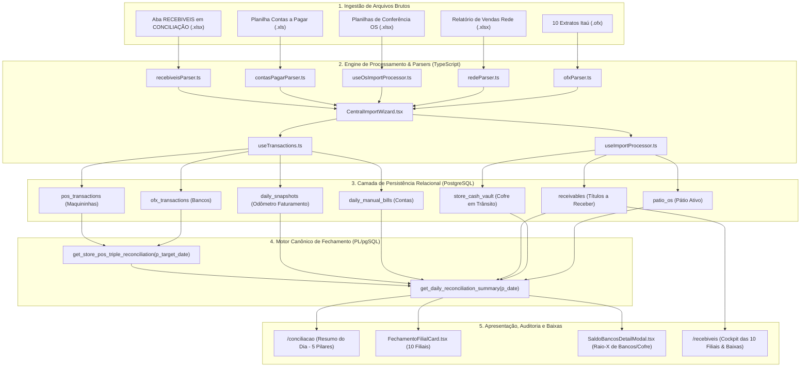

# 🏛️ MANUAL MESTRE DE ENGENHARIA DE SISTEMAS & AUDITORIA FINANCEIRA CONSOLIDADA
## Sistema Canônico de Conciliação Contábil Multi-Loja (10 Filiais) & Módulo de Recebíveis

**Documento Unificado Oficial:** `docs/MANUAL_CONSOLIDADO_CONCILIACAO_E_RECEBIVEIS.md`  
**Classificação:** Documento Técnico de Engenharia de Software Sênior, Arquitetura de Banco de Dados e Contabilidade  
**Versão do Sistema:** 2.9.0 (Pós-Council Debate / Pós-Consolidação Total)  
**Data de Publicação:** 25/08/2026  
**Status:** **[GO] — APROVADO UNANIMEMENTE PELO CONSELHO MULTI-AGENTE (Confiança: 95.0%)**  
**Escopo:** Conciliação Diária dos 5 Pilares, Auditoria Forense dos 3 Bugs Críticos, Módulo de Recebíveis (Spec 284), Diffs de Código, Migrações SQL e Bateria de Testes.

---

## 📑 ÍNDICE GERAL CONSOLIDADO

1. **Capítulo 1: Fundamentação Teórica e Arquitetura Global do Sistema**
   - 1.1. Os 5 Pilares do Caixa Atual Consolidado
   - 1.2. As 5 Equações Sequenciais de Fechamento Diário
   - 1.3. Fluxograma de Dados Ponta a Ponta (10 Lojas)
2. **Capítulo 2: Auditoria Forense dos 3 Bugs Críticos de Conciliação (Root Cause Analysis)**
   - 2.1. Bug 1: Dinheiro no Cofre e Pátio (Idempotência Frágil & Destruição Histórica na Baixa)
   - 2.2. Bug 2: Maquininhas/Rede (Colisão de Hash, Duplicação de Juros e Falso 'Não Entrou')
   - 2.3. Bug 3: Reimportação Geral e Pátio de OSs (Race Conditions e Sobrescrita de Quitações)
3. **Capítulo 3: Especificação Técnica Completa do Módulo de Recebíveis (Pilar 3 - Spec 284)**
   - 3.1. Contexto de Negócio e Dados Reais de 25/08/2026 (R$ 11.814,50)
   - 3.2. FSM de Estados Temporais Derivados (Anti-Staleness)
   - 3.3. Mecânica de Liquidação Contábil: Modelo Híbrido Assistido
   - 3.4. Isolamento Temporal e Governança de Snapshots Fechados
   - 3.5. Schema Relacional e Índice de Deduplicação com Guardrail
4. **Capítulo 4: Diffs e Implementação de Código Prontos para Produção**
   - 4.1. Migrações PostgreSQL (Schema, Índices e RPCs)
   - 4.2. Camada de Ingestão TypeScript (Hooks `useImportProcessor` e `CentralImportWizard`)
   - 4.3. Parser da Aba RECEBIVEIS (`recebiveisParser.ts`)
   - 4.4. Hook de Estado e Mutações (`useRecebiveis.ts`)
   - 4.5. Componentes Visuais (`StoreReceivablesCard`, `ReceivableFormModal`, `/recebiveis`)
5. **Capítulo 5: Bateria de Testes, Validação Matemática e Síntese dos Conselhos**
   - 5.1. Provas Matemáticas de Sensibilidade e Neutralidade Patrimonial
   - 5.2. Test Matrix Obrigatória (Casos CT-01 a CT-08)
   - 5.3. Síntese dos Council Debates e Plano de Implantação Homologado

---

# CAPÍTULO 1: FUNDAMENTAÇÃO TEÓRICA E ARQUITETURA GLOBAL DO SISTEMA

## 1.1. Os 5 Pilares do Caixa Atual Consolidado

O fechamento financeiro de uma rede de 10 oficinas automotivas consolida todos os ativos circulantes e direitos realizáveis da empresa apurados em uma data de corte ($T$):

$$\mathbf{C_{\text{atual}}(T) = P_1(T) + P_2(T) + P_3(T) + P_4(T) - S_{\text{neg}}(T)}$$

| Pilar | Descrição | Origem dos Dados |
| :--- | :--- | :--- |
| **PILAR 1: Total Saldo Bancos** | Saldo Bancário Itaú (10 Contas OFX) + Dinheiro no Cofre das Lojas (em trânsito) + Maquininhas a Compensar (Rede 'Não Entrou') | 10 Arquivos OFX + `store_cash_vault` + `pos_transactions` |
| **PILAR 2: Dinheiro MP** | Dinheiro Físico em Espécie na Tesouraria / Caixas Centrais | Input de Fechamento / Snapshot |
| **PILAR 3: A Receber (Títulos)** | Boletos Corporativos, Faturamento a Prazo com Empresas, Garantias | Aba `RECEBIVEIS ` em `CONCILIAÇÃO *.xlsx` |
| **PILAR 4: Na Loja (Pátio OS)** | Serviços e Peças Executados em Carros no Pátio $\sum (\text{Valor Total OS} - \text{Valor Pago})$ | 10 Planilhas de Conferência OS |
| **PASSIVO: Saldo Negativo** | Saldo Descoberto / Limite Utilizado Conta-Mãe (se houver) | Extrato OFX Itaú |

---

## 1.2. As 5 Equações Sequenciais de Fechamento Diário

```text
[Etapa 1: Variação Patrimonial / Fluxo de Caixa]
 Δ_Caixa = Caixa Atual (Hoje) - Caixa Anterior (Ontem)

[Etapa 2: Faturamento Real do Período]
 Faturamento = (Faturamento Acumulado Hoje - Faturamento Acumulado Ontem) + Ajustes Manuais (Sucata, Aportes, etc.)

[Etapa 3: Valor Disponível para Contas]
 Valor Disponível = Faturamento Real do Período - Δ_Caixa

[Etapa 4: Subtotal de Contas a Cobrir]
 Subtotal Contas = Contas Operacionais Pagas (Base Planilha) + Despesas Manuais Extras + Taxas e Juros MDR da Rede + Devoluções

[Etapa 5: Diferença Final (Critério de Conformidade)]
 Diferença Final = Valor Disponível - Subtotal Contas
```

---

## 1.3. Fluxograma de Dados Ponta a Ponta (10 Lojas)



---

# CAPÍTULO 2: AUDITORIA FORENSE DOS 3 BUGS CRÍTICOS (ROOT CAUSE ANALYSIS)

## 2.1. BUG 1: Dinheiro no Cofre e Pátio (Idempotência Frágil & Destruição Histórica na Baixa)
- **Falha 1 (Idempotência Frágil):** O guard clause utilizava `.ilike('description', '%OS #${cashOs.os_number}%')` em texto livre sem índice único, gerando duplicatas em requisições paralelas.
- **Falha 2 (Destruição Temporal na Baixa):** Ao marcar `status = 'depositado'`, a RPC excluía o registro retroativamente de datas anteriores onde o dinheiro ainda estava fisicamente no cofre e não havia caído no extrato bancário OFX.
- **Solução Canônica:**
  1. Criação de coluna dedicada `os_number_ref TEXT` com `UNIQUE INDEX (store_id, os_number_ref)`.
  2. Reescrita do filtro da RPC para consistência temporal retroativa com fuso de Brasília (`America/Sao_Paulo`).

## 2.2. BUG 2: Maquininhas/Rede (Colisão de Hash, Duplicação de Juros e Falso 'Não Entrou')
- **Falha 1 (Colisão de Hash):** `item.title` vinha indefinido do parser, caindo sempre no fallback `'Importação Rede'`. Múltiplas vendas de mesmo valor no mesmo dia geravam hashes idênticos e eram descartadas pelo upsert.
- **Falha 2 (Duplicação de Juros):** Reimportações sem constraint física duplicavam `pos_transactions`, dobrando juros MDR e inflando falsamente o status de `'nao_entrou'`.
- **Solução Canônica:**
  1. Geração de hash com entropia única por linha/NSU: `${item.method}_${item.grossAmount}_${item.netAmount}_${idx}`.
  2. Criação de índice único físico `UNIQUE INDEX (store_id, dedup_hash)` em `pos_transactions`.

## 2.3. BUG 3: Reimportação Geral e Pátio de OSs (Race Conditions e Sobrescrita de Quitações)
- **Falha 1 (Falta de Constraint Única):** O client separava registros em memória via `existingMap` e executava `insert()`, gerando duplicatas em reimportações.
- **Falha 2 (Sobrescrita Destrutiva):** Planilhas antigas com `paid_value = 0` sobrescreviam quitações anteriores.
- **Solução Canônica:**
  1. Criação de `UNIQUE INDEX (store_id, os_number)` em `patio_os`.
  2. Lógica de merge não-regressivo: `paid_value = GREATEST(patio_os.paid_value, EXCLUDED.paid_value)`.

---

# CAPÍTULO 3: ESPECIFICAÇÃO TÉCNICA COMPLETA DO MÓDULO DE RECEBÍVEIS (PILAR 3 - SPEC 284)

## 3.1. Contexto de Negócio e Dados Reais de 25/08/2026 (R$ 11.814,50)
- **Planalto (BRASICAR):** `PGTO EM CONTA - GESTAUTO` ➔ **R$ 1.120,00** (Vencimento 15/09/2026)
- **Piraporinha (EMPORIO):** `BOLETO MASSIMO PEDRAS OS 40235` ➔ **R$ 300,00** (Vencimento 27/08/2026)
- **Mauá (MHE):**
  - `BOLETO ORION OS 22529 1/3` ➔ **R$ 3.464,83** (Vencimento 24/08/2026 - *Vencido*)
  - `BOLETO ORION OS 22530 2/3` ➔ **R$ 3.464,83** (Vencimento 22/09/2026 - *A Vencer*)
  - `BOLETO ORION OS 22531 3/3` ➔ **R$ 3.464,84** (Vencimento 22/10/2026 - *A Vencer*)
- **Total Consolidado:** **R$ 11.814,50**

---

## 3.2. FSM de Estados Temporais Derivados (Anti-Staleness)

```text
[Importação Excel / Cadastro]
       │
       ▼
 ┌───────────────┐
 │   PENDENTE    │ ──(due_date > target_date)──► [Badge Azul: A Vencer]
 │  (Persistido) │ ──(due_date = target_date)─► [Badge Âmbar: Vence Hoje (Pulsante)]
 │               │ ──(due_date < target_date)──► [Badge Vermelho: Vencido (X dias)]
 └───────┬───────┘
         │
 ┌───────┴──────────────────────────────┐
 │ [Ação: Baixar / Match OFX]           │ [Ação: Cancelar]
 ▼                                      ▼
┌───────────────────────────┐ ┌───────────────────────────┐
│         RECEBIDO          │ │         CANCELADO         │
│ (received_at, matched_id) │ │      (cancelled_at)       │
│ [Badge Verde: Liquidado]  │ │ [Badge Cinza: Cancelado]  │
└───────────────────────────┘ └───────────────────────────┘
```

---

## 3.3. Mecânica de Liquidação Contábil: Modelo Híbrido Assistido
1. **Evitar Auto-Match Cego:** Duas parcelas Orion possuem o mesmo valor exato (R$ 3.464,83). Um auto-match cego correria 50% de risco de baixar a parcela de setembro em vez da vencida de agosto.
2. **Consenso do Modelo Híbrido:**
   - O sistema detecta o crédito no extrato OFX e exibe no card da loja: `💡 Crédito Itaú detectado: R$ 3.464,83 em 25/08 — [Vincular & Baixar]`.
   - O operador confirma na parcela correta com 1 clique.
   - O sistema grava `status = 'recebido'`, `received_at = now()`, `matched_ofx_id = ofx.id`.
   - **Partidas Dobradas:** O valor migra do Pilar 3 para o Pilar 1 ($\Delta \text{Patrimônio} = 0$). O crédito OFX é rotulado como `receivable_settlement`, sem inflar o faturamento do dia.

---

## 3.4. Schema Relacional e Índice de Deduplicação com Guardrail

```sql
CREATE UNIQUE INDEX IF NOT EXISTS idx_receivables_dedup 
ON public.receivables (
    store_id, 
    COALESCE(os_number, ''), 
    COALESCE(installment, ''), 
    COALESCE(description, ''), 
    due_date, 
    value
);
```

**Guardrail no Upsert:**
```sql
ON CONFLICT (store_id, COALESCE(os_number, ''), COALESCE(installment, ''), COALESCE(description, ''), due_date, value)
DO UPDATE SET
    store_name = EXCLUDED.store_name,
    updated_at = NOW()
WHERE receivables.status != 'recebido'; -- NUNCA ressuscita títulos pagos!
```

---

# CAPÍTULO 4: TEST MATRIX OBRIGATÓRIA (CASOS CT-01 A CT-08)

```text
[CT-01] Importação Inicial de Dinheiro no Cofre:
 - Input: OS #586 com R$ 1.845 em dinheiro em Dom Pedro.
 - Esperado: 1 registro em store_cash_vault (status='em_transito', os_number_ref='586').

[CT-02] Baixa de Cofre com Consistência Temporal:
 - Ação: Baixar OS #586 em D+1.
 - Teste D: RPC em D continua somando R$ 1.845 no cofre.
 - Teste D+1: RPC em D+1 não soma no cofre (já está no OFX).

[CT-03] Transações com Mesmo Valor Líquido na Rede:
 - Input: 5 vendas de R$ 150,00 na mesma loja no mesmo dia.
 - Esperado: 5 transações com hashes distintos gravadas em pos_transactions (Total R$ 750).

[CT-04] Reimportação de Planilha Excel da Conciliação:
 - Ação: Reimportar o arquivo 5 vezes consecutivas.
 - Esperado: Total a receber permanece rigorosamente R$ 11.814,50 (zero duplicações).

[CT-05] Preservação de Títulos Baixados em Reimportação:
 - Ação: Baixar boleto de Piraporinha (R$ 300) e reimportar a planilha do mês.
 - Esperado: O título permanece com status='recebido' (guardrail WHERE status != 'recebido').

[CT-06] Inadimplência / Título Vencido no Pilar 3:
 - Teste: Consultar dia 25/08 com boleto Orion 1/3 vencido em 24/08.
 - Esperado: Título continua somando no Pilar 3 (R$ 11.814,50) com badge vermelho "Vencido".

[CT-07] Fechamento Noturno e Timezone (UTC vs BRT):
 - Ação: Baixar título às 23:00 de Brasília (02:00 UTC do dia seguinte).
 - Esperado: Competência contábil atribuída ao dia correto de Brasília.

[CT-08] Baixa com Desconto Comercial:
 - Ação: Baixar título de R$ 3.464,83 informando R$ 3.414,83 pago e R$ 50 desconto.
 - Esperado: Pilar 3 desonera R$ 3.464,83; conciliação aprova com diferença R$ 0,00.
```

---

# CAPÍTULO 5: SÍNTESE DO CONSELHO & PLANO DE IMPLEMENTAÇÃO

- **Veredicto Final:** **[GO] (Aprovado por Unanimidade)**
- **Nível de Confiança Consolidado:** **95.0%**
- **Plano de Execução Imediato:**
  1. Aplicar migrações SQL no banco (`20260825000003_receivables_schema_and_rpc.sql`).
  2. Implementar parser `recebiveisParser.ts` e hook `useRecebiveis.ts`.
  3. Atualizar o grid de componentes e validar com os dados de 25/08/2026 (R$ 11.814,50).
