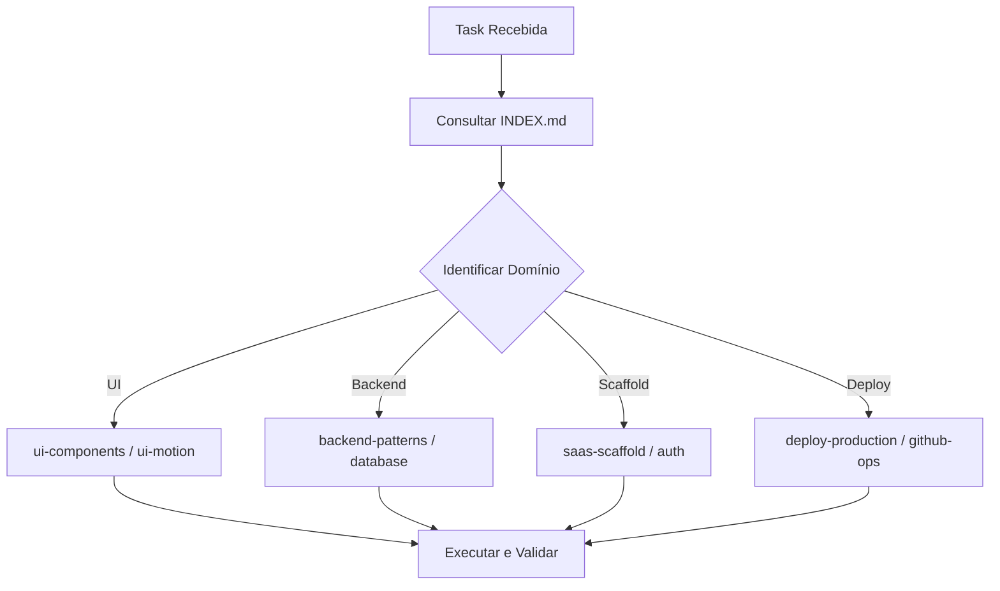

# ⚡ Universal Agent Execution Protocol & Workflow Rules

Este documento dita o comportamento de execução do agente em qualquer workspace ao utilizar as skills globais.

---

## 1. Protocolo de Despacho (3 Passos)

1. **Step 1 — Identificação**: Consulte mentalmente ou via leitura rápida o `INDEX.md` para selecionar as 1 ou 2 skills necessárias.
2. **Step 2 — Leitura Direcionada**: Use `view_file` no `SKILL.md` alvo.
3. **Step 3 — Consulta a Templates (Opcional)**: Se for implementar um bloco complexo (ex: Data Table com paginação ou formulário em grid), leia o arquivo correspondente na subpasta `references/`.

---

## 2. Limites e Guardrails

- **Teto de Contexto**: Máximo 15.000 tokens injetados por tarefa.
- **Decomposição**: Se a feature exigir Frontend + Backend + Banco de Dados simultaneamente, quebre em 3 subtarefas sequenciais:
  1. *Subtarefa 1*: Migration e Schema (`database`).
  2. *Subtarefa 2*: Server Actions e Validações (`backend-patterns`).
  3. *Subtarefa 3*: Telas e Componentes (`ui-components`).
- **Padrão Lovable & Next.js**: Sempre priorize Server Components por padrão e empurre o `'use client'` para as folhas da árvore de componentes.
