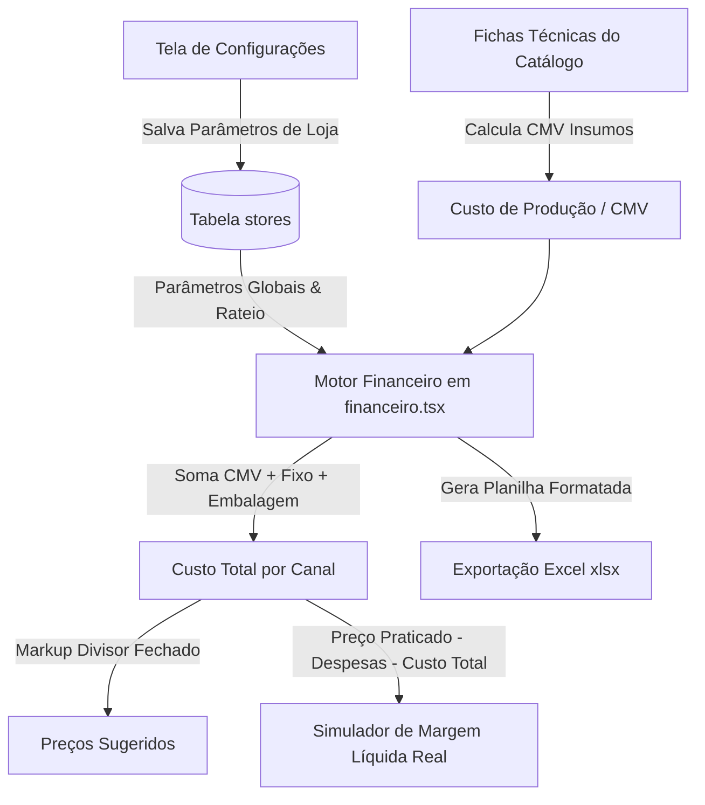

# Design: Refatoração de Configurações e Consolidação de Custos no Financeiro (Spec 201)

## Contexto e Arquitetura
O sistema opera como um SaaS de precificação e engenharia de cardápio para restaurantes multi-canal. A separação de responsabilidades é:
- **`src/routes/configuracoes.tsx` (Estratégico):** Onde o gestor define a estrutura da loja (Faturamento, Custos Fixos Salão/Delivery, Pedidos Mês por canal, Impostos, Taxas de Aplicativos e Margem Alvo).
- **`src/routes/financeiro.tsx` (Tático / Simulação):** Onde o gestor analisa o cardápio, audita a composição de custo total de cada prato e simula preços praticados para visualizar as margens líquidas reais em tempo real.

## Fluxo de Dados

## Componentes e Módulos
1. **`StoreRow` (`src/routes/configuracoes.tsx`):**
   - Agrupamento em cartões com visual limpo e sem poluição:
     - Bloco 1: Estrutura Geral (Faturamento, C. Fixo Geral)
     - Bloco 2: Rateio Multi-Canal (C. Fixo Salão, C. Fixo Delivery, Pedidos Mesa, iFood, 99, Keeta)
     - Bloco 3: Impostos e Taxas (Imposto %, Maquininha %, iFood %, 99 %, Keeta %, Margem Ideal %)
   - Autosave via `onBlur` com feedback visual (indicador de salvando/salvo).

2. **`ProductPricingRow` (`src/routes/financeiro.tsx`):**
   - **Tabela de Custos Base:**
     - Coluna 1: Nome do Produto
     - Coluna 2: CMV (Ficha Técnica)
     - Coluna 3: Custo Fixo Unitário Rateado
     - Coluna 4: Embalagem
     - Coluna 5: **Custo Total Base** (Destaque visual)
   - **Tabela de Preços Sugeridos:**
     - Colunas: Mesa, iFood, App 99, Keeta (com tooltip explicativo da fórmula)
   - **Tabela do Simulador / Praticados:**
     - Inputs para Preço Mesa, Preço iFood, Preço 99, Preço Keeta
     - Tags coloridas com Margem Real calculada e status (OK, AJUSTAR, PREJUÍZO).

3. **`handleExportExcel` (`src/routes/financeiro.tsx`):**
   - Geração nativa com `exceljs` contendo exatamente as colunas e regras do simulador visual.

## Cenários de Teste / Verificação
- **Cenário 1 (Com Volume de Pedidos):**
  - Loja com 500 pedidos mesa, 500 pedidos delivery, Custo Fixo Salão R$ 1.000, Delivery R$ 1.000.
  - Produto com CMV R$ 10,00 e Embalagem R$ 2,00.
  - Custo Fixo Unitário Salão = R$ 2,00 | Delivery = R$ 2,00.
  - Custo Total Salão = R$ 14,00.
  - Com Imposto 4%, Maquininha 2% e Margem 20%, Preço Sugerido Mesa = R$ 14,00 / (1 - 0.26) = R$ 18,92.
- **Cenário 2 (Fallback sem volume):**
  - Loja sem pedidos preenchidos (pedidos = 0).
  - O sistema usa a porcentagem de rateio fixo tradicional sem quebrar ou gerar `NaN`.
- **Cenário 3 (Exportação Excel):**
  - Clicar em "Exportar Excel" baixa arquivo `.xlsx` íntegro com formatação de moeda e porcentagem.
