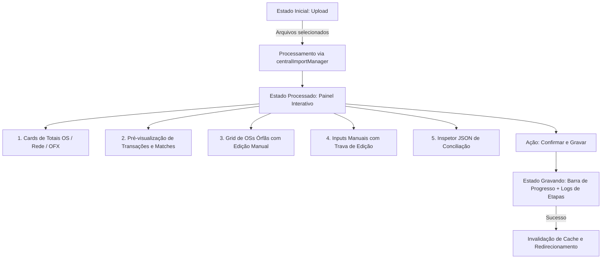

# Design Técnico: Visualização Reativa, Logs de Match e Inspetor JSON (Spec 202)

## 1. Arquitetura de Estados Reativos

## 2. Componentes e Estrutura

### `DailyImportView.tsx` (Componente Reativo Principal):
1. **Header & Contexto de Data:**
   - Data ativa do fechamento com seletor nativo.
2. **Zona de Upload & Mapeamento:**
   - Dropzone estilizada com indicação visual de status e badges para OFX / Pátio / Rede.
   - Lista de arquivos vinculados às lojas com persistência automática no Supabase (`store_file_mappings`).
3. **Painel de Pré-Visualização & Logs de Matches:**
   - Abas internas de preview: `Extrato Bancário`, `Ordens de Serviço`, `Vendas Cartão`, `Casamentos (Matches)`.
   - Log de auto-match (ex: *Match perfeito: OS #4928 R$ 250,00 ↔ Transação PIX R$ 250,00*).
4. **Grid de OSs Órfãs:**
   - Tabela em alta densidade com inputs diretos de `Valor Total`, `Total Pago` e `<select>` de `Status`.
5. **Inputs Manuais Globais com Trava:**
   - Odômetro Hoje, Dinheiro MP, A Receber, Contas a Pagar com botão de trava/destrava ("Editar Valores").
6. **Inspetor JSON de Conciliação (`
` estilizado):**
   - Bloco de código: `font-mono text-xs text-emerald-400 bg-zinc-950 p-4 rounded-xl border border-zinc-800`.
   - Exibe em tempo real o payload JSON que será enviado para `daily_snapshots`, `ofx_transactions`, `patio_os` e `conciliation_matches`.
7. **Painel de Execução & Progresso:**
   - Barra de progresso por etapas: OSs -> Rede -> OFX -> Matches -> Snapshot.
   - Terminal colapsável de logs de depuração.

## 3. Design System Zinc-950 / Emerald
- Fundo: `bg-zinc-950`
- Superfícies: `bg-zinc-900` com `border-zinc-800`
- Acentos: `text-emerald-400`, `bg-emerald-600 hover:bg-emerald-500`
- Fontes: Inter / Outfit para UI e `font-mono` para valores numéricos e JSON.
