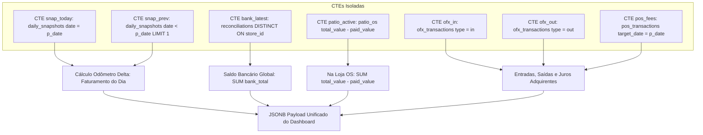

# Design Técnico: Blindagem de CTEs e Performance da RPC do Dashboard (Spec 204)

## 1. Arquitetura de Agregação da RPC `get_dashboard_metrics`



## 2. Estrutura SQL da Migration

```sql
CREATE OR REPLACE FUNCTION public.get_dashboard_metrics(p_date date)
RETURNS jsonb
LANGUAGE plpgsql
SECURITY DEFINER
AS $$
DECLARE
    v_result jsonb;
    v_total_saldo numeric := 0;
    v_total_dinheiro numeric := 0;
    v_total_areceber numeric := 0;
    v_total_naloja numeric := 0;
    v_total_cxatual numeric := 0;
    v_total_fluxo numeric := 0;
    v_total_fatura numeric := 0;
    v_total_disp_contas numeric := 0;
    v_total_contas numeric := 0;
    v_odometro_hoje numeric := 0;
    v_odometro_ant numeric := 0;
    v_faturamento_delta numeric := 0;
    v_contas_manual numeric := 0;
    v_juros_rede numeric := 0;
BEGIN
    -- 1. Snapshot Atual e Anterior (Odômetro e Manuais)
    SELECT COALESCE(faturamento, 0), COALESCE(dinheiro_mp, 0), COALESCE(a_receber_manual, 0), COALESCE(contas_a_pagar, 0), COALESCE(juros_rede, 0)
    INTO v_odometro_hoje, v_total_dinheiro, v_total_areceber, v_contas_manual, v_juros_rede
    FROM daily_snapshots WHERE date = p_date;

    SELECT COALESCE(faturamento, 0)
    INTO v_odometro_ant
    FROM daily_snapshots WHERE date < p_date ORDER BY date DESC LIMIT 1;

    -- Cálculo Delta do Odômetro
    IF v_odometro_hoje > 0 AND v_odometro_ant > 0 AND v_odometro_hoje >= v_odometro_ant THEN
        v_faturamento_delta := v_odometro_hoje - v_odometro_ant;
    ELSIF v_odometro_hoje > 0 THEN
        v_faturamento_delta := v_odometro_hoje;
    ELSE
        SELECT COALESCE(SUM(amount), 0) INTO v_faturamento_delta FROM ofx_transactions WHERE target_date = p_date AND type = 'in';
    END IF;

    -- 2. CTEs Isoladas para Agregação Sem Produto Cartesiano
    WITH bank_recons AS (
        SELECT DISTINCT ON (store_id) store_id, bank_total
        FROM reconciliations
        WHERE date <= p_date
        ORDER BY store_id, date DESC
    ),
    patio_active AS (
        SELECT store_id, COALESCE(SUM(COALESCE(total_value, 0) - COALESCE(paid_value, 0)), 0) as v
        FROM patio_os
        WHERE opened_at::date <= p_date
          AND LOWER(status) NOT IN ('finalizada', 'finalizado', 'paga', 'pago', 'cancelada', 'cancelado')
          AND ((COALESCE(total_value, 0) - COALESCE(paid_value, 0)) > 0 OR closed_at::date = p_date OR opened_at::date = p_date)
        GROUP BY store_id
    ),
    ofx_saidas AS (
        SELECT COALESCE(ABS(SUM(amount)), 0) as v
        FROM ofx_transactions
        WHERE target_date = p_date AND type = 'out'
    )
    SELECT
        COALESCE((SELECT SUM(bank_total) FROM bank_recons), 0),
        COALESCE((SELECT SUM(v) FROM patio_active), 0),
        COALESCE((SELECT v FROM ofx_saidas), 0)
    INTO
        v_total_saldo,
        v_total_naloja,
        v_total_contas;

    IF v_contas_manual > 0 THEN
        v_total_contas := v_contas_manual;
    END IF;

    -- Caixa Atual e Fluxo
    v_total_cxatual := v_total_saldo + v_total_dinheiro + v_total_areceber;
    v_total_disp_contas := v_total_cxatual;
    v_total_fluxo := v_total_cxatual - v_total_contas;
    v_total_fatura := v_faturamento_delta;

    v_result := jsonb_build_object(
        'dataAtual', p_date,
        'saldoTotal', v_total_saldo,
        'dinheiroMp', v_total_dinheiro,
        'aReceber', v_total_areceber,
        'naLoja', v_total_naloja,
        'caixaAtual', v_total_cxatual,
        'fluxoCx', v_total_fluxo,
        'fatura', v_total_fatura,
        'faturamentoAtual', v_total_fatura,
        'valorDispContas', v_total_disp_contas,
        'valorContas', v_total_contas,
        'diferenca', v_total_areceber - v_total_saldo
    );

    RETURN v_result;
END;
$$;
```

## 3. Índices Compostos
```sql
CREATE INDEX IF NOT EXISTS idx_patio_os_store_status_opened ON patio_os (store_id, status, opened_at);
CREATE INDEX IF NOT EXISTS idx_ofx_tx_target_type_store ON ofx_transactions (target_date, type, store_id);
CREATE INDEX IF NOT EXISTS idx_reconciliations_store_date ON reconciliations (store_id, date DESC);
CREATE INDEX IF NOT EXISTS idx_daily_snapshots_date ON daily_snapshots (date DESC);
```
