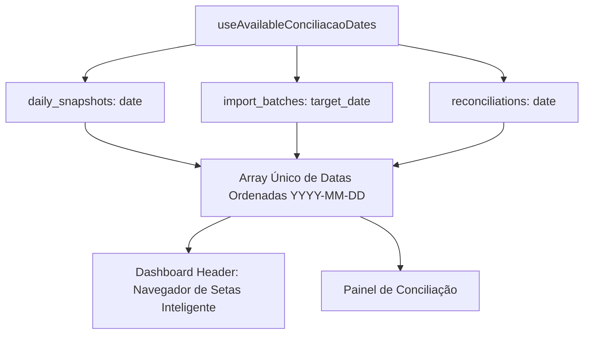

# Design Técnico: Navegação Inteligente por Datas e Alinhamento de APIs (Spec 205)

## 1. Fluxo de Obtenção de Datas Válidas



## 2. Navegador de Setas no Dashboard (`src/routes/index.tsx`)

```tsx
const { data: availableDates = [], isLoading: loadingDates } = useAvailableConciliacaoDates();
const [selectedDate, setSelectedDate] = useState<string>('');

useEffect(() => {
  if (!selectedDate && availableDates.length > 0) {
    // Seleciona automaticamente a data mais recente
    setSelectedDate(availableDates[availableDates.length - 1]);
  }
}, [availableDates, selectedDate]);

const handleNavigateDate = (direction: 'prev' | 'next') => {
  if (availableDates.length === 0) return;
  const currentIndex = availableDates.indexOf(selectedDate);
  if (currentIndex === -1) {
    setSelectedDate(availableDates[availableDates.length - 1]);
    return;
  }
  const newIndex = direction === 'prev' ? currentIndex - 1 : currentIndex + 1;
  if (newIndex >= 0 && newIndex < availableDates.length) {
    setSelectedDate(availableDates[newIndex]);
  }
};
```

## 3. Correção da RPC `calculate_daily_conciliation`

```sql
CREATE OR REPLACE FUNCTION public.calculate_daily_conciliation(p_date date)
RETURNS jsonb
LANGUAGE plpgsql
SECURITY DEFINER
AS $$
DECLARE
    v_result jsonb;
BEGIN
    WITH recon AS (
        SELECT DISTINCT ON (store_id) store_id, bank_total as faturamento_banco, na_loja_os as historical_na_loja
        FROM reconciliations
        WHERE date <= p_date
        ORDER BY store_id, date DESC
    ),
    maq AS (
        SELECT store_id, COALESCE(SUM(amount), 0) as maquininha
        FROM ofx_transactions 
        WHERE target_date = p_date AND type = 'in' AND (title ILIKE '%REDE%' OR title ILIKE '%MAQUINA%')
        GROUP BY store_id
    ),
    pix AS (
        SELECT store_id, COALESCE(SUM(amount), 0) as pix
        FROM ofx_transactions 
        WHERE target_date = p_date AND type = 'in' AND (title ILIKE '%PIX%' OR fitid ILIKE '%PIX%')
        GROUP BY store_id
    ),
    prev AS (
        SELECT store_id, COALESCE(SUM(amount), 0) as previsto_ofx
        FROM ofx_transactions 
        WHERE target_date = p_date AND type = 'in'
        GROUP BY store_id
    ),
    patio AS (
        SELECT store_id, COALESCE(SUM(COALESCE(total_value, 0) - COALESCE(paid_value, 0)), 0) as patio_os_sum
        FROM patio_os
        WHERE opened_at::date <= p_date
          AND LOWER(status) NOT IN ('finalizada', 'finalizado', 'paga', 'pago', 'cancelada', 'cancelado')
          AND (
              (COALESCE(total_value, 0) - COALESCE(paid_value, 0)) > 0
              OR closed_at::date = p_date
              OR opened_at::date = p_date
          )
        GROUP BY store_id
    ),
    store_data AS (
        SELECT 
            s.id as store_id,
            s.name as store_name,
            COALESCE(r.faturamento_banco, 0) as faturamento_banco,
            COALESCE(m.maquininha, 0) as maquininha,
            COALESCE(px.pix, 0) as pix,
            COALESCE(pv.previsto_ofx, 0) as previsto_ofx,
            CASE 
                WHEN r.historical_na_loja IS NOT NULL THEN r.historical_na_loja
                ELSE COALESCE(pt.patio_os_sum, 0)
            END as na_loja_os
        FROM stores s
        LEFT JOIN recon r ON r.store_id = s.id
        LEFT JOIN maq m ON m.store_id = s.id
        LEFT JOIN pix px ON px.store_id = s.id
        LEFT JOIN prev pv ON pv.store_id = s.id
        LEFT JOIN patio pt ON pt.store_id = s.id
    ),
    calculated AS (
        SELECT 
            *,
            (previsto_ofx - (maquininha + pix)) as diferenca,
            CASE WHEN (previsto_ofx - (maquininha + pix)) >= -1 THEN 'approved' ELSE 'divergence' END as status
        FROM store_data
    )
    SELECT COALESCE(jsonb_agg(
        jsonb_build_object(
            'store_id', store_id,
            'store_name', store_name,
            'faturamento_banco', faturamento_banco,
            'maquininha', maquininha,
            'pix', pix,
            'na_loja_os', na_loja_os,
            'previsto_ofx', previsto_ofx,
            'diferenca', diferenca,
            'status', status
        )
    ), '[]'::jsonb) INTO v_result
    FROM calculated;

    RETURN v_result;
END;
$$;
```
