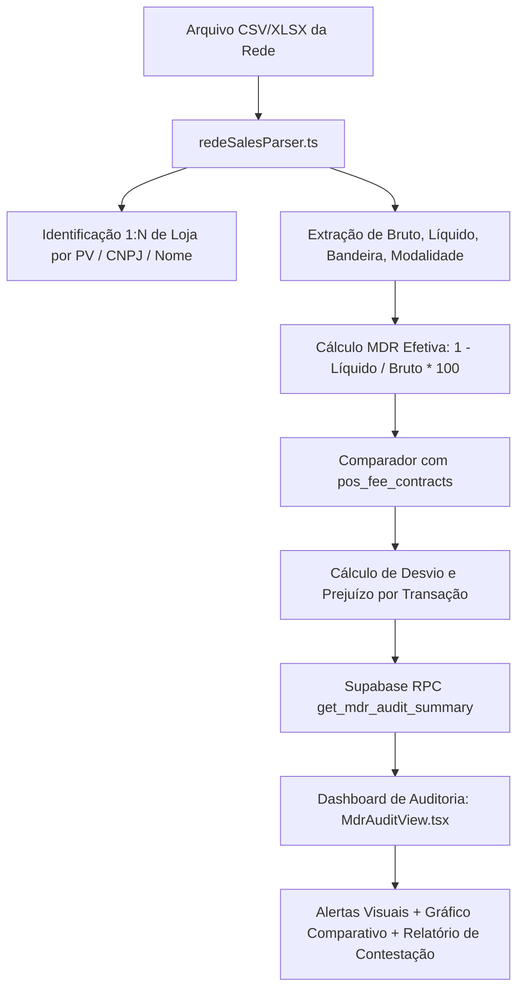

# Design: Auditoria Analítica de MDR, Taxas de Maquininhas e Divergência Contratual Multi-Loja (217)

## Arquitetura Técnica do Fluxo de Auditoria



## Interfaces TypeScript

```typescript
export interface MdrContractRate {
  id: string;
  store_id?: string | null;
  acquirer: string;
  payment_method: 'debito' | 'credito_vista' | 'credito_2_6' | 'credito_7_12' | 'pix';
  brand: string;
  contracted_rate_pct: number;
  max_tolerance_pct: number;
  is_active: boolean;
}

export interface MdrAuditItem {
  storeId: string;
  storeName: string;
  terminalNumber?: string;
  acquirer: string;
  brand: string;
  method: string;
  date: string;
  grossAmount: number;
  netAmount: number;
  feeAmount: number;
  effectiveRatePct: number;
  contractedRatePct: number;
  divergencePct: number;
  overchargeAmount: number;
  status: 'conforme' | 'atencao' | 'divergente' | 'sem_contrato';
}

export interface MdrAuditSummary {
  totalGross: number;
  totalNet: number;
  totalFees: number;
  totalOvercharge: number;
  avgEffectiveRatePct: number;
  divergentCount: number;
  byBrand: Array<{
    brand: string;
    gross: number;
    effectiveRatePct: number;
    contractedRatePct: number;
    overcharge: number;
  }>;
  byStore: Array<{
    storeId: string;
    storeName: string;
    gross: number;
    net: number;
    fees: number;
    effectiveRatePct: number;
    overcharge: number;
  }>;
  transactions: MdrAuditItem[];
}
```

## Componentes Novos

1. `src/lib/parsers/redeSalesParser.ts`:
   - Parser otimizado para extratos detalhados de vendas da Rede e maquininhas, com suporte a múltiplas filiais (1:N), identificação de bandeiras, parcelas e cálculo linha a linha de MDR efetivo.
2. `src/hooks/useMdrAudit.ts`:
   - Hook React Query para carregar auditoria agregada por período e loja, com RPC segura no Supabase e fallback defensivo no cliente.
3. `src/components/maquininhas/MdrAuditView.tsx`:
   - Componente visual completo com Dark UI sólido (Zinc-950), KPIs financeiros, gráfico de barras Recharts comparativo (Efetivo vs Contrato por Bandeira), tabela de transações com chips coloridos de auditoria e botão de exportação CSV para contestação bancária.
4. Rota `/recebiveis` ou `/auditoria-maquininhas`:
   - Integração da aba de auditoria de taxas para acesso direto pelo operador financeiro.

## Cenários de Verificação (SCAN → INFER → VERIFY → FIX)

- **Cenário 1 (Cálculo de MDR Efetivo):** Transação com Bruto R$ 1.000,00 e Líquido R$ 970,00 gera MDR Efetiva de exatos `3,00%`.
- **Cenário 2 (Detecção de Cobrança Indevida):** Contrato para Mastercard Crédito à Vista prevê `2,10%`. A adquirente descontou `3,10%` sobre venda de R$ 5.000,00. O sistema gera alerta de `🚨 Cobrança Abusiva (+1,00%)` e calcula prejuízo de `R$ 50,00`.
- **Cenário 3 (Multi-Loja 1:N):** Arquivo contendo lançamentos do Dom Pedro (DP), Jabaquara (JAB) e Kennedy (MP) é segregado com 100% de precisão por loja, permitindo filtrar o dashboard por filial individual.
