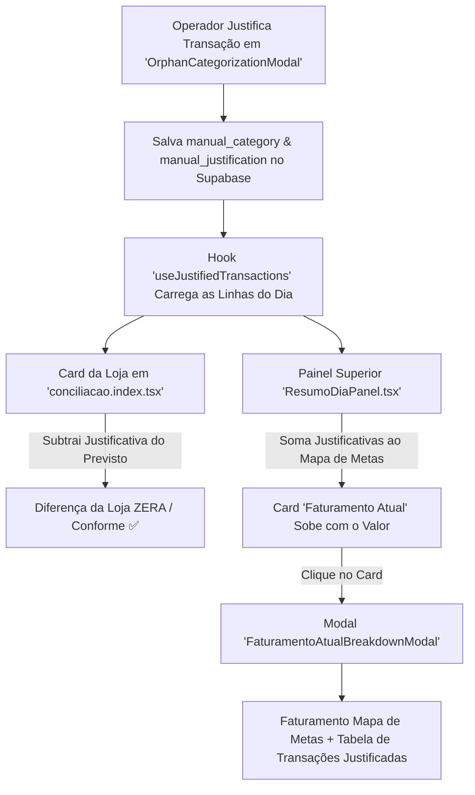

# Design: Faturamento Atual com Justificativas, Abatimento de Diferença na Loja e Breakdown (219)

## Arquitetura Técnica



## Interfaces TypeScript

```typescript
export interface JustifiedTransactionItem {
  id: string;
  store_id: string;
  store_name: string;
  source_table: 'ofx' | 'pos' | 'manual';
  date: string;
  title: string;
  amount: number;
  category: string;
  justification: string;
}

export interface JustifiedTransactionsSummary {
  transactions: JustifiedTransactionItem[];
  totalByStore: Record<string, number>;
  totalGlobal: number;
}
```

## Componentes & Lógica

1. **`src/hooks/useJustifiedTransactions.ts`:**
   - Consulta transações do dia onde `manual_justification` foi preenchido.
   - Retorna a lista completa, o total agrupado por `store_id` (para abater no card da loja) e o `totalGlobal` (para somar no Faturamento Atual).
2. **`src/components/conciliacao/FaturamentoAtualBreakdownModal.tsx`:**
   - Exibe o valor do Mapa de Metas e a tabela detalhada de justificativas (Loja, Descrição, Categoria, Justificativa e Valor R$).
3. **`src/components/conciliacao/ResumoDiaPanel.tsx`:**
   - Card renomeado para **Faturamento Atual**, interativo (abre o modal ao clicar).
   - Input manual no modo de edição renomeado para **Faturamento Mapa de Metas**.
   - $\text{Faturamento Atual} = \text{Faturamento Mapa de Metas} + \text{totalGlobalJustified}$.
4. **`src/routes/conciliacao.index.tsx`:**
   - Ajusta o cálculo do card da loja:
     $$\text{Previsto Efetivo} = \text{Previsto Original} - \text{Justificativas da Loja}$$
     $$\text{Diferença} = \text{Previsto Efetivo} - (\text{Maquininha} + \text{PIX})$$
   - Quando todas as divergências daquela filial são justificadas, a diferença da loja zera e o badge passa para aprovado/conforme ✅.

## Cenários de Verificação (SCAN → INFER → VERIFY → FIX)
- **Cenário 1 (Justificação de Transação):** Ao justificar uma diferença em uma loja (ex: PIX não conciliado de R$ 500,00), o Previsto da loja abate R$ 500,00 e a diferença daquela loja é zerada.
- **Cenário 2 (Faturamento Atual Sobe):** No painel superior, o card "Faturamento Atual" reflete a soma: $\text{Mapa de Metas} + \text{R\$ 500,00}$.
- **Cenário 3 (Abertura do Modal):** Clicar no card de Faturamento Atual abre o modal exibindo a linha de R$ 500,00 com o nome da loja e a justificativa cadastrada.
- **Cenário 4 (Quality Gate):** `cmd.exe /c "npm run build"` passa com 0 erros de compilação.
