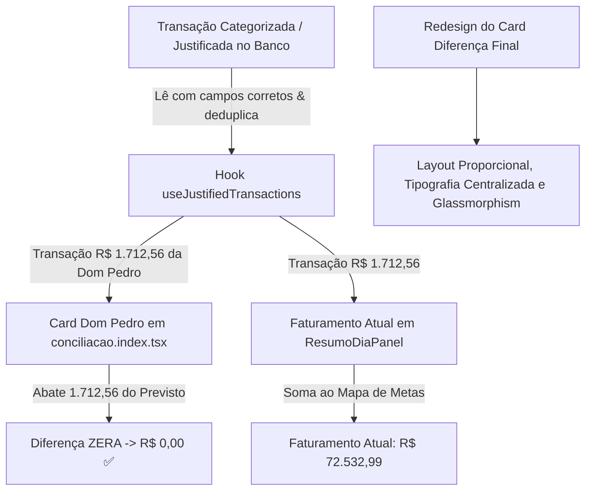

# Design: Correção de Justificativas e Redesign do Card de Diferença Final (220)

## Arquitetura Técnica

## Ajustes Específicos

### 1. `src/hooks/useJustifiedTransactions.ts`
- Consultar a tabela unificada `transactions` filtrando por `target_date = targetDate` e onde `manual_category IS NOT NULL OR (manual_justification IS NOT NULL AND manual_justification != '')`.
- Suporte fallback para `ofx_transactions` (utilizando colunas `bank_name`, `counterpart_name`) e `pos_transactions` (utilizando `machine_name`, `payment_method`).
- Desduplicação por `Map<string, JustifiedTransactionItem>`.

### 2. `src/hooks/useCategorizeOrphan.ts`
- Atualizar tanto `transactions` quanto `ofx_transactions` e `pos_transactions` ao categorizar para garantir paridade total entre tabelas.

### 3. `src/components/conciliacao/ResumoDiaPanel.tsx` (Card de Diferença Final)
- Reorganizar a grade de Consolidação do Dia:
  - 4 métricas em grid 2x2 à esquerda (Caixa Atual, Fluxo de Caixa, Faturamento Atual, Valor Disp. Contas).
  - Abaixo da grade: barra horizontal do `Subtotal: Valor Contas`.
  - Card lateral de **Diferença Final**:
    - Centralização vertical e horizontal equilibrada.
    - Tipografia de alto impacto: `text-3xl` a `text-4xl` em `font-display font-bold font-mono`.
    - Badge e texto explicativo com padding proporcional e bordas suaves.

## Cenários de Verificação
- **Cenário 1 (Reconhecimento da Dom Pedro):** O lançamento de R$ 1.712,56 de "venda de oleo" em Dom Pedro é carregado pelo hook.
- **Cenário 2 (Card da Loja Dom Pedro):** A diferença da Dom Pedro zera (`R$ 0,00` e status aprovado/conforme ✅).
- **Cenário 3 (Faturamento Atual):** O Faturamento Atual sobe para R$ 72.532,99 (com R$ 70.820,43 de Mapa de Metas + R$ 1.712,56 de Justificados).
- **Cenário 4 (Visual do Card Diferença Final):** O card de Diferença Final exibe layout refinado, simétrico e sem espaços vazios exagerados.
- **Cenário 5 (Quality Gate):** `npm run build` passa com 0 erros.
