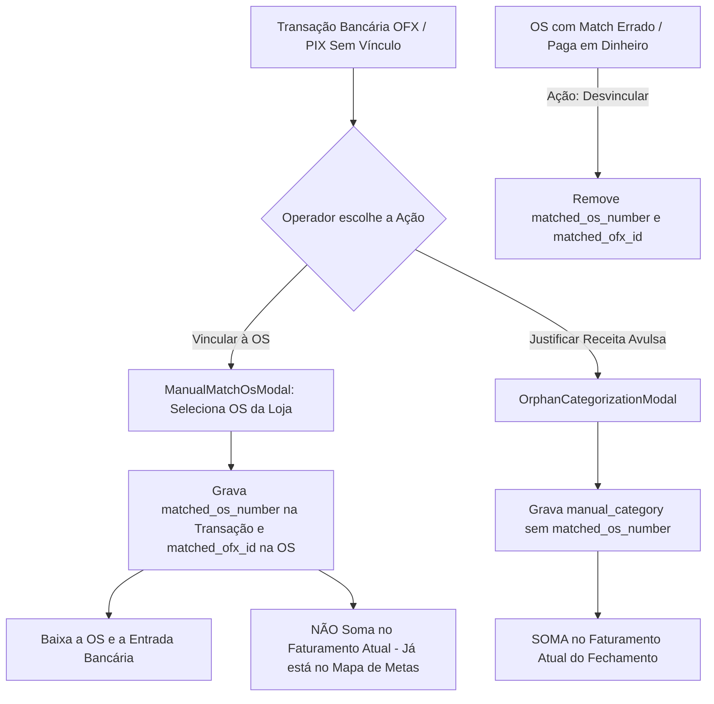

# Design: Vínculo Manual de PIX/Banco com OS, Desvinculação e Proteção contra Duplicidade no Faturamento (221)

## Arquitetura Técnica

## Componentes & Lógica

### 1. Hook `src/hooks/useManualMatch.ts`
- **`linkTransactionToOs(transactionId, osNumber, storeId)`:**
  - Atualiza `matched_os_number = osNumber` em `transactions` e `ofx_transactions`.
  - Atualiza `matched_ofx_id = transactionId` em `patio_os` (ou `estoque_os_pendente`).
  - Invalida queries: `reconciliation_views`, `reconciliations`, `transactions`, `justified_transactions`, `daily_snapshots`.
- **`unlinkTransaction(transactionId, osNumber?)`:**
  - Remove `matched_os_number` (define como `null`) e `matched_ofx_id`.
  - Invalida queries correspondentes.

### 2. Componente `src/components/conciliacao/ManualMatchOsModal.tsx`
- Modal com:
  - Header: Detalhes do PIX selecionado (Descrição, Valor R$, Data, Contraparte).
  - Campo de busca rápida (por número de OS, nome do cliente, placa).
  - Tabela com lista de OSs candidatas da filial no dia / recentes:
    - Colunas: OS #, Cliente, Veículo / Placa, Valor Declarado, Meio Pagamento Original, Diferença de Valor em relação ao PIX.
    - Botão "Vincular a esta OS".

### 3. Atualização de `PixVsOfxTable.tsx` e `OfxSemMatchTable.tsx`
- **Em `PixVsOfxTable.tsx`:**
  - Coluna "Ações": Se não pareado $\rightarrow$ Botão `[Vincular PIX do Banco]`. Se pareado $\rightarrow$ Botão `[Desvincular]`.
- **Em `OfxSemMatchTable.tsx`:**
  - Coluna "Ação": Botão `[Vincular à OS]` (abre `ManualMatchOsModal`) e Botão `[Justificar Avulso]` (abre `OrphanCategorizationModal`).

### 4. Proteção em `useJustifiedTransactions.ts`
- Ignorar qualquer transação que possua `matched_os_number` preenchido (ou seja, transações vinculadas a OS nunca entram como receita avulsa).

## Cenários de Verificação
- **Cenário 1 (Vínculo Manual de PIX):** Operador seleciona um PIX sem match de R$ 350,00 e vincula à OS #412. O status muda para "Entrou no Banco" e a OS é marcada como quitada.
- **Cenário 2 (Zero Duplicidade no Faturamento):** A transação vinculada à OS NÃO soma no Faturamento Atual do painel superior.
- **Cenário 3 (Desvinculação de OS em Dinheiro):** Operador desvincula uma OS que foi paga em dinheiro. O PIX volta para "Banco Sem Origem" e a OS volta para aguardar confirmação.
- **Cenário 4 (Quality Gate):** `npm run build` passa com 0 erros.
