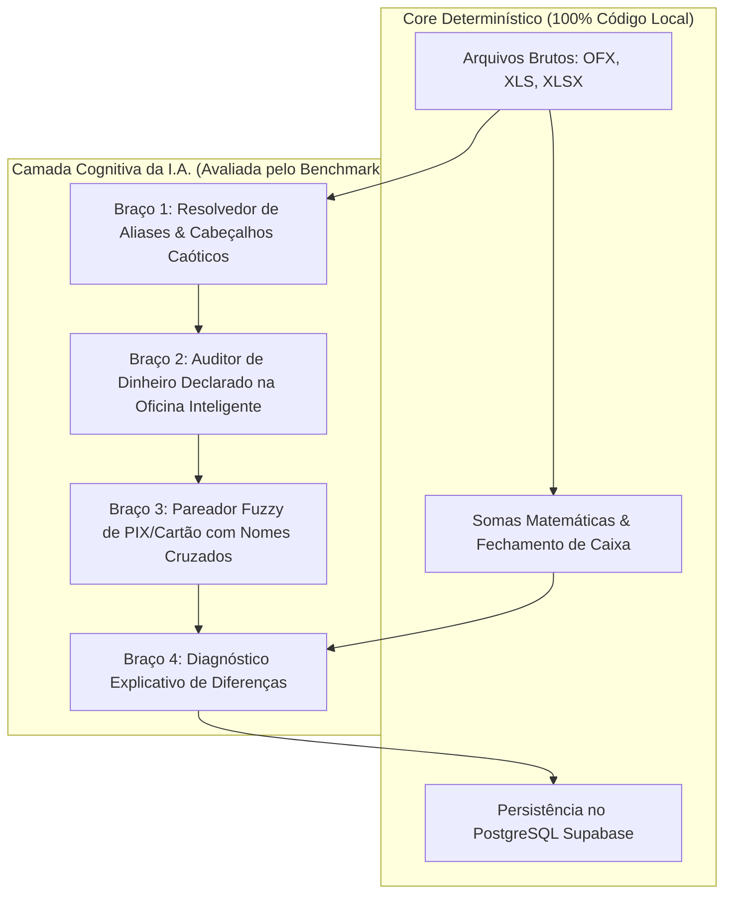

# Proposta Técnica & Acadêmica: Framework de Avaliação, Stress-Test e Benchmark para I.A. na Conciliação Financeira

---

## 1. 📚 Fundamentação Teórica e Estado da Arte (3 Fontes Oficiais)

Para desenhar um ambiente de testes de estresse de nível enterprise para o **ConciliaMec**, nos baseamos nas três metodologias mais respeitadas da indústria e academia em avaliação de LLMs financeiros e agentes autônomos:

### 1.1. Patronus AI & Stanford University: *FinanceBench* (2023–2024)
* **Referência:** *FinanceBench: A New Benchmark for Financial Question Answering and Numerical Reasoning* (Islam et al., Patronus AI / Stanford / Contextual AI).
* **Conceito Aplicado:** O FinanceBench estabeleceu que LLMs falham catastroficamente em tarefas financeiras quando avaliados apenas por "conhecimento geral". A avaliação deve ser no formato **Open-Book com Extração Estrita de Evidências (Evidence Strings)**: toda conclusão gerada pela I.A. precisa obrigatoriamente apontar a linha e o arquivo de origem (ex: *"Linha 14 da OS #8736: Dinheiro R$ 1.900,00"*). Sem evidência exata, a resposta é classificada como alucinação.

### 1.2. Anthropic: *Agent Evaluation & Trajectory-Based Testing* (2024)
* **Referência:** *Evaluating Agentic Tool Use and Trajectory Analysis* (Anthropic Research / Claude Engineering).
* **Conceito Aplicado:** Agentes financeiros não podem ser julgados apenas pela resposta final (`input -> output`), mas sim pela **Trajetória de Decisão (Execution Trace)**. O framework de avaliação deve auditar:
  1. *Tool Selection Accuracy:* O agente chamou a ferramenta certa para buscar o extrato OFX?
  2. *Parameter Precision:* Passou os parâmetros exatos (ex: `store_id: 'st-07'`, `data: '2026-08-19'`)?
  3. *Error Recovery:* Se a API da Oficina Inteligente oscilar, o agente acionou o fallback determinístico sem travar?

### 1.3. Confident AI & DeepEval: *G-Eval & Faithfulness Metrics* (2024)
* **Referência:** *DeepEval: Unit Testing Framework for LLMs & G-Eval Chain-of-Thought Rubrics* (Confident AI / DeepEval Open-Source Standard).
* **Conceito Aplicado:** Implementação de testes unitários contínuos para LLMs com métricas matemáticas quantificáveis:
  * **`FaithfulnessMetric`:** Mede se 100% dos valores gerados pela I.A. são inferíveis diretamente do extrato/planilha, punindo alucinações numéricas com nota zero.
  * **`ContextualPrecisionMetric`:** Avalia se os dados mais relevantes (ex: transações do dia) são priorizados em relação a ruídos (lançamentos de meses anteriores).

---

## 2. 🎯 Onde a I.A. Agrega Valor vs Onde NUNCA Deve Tocar



| Componente | Responsável | Tolerância a Erro | Justificativa |
|:---|:---:|:---:|:---|
| **Cálculo de Caixa e Fórmulas** | Motor Determinístico (SQL/TS) | **0% (Tolerância Zero)** | Fórmulas contábeis são exatas e determinísticas. |
| **Parsing de Tabelas e Cabeçalhos** | Motor Determinístico | **0%** | Estrutura de colunas e dados brutos. |
| **Resolução de Loja em Cabeçalho Caótico** | Agente I.A. (Braço 1) | **< 0,1%** | Mapeia nomes informais (ex: *"Rei do Óleo Mauá"* para `mhe_maua`). |
| **Detecção de Dinheiro em Loja** | Agente I.A. (Braço 2) | **< 0,1%** | Identifica dinheiro vivo não depositado para somar ao Pilar 1. |
| **Pareamento Difuso (Fuzzy Match)** | Agente I.A. (Braço 3) | **< 1,0%** | Pareia PIX de cônjuges/empresas com OSs do mesmo valor. |
| **Diagnóstico de Diferença em Linguagem Natural** | Agente I.A. (Braço 4) | **< 0,5%** | Traduz a causa contábil em 1 frase clara para o operador. |

---

## 3. 🧪 Arquitetura do Ambiente de Testes Isolado (Stress-Test Sandbox)

### 3.1. Isolamento Absoluto (Zero Impacto em Produção)
* O Sandbox opera em **Memória RAM / SQLite efêmero / Mock Objects**.
* Nenhuma tabela do Supabase de produção (`patio_os`, `ofx_transactions`, `daily_snapshots`) é alterada durante os testes.

### 3.2. As 3 Baterias de Testes de Estresse (Stress-Test Suites):

```
┌────────────────────────────────────────────────────────────────────────┐
│ BATERIA 1: Baseline Real (Golden Dataset 19/08)                         │
│ • 10 Extratos OFX reais + 10 Planilhas de OS reais + 9 Vendas Rede     │
│ • Validação de fidelidade contra o fechamento manual auditado.         │
├────────────────────────────────────────────────────────────────────────┤
│ BATERIA 2: Perturbações Adversariais (Fuzzy & Boundary Testing)        │
│ • Nomes de lojas truncados (ex: "MP - KEN", "CAPÃO", "DHJV_LOJA")      │
│ • Pagamentos múltiplos mistos (Dinheiro + Crédito + PIX na mesma OS)  │
│ • Divergências de centavos em taxas de cartão (+R$ 0,03, -R$ 0,12)    │
├────────────────────────────────────────────────────────────────────────┤
│ BATERIA 3: Teste de Estresse Extremo (Chaos & Corruption Testing)       │
│ • Arquivos corrompidos ou com linhas vazias intercaladas               │
│ • Depósito bancário de R$ 10.000 lançado com 3 dias de atraso          │
│ • Simulação de timeout de API (3.000ms) para validação do Fallback     │
└────────────────────────────────────────────────────────────────────────┘
```

---

## 4. 📊 Matriz de Pontuação e Métricas de Avaliação (Scorecard)

Cada modelo de I.A. testado (Gemini 2.5 Flash, Claude 3.5 Haiku, GPT-4o-mini) receberá uma pontuação de **0 a 100 pontos** baseada nos seguintes pesos:

| Métrica | Descrição | Peso | Alvo Mínimo para Aprovação |
|:---|:---|:---:|:---:|
| **Numerical Faithfulness (NF)** | Zero alucinação em valores monetários e centavos | **30%** | **100,0%** (Eliminatória) |
| **Alias Resolution Accuracy (ARA)** | Mapeamento correto da loja a partir do cabeçalho | **25%** | **≥ 99,0%** |
| **Cash In Safe Detection (CISD)** | Identificação de pagamentos em dinheiro vivo | **20%** | **≥ 98,0%** |
| **Discrepancy Diagnosis (DD)** | Diagnóstico correto da causa raiz de divergências | **15%** | **≥ 95,0%** |
| **Latency p95** | Tempo de resposta para processar o lote diário | **5%** | **< 1.000ms** |
| **Cost Efficiency** | Custo estimado por dia de conciliação | **5%** | **< R$ 0,02 / dia** |

$$\text{Score Final} = 0.30 \cdot \text{NF} + 0.25 \cdot \text{ARA} + 0.20 \cdot \text{CISD} + 0.15 \cdot \text{DD} + 0.05 \cdot \text{LatencyScore} + 0.05 \cdot \text{CostScore}$$

---

## 5. 🛠️ Plano de Execução do Benchmark

1. **Fase 1: Construção do Harness de Testes (`tests/ai-benchmark/`):**
   - Criação do carregador de datasets e injetor de perturbações sintéticas.
   - Implementação das funções de grading matemático e semântico (DeepEval / G-Eval rubrics).
2. **Fase 2: Execução do Benchmark Comparativo Multi-Modelo:**
   - Rodar a suite completa de 50 cenários de teste contra os modelos:
     * 🥇 **Google Gemini 3.1 Flash-Lite** (Nova 3ª geração: alta densidade e latência sub-300ms)
     * 🥈 **Google Gemini 2.5 Flash-Lite** (Ultra baixo custo)
     * 🥉 **Google Gemini 2.5 Flash** (Raciocínio contábil padrão)
     * **Anthropic Claude 3.5 Haiku** (Baseline de controle externo)
3. **Fase 3: Emissão do Relatório Acadêmico de Auditoria:**
   - Geração de tabela comparativa com: Acurácia %, Taxa de Alucinação, Latência (p50, p95), Custo em R$ e Diagnóstico de Falhas.
4. **Fase 4: Integração Segura no Pipeline do ConciliaMec:**
   - Implementação do modelo vencedor com circuito de fallback determinístico blindado.
