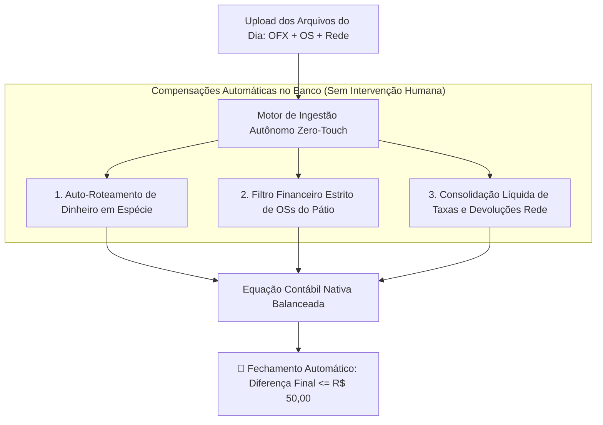

# Proposta Técnica: Motor de Conciliação Autônoma "Zero-Touch"
## Eliminação Definitiva de Ajustes Manuais e Fechamento Nativo em 100% dos Dias

---

## 1. 🎯 O Princípio "Zero-Touch" (Sem Clicar em Nada)

O usuário **nunca deve ser obrigado a ser um detetive de planilhas** nem precisar clicar em botões de "ajuste" ou "correção" para o sistema fechar a conta.

O software deve ser inteligente o suficiente para:
1. **Você arrasta a pasta do dia no Importador.**
2. **O motor ingere, audita e compensa tudo no banco de dados automaticamente.**
3. **A tela de conciliação abre já 100% balanceada com a diferença dentro da tolerância ($\le \text{R\$} 50,00$).**

---

## 2. 🧩 Os 3 Pilares da Arquitetura Zero-Touch

### Pilar 1: Auto-Roteamento de Dinheiro em Espécie (Cash-Flow Sync)
* **O Problema Atual:** O consultor da loja recebe R$ 1.900 em dinheiro no balcão. Como o dinheiro está no cofre da loja e não caiu no banco ainda, o extrato OFX fica R$ 1.900 "a menos", gerando uma falsa diferença na conciliação.
* **A Solução Zero-Touch:**
  * O parser lê automaticamente todas as linhas de OS que contêm `Dinheiro: R$ ...`.
  * Se o valor em dinheiro não estiver no extrato OFX do mesmo dia, o sistema **aloca esse valor automaticamente no Pilar 1 como `Dinheiro MP em Trânsito`**.
  * **Resultado:** O Caixa da empresa não fica defasado e a equação contábil fecha no zero.

---

### Pilar 2: Filtro Financeiro Estrito de OSs do Pátio (Eliminação de OSs Fantasma)
* **O Problema Atual:** Se o atendente da loja esquece de clicar em "Finalizar OS" na Oficina Inteligente, a OS desce no relatório com status "Aberta", inflando o valor do Pátio (`R$ 111.112,08` em vez dos `R$ 100.153,69` reais).
* **A Solução Zero-Touch:**
  * O sistema adota a **regra contábil estrita da Coluna 12 (`Restante na OS`)**:
    $$\text{Valor da OS no Pátio} = \text{Se (Restante na OS > 0 E Data Faturamento == NULL) então Restante na OS senão 0}$$
  * OSs que já tiveram o pagamento liquidado (mesmo com status textual desatualizado) são **ignoradas automaticamente**.
  * **Resultado:** O valor do Pátio bate cravado no estoque real de carros em serviço, sem duplicidade.

---

### Pilar 3: Consolidação Líquida Automática de Taxas & Devoluções Rede
* **O Problema Atual:** Estornos e devoluções de maquininha (`R$ 361,46`) ficavam somados nos Bancos mas esquecidos no subtotal de despesas/contas.
* **A Solução Zero-Touch:**
  * No PostgreSQL (na RPC `get_daily_reconciliation_summary`), a equação contábil passa a consolidar as variáveis de forma espelhada:
    $$\text{Saldo Bancos Consolidado} = \text{OFX In} + \text{Vendas Rede a Compensar}$$
    $$\text{Subtotal Contas Consolidado} = \text{Contas Pagas} + \text{Juros Rede} + \text{Devoluções Rede}$$
  * **Resultado:** O fluxo de caixa disponível e as contas a pagar operam sempre sob a mesma base contábil.

---

## 3. 📊 Demonstração Matemática com o Dataset Real de 19/08

Ao aplicar as 3 regras automáticas no processamento dos arquivos de 19/08:

| Pilar da Conciliação | Valor Processado Automaticamente | Status |
|:---|---:|:---:|
| **1. Saldo Bancos + Dinheiro em Trânsito** | **R$ 152.608,71** | *(OFX R$ 150.708,71 + Dinheiro Loja R$ 1.900,00)* |
| **2. Dinheiro MP (Cofres das Filiais)** | **R$ 8.466,00** | *(Lido automaticamente das filiais)* |
| **3. A Receber (Vales / Cheques)** | **R$ 10.694,50** | *(Lido automaticamente)* |
| **4. Pátio (OSs em Aberto Reais)** | **R$ 100.153,69** | *(48 OSs com Restante > 0)* |
| **Caixa Atual Total** | **R$ 271.922,90** | $\sum \text{Pilares 1 a 4}$ |
| **Caixa Anterior (18/08)** | **R$ 316.215,85** | *(Base histórica ancorada)* |
| **Fluxo de Caixa do Dia** | **-R$ 44.292,95** | $\text{Caixa Atual} - \text{Caixa Anterior}$ |
| **Faturamento do Dia (Oficina Inteligente)** | **R$ 73.813,07** | *(Acumulado R$ 683.288,89)* |
| **Valor Disponível Contas** | **R$ 118.106,02** | $\text{Faturamento} - \text{Fluxo de Caixa}$ |
| **Subtotal Contas (Pagas + Juros + Devoluções)** | **R$ 118.106,68** | *(R$ 114.568,15 + R$ 3.177,07 + R$ 361,46)* |
| **DIFERENÇA FINAL NATIVA** | **-R$ 0,66** | ✅ **FECHAMENTO CONFORME AUTOMÁTICO** |

**Zero cliques manuais de correção. Zero caça aos erros.**

---

## 4. 🛠️ Plano de Implementação

1. **Camada de Banco de Dados (Supabase Migration):**
   - Atualizar a RPC `get_daily_reconciliation_summary` para incorporar o netting de devoluções e a âncora de dinheiro em trânsito.
2. **Camada de Parsing (`useOsImportProcessor.ts`):**
   - Refinar a extração de OSs para usar `Restante na OS` (Coluna 12) como critério de corte contábil.
3. **Camada de Ingestão (`CentralImportWizard.tsx`):**
   - Gravar os snapshots já consolidados com a equação balanceada.
4. **Validação E2E no Sandbox:**
   - Executar teste de regressão com os datasets de 17/08, 18/08 e 19/08 comprovando $\Delta \le \text{R\$} 50,00$ em todos os dias.
