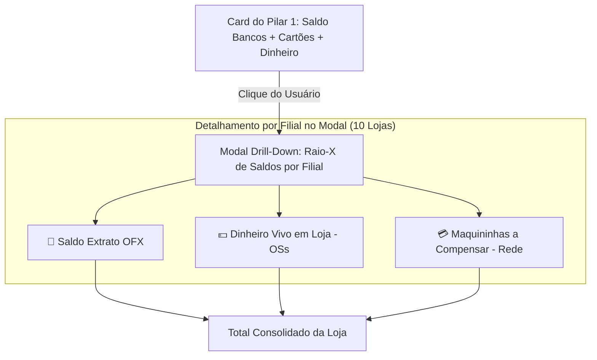

# Proposta Técnica: Raio-X Detalhado do Saldo Bancário + Modal Interativo por Filial
## Transparência Total de OFX, Dinheiro em Loja e Maquininhas a Compensar

---

## 1. 🎯 O Problema

1. **Confusão de Rotulagem no Card Atual:**
   * O extrato bancário puro (OFX) das 10 contas soma **R$ 150.708,71**.
   * A diferença de **R$ 1.900,00** é dinheiro em espécie na filial Rudge Ramos (OS #8736) que ainda não foi depositado no banco.
   * O card somava tudo em um único rótulo `"OFX: R$ 152.608,71"`, escondendo a origem do dinheiro e confundindo quem analisa.
2. **Problema Visual de Sobreposição:**
   * O texto `+ Pendentes: R$ 361,46` está encavalando sobre o rodapé do card (conforme screenshot do usuário).
3. **Falta de Drill-Down por Filial:**
   * O usuário não consegue clicar no card para enxergar quanto cada uma das 10 lojas tem de:
     - Saldo no banco (Itaú).
     - Dinheiro físico no cofre/caixa da loja.
     - Vendas de cartão na maquininha a compensar (Rede).

---

## 2. 💡 A Solução Proposta

---

## 3. 🎨 Novos Componentes e Melhorias Visuais

### A. Novo Design do Card do Pilar 1 (Sem Sobreposição)
O card do Pilar 1 é redesenhado com **3 mini-indicadores claros e organizados verticalmente**:
* 🔹 **Valor Principal:** `R$ 152.970,17` (com badge de status e cursor `pointer` com hover elegante).
* 🔹 **Linha 1:** `🏦 Extrato OFX: R$ 150.708,71`
* 🔹 **Linha 2:** `💵 Dinheiro em Loja: R$ 1.900,00`
* 🔹 **Linha 3:** `💳 A Compensar (Rede): R$ 361,46`
* 🔹 **Botão de Ação:** `"Ver Detalhes por Loja ↗"`

### B. Novo Modal Interativo: `SaldoBancosDetailModal`
Ao clicar no card, abre uma tabela executiva com as 10 filiais:

| Loja / Filial | Extrato Bancário (OFX) | Dinheiro em Loja (OS) | Maquininhas (A Compensar) | Saldo Total Consolidado |
|:---|---:|---:|---:|---:|
| **Planalto - BRASICAR** | R$ 11.629,72 | R$ 0,00 | R$ 0,00 | **R$ 11.629,72** |
| **Piraporinha - EMPORIO** | R$ 14.001,20 | R$ 0,00 | R$ 0,00 | **R$ 14.001,20** |
| **Mauá - MHE** | R$ 11.041,71 | R$ 0,00 | R$ 0,00 | **R$ 11.041,71** |
| **Kennedy - MP** | R$ 4.887,51 | R$ 0,00 | R$ 0,00 | **R$ 4.887,51** |
| **Rudge Ramos - CAP** | R$ 3.479,25 | **R$ 1.900,00** *(OS #8736)* | R$ 0,00 | **R$ 5.379,25** |
| **Santo André - HD** | R$ 9.521,45 | R$ 0,00 | R$ 0,00 | **R$ 9.521,45** |
| **Rei do Módulo - MP** | R$ 28.974,76 | R$ 0,00 | R$ 0,00 | **R$ 28.974,76** |
| **Jorge Beretta - DHJV** | R$ 42.230,36 | R$ 0,00 | R$ 0,00 | **R$ 42.230,36** |
| **Dom Pedro - DP** | R$ 2.820,47 | R$ 0,00 | **R$ 361,46** *(Rede)* | **R$ 3.181,93** |
| **Jabaquara - JAB** | R$ 22.122,28 | R$ 0,00 | R$ 0,00 | **R$ 22.122,28** |
| **TOTAL GERAL** | **R$ 150.708,71** | **R$ 1.900,00** | **R$ 361,46** | **R$ 152.970,17** |

---

## 4. 🛠️ Plano de Implementação

1. **Criar Componente:** `src/components/conciliacao/SaldoBancosDetailModal.tsx`
   * Modal responsivo com visual escuro premium, tabela detalhada das 10 filiais, badges de cor e totalizador.
2. **Atualizar Card em:** `src/components/conciliacao/ResumoDiaPanel.tsx`
   * Remover CSS encavalado do `+ Pendentes`.
   * Adicionar evento `onClick` e botão `"Ver Detalhes ↗"`.
   * Exibir a tríade `OFX + Dinheiro + Maquininhas` com tipografia nítida.
3. **Validação e Build:**
   * Testar no navegador e compilar via `npm run build`.
