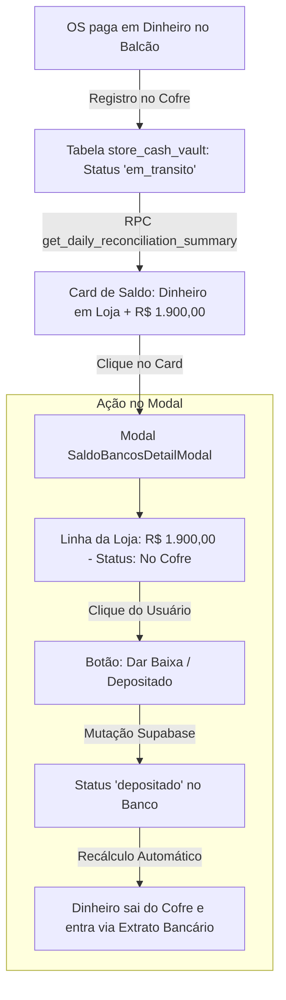

# Proposta Técnica: Gestão e Baixa de Dinheiro em Trânsito / Cofre por Filial
## Persistência de Dinheiro Físico com Botão de Baixa de Depósito no Modal

---

## 1. 🎯 O Problema e a Necessidade

1. **Dinheiro Físico em Trânsito (Cofre da Loja):**
   * Quando uma OS é paga em dinheiro no balcão (como os **R$ 1.900,00** da Rudge Ramos), esse valor fica fisicamente no cofre/caixa da filial até que o gerente vá ao banco e faça o depósito.
   * O dinheiro deve continuar constando no patrimônio do dia (`Caixa Atual`) e no Saldo Consolidado **em todos os dias subsequentes** enquanto estiver com status `"Em Trânsito / No Cofre"`.
2. **Controle e Ação de Baixa:**
   * O usuário precisa ver quanto dinheiro cada loja tem no cofre dentro do modal de Raio-X do Saldo (`SaldoBancosDetailModal`).
   * Quando o depósito for confirmado no extrato bancário, o usuário clica no botão **`[ Dar Baixa / Depositar ]`** diretamente no modal, transferindo a custódia do cofre para o banco e encerrando a pendência.

---

## 2. 💡 Arquitetura e Fluxo de Dados



---

## 3. 🛠️ Mudanças Técnicas Propostas

### A. Tabela no Banco: `store_cash_vault`
```sql
CREATE TABLE public.store_cash_vault (
    id UUID PRIMARY KEY DEFAULT gen_random_uuid(),
    store_id TEXT NOT NULL REFERENCES stores(id),
    amount NUMERIC NOT NULL CHECK (amount > 0),
    description TEXT NOT NULL,
    entry_date DATE NOT NULL,
    status TEXT NOT NULL DEFAULT 'em_transito' CHECK (status IN ('em_transito', 'depositado', 'cancelado')),
    deposited_at TIMESTAMPTZ,
    deposited_by TEXT,
    notes TEXT,
    created_at TIMESTAMPTZ DEFAULT now()
);
```

### B. Integração na RPC `get_daily_reconciliation_summary`
A RPC consulta os saldos em trânsito de cada filial onde `entry_date <= v_target_date` e `status = 'em_transito'` (ou `deposited_at::date > v_target_date` para preservar fidelidade histórica).
* Popula `dinheiro_loja` em cada filial dentro do array `stores`.
* Popula `dinheiro_em_lojas` no total consolidado.

### C. Novo Botão de Ação no `SaldoBancosDetailModal`
* Na coluna "Dinheiro em Loja", se houver saldo em trânsito:
  * Exibe o badge de valor (ex: `R$ 1.900,00`).
  * Botão de ação: **`Dar Baixa 💸`** com tooltip e confirmação.
* Ao clicar:
  * Abre popover/diálogo rápido de confirmação.
  * Executa a mutação Supabase marcando `status = 'depositado'` e `deposited_at = now()`.
  * Atualiza instantaneamente a RPC e o painel via React Query.

---

## 4. 📋 Plano de Verificação

1. **Persistência Multi-Dias:** Confirmar que no dia 19/08, 20/08 e 21/08 os R$ 1.900,00 aparecem como dinheiro em cofre até serem baixados.
2. **Ação de Baixa:** Clicar em "Dar Baixa" no modal e verificar que o status passa para "depositado" e o saldo do cofre é zerado.
3. **Fidelidade Histórica:** Garantir que consultas a datas passadas (antes da data de baixa) continuem mostrando o dinheiro em trânsito daquela época.
