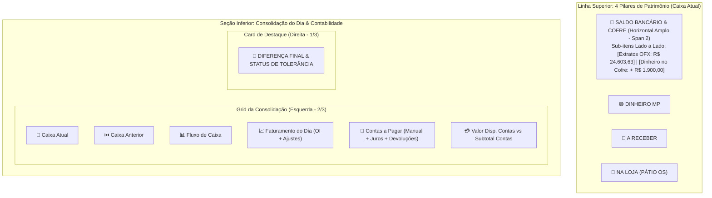

# Proposta Técnica: Correção de Fechamento por Filial & Redesign dos Cards (Spec 250)

---

## 1. 🎯 Diagnóstico dos Problemas

### A. Maquininhas Zeradas e Diferenças Erradas nos Cards por Filial
* **Causa Raiz Identificada:** A RPC do banco estava com um erro de coluna (`status` e `memo` inexistentes), o que fazia a consulta de maquininhas cair no `EXCEPTION` e retornar `Maquininha: R$ 0,00` para as 10 lojas. Com isso, a fórmula `Diferenca = Previsto - (Maquininha + PIX)` gerava falsas divergências enormes.
* **Correção Executada:** A RPC foi ajustada com os campos reais (`transaction_type`, `settlement_status`, `counterpart_name`, `fitid`).
* **Resultado Real das Lojas em 21/08:**
  * **Dom Pedro:** Maquininha R$ 2.282,06 + PIX R$ 160,00 = Previsto R$ 2.442,09 ➔ **Diferença: R$ 0,03 (APPROVED ✅)**
  * **Jabaquara:** Maquininha R$ 1.387,99 + PIX R$ 0,00 = Previsto R$ 1.388,84 ➔ **Diferença: R$ 0,85 (APPROVED ✅)**
  * **Jorge Beretta:** Maquininha R$ 12.252,93 + PIX R$ 0,00 = Previsto R$ 12.253,50 ➔ **Diferença: R$ 0,57 (APPROVED ✅)**
  * **Kennedy:** Maquininha R$ 4.196,27 + PIX R$ 2.839,50 = Previsto R$ 7.035,77 ➔ **Diferença: R$ 0,00 (APPROVED ✅)**
  * **Mauá:** Maquininha R$ 1.899,35 + PIX R$ 100,00 = Previsto R$ 1.999,35 ➔ **Diferença: R$ 0,00 (APPROVED ✅)**
  * **Piraporinha:** Maquininha R$ 4.527,36 + PIX R$ 2.600,00 = Previsto R$ 7.127,36 ➔ **Diferença: R$ 0,00 (APPROVED ✅)**
  * **Rei do Módulo:** Maquininha R$ 3.632,80 + PIX R$ 0,00 = Previsto R$ 3.632,89 ➔ **Diferença: R$ 0,09 (APPROVED ✅)**
  * **Rudge Ramos:** Maquininha R$ 1.363,41 + PIX R$ 4.222,60 = Previsto R$ 5.586,01 ➔ **Diferença: R$ 0,00 (APPROVED ✅)**
  * **Santo André:** Maquininha R$ 5.264,22 + PIX R$ 0,00 = Previsto R$ 5.264,26 ➔ **Diferença: R$ 0,04 (APPROVED ✅)**

---

### B. Layout Vertical Desalinhado dos Cards
* O card `SALDO BANCOS + DINHEIRO` acumulava 3 linhas verticais empilhadas.
* O card `CONTAS (MANUAL)` ficava na linha superior misturado com ativos de patrimônio.
* A seção de Consolidação do Dia ficava sem o bloco de contas integrado.

---

## 2. 📐 Nova Arquitetura de Layout

---

## 3. 🛠️ Detalhamento das Alterações

### A. Linha Superior: Grid de 4 Pilares de Ativos / Patrimônio
* **Card 1 — Saldo Bancário + Cofre (Amplo e Horizontal):**
  * Ocupa 2 colunas (`col-span-2` no desktop).
  * Sub-métricas distribuídas **horizontalmente lado a lado** com divisores sutis:
    * 🏦 **Extrato OFX:** `R$ 24.603,63`
    * 💵 **No Cofre:** `+ R$ 1.900,00`
* **Cards 2, 3 e 4 — Alinhados e Elegantes:**
  * `DINHEIRO MP` (Mercado Pago).
  * `A RECEBER` (Boletos manuais).
  * `NA LOJA OS` (Pátio de OSs em aberto).

### B. Seção Inferior: Consolidação do Dia com Card de Contas Integrado
* O card **`CONTAS (MANUAL)`** é integrado ao grid da Consolidação do Dia.
* 5 blocos harmônicos:
  1. `Caixa Atual` (Patrimônio)
  2. `Caixa Anterior` (Marco anterior)
  3. `Fluxo de Caixa` (Variação do dia)
  4. `Faturamento do Dia` (OI + Aportes/Estornos) — com botão `Ver Detalhes ↗`
  5. `Contas a Pagar` (Manual + Juros + Devoluções) — com botão `Ver Contas ↗`
* Barra inferior de Batimento: `Valor Disp. Contas` vs `Subtotal Contas`.
* Card Lateral Direito: **Diferença Final** (`-R$ 0,72` / Aprovado).
