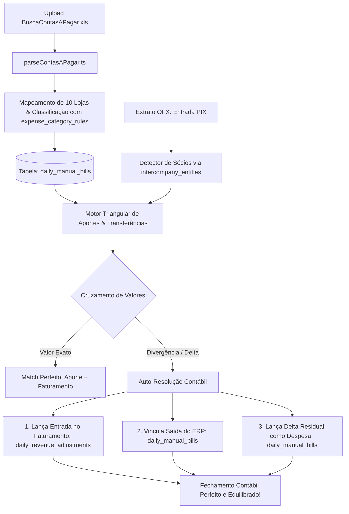

# Design: Importação Analítica do "BuscaContasAPagar.xls", Cadastro de Entidades e Motor Triangular Intercompany (Spec 256)

---

## 🏛️ Arquitetura Técnica do Cruzamento Triangular



---

## 📝 Interfaces TypeScript

```typescript
// src/types/contasPagar.ts

export interface IntercompanyEntity {
  id: string;
  name: string;
  type: 'socio' | 'filial' | 'holding' | 'parceiro';
  cpfCnpj?: string;
  pixKeys: string[];
  storeId?: string;
  isActive: boolean;
}

export interface ExpenseCategoryRule {
  id: string;
  pattern: string;
  category: string;
  priority: number;
}

export interface RawContaAPagarRow {
  emp: string;
  codigo: string;
  parc: string;
  clienteFornecedor: string;
  descricao: string;
  tipo: string;
  dtVecto: string;
  dtPrevisao: string;
  vlAPagar: number;
  status: string;
  dtPgto?: string;
  vlPago: number;
}

export interface ParsedContaAPagar {
  externalCode: string;
  installment: string;
  storeId: string;
  storeName: string;
  recipientName: string;
  description: string;
  category: string;
  dueDate: string;
  paymentDate?: string;
  amount: number;
  status: 'PAG' | 'ABER' | 'CANCELADA';
  matchedOsNumber?: string;
  isIntercompany: boolean;
  intercompanyEntityId?: string;
}

export interface TriangularMatchResult {
  inflowOfxId: string;
  inflowAmount: number;
  inflowStoreId: string;
  outflowBillsId?: string;
  outflowAmount: number;
  outflowStoreId?: string;
  unregisteredDelta: number;
  entityName: string;
}
```

---

## 🧩 Componentes & Artefatos Novos / Modificados

1. **`src/lib/parsers/contasPagarParser.ts`**: Parser de arquivos `.xls`/`.xlsx` com categorização dinâmica e extração de OS de frete.
2. **`src/hooks/useIntercompanyEntities.ts`**: Hook para cadastro e listagem de sócios, filiais e regras de despesa.
3. **`src/hooks/useContasAPagarImport.ts`**: Hook de processamento e persistência das despesas.
4. **`src/components/configuracoes/IntercompanyEntitiesModal.tsx`**: Modal minimalista para cadastrar/editar sócios, chaves PIX e regras de classificação.
5. **`src/components/conciliacao/ContasManualModal.tsx`**: Tabela analítica turbinada com busca, filtro por loja/categoria e dropdown de reclassificação.
6. **`supabase/migrations/20260821000008_accounts_payable_support.sql`**: Migration criando `intercompany_entities`, `expense_category_rules`, `accounts_payable_imports` e colunas estendidas em `daily_manual_bills`.

---

## 🎨 Fluxo de UI & Restrições Visuais

* **Paleta & Tokens:** Dark mode estrito (`var(--bg-canvas)`, `var(--bg-surface-elevated)`), fontes mono para valores, badges coloridos por categoria.
* **Jornada:**
  1. No painel de Configurações ou Conciliação, o usuário pode clicar em **"Entidades & Sócios"** para conferir as contas e chaves PIX cadastradas.
  2. Ao importar o `BuscaContasAPagar.xls`, o sistema extrai todas as contas e cruza automaticamente com os extratos bancários.
  3. Se houver aporte triangular de sócio, o sistema reconhece a origem e o destino, lança o faturamento, amarra a retirada do ERP e gera a despesa delta residual para zerar o fechamento de ponta a ponta.

---

## 🧪 Cenários de Verificação (SCAN ➔ INFER ➔ VERIFY ➔ FIX)

### Cenário 1: Cruzamento Triangular Real (Retirada R$ 10k ➔ Aporte R$ 16k ➔ Delta R$ 6k)
* **SCAN:** Entrada de PIX de `+R$ 16.000,00` na Loja B identificada com titularidade de Sócio.
* **INFER:** Busca no `daily_manual_bills` e localiza retirada de `R$ 10.000,00` na Loja A pelo mesmo sócio.
* **VERIFY:** Calcula delta residual: `16000 - 10000 = 6000`.
* **FIX:** 
  1. Cria ajuste de faturamento (+R$ 16k) em `daily_revenue_adjustments`.
  2. Cria despesa delta (+R$ 6k) em `daily_manual_bills`.
  3. Resultado: Conciliação zera perfeitamente!
