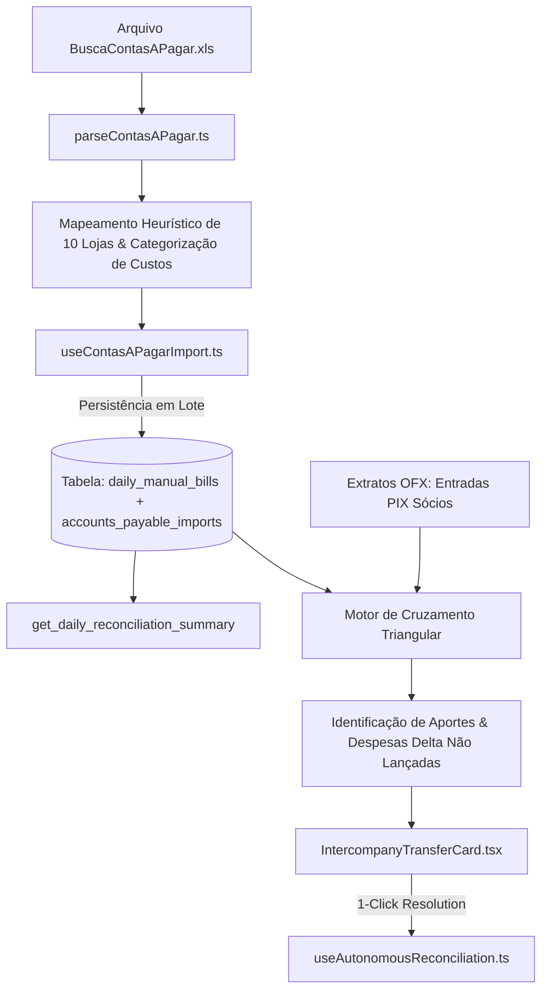

# Design: Importação Analítica do "BuscaContasAPagar.xls" & Conciliação Triangular de Aportes/Transferências Intercompany (Spec 256)

---

## 🏛️ Arquitetura Técnica



---

## 📝 Interfaces TypeScript

```typescript
// src/types/contasPagar.ts

export interface RawContaAPagarRow {
  emp: string;
  codigo: string;
  parc: string;
  clienteFornecedor: string;
  descricao: string;
  tipo: string;
  dtVecto: string;
  dtPrevisao: string;
  vlAPagar: number;
  status: string;
  dtPgto?: string;
  vlPago: number;
}

export type ContaCategory = 
  | 'retirada_socios'
  | 'gestao_tech'
  | 'custo_operacional_pecas'
  | 'logistica_os'
  | 'despesas_bancarias'
  | 'outros';

export interface ParsedContaAPagar {
  externalCode: string;
  installment: string;
  storeId: string;
  storeName: string;
  recipientName: string;
  description: string;
  category: ContaCategory;
  dueDate: string;
  paymentDate?: string;
  amount: number;
  status: 'PAG' | 'ABER' | 'CANCELADA';
  matchedOsNumber?: string;
  isIntercompany: boolean;
}

export interface IntercompanyMatch {
  ofxEntryId: string;
  ofxAmount: number;
  ofxCounterpart: string;
  sourceStoreId?: string;
  sourceStoreName?: string;
  erpExpenseAmount: number;
  unregisteredDelta: number;
  suggestedAction: 'conciliar_aporte_e_despesa';
}
```

---

## 🧩 Componentes & Artefatos Novos / Modificados

1. **`src/lib/parsers/contasPagarParser.ts`**: Parser de arquivos `.xls`/`.xlsx` do relatório do ERP Oficina Inteligente, com mapeamento normalizado de lojas (`MPJorgeBeretta` -> `st-03`, `ReiDoModulo` -> `st-09`, etc.) e categorização inteligente (Uber OS, Peças, Retiradas, Cartão).
2. **`src/hooks/useContasAPagarImport.ts`**: Hook de importação e query das contas do dia.
3. **`src/components/importacoes/CentralImportWizard.tsx`**: Novo slot de upload para `BuscaContasAPagar.xls` no Step 1 do Wizard.
4. **`src/components/conciliacao/ContasManualModal.tsx`**: Evolução para tabela analítica com busca, filtro por loja e categoria, e totalizador dinâmico.
5. **`src/components/conciliacao/IntercompanyTransferCard.tsx`**: Card para sugestão de regularização de aportes e transferências com botão de ação direta.
6. **`supabase/migrations/20260821000008_accounts_payable_support.sql`**: Migration expandindo `daily_manual_bills` e criando `accounts_payable_imports`.

---

## 🎨 Fluxo de UI & Restrições Visuais

* **Paleta & Tokens:** Dark mode estrito (`var(--bg-canvas)`, `var(--bg-surface-elevated)`), fontes mono para números e valores, badges coloridos por categoria (Ex: Roxo para Sócios, Azul para Peças, Amarelo para Logística OS).
* **Jornada do Usuário:**
  1. O usuário arrasta `BuscaContasAPagar (1).xls` na Central de Importação junto com os OFX e OSs.
  2. O sistema extrai instantaneamente as 253 contas (R$ 195.066,04), atribui às 10 lojas e extrai as OSs vinculadas aos Ubers.
  3. No fechamento, o total de `Contas (Manual / Analítico)` é preenchido automaticamente sem digitação manual.
  4. Se houver aporte intercompany de sócio com despesa delta, o sistema sugere a contrapartida e regulariza em 1 clique.

---

## 🧪 Cenários de Verificação (SCAN ➔ INFER ➔ VERIFY ➔ FIX)

### Cenário 1: Importação do Arquivo Real `BuscaContasAPagar (1).xls`
* **SCAN:** Parse das 253 linhas do arquivo de 21/08.
* **INFER:** Extrai e soma `R$ 195.066,04` e mapeia 100% das lojas para seus IDs reais.
* **VERIFY:** O valor bate exatamente com o total contábil esperado (`195066.04`).
* **FIX:** Persiste na tabela `daily_manual_bills`.

### Cenário 2: Aporte Intercompany com Delta sem Despesa (Ex: R$ 16k entrada com R$ 10k saída)
* **SCAN:** Entrada de PIX de +R$ 16k na conta da Loja B e retirada de R$ 10k na Loja A.
* **INFER:** Detecta delta de R$ 6.000 não lançado no ERP.
* **VERIFY:** Confere se o sócio é o mesmo titular em ambas as pontas.
* **FIX:** Sugere e lança aporte de R$ 16k no faturamento e despesa de R$ 6k nas contas.
