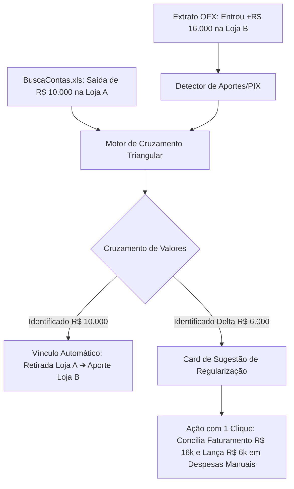

# Proposta Técnica (Spec 256): Importação Analítica do "BuscaContasAPagar.xls" & Conciliação Triangular de Aportes/Transferências Intercompany

---

## 📌 1. Visão Geral & Contexto

Atualmente, o valor total de **Contas a Pagar (Despesas do Dia)** no fechamento diário é consolidado como um valor global ou inserido manualmente. 
Além disso, transferências entre contas de filiais e sócios (onde uma loja retira R$ 10k e junta-se com mais R$ 6k para aportar R$ 16k em outra loja) geram divergências contábeis difíceis de rastrear quando parte da saída não foi previamente cadastrada no ERP como despesa.

Esta especificação define:
1. **Parser & Importador Automático do Relatório `BuscaContasAPagar.xls` (Oficina Inteligente / ERP)**.
2. **Atribuição Automática de Despesas por Filial** (`Emp` ➔ Loja no Sistema) e **Vínculo de Logística às OSs** (ex: `REF. UBER OS22541`).
3. **Motor de Conciliação Triangular de Aportes e Transferências Intercompany** com detecção cruzada de saídas/entradas entre lojas e sugestão de resolução com 1 clique.

---

## 📊 2. Estrutura de Dados do Arquivo `BuscaContasAPagar.xls`

### 2.1 Colunas do Relatório Analítico:
* **`Emp`**: Código da Loja/Filial de origem (ex: `MPJorgeBeretta`, `ReiDoModulo`, `MPpiraporinha`, `MPSantoAndre`, `MPplanalto`, `MPdompedro1`, `MPkennedy`, `MPrudge`, `ReiDoOleoMaua`, `MPJabaquara`, `MPMaster`).
* **`Código`**: ID numérico único do título no contas a pagar (ex: `20297`, `3465`).
* **`Parc`**: Número da parcela (ex: `1/1`, `8/12`).
* **`Cliente/Fornecedor`**: Nome do beneficiário ou fornecedor (ex: `CARTÃO DANIEL C6`, `ROGERIO TADEU RUIZ`, `BANCO ITAÚ`).
* **`Descrição`**: Histórico detalhado (ex: `REF. GOOGLE`, `REF. RETIRADA ROGÉRIO`, `REF. UBER OS22541`).
* **`Tipo`**: Tipo de lançamento (`LCTO`).
* **`Dt. Vecto`**: Data original de vencimento do título.
* **`Dt. Previsão`**: Data prevista para desembolso.
* **`Vl. a Pagar`**: Valor nominal da obrigação.
* **`Status`**: Status da conta (`PAG` = Pago, `ABER` = Aberto).
* **`Dt. Pgto`**: Data efetiva da liquidação contábil.
* **`Vl. Pago`**: Valor desembolsado ao centavo.

---

### 2.2 Mapeamento Automático de Filiais (`Emp` ➔ Sistema):
| Código no Excel (`Emp`) | Filial no Sistema | ID do Banco |
| :--- | :--- | :--- |
| `MPJorgeBeretta` | Jorge Beretta - DHJV | `st-03` |
| `ReiDoModulo` | Rei do Módulo - MP | `st-09` |
| `MPpiraporinha` | Piraporinha - EMPORIO | `st-05` |
| `MPJabaquara` | Jabaquara - JAB | `st-02` |
| `MPrudge` | Rudge Ramos - CAP | `st-07` |
| `MPkennedy` | Kennedy - MP | `st-04` |
| `ReiDoOleoMaua` | Mauá - MHE | `3a3dd7ce-fa8c-4aee-bac4-42f30fa6899f` |
| `MPplanalto` | Planalto - BRASICAR | `st-06` |
| `MPSantoAndre` | Santo André - HD | `st-08` |
| `MPdompedro1` | Dom Pedro - DP | `st-01` |
| `MPMaster` | Matriz / Custos Compartilhados | `master` |

---

### 2.3 Categorização Heurística Automática de Despesas:
O motor analisa o texto de `Fornecedor` + `Descrição` e classifica em centros de custo:
1. **Retiradas & Pró-Labore (`Retirada / Sócios`):** Palavras-chave: `RETIRADA`, `PARTICIPAÇÃO DE LUCROS`, `PRO LABORE`.
2. **Cartão Corporativo / Software / Marketing (`Gestão & Tech`):** Palavras-chave: `GOOGLE`, `FACEBOOK`, `CARTAO DANIEL`, `VERISURE`, `SISTEMA`.
3. **Peças & Fornecedores Mecânicos (`Custo Operacional`):** Palavras-chave: `CAMBIO`, `PEÇAS`, `JUNTAS`, `COOPERPECAS`, `DISTRIBUIDORA`, `MERCADO LIVRE`.
4. **Logística & Entregas de Peças (`Logística OS`):** Palavras-chave: `UBER OS[0-9]+` ➔ *Extrai o número da OS e associa diretamente ao custo do serviço no pátio!*
5. **Financeiro & Bancos (`Despesas Bancárias`):** Palavras-chave: `JUROS LIMITE`, `TARIFA`, `IOF`.

---

## 🔄 3. Motor de Conciliação Triangular (Transferências & Aportes Intercompany)

### 3.1 O Problema Operacional Real:
1. Loja A transfere **R$ 10.000,00** para um sócio (registrado no ERP como *Retirada*).
2. Sócio transfere **R$ 16.000,00** para a conta da Loja B (aporte de reforço de caixa).
3. **No Banco da Loja B:** Entra `+ R$ 16.000,00` no extrato OFX (aumentando o Caixa Atual).
4. **No Faturamento:** Deve-se lançar `+ R$ 16.000,00` como Aporte (pois não é receita de vendas OI).
5. **Nas Contas do ERP:** Constam apenas os **R$ 10.000,00** da Loja A. Os **R$ 6.000,00** restantes não foram emitidos como título no ERP.
6. **Divergência:** Diferença residual de **R$ 6.000,00** entre a capacidade gerada e as contas apuradas.



### 3.2 Como o Sistema Resolverá:
* O sistema identifica as entradas de PIX com identificação de sócios/filiais nos extratos OFX.
* Cruza com as saídas marcadas como `Retirada / Transferência` no `BuscaContasAPagar.xls`.
* Se houver saldo parcial (ex: R$ 10k encontrados de R$ 16k), o sistema exibe o **Card de Detecção Inteligente de Aporte**:
  > **💡 Aporte Intercompany Detectado:**
  > * Entrada no extrato da Loja B: **R$ 16.000,00**
  > * Origem identificada: Retirada da Loja A (**R$ 10.000,00**)
  > * **Delta sem registro no ERP:** **R$ 6.000,00**
  >
  > 👉 **[ Botão: Conciliar Aporte (+R$ 16k) & Auto-Lançar Despesa (+R$ 6k) ]**

---

## 💻 4. Interface do Usuário (UI / UX)

### 4.1 Nova Zona de Upload na Aba "Importações":
* Adicionar o slot de upload: **`Relatório de Contas a Pagar (BuscaContasAPagar.xls)`**.
* Validação automática de colunas, contagem de registros e totalização instantânea na tela.

### 4.2 Modal "Contas a Pagar (Item a Item)" Turbinado:
* Listagem completa das 253 contas agrupadas por:
  * **Loja / Filial** (com filtros por loja).
  * **Categoria de Despesa** (com badges coloridos).
  * **Status de Conciliação com Extrato Bancário** (Ícone verde se houve débito OFX correspondente).
* Botão para **Exportar Relatório Consolidado** ou **Adicionar Despesa Avulsa Manual**.

---

## 🗄️ 5. Modelo de Dados (Tabelas Supabase)

### 5.1 Nova Tabela: `accounts_payable_imports`
```sql
CREATE TABLE public.accounts_payable_imports (
    id UUID PRIMARY KEY DEFAULT gen_random_uuid(),
    date DATE NOT NULL,
    source_filename TEXT NOT NULL,
    total_bills_count INTEGER NOT NULL,
    total_amount NUMERIC(15, 2) NOT NULL,
    created_at TIMESTAMPTZ DEFAULT now()
);
```

### 5.2 Evolução da Tabela `daily_manual_bills`:
```sql
ALTER TABLE public.daily_manual_bills 
ADD COLUMN IF NOT EXISTS external_code TEXT,
ADD COLUMN IF NOT EXISTS installment TEXT,
ADD COLUMN IF NOT EXISTS due_date DATE,
ADD COLUMN IF NOT EXISTS payment_date DATE,
ADD COLUMN IF NOT EXISTS recipient_name TEXT,
ADD COLUMN IF NOT EXISTS matched_ofx_id UUID REFERENCES ofx_transactions(id),
ADD COLUMN IF NOT EXISTS is_intercompany BOOLEAN DEFAULT false,
ADD COLUMN IF NOT EXISTS matched_os_number TEXT;
```

---

## 🎯 6. Benefícios Esperados
1. **Zero Digitação Manual:** O contas a pagar de centenas de milhares de reais é importado em 2 segundos.
2. **Rastreabilidade Total:** Saber centavo a centavo o custo de cada filial e cada OS.
3. **Fim das Dúvidas com Aportes e Sócios:** O sistema calcula a diferença residual de transferências e resolve o fechamento contábil com um único clique.
