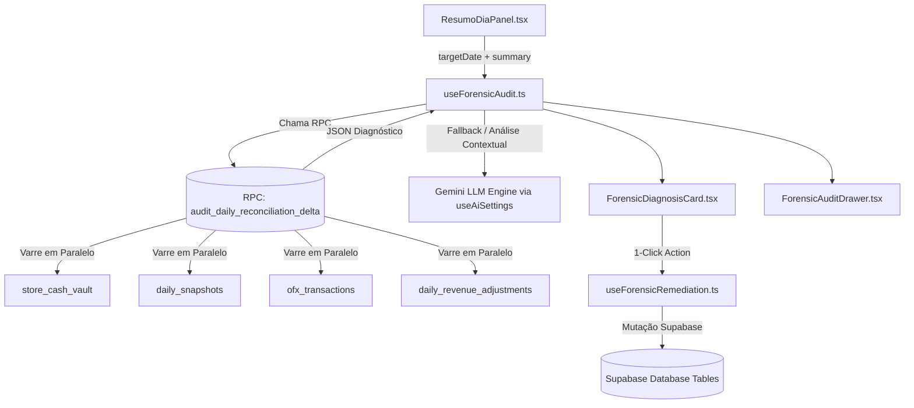

# Design: Copiloto IA Forense & Motor de Auditoria Autônoma (Spec 257)

---

## 🏛️ Arquitetura Técnica



---

## 📝 Interfaces TypeScript

```typescript
// src/types/forensicAudit.ts

export type ForensicRootCauseType = 
  | 'vault_anchor_mismatch'
  | 'intercompany_delta'
  | 'snapshot_cascade'
  | 'unrecorded_expense'
  | 'card_timing'
  | 'unaccounted_revenue'
  | 'tolerance_cents';

export interface ForensicPatternMatch {
  id: string;
  type: ForensicRootCauseType;
  title: string;
  description: string;
  amount: number;
  storeId?: string;
  storeName?: string;
  remediationAction?: 'reanchor_vault' | 'create_revenue_adjustment' | 'create_manual_bill' | 'recalculate_snapshot';
  remediationPayload?: Record<string, any>;
}

export interface ForensicAuditResult {
  hasDivergence: boolean;
  divergenceAmount: number;
  status: 'conforme' | 'divergente';
  patterns: ForensicPatternMatch[];
  aiAnalysisText: string;
  timestamp: string;
}
```

---

## 🧩 Componentes & Artefatos Novos/Atualizados

1. **`src/hooks/useForensicAudit.ts`**: Hook principal que executa a RPC SQL e aciona o LLM para síntese explicativa.
2. **`src/hooks/useForensicRemediation.ts`**: Hook de mutações com confirmação e preview para aplicar as correções sugeridas.
3. **`src/components/conciliacao/ForensicDiagnosisCard.tsx`**: Card embutido na lateral do Resumo do Dia que exibe o diagnóstico e o botão de ação.
4. **`src/components/conciliacao/ForensicAuditDrawer.tsx`**: Gaveta lateral de chat pericial com histórico de transações e investigações interativas.
5. **`supabase/migrations/20260821000006_forensic_audit_rpc.sql`**: Migration com a tabela de logs e a RPC `audit_daily_reconciliation_delta`.

---

## 🎨 Fluxo de UI & Restrições Visuais

* **Paleta & Tokens:** Dark mode estrito (`var(--bg-canvas)`, `var(--bg-surface-elevated)`), sem glassmorphism borrado, fontes mono para números e valores.
* **Jornada do Usuário:**
  1. Ao abrir o dia (ex: 21/08), se houver divergência $> \text{R\$\ } 50$, o card da Diferença Final pulsa suavemente e exibe o bloco **"Diagnóstico Forense da IA"**.
  2. O bloco exibe em bullets:
     - 🔍 **Causa Identificada:** Ex: *Depósito em trânsito de R$ 1.900,00 registrado com data de 19/08.*
     - 💥 **Impacto:** *Elevou o Caixa Anterior de 21/08 de R$ 271.922,90 para R$ 273.822,90.*
     - 🛠️ **Ação Recomendada:** *Reancorar data da entrada para 21/08.*
  3. O usuário clica em **[ Corrigir Ancoragem ]**.
  4. Um diálogo confirma a alteração mostrando o impacto (Diferença Final vai de `+R$ 1.899,78` para `-R$ 0,22`).
  5. A tela atualiza instantaneamente e exibe o badge verde: **Fechamento Conforme ✅**.

---

## 🧪 Cenários de Verificação (SCAN ➔ INFER ➔ VERIFY ➔ FIX)

### Cenário 1: Divergência por Ancoragem de Cofre (Caso 21/08)
* **SCAN:** Diferença de `+R$ 1.899,78` com tolerância esperada de `-R$ 0,22`.
* **INFER:** `1899.78 - (-0.22) = 1900.00`. Busca item de R$ 1.900 em `store_cash_vault` com `entry_date < target_date`.
* **VERIFY:** Confirma que o item foi adicionado em data anterior e afetou `caixa_anterior`.
* **FIX:** Sugere reancoragem para a data atual.

### Cenário 2: Aporte Intercompany com Delta sem Despesa
* **SCAN:** Entrada de PIX de `+R$ 16.000,00` no banco e retirada de `R$ 10.000,00` no Contas a Pagar (Delta: R$ 6.000).
* **INFER:** Detecta vínculo de sócio e diferença de R$ 6.000 não lançada no ERP.
* **VERIFY:** Aponta sugestão de conciliar Aporte (+16k) e lançar Despesa (+6k).
* **FIX:** Executa os dois lançamentos simultaneamente com 1 clique.
