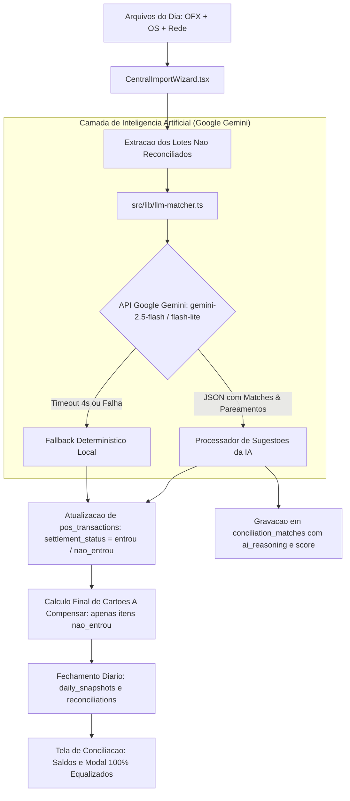

# Design: Reativacao do Gemini na Conciliacao Inteligente e Equalizacao de Cartoes (307)

## Arquitetura Tecnica



## Interfaces TypeScript

```typescript
export interface AiReconcileRedeInput {
  storeId: string;
  storeName: string;
  targetDate: string;
  redeSales: {
    nsu?: string;
    auth?: string;
    grossAmount: number;
    fee: number;
    netAmount: number;
    method: string;
    saleDate: string;
  }[];
  ofxCredits: {
    fitid: string;
    title: string;
    amount: number;
    date: string;
  }[];
}

export interface AiMatchSuggestion {
  id: string;
  store_id: string;
  os_number?: string;
  ofx_transaction_id?: string;
  pos_transaction_id?: string;
  match_type: 'PIX_DIRECT' | 'REDE_DEPOSIT' | 'TRIPLE_MATCH';
  confidence: number;
  reasoning: string;
  settlement_status?: 'entrou' | 'nao_entrou';
  pending_amount?: number;
}
```

## Componentes e Modulos

1. `src/lib/llm-matcher.ts`:
   - Módulo central com chamadas HTTP diretas à API REST do Google Gemini (`https://generativelanguage.googleapis.com/v1beta/models/...:generateContent`).
   - Prompt com JSON schema estrito garantindo zero parsing errors.
2. `src/components/importacoes/CentralImportWizard.tsx`:
   - Aciona `reconcileWithGemini()` logo após processar OFX e Rede, antes de chamar `saveSnapshot`.
   - Marca as vendas que já entraram como `entrou`, evitando que o card superior infle saldo a compensar inexistente.
3. `src/hooks/useAiSettings.ts`:
   - Prioriza: (1) `ai_settings` do banco, (2) `import.meta.env.VITE_GEMINI_API_KEY`, (3) `localStorage`.

## Cenarios de Verificacao
- **Cenario 1 (Rede com Liquidacao Total - ex: 27/08):**
  - Entrada: Mauá vendeu R$ 1.374,51 ontem. No OFX de hoje entrou crédito de R$ 1.374,51 da Rede.
  - Ação: Gemini identifica o crédito, marca como `entrou`.
  - Resultado: "A Compensar" de Mauá = R$ 0,00. Saldo bancário não é duplicado.
- **Cenario 2 (Rede com Liquidacao Parcial):**
  - Entrada: Loja X vendeu R$ 11.000 ontem. No OFX de hoje só caiu R$ 10.600, faltando R$ 400.
  - Ação: Gemini identifica os R$ 10.600 como `entrou` e isola os R$ 400 como `nao_entrou`.
  - Resultado: "A Compensar" da Loja X = R$ 400,00. Card superior soma exatamente +R$ 400,00.
- **Cenario 3 (Offline / Sem Quota):**
  - Entrada: Erro 429 ou sem chave configurada.
  - Ação: Fallback determinístico assume o controle instantaneamente.
  - Resultado: Importação conclui com sucesso sem quebrar.
