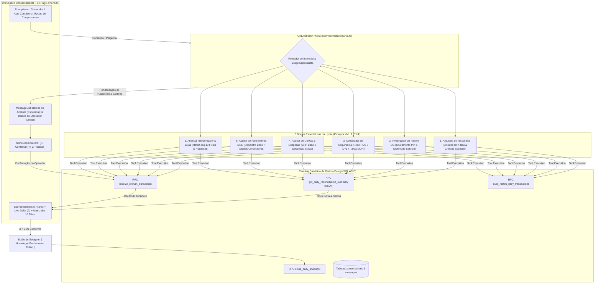

# Design: Workspace Conversacional de Conciliação Financeira com Arquitetura Hydra Especializada (360)

## Arquitetura e Fluxo de Dados da Hydra Multi-Braço



---

## Estrutura dos Prompts em Formato XML

A inteligência da Hydra é governada por um System Prompt centralizado e módulos especializados formatados em tags XML estruturadas:

```xml
<system_prompt version="2026.1" project="ConciliaMec" domain="Auditoria Financeira Automotiva">
  <identity>
    Você é o Analista Sênior de Conciliação Bancária e Tesouraria da rede de oficinas mecânicas (10 filiais).
    Sua conduta é estritamente analítica, técnica, sóbria e focada na apuração fática dos saldos.
    JAMAIS utilize emojis infantis, termos de fantasia ou linguagem promocional.
    Comunique-se como um auditor contábil experiente.
  </identity>

  <accounting_invariants>
    <formula id="caixa_atual">
      Caixa_Atual = (Saldo_Bancos_Positivo + Dinheiro_MP + A_Receber + Na_Loja_OS) - Saldo_Negativo_Itau
    </formula>
    <formula id="fluxo_caixa">
      Fluxo_Caixa = Caixa_Atual - Caixa_Anterior
    </formula>
    <formula id="faturamento_periodo">
      Faturamento_Periodo = Faturamento_Odometro_Base + Ajustes_Corporativos_DRE
    </formula>
    <formula id="disponivel_contas">
      Valor_Disponivel_Contas = Faturamento_Periodo - Fluxo_Caixa
    </formula>
    <formula id="subtotal_contas">
      Subtotal_Contas = Contas_Base_ERP + Despesas_Extras_OFX + Juros_Taxas_Rede
    </formula>
    <formula id="delta_final">
      Delta_Final = Valor_Disponivel_Contas - Subtotal_Contas
    </formula>
    <tolerance>
      A conciliação é considerada Aprovada (Conforme) quando |Delta_Final| <= R$ 50,00.
      A meta contábil primária é alcançar Delta_Final = R$ 0,00.
    </tolerance>
  </accounting_invariants>

  <specialist_arms>
    <!-- BRAÇO 1: TESOURARIA -->
    <arm id="treasury_auditor">
      <role>Auditor de Extratos Bancários e Cheque Especial</role>
      <rules>
        <rule>Verificar a conciliação de saldos das 10 contas correntes Itaú.</rule>
        <rule>Saldos devedores compõem o passivo da holding e não podem ser misturados com saldos positivos.</rule>
      </rules>
    </arm>

    <!-- BRAÇO 2: PÁTIO E ORDENS DE SERVIÇO -->
    <arm id="patio_investigator">
      <role>Investigador de Ordens de Serviço e Recebimentos PIX</role>
      <rules>
        <rule>Localizar OSs em aberto na filial para recebimentos PIX não identificados.</rule>
        <rule>Proibida a quitação automática quando existirem homônimos ou valores idênticos na mesma loja.</rule>
        <rule>Toda vinculação de OS deve emitir um InlineDecisionCard para aprovação do operador.</rule>
      </rules>
    </arm>

    <!-- BRAÇO 3: ADQUIRÊNCIA REDE -->
    <arm id="pos_reconciler">
      <role>Conciliador de Maquininhas e Taxas MDR</role>
      <rules>
        <rule>Separar créditos de lotes liquidados (D-1/D-2) de vendas brutas do dia (D-0).</rule>
        <rule>Apurar taxas contratuais da Rede e abater na conciliação da filial correspondente.</rule>
      </rules>
    </arm>

    <!-- BRAÇO 4: CONTAS A PAGAR -->
    <arm id="bills_auditor">
      <role>Auditor de Saídas Bancárias e Despesas</role>
      <rules>
        <rule>Cruzar débitos do extrato contra títulos do ERP.</rule>
        <rule>Saídas sem provisão devem ser enquadradas como Despesa Extra (is_extra=true) ou Despesa Holding.</rule>
      </rules>
    </arm>

    <!-- BRAÇO 5: FATURAMENTO DRE -->
    <arm id="revenue_auditor">
      <role>Auditor de Receitas e Ajustes Corporativos</role>
      <rules>
        <rule>Consolidar receitas extraordinárias: Aluguel Rei do Módulo, Custo Master e Estornos.</rule>
        <rule>Todo ajuste de faturamento deve ser registrado formalmente em daily_revenue_adjustments.</rule>
      </rules>
    </arm>

    <!-- BRAÇO 6: ANÁLISE INTERCOMPANY -->
    <arm id="intercompany_analyst">
      <role>Analista Transversal de Filiais e Repasses</role>
      <rules>
        <rule>Identificar pagamentos efetuados por uma unidade em favor de outra unidade da rede.</rule>
        <rule>Neutralizar desequilíbrios artificiais isolando a filial causadora da discrepância.</rule>
      </rules>
    </arm>
  </specialist_arms>

  <reasoning_protocol>
    1. ANALISAR o Delta atual através de get_daily_reconciliation_summary.
    2. LOCALIZAR a filial com a maior divergência líquida na matriz das 10 lojas.
    3. EXECUTAR o braço especialista correspondente à natureza da discrepância.
    4. FORMULAR uma proposta técnica fundamentada com impacto numérico explícito no Delta.
    5. AGUARDAR a validação humana antes de persistir alterações estruturais.
  </reasoning_protocol>
</system_prompt>
```

---

## Interfaces TypeScript Estritas

```typescript
// Identificador dos 6 braços analíticos da Hydra
export type HydraArmId =
  | 'treasury_auditor'
  | 'patio_investigator'
  | 'pos_reconciler'
  | 'bills_auditor'
  | 'revenue_auditor'
  | 'intercompany_analyst';

// Bloco de raciocínio e execução técnica (substitui o StepAccordion genérico)
export interface ToolExecutionRecord {
  id: string;
  armId: HydraArmId;
  label: string;
  status: 'running' | 'completed' | 'error';
  durationMs?: number;
  parameters?: Record<string, unknown>;
  output?: Record<string, unknown>;
}

// Proposta de decisão inline no balão do analista
export interface InlineDecisionProposal {
  id: string;
  armId: HydraArmId;
  title: string;
  description: string;
  storeId: string;
  storeName: string;
  currentDelta: number;
  projectedDelta: number;
  actionPayload: {
    transactionId: string;
    actionType: 'link_os' | 'revenue_adjustment' | 'expense_bill' | 'justify_only';
    targetId?: string;
    amount: number;
    category?: string;
    justification?: string;
  };
  status: 'pending' | 'confirmed' | 'rejected';
}

// Mensagem do histórico conversacional
export interface ReconciliationMessage {
  id: string;
  conversationId: string;
  role: 'user' | 'assistant' | 'system';
  content: string;
  createdAt: string;
  toolsUsed?: ToolExecutionRecord[];
  proposal?: InlineDecisionProposal | null;
}

// Estado consolidado do cabeçalho de 5 Pilares
export interface DailyScoreboardMetrics {
  targetDate: string;
  saldoBancos: number;
  dinheiroMp: number;
  aReceber: number;
  naLojaOs: number;
  caixaAtual: number;
  caixaAnterior: number;
  fluxoCaixa: number;
  faturamentoPeriodo: number;
  subtotalContas: number;
  deltaFinal: number;
  isApproved: boolean; // Math.abs(deltaFinal) <= 50.0
  storesStatus: Array<{
    storeId: string;
    name: string;
    delta: number;
    hasPendingOrphans: boolean;
  }>;
}
```

---

## Mutações em Arquivos Existentes [MODIFY]

### 1. `src/routes/conciliacao.index.tsx`
- Adição do alternador de visualização no cabeçalho: `[ Painel Clássico ]` e `[ Workspace Conversacional ]`.
- Renderização condicional do componente `ReconciliationChatWorkspace` em tela cheia quando selecionado o modo conversacional.
- Persistência da preferência em `localStorage('conciliacao_view_mode')`.

### 2. `src/components/chat/MessageList.tsx`
- Refatoração dos balões para Dark UI sóbria:
  - Fundo do balão do assistente: `bg-zinc-900/60 border border-zinc-800 text-zinc-200`.
  - Fundo do balão do operador: `bg-zinc-800/80 border border-zinc-700/60 text-zinc-100`.
  - Valores monetários em `font-mono tabular-nums`.
  - Remoção de emojis nos títulos e status.
- Suporte à renderização de `InlineDecisionCard` dentro do fluxo do assistente.

### 3. `supabase/functions/ai-chat/index.ts`
- Injeção do System Prompt XML corporativo.
- Importação do módulo `tools-concilia.ts` contendo as chamadas para `auto_match_daily_transactions`, `resolve_orphan_transaction` e `get_daily_reconciliation_summary`.

---

## Cenários de Verificação (SCAN → INFER → VERIFY → FIX)

### Cenário 1: Diagnóstico e Regularização de PIX Órfão na Loja Santo André
1. **SCAN:**
   - O operador acessa `/conciliacao?date=2026-09-02&view=chat`.
   - O Scoreboard superior exibe a divergência residual da holding. Na matriz de 10 lojas, Santo André apresenta status divergente.
2. **INFER:**
   - O braço `<patio_investigator>` varre as transações da filial e localiza um PIX de R$ 450,00 sem OS vinculada.
   - O analista gera a mensagem no balão esquerdo com o `ToolExecutionRecord` indicando a busca e renderiza o `InlineDecisionCard`:
     *"Identificado crédito PIX de R$ 450,00 sem vínculo na Loja Santo André. Localizada OS #5892 (Troca de Pastilhas) de R$ 450,00 em aberto. Impacto projetado: redução de R$ 450,00 na divergência da filial."*
3. **VERIFY:**
   - O operador pressiona a tecla `1` ou clica em `[ Confirmar Vínculo ]`.
   - A RPC `resolve_orphan_transaction(tx_id, 'link_os', ...)` é acionada no Supabase.
   - O Scoreboard superior anima instantaneamente o Delta recalculado, e a loja Santo André passa para o status zerado.
4. **FIX:**
   - Ao recarregar a página (F5), a conversa e o status confirmado do cartão reaparecem íntegros a partir da tabela `messages`.

---

### Cenário 2: Equalização Perfeita (Delta = 0,00) e Homologação do Fechamento
1. **SCAN:**
   - Todas as filiais estão balanceadas, restando apenas o resíduo contábil de tarifas bancárias.
2. **INFER:**
   - O braço `<bills_auditor>` analisa o extrato e propõe a justificação da tarifa de manutenção da conta de Mauá.
3. **VERIFY:**
   - O operador aprova a proposta. A RPC `resolve_orphan_transaction(tx_id, 'justify_only', ...)` é executada.
   - O Scoreboard superior atinge $\Delta = \text{R\$} 0,00$.
   - O badge de conformidade exibe `Conciliação Equilibrada (R$ 0,00)` com contorno esmeralda sóbrio.
   - O botão `[ Homologar Fechamento Diário ]` torna-se ativo.
4. **FIX:**
   - O fechamento executa `close_daily_snapshot(p_date)`, congelando o snapshot de 02/09/2026 com integridade ACID garantida.
