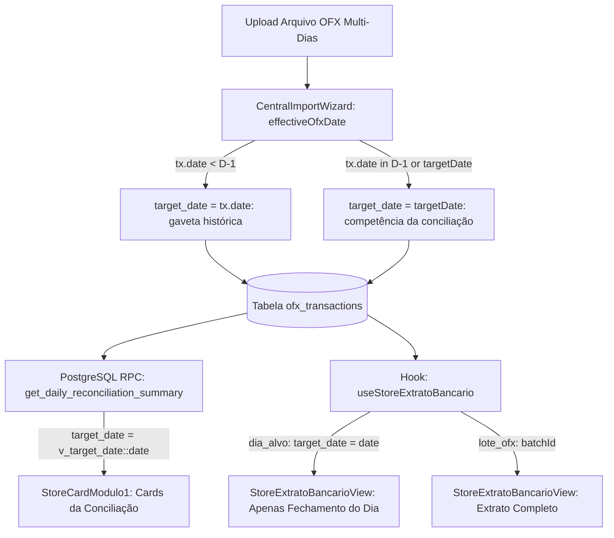

# 📐 SDD Design: Blindagem contra Vazamento de Datas Anteriores do OFX (Spec 415)

## 1. Arquitetura de Fluxo dos Dados (End-to-End)



1. **Ingestão (CentralImportWizard):**  
   Ao analisar um lançamento do OFX:
   - Se a transação possui data anterior a D-1 (ex: `parsedTxDate < targetDate - 1 dia`), ela preserva sua competência natural: `target_date = parsedTxDate`.
   - Se a transação pertence à competência de fechamento (`parsedTxDate === targetDate` ou `parsedTxDate === D-1`), ela é associada à conciliação vigente: `target_date = targetDate`.
2. **Armazenamento Fiduciário (Supabase PostgreSQL):**  
   `ofx_transactions` mantém `occurred_at` com o timestamp exato do banco e `target_date` estritamente sincronizado com o dia de competência contábil.
3. **Agregação Canônica (RPC SSOT):**  
   `get_daily_reconciliation_summary` calcula entradas, saídas, conciliados e divergências baseando-se estritamente em `target_date = v_target_date::date`. Nenhuma cláusula de batch cega é permitida.
4. **Visualização Front-end (StoreExtratoBancarioView):**  
   - Escopo `dia_alvo` (`Apenas Fechamento do Dia`): filtra `rawTransactions` por `target_date === date`. O loop `dayGroups` renderiza apenas o grupo do dia da conciliação.
   - Escopo `lote_ofx` (`Extrato Completo do OFX`): exibe a totalidade do lote importado com accordions cronológicos por dia.

---

## 2. Design System & UI Guardrails (Shadcn + Zinc-950)

- **Consistência de Cores e Tokens:**
  - Superfície base: `bg-background` (Zinc-950)
  - Superfície dos cards: `bg-card border border-border/50` (Zinc-900)
  - Accordions e listas: `bg-zinc-950/40 border-zinc-800/40`
  - Badges de competência: `bg-zinc-800 text-zinc-300 border-zinc-700`
- **Zero AI Slop:** Proibido uso de classes arbitrárias de cores hexadecimais soltas (`#09090b`), gradientes roxos semânticos ou badges flutuantes redundantes.
- **Micro-interações:** Animações do accordion mantidas com Framer Motion $\le 200\text{ms}$ (`ease: 'easeInOut'`).

---

## 3. Interfaces TypeScript Reais

```typescript
// Contrato de retorno da StoreExtratoBancarioData
export interface StoreExtratoBancarioData {
  previousBalance: number;
  bankTotal: number;
  targetDateTxs: Array<{
    id: string;
    store_id: string;
    amount: number;
    type: 'in' | 'out';
    occurred_at: string;
    target_date: string;
    fitid?: string | null;
    bank_name?: string | null;
    counterpart_name?: string | null;
    source: 'ofx' | 'manual';
  }>;
  loteTxs: any[];
  batchId: string | null;
  recon: {
    id: string;
    store_id: string;
    date: string;
    bank_total: number;
    previous_balance: number;
    status: string;
  } | null;
  hasOfxForDate: boolean;
}
```

---

## 4. Cenários Obrigatórios

### A. Happy Path
- O usuário abre `/conciliacao?date=2026-09-17`.
- A filial **Piraporinha - EMPORIO (`st-05`)** exibe:
  - **OFX Entradas:** R$ 3.430,00 (Tamires R$ 2.930,00 + Leordina R$ 500,00).
  - **Saídas OFX:** R$ 5.000,00 (Rei do Módulo R$ 1.000,00 + Brasicar R$ 4.000,00).
  - **Saldo Total:** R$ 2.394,12 (R$ 3.964,12 inicial + R$ 3.430,00 entradas - R$ 5.000,00 saídas).
- Ao clicar em Piraporinha para ver os detalhes, a aba `Extrato Bancário` abre em `Apenas Fechamento do Dia (4)` com exatamente 4 lançamentos do dia 17. Os lançamentos de 14/09 e 15/09 não aparecem e não contaminam os KPIs.

### B. Edge Case (Extrato Multi-Dias Completo)
- O usuário precisa auditar o que veio no arquivo OFX original de Piraporinha.
- Ele clica no botão `Extrato Completo do OFX (21)`.
- O sistema expande a visualização mostrando o extrato íntegro do lote com os 3 grupos:
  - Segunda-feira, 14/09/2026 (10 lançamentos)
  - Terça-feira, 15/09/2026 (7 lançamentos)
  - Fechamento Vigente (4 lançamentos)
- Os lançamentos de 14/09 e 15/09 são exibidos como somente leitura / bloqueados para edição no fechamento do dia 17, com o badge indicativo da data de ocorrência real.

---

## 5. Critérios de Aceitação Verificáveis

1. **Agregação Fiduciária em `get_daily_reconciliation_summary`:**  
   Para `p_date = '2026-09-17'`, a filial `st-05` retorna exatamente:
   - `ofx_entradas_total = 3430.00`
   - `ofx_saidas_total = 5000.00`
   - Zero inclusão de transações de 14/09 ou 15/09.
2. **Estabilidade das Demais Filiais:**  
   Todas as outras 9 filiais (Dom Pedro, Jabaquara, Jorge Beretta, etc.) mantêm rigorosamente seus valores atuais (ex: Dom Pedro R$ 1.658,37 em entradas e R$ 440,00 em saídas).
3. **Escopo Estrito em `StoreExtratoBancarioView`:**  
   No escopo `dia_alvo`, `filteredTransactions.length === 4` para Piraporinha em 17/09/2026. Nenhum accordion de 14/09 ou 15/09 é exibido neste escopo.
4. **Quality Gate de Build:**  
   `npm run build` executa sem erros de TypeScript (exit code 0).
