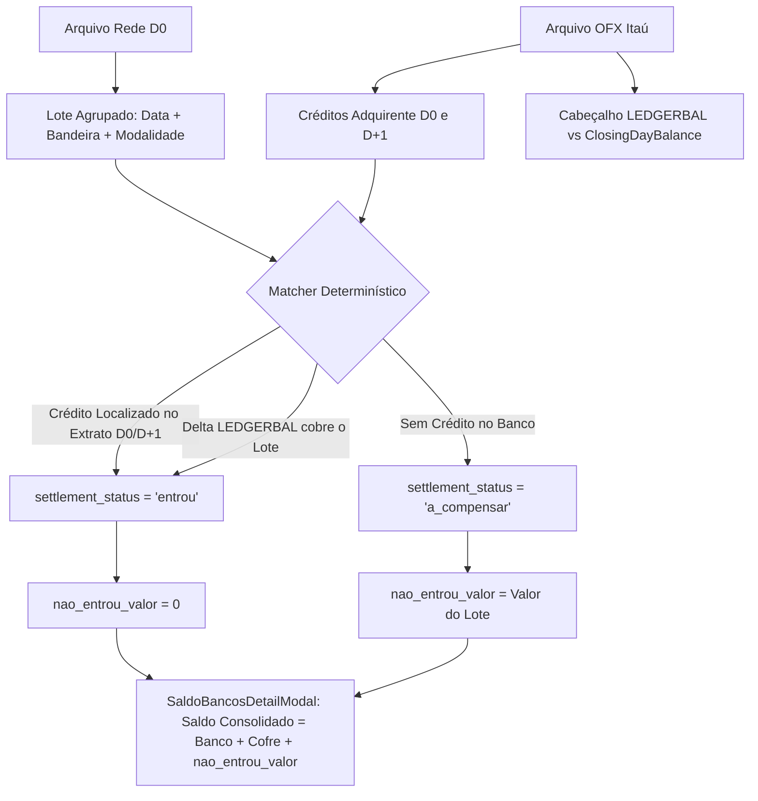

# 📐 SDD Design — Calibração do Match Rede x OFX e Deduplicação no Saldo Consolidado

- **Spec ID:** `433-match-rede-ofx-deduplicacao-saldo`
- **Status:** Especificado (Aguardando Aprovação)

---

## 1. Arquitetura de Fluxo dos Dados



---

## 2. Ajustes Detalhados por Arquivo

### 2.1. `src/lib/llm-matcher.ts`
- **Localização:** Linhas 105-110 em `reconcileRedeWithOfxDeterministic`.
- **Alteração:**
  Substituir a comparação rígida de data única por verificação de proximidade de liquidação bancária (D0 e D+1):
  ```ts
  const targetCredits = ofxCredits.filter(c => {
    if (!c.date) return true;
    const cleanDate = c.date.replace(/[-/]/g, '').slice(0, 8);
    const cleanTarget = targetDate.replace(/[-/]/g, '').slice(0, 8);
    // Permite créditos no dia D0 ou no dia seguinte D+1 (liquidação de débito/antecipação)
    const diffDays = Math.abs(
      (new Date(c.date).getTime() - new Date(targetDate).getTime()) / (1000 * 60 * 60 * 24)
    );
    return cleanDate === cleanTarget || diffDays <= 1;
  });
  ```

### 2.2. `src/components/conciliacao/SaldoBancosDetailModal.tsx`
- **Localização:** Linhas 84-98.
- **Alteração:**
  Corrigir o guardrail de fallback:
  ```ts
  const rawNaoEntrou = s.nao_entrou_valor !== undefined && s.nao_entrou_valor !== null ? Number(s.nao_entrou_valor) : undefined;
  const rawCartaoNaoEntrou = s.cartao_nao_entrou !== undefined && s.cartao_nao_entrou !== null ? Number(s.cartao_nao_entrou) : undefined;
  const redeLiquidoVal = Number(s.maquininha || s.rede_liquido || 0);

  let maquininhaNaoEntrou = 0;
  if (rawNaoEntrou !== undefined) {
    maquininhaNaoEntrou = Math.max(0, rawNaoEntrou);
  } else if (rawCartaoNaoEntrou !== undefined) {
    maquininhaNaoEntrou = Math.max(0, rawCartaoNaoEntrou);
  } else if (redeLiquidoVal > 0) {
    maquininhaNaoEntrou = redeLiquidoVal;
  }
  ```

---

## 3. Cenários de Teste

### Cenário 1: Jorge Beretta (DHJV) — Venda já creditada
- **Entrada:** OFX com saldo R$ 48.111,02. Rede com R$ 382,00 creditado em 22/09.
- **Resultado Esperado:** `nao_entrou_valor = 0`. Saldo Consolidado = R$ 48.111,02.

### Cenário 2: Mauá (MHE) — Venda creditada sem duplicar
- **Entrada:** OFX com saldo -R$ 12.964,64. Lote de R$ 992,20 já compensado.
- **Resultado Esperado:** Não soma R$ 992,20 duas vezes. Saldo Consolidado converge para -R$ 9.285,52 (-9k).
