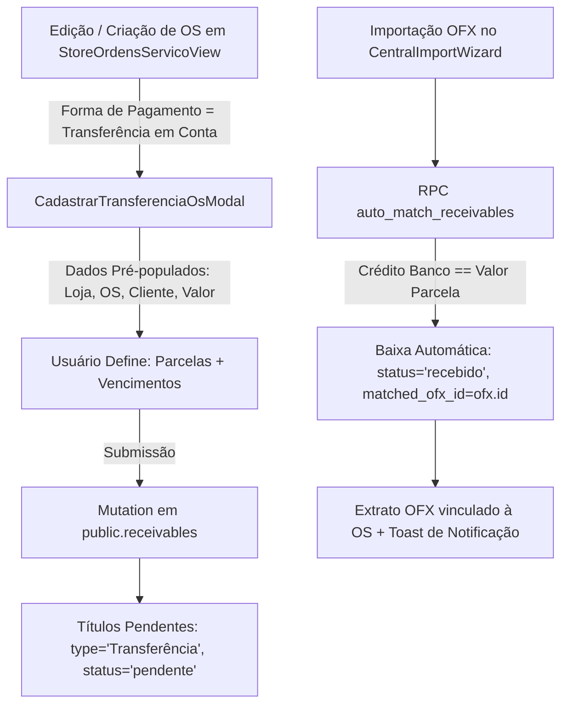

# 📐 SDD Design — Cadastro Ágil de Transferência em Conta na OS e Baixa Automática no OFX

- **Spec ID:** `434-os-transferencia-em-conta-recebiveis-automatch`
- **Status:** Especificado (Aguardando Aprovação)

---

## 1. Arquitetura de Fluxo dos Dados



---

## 2. Contratos de Dados e Interfaces TypeScript

```ts
export interface OsTransferParcelaInput {
  installmentNumber: number; // ex: 1, 2, 3
  totalInstallments: number; // ex: 2
  installmentLabel: string;  // ex: '1/2'
  value: number;
  dueDate: string; // YYYY-MM-DD
}

export interface CadastrarTransferenciaOsModalProps {
  isOpen: boolean;
  onClose: () => void;
  storeId: string;
  storeName: string;
  osNumber: string;
  clientName?: string;
  totalAmount: number;
  targetDate: string;
  onSuccess?: () => void;
}
```

---

## 3. Cenários de Teste

### Cenário 1: Cadastro de Transferência 2x em OS Manual
- **Entrada:** OS #2045 no valor de R$ 2.000,00 da filial Jorge Beretta.
- **Ação:** Selecionar "Transferência em Conta", definir 2 parcelas (R$ 1.000,00 em D+5 e R$ 1.000,00 em D+20).
- **Resultado Esperado:** 2 registros criados em `receivables` com status `pendente`. OS exibe badge de alerta de transferência pendente.

### Cenário 2: Baixa Automática de Transferência no OFX
- **Entrada:** Extrato OFX importado no wizard contém crédito de R$ 1.000,00 da mesma filial.
- **Ação:** Wizard executa etapa de auto-match de recebíveis.
- **Resultado Esperado:** Parcela 1/2 tem status atualizado para `recebido` com `matched_ofx_id`.
