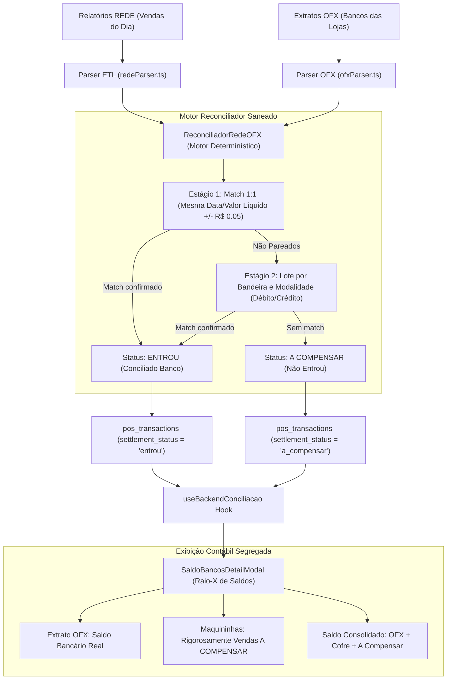

# 📐 SDD Design — Correção Definitiva do Matcher Rede x OFX e Exibição de Saldos por Filial

- **Spec ID:** `435-fix-matcher-rede-ofx-saldos-filiais`
- **Data:** 2026-09-22
- **Autor:** Antigravity 2.0 (Single-Agent Direto)

---

## 1. Arquitetura de Fluxo de Dados



---

## 2. Design System & UI Standards (Zinc-950)

Conforme `DESIGN.md` e `skills/frontend-design-pro`:
- **Superfícies:** Canvas em `bg-background` (Zinc-950), modal em `bg-popover`, cartões e linhas em `bg-card` com `border-border/40`.
- **Tipografia e Cores Semânticas:**
  - Valores positivos/conciliados: `text-emerald-400`, badge com fundo `bg-emerald-500/10 border-emerald-500/30`.
  - Saldos devedores (cheque especial): `text-red-400`, badge com fundo `bg-red-500/10 border-red-500/30`.
  - Valores a compensar/pendentes: `text-amber-300` / `text-emerald-400`.
  - Ausência de valor: `text-muted-foreground` (`-`).
- **Zero Arbitrary Classes:** Nenhuma cor hexadecimal inline solta ou dimensões fora da escala Tailwind.

---

## 3. Interfaces TypeScript Reais

```typescript
export interface CleanOfxCredit {
  fitid: string;
  dataBanco: string;
  valorBanco: number;
  memo: string;
  brand: CardBrand;
  statusMatch: boolean;
  remainingAmount: number;
  vinculadoSaleIds: string[];
}

export interface MatchedRedeSale {
  saleId: string;
  nsu?: string;
  authorization?: string;
  brand: CardBrand;
  method: string;
  dataVenda: string;
  dataPrevista: string;
  valorBruto: number;
  valorLiquido: number;
  statusMatch: boolean;
  fitidBancoVinculado?: string;
  valorBancoVinculado?: number;
  reasoning?: string;
  rawSale: RawRedeSale;
}

export interface ReconciliadorRedeOfxOutput {
  storeId: string;
  storeName: string;
  totalVendasLiquidas: number;
  totalCreditadoBanco: number;
  totalNaoEntrou: number;
  totalOrfaosBanco: number;
  conciliados: MatchedRedeSale[];
  naoEntrou: MatchedRedeSale[];
  orfaosBanco: CleanOfxCredit[];
}
```

---

## 4. Cenários Obrigatórios

### Happy Path
1. Usuário importa o lote do dia (OFX + Rede + OS) na Central de Importações.
2. O `ReconciliadorRedeOFX` processa loja a loja:
   - Para lojas com depósitos casados no banco (ex.: débito D+1 que entrou no extrato matinal), marca as vendas como `entrou` vinculando ao FITID correspondente.
   - Para lojas com vendas pendentes de liquidação futura, marca as vendas como `a_compensar`.
3. No modal *Raio-X de Saldos*:
   - Cada filial exibe com precisão matemática seu saldo bancário OFX e o valor a compensar de maquininhas.
   - O saldo consolidado soma apenas os ativos em trânsito legítimos, sem duplicar valores já creditados na conta.

### Edge Case
- **Extrato bancário com crédito avulso de adquirente de valor superior às vendas do dia (ex.: Beretta com crédito de R$ 3.981,28 de lote anterior e venda de R$ 382,00 do dia atual):**
  - O motor NÃO utiliza o crédito anterior para abater falsamente a venda do dia.
  - A venda de R$ 382,00 não é absorvida cegamente; o crédito de R$ 3.981,28 é classificado em `orfaosBanco` (crédito de lote anterior), mantendo a integridade contábil das vendas do dia corrente.

---

## 5. Critérios de Aceitação Verificáveis
1. **Zero Perda de "A Compensar":** Filiais com vendas de maquininha pendentes (como Jorge Beretta, Piraporinha, Jabaquara) exibem seus valores reais na coluna *Maquininhas (Rede)*, eliminando a exibição de `-` indevido.
2. **Saldo Correto em Mauá:** O saldo bancário e os créditos da filial de Mauá refletem o batimento correto, sem somar duplamente a venda da adquirente sobre o saldo já liquidado.
3. **Sem Duplicações:** Nenhuma loja tem o saldo consolidado inflado pela soma de vendas que já estão creditadas no saldo do extrato OFX.
4. **Terminal Gate:** O comando `npm run build` deve passar com 0 erros de TypeScript e sem quebras de contrato de interface.

---

## 6. Cenários de Teste [SCAN -> INFER -> VERIFY -> FIX]
- **Teste 1:** Executar script pericial com os dados reais de 22/09 sobre a classe `ReconciliadorRedeOFX` saneada e verificar que o array `naoEntrou` contém as vendas pendentes de Beretta, Piraporinha e Jabaquara.
- **Teste 2:** Verificar a renderização das linhas do `SaldoBancosDetailModal.tsx` simulando os dados de 22/09 e garantir que nenhuma filial com recebíveis apresente valor zerado ou duplicado.
