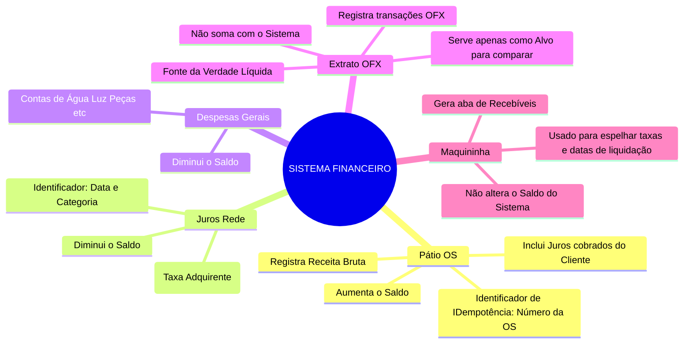
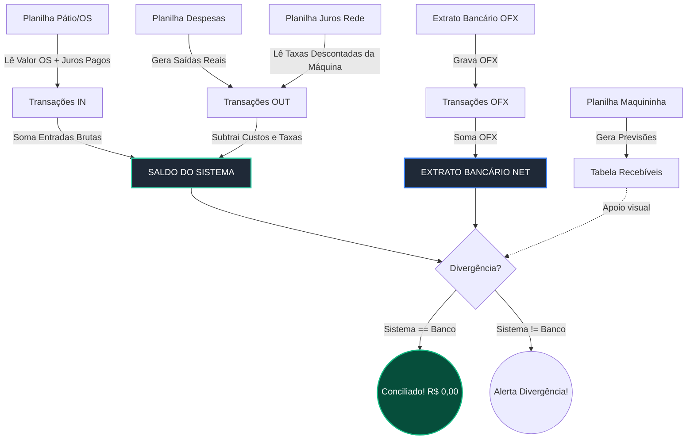

# Spec 038 - Diagramas e Mapa Mental da Conciliação

## Mapa Mental da Importação (Mind Map)

## Fluxograma de Cruzamento de Dados (Flowchart)

## Relatório de Arquitetura por Lojas e Global
**Visão Global:**
O sistema age como um DRE dinâmico. O dinheiro não nasce mágico no banco. O banco (OFX) é passivo. A Inteligência (Sistema) é proativa. Quando você importa as 4 planilhas, o sistema constrói a história: "A Loja Matriz fez um serviço (OS), a maquininha cobrou X (Juros Rede) e o fornecedor cobrou Y (Despesas). O restante DEVE cair no banco".

**Visão Por Loja:**
Cada transação e OS ganha uma tag (um "carimbo") com o `store_id` (via Mapeamento Inteligente nos Wizards). A tela de **Conciliação** separa esses carimbos.
1. O robô soma as Entradas carimbadas daquela loja.
2. Subtrai as Taxas/Despesas carimbadas daquela loja.
3. Exibe o resultado como o **Saldo Atual no Sistema**.
4. Depois, soma o Extrato OFX carimbado daquela loja e exibe o lado **Bancário**.
Se a loja operou perfeitamente, o lucro exato cai na conta. Se o OFX tiver R$ 50 a mais ou a menos, o sistema trava o card da loja em vermelho, apontando exatamente onde o dinheiro sumiu.
