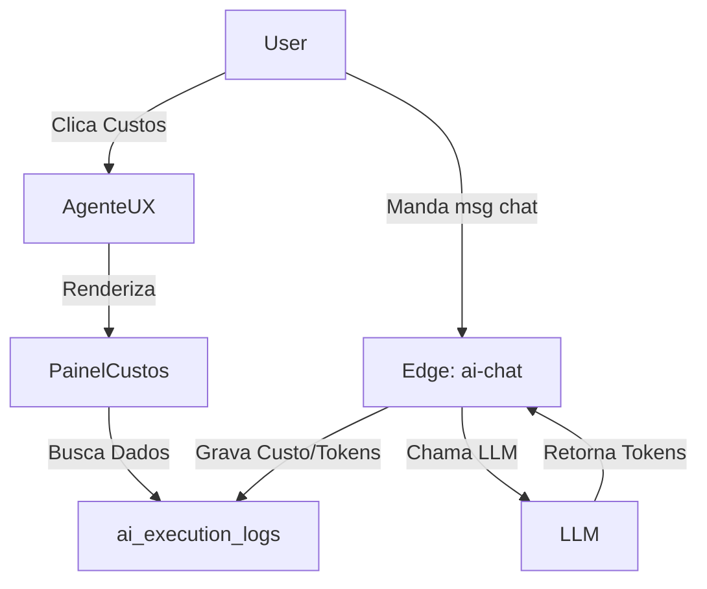

# Design: ReestruturaçÁo da UX do Agente IA e Custos Reais (058-ai-agent-ux-costs)

## Arquitetura Técnica

## Componentes / Hooks / Funções
1. **`src/components/layout/Sidebar.tsx`**: Remover `/custos`.
2. **`src/routes/agente.tsx`**: 
   - Criar estado `activeView` (chat, config, logs-agent, logs-motor, custos).
   - Refatorar a renderizaçÁo central. Se `activeView === 'chat'`, renderiza o Chat. Se `'costs'`, renderiza `<CustosPanel />`.
3. **`src/components/agente/CustosPanel.tsx`** (Novo / Refatorado de `custos.tsx`):
   - Extraído de `custos.tsx`. Utilizará um `useQuery` (Tanstack Query) do Supabase para puxar os registros de `ai_execution_logs`.
4. **`src/components/agente/ConfiguracoesPanel.tsx`** (Novo / Refatorado):
   - Extraído de `configuracoes.tsx`.
5. **`supabase/functions/ai-chat/index.ts`**:
   - `onFinish: async ({ text, usage }) => { ... }`
   - Cálculo de tarifa (ex: GPT-4o: $5.00/1M In, $15.00/1M Out. ConversÁo Dólar ~R$5,50).

## Fluxo de UI
1. Usuário acessa "Agente IA" pelo menu lateral global.
2. Abre a interface dividida (Sidebar do Agente + Área de Chat).
3. Ao clicar em "Custos" ou "Configurações" no rodapé esquerdo, a Área de Chat desaparece e dá lugar ao Dashboard de Custos ou à tela de ConfiguraçÁo, de forma fluida sem reload ou `<AppShell>` piscar.

## Infra / Deploy
- Nenhuma topologia nova. ReutilizaçÁo do Supabase DB e Edge Functions existentes.

## Cenários de VerificaçÁo (SCAN → INFER → VERIFY → FIX)
- **Cenário 1:** Acesso ao Menu Global → "Custos IAS" nÁo deve mais existir.
- **Cenário 2:** Dentro do Agente, clicar em "Configurações" → O conteúdo muda na direita, sem sair da rota/estrutura base do Agente.
- **Cenário 3:** Enviar mensagem no chat → Verificar tabela `ai_execution_logs` no Supabase, deve ter um novo registro de uso com as métricas e o custo em BRL calculado e populado no painel "Custos".
