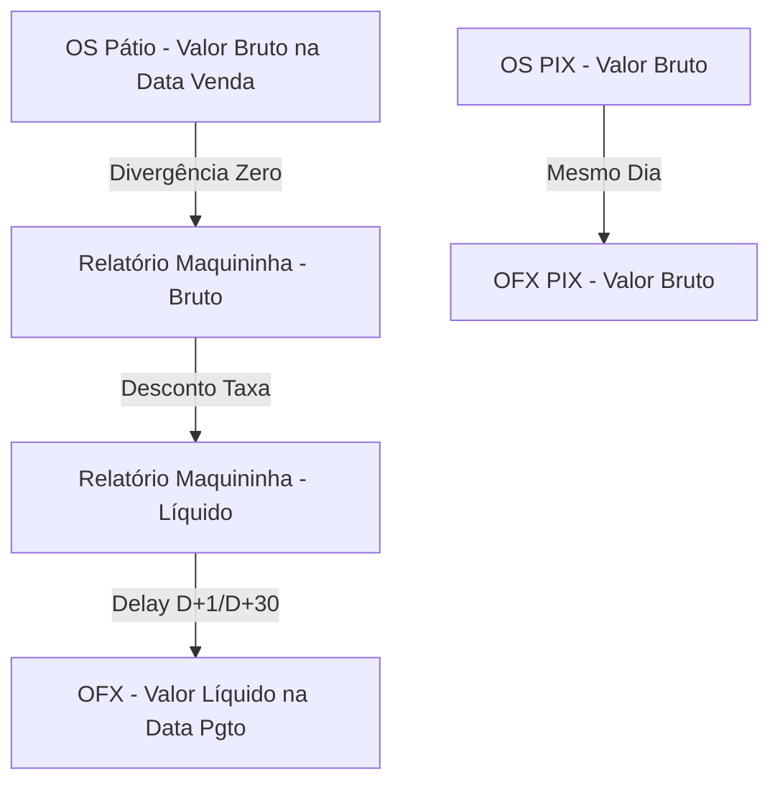

# Design: Lógica Refatorada de ConciliaçÁo Bruto vs Líquido (090-reconciliation-math)

## Arquitetura Técnica
A arquitetura se apoiará na desvinculaçÁo entre "Valor Registrado no Caixa" e "Valor Depositado no Banco". 


## Interfaces TypeScript
```typescript
// Supabase TransactionRow modifications (supabase.ts)
export type TransactionRow = {
  // ... existing fields
  gross_amount?: number | null; // Valor Bruto da transaçÁo
  fee_amount?: number | null; // Taxa de juros/custo
}
```

## Componentes / Hooks / Funções
1. **MigraçÁo de Banco de Dados**:
   - `supabase/migrations/<timestamp>_add_gross_fee_transactions.sql`: Adiciona `gross_amount` e `fee_amount` `NUMERIC` na tabela `transactions`.

2. **Backend/ImportWizard (`CentralImportWizard.tsx`)**:
   - Atualiza a lógica de iteraçÁo de `results.redeResults` e maquininha para capturar os `grossAmount` e `interest` mapeados pelos parsers, enviando pro supabase em `txsToInsert`.

3. **Backend/Hook (`useConciliacao.ts` e `modulo1Calculations.ts`)**:
   - O campo `faturamento_atual` e o `saldo_bancario` precisam distinguir essas lógicas.
   - Criar separaçÁo de "Total Rede Bruto" vs "Total Rede Líquido".
   - Criar separaçÁo "Juros Retidos".

4. **Frontend/UI (`ResumoDiaPanel.tsx` e `conciliacao.index.tsx`)**:
   - Acrescentar a exibiçÁo da linha "Taxas e Juros (Maquininha)" no modal de conciliaçÁo.
   - Mudar a matemática do campo divergência (Divergência real = OS Bruto - Rede Bruto - PIX).
   - O status "Em Caminho" passa a ser Rede Bruto (do dia atual) que ainda nÁo compensou no OFX (cujos D+1 cairÁo em dias seguintes).

## Fluxo de UI
1. Usuário importa o Relatório da Rede de Hoje (04/08) e as OS de Hoje (04/08).
2. UI mostra "Total OS Crédito: R$ 1000", "Maquininha Reconhecida (Bruto): R$ 1000".
3. UI mostra "Taxas Maquininha: R$ 40" e "PrevisÁo Líquida: R$ 960".
4. O campo "Divergência de Vendas" dá R$ 0.00.
5. No dia seguinte (05/08), o usuário importa o OFX do Itaú.
6. A conciliaçÁo puxa o OFX de 05/08, cruza com a PrevisÁo Líquida de 04/08, e liquida R$ 960 na conta bancária.

## Cenários de VerificaçÁo (SCAN → INFER → VERIFY → FIX)
- **Cenário 1 (Venda normal de cartÁo)**: Venda OS de R$ 100 no cartÁo. Importado arquivo Rede com venda de R$ 100 bruto e R$ 90 líquido. UI deve registrar: Faturamento R$ 100, Taxa R$ 10. Divergência na loja: R$ 0. Em Caminho: R$ 90.
- **Cenário 2 (PIX)**: Venda OS PIX R$ 50. Importado OFX PIX R$ 50. UI cruza Bruto PIX com Bruto OFX (mesmo dia). Faturamento: R$ 50. Em caminho: R$ 0.
