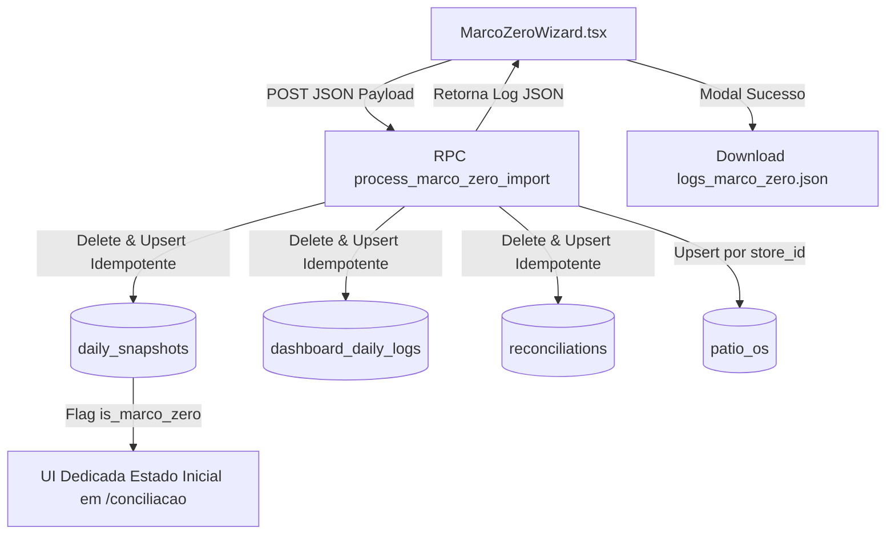

# Design: Refatoração Absoluta do Marco Zero: Matemática, Logs e UI Dedicada (186)

## Arquitetura Técnica
`MarcoZeroWizard.tsx` → RPC `process_marco_zero_import` (Supabase DB) → `daily_snapshots`, `dashboard_daily_logs`, `reconciliations`, `patio_os` → UI Dedicada `/conciliacao`



## Interfaces TypeScript

```typescript
export interface MarcoZeroExecutionLog {
  status: 'success' | 'error';
  target_date: string;
  processed_stores_count: number;
  processed_os_count: number;
  stores_summary: {
    store_id: string;
    store_name: string;
    os_count: number;
    saldo_loja: number;
  }[];
  global_summary: {
    caixa_atual: number;
    caixa_anterior: number;
    faturamento_atual: number;
    faturamento_anterior: number;
    fluxo_caixa: number;
    contas: number;
    diferenca: number;
  };
  execution_logs: string[];
  timestamp: string;
}
```

## Componentes / Hooks / Funções

### 1. Backend: RPC `process_marco_zero_import` (Migration SQL)
- Assinatura: `process_marco_zero_import(p_target_date date, p_global jsonb, p_stores jsonb)`
- Operações atômicas:
  1. `DELETE FROM daily_snapshots WHERE date = p_target_date;`
  2. `DELETE FROM dashboard_daily_logs WHERE date = p_target_date;`
  3. `INSERT INTO daily_snapshots` com `metadata` contendo `is_marco_zero: true`.
  4. `INSERT INTO dashboard_daily_logs` com os saldos exatos.
  5. Loop em `p_stores`:
     - Upsert em `reconciliations` filtrado estritamente por `store_id` e `date = p_target_date`.
     - Upsert em `patio_os` (com `opened_at = p_target_date` e `status = 'em_aberto'`) filtrado por `store_id`.
  6. Constroi o payload JSON de log e retorna.

### 2. Frontend: Modal de Sucesso com Download de Logs (`MarcoZeroWizard.tsx`)
- Após chamar a RPC e receber a resposta:
  - Exibir card com ícone de Sucesso e resumo das filiais e OSs implantadas.
  - Botão **"Baixar Logs de Execução"**: cria um Blob `.json` com `JSON.stringify(logResult, null, 2)` e aciona o download automático (`logs_marco_zero_<DATA>.json`).

### 3. Frontend: UI Dedicada para Marco Zero (`conciliacao.index.tsx` & `ResumoDiaPanel.tsx`)
- Ao detectar `currentSnapshot?.metadata?.is_marco_zero === true`:
  - Renderiza o componente `MarcoZeroInitialStatePanel` (UI Simplificada):
    - Banner com Badge "Marco Zero - Estado Inicial Implantado".
    - Cards com os saldos legados do arquivo.
    - Oculta o bloco de divergências diárias e os botões de ação contábil diária padrão.

## Cenários de Verificação (SCAN → INFER → VERIFY → FIX)
- **Cenário 1:** Executar Marco Zero via Wizard → Verificar se a RPC executa sem erros e retorna o JSON de log → Baixar o arquivo de log `.json`.
- **Cenário 2:** Navegar para a tela `/conciliacao` na data do Marco Zero → Confirmar a exibição da UI Dedicada de Estado Inicial.
- **Cenário 3:** Reexecutar a importação do Marco Zero para a mesma data → Confirmar idempotência total (sem duplicar OSs ou multiplicar saldos).
