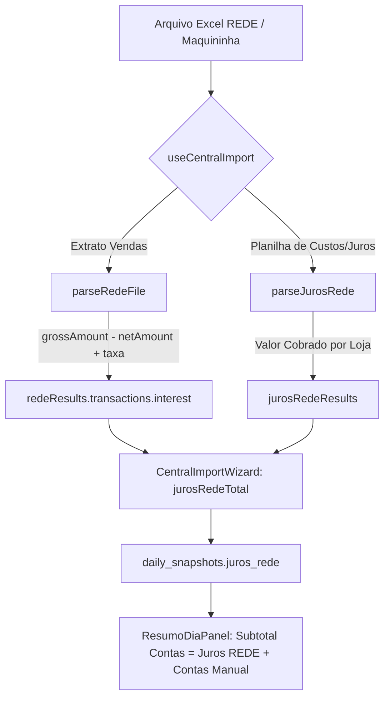

# Technical Design: 207-fix-automatic-rede-juros-calculation-on-import

## Architecture & Data Flow



## Implementation Details

### 1. `src/lib/parsers/redeParser.ts`
- **Cálculo Robusto de Desconto/Juros**:
  ```typescript
  let calculatedDiff = roundCurrency(grossAmount - netAmount);
  let explicitTax = taxRaw !== undefined ? extractNumber(taxRaw) : 0;
  
  // Se houver valor bruto e líquido, o desconto total retido pela adquirente é a diferença exata
  let interest = calculatedDiff > 0 ? calculatedDiff : (explicitTax > 0 ? explicitTax : 0);
  ```
- **Busca Abrangente por Colunas de Taxas e Tarifas**:
  Identificar `taxa de antecipação`, `desconto antecipação`, `tarifa`, `juros`, `mdr`. Se houver coluna de taxa E coluna de antecipação, somar ambas caso `grossAmount - netAmount` seja zero.

### 2. `src/hooks/useCentralImport.ts`
- Importar `parseJurosRede` de `@/lib/parsers/jurosRedeParser`.
- Atualizar `UnifiedImportResult` para incluir `jurosRedeResults: ParsedExpense[]`.
- No fluxo de processamento de arquivos `.xls` / `.xlsx`:
  ```typescript
  // Tenta parseJurosRede se o arquivo tiver padrão de juros/custos
  try {
    const jurosParsed = parseJurosRede(workbook);
    if (jurosParsed && jurosParsed.length > 0) {
      newResults.jurosRedeResults.push(...jurosParsed);
      continue;
    }
  } catch {}
  ```

### 3. `src/components/importacoes/CentralImportWizard.tsx`
- Ao consolidar os juros para gravação:
  ```typescript
  let jurosRedeTotal = 0;
  results.redeResults.forEach(r => {
    if (r.success) {
      r.transactions.forEach(t => {
        jurosRedeTotal += t.interest || 0;
      });
    }
  });
  results.jurosRedeResults?.forEach(j => {
    jurosRedeTotal += j.amount || 0;
  });
  ```
- Persistir `juros_rede: jurosRedeTotal` no `daily_snapshots`.

## Verification Matrix

1. **Upload de Extrato REDE padrão**:
   - `grossAmount` = R$ 10.000,00, `netAmount` = R$ 9.650,00 → `interest` = R$ 350,00 (100% automático).
2. **Upload de Planilha de Juros / Antecipação REDE**:
   - Arquivo detectado automaticamente por `parseJurosRede`, valores extraídos por filial e somados a `jurosRedeTotal`.
3. **Fechamento Diário**:
   - `ResumoDiaPanel` carrega `juros_rede` exato da importação, sem necessidade de digitação manual.
