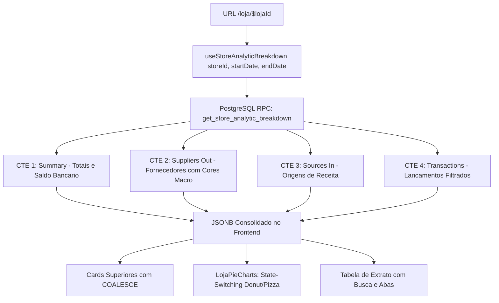

# Design: Refatoração da Tela de Detalhes da Loja com Gráficos Analíticos e Macro Segmentação por Fornecedor (214)

## Arquitetura Técnica



## Especificação da RPC PostgreSQL

```sql
CREATE OR REPLACE FUNCTION public.get_store_analytic_breakdown(
    p_store_id text,
    p_start_date date,
    p_end_date date
)
RETURNS jsonb
LANGUAGE plpgsql
SECURITY DEFINER
AS $$
DECLARE
    v_result jsonb;
BEGIN
    WITH cte_raw_txs AS (
        SELECT
            id,
            store_id,
            type,
            ABS(COALESCE(amount, 0)) AS amount,
            occurred_at,
            target_date,
            title,
            counterpart_name,
            manual_category,
            source,
            CASE
                WHEN counterpart_name IS NOT NULL AND counterpart_name NOT ILIKE 'BANCO DESCONHECIDO%' AND counterpart_name <> '' THEN counterpart_name
                WHEN title ILIKE 'BOLETO PAGO %' THEN TRIM(SUBSTRING(title FROM 13))
                WHEN title ILIKE 'PIX ENVIADO %' THEN TRIM(SUBSTRING(title FROM 13))
                WHEN title ILIKE 'SISPAG %' THEN TRIM(SUBSTRING(title FROM 8))
                WHEN title ILIKE 'SAQUE %' THEN 'Saque em Espécie'
                WHEN title ILIKE 'TAR %' OR title ILIKE 'TARIFA %' OR title ILIKE 'IOF %' THEN 'Tarifas Bancárias'
                WHEN manual_category IS NOT NULL AND manual_category <> '' THEN INITCAP(REPLACE(manual_category, '_', ' '))
                ELSE COALESCE(NULLIF(title, ''), 'Outros Fornecedores')
            END AS clean_supplier_name,
            CASE
                WHEN title ILIKE 'REDE %' OR source = 'rede' THEN 'Cartão REDE'
                WHEN title ILIKE 'PIX %' THEN 'PIX Recebido'
                WHEN title ILIKE 'SISPAG %' OR title ILIKE '%TRANSF%' THEN 'Transferências / TED'
                WHEN title ILIKE 'REND %' OR title ILIKE '%APLIC%' THEN 'Rendimento de Aplicação'
                WHEN manual_category IS NOT NULL AND manual_category <> '' THEN INITCAP(REPLACE(manual_category, '_', ' '))
                ELSE COALESCE(NULLIF(title, ''), 'Outras Receitas')
            END AS clean_source_name
        FROM public.transactions
        WHERE store_id = p_store_id
          AND target_date >= p_start_date
          AND target_date <= p_end_date
    ),
    cte_summary AS (
        SELECT
            COALESCE(SUM(CASE WHEN type = 'in' THEN amount ELSE 0 END), 0) AS total_in,
            COALESCE(SUM(CASE WHEN type = 'out' THEN amount ELSE 0 END), 0) AS total_out,
            COALESCE(SUM(CASE WHEN type = 'in' THEN amount ELSE -amount END), 0) AS net_result,
            COUNT(*) AS total_count
        FROM cte_raw_txs
    ),
    cte_bank_balance AS (
        SELECT COALESCE(bank_total, 0) AS current_balance
        FROM public.reconciliations
        WHERE store_id = p_store_id AND date <= p_end_date
        ORDER BY date DESC LIMIT 1
    ),
    cte_suppliers_out AS (
        SELECT
            clean_supplier_name AS name,
            SUM(amount) AS value,
            COUNT(*) AS count,
            CASE 
                WHEN (SELECT total_out FROM cte_summary) > 0 
                THEN ROUND((SUM(amount) / (SELECT total_out FROM cte_summary) * 100)::numeric, 1)
                ELSE 0 
            END AS percentage
        FROM cte_raw_txs
        WHERE type = 'out'
        GROUP BY clean_supplier_name
        ORDER BY value DESC
    ),
    cte_sources_in AS (
        SELECT
            clean_source_name AS name,
            SUM(amount) AS value,
            COUNT(*) AS count,
            CASE 
                WHEN (SELECT total_in FROM cte_summary) > 0 
                THEN ROUND((SUM(amount) / (SELECT total_in FROM cte_summary) * 100)::numeric, 1)
                ELSE 0 
            END AS percentage
        FROM cte_raw_txs
        WHERE type = 'in'
        GROUP BY clean_source_name
        ORDER BY value DESC
    )
    SELECT jsonb_build_object(
        'store_id', p_store_id,
        'start_date', p_start_date,
        'end_date', p_end_date,
        'current_balance', COALESCE((SELECT current_balance FROM cte_bank_balance), 0),
        'total_in', (SELECT total_in FROM cte_summary),
        'total_out', (SELECT total_out FROM cte_summary),
        'net_result', (SELECT net_result FROM cte_summary),
        'total_count', (SELECT total_count FROM cte_summary),
        'suppliers_out', COALESCE((SELECT jsonb_agg(to_jsonb(s)) FROM cte_suppliers_out s), '[]'::jsonb),
        'sources_in', COALESCE((SELECT jsonb_agg(to_jsonb(i)) FROM cte_sources_in i), '[]'::jsonb),
        'transactions', COALESCE((SELECT jsonb_agg(to_jsonb(t)) FROM (
            SELECT id, occurred_at, target_date, type, amount, title, counterpart_name, clean_supplier_name, clean_source_name, manual_category, source
            FROM cte_raw_txs
            ORDER BY occurred_at DESC
        ) t), '[]'::jsonb)
    ) INTO v_result;

    RETURN v_result;
END;
$$;
```

## Interfaces TypeScript

```typescript
export interface BreakdownCategoryItem {
  name: string;
  value: number;
  count: number;
  percentage: number;
  color?: string;
}

export interface StoreAnalyticBreakdown {
  store_id: string;
  start_date: string;
  end_date: string;
  current_balance: number;
  total_in: number;
  total_out: number;
  net_result: number;
  total_count: number;
  suppliers_out: BreakdownCategoryItem[];
  sources_in: BreakdownCategoryItem[];
  transactions: any[];
}

export type LojaChartMode = 'geral' | 'despesas' | 'receitas';
```

## Componentes / Hooks

1. `src/hooks/useStoreAnalyticBreakdown.ts`:
   - Hook que chama `supabase.rpc('get_store_analytic_breakdown', { p_store_id, p_start_date, p_end_date })` com cache inteligente no TanStack Query.
2. `src/components/lojas/LojaPieCharts.tsx`:
   - Componente React Donut/Pizza com Recharts (`ResponsiveContainer`, `Pie`, `Cell`, `Tooltip`).
   - Botões de alternância com 1 clique (`[Receita x Despesa]`, `[Por Fornecedor]`, `[Por Origem]`).
   - Centro informativo com label e valor dinâmico (`AnimatedNumber`).
   - Paleta de Cores Macro:
     - Receitas: `#10b981` (Verde), `#14b8a6` (Teal), `#3b82f6` (Azul), `#06b6d4` (Ciano).
     - Despesas: `#f43f5e` (Coral/Vermelho), `#f97316` (Laranja), `#eab308` (Amarelo), `#8b5cf6` (Roxo), `#ec4899` (Rosa), `#64748b` (Slate).
3. `src/routes/loja.$lojaId.tsx`:
   - Auto-seleção de data mais recente via `useAvailableConciliacaoDates`.
   - Atalhos rápidos de período (`Último Fechamento`, `Últimos 7 dias`, `Mês Atual`, `Todo o Período`).
   - 4 Cards Superiores com saldo e fluxo líquido.
   - Integração do gráfico e tabela com busca instantânea.

## Cenários de Verificação

- **Cenário 1 (Auto-Data):** Ao acessar `/loja/st-01`, a aplicação detecta a última data com extrato (`14/08/2026`) e exibe os valores reais da loja sem zero artificial.
- **Cenário 2 (Visão Macro):** O gráfico abre em `Receita x Despesa` com 2 fatias (Verde vs Vermelho) e o saldo líquido central.
- **Cenário 3 (Segmentação por Fornecedor):** Ao alternar para `Por Fornecedor` ou clicar na aba `Saídas`, o gráfico se transforma exibindo as despesas por fornecedor em cores macro distintas com percentuais.
- **Cenário 4 (Busca Instantânea):** O operador digita o nome de um fornecedor no extrato e a tabela filtra as transações em tempo real.
