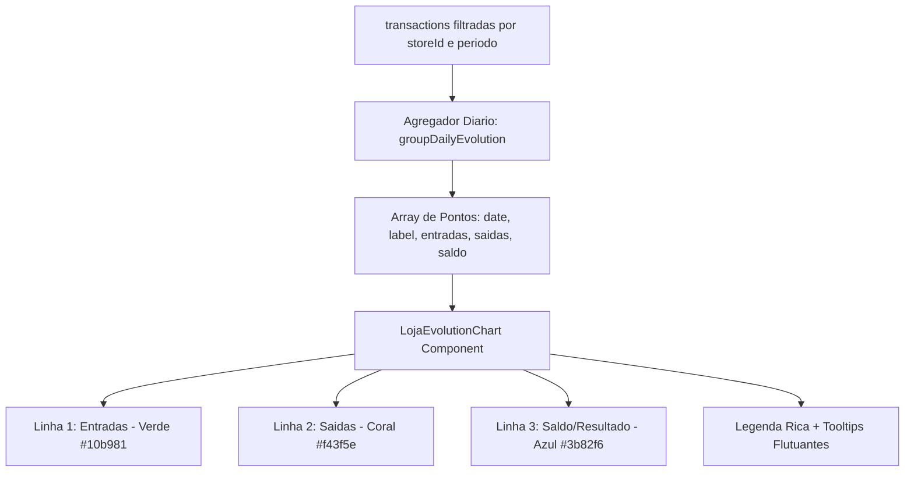

# Design: Limpeza de Dados Pré-Marco Zero e Gráfico de Evolução Diária em 3 Linhas (216)

## Arquitetura de Componentes e Dados



## Interface dos Dados Diários

```typescript
export interface DailyEvolutionPoint {
  date: string;
  label: string; // Ex: "13/08", "14/08"
  entradas: number;
  saidas: number;
  saldo: number;
}
```

## Componente `LojaEvolutionChart.tsx`
- Contêiner de altura `200px` responsivo.
- Linhas:
  - `<Line type="monotone" dataKey="entradas" name="Entradas" stroke="#10b981" strokeWidth={2.5} dot={{ r: 4, fill: '#10b981' }} />`
  - `<Line type="monotone" dataKey="saidas" name="Saídas" stroke="#f43f5e" strokeWidth={2.5} dot={{ r: 4, fill: '#f43f5e' }} />`
  - `<Line type="monotone" dataKey="saldo" name="Saldo Líquido" stroke="#3b82f6" strokeWidth={2.5} dot={{ r: 4, fill: '#3b82f6' }} />`
- Grade cartesiana sutil `stroke="#27272a" strokeDasharray="3 3"`.
- Legenda no topo ou rodapé com chips coloridos.

## Cenários de Verificação

- **Cenário 1 (Limpeza do Banco):** Todas as transações com data anterior a `2026-08-13` são excluídas do banco de dados.
- **Cenário 2 (Gráfico de Linhas):** O card lateral exibe o gráfico com as 3 curvas (Entradas, Saídas e Saldo), e ao passar o mouse sobre um dia, o tooltip exibe os 3 valores formatados em R$.
