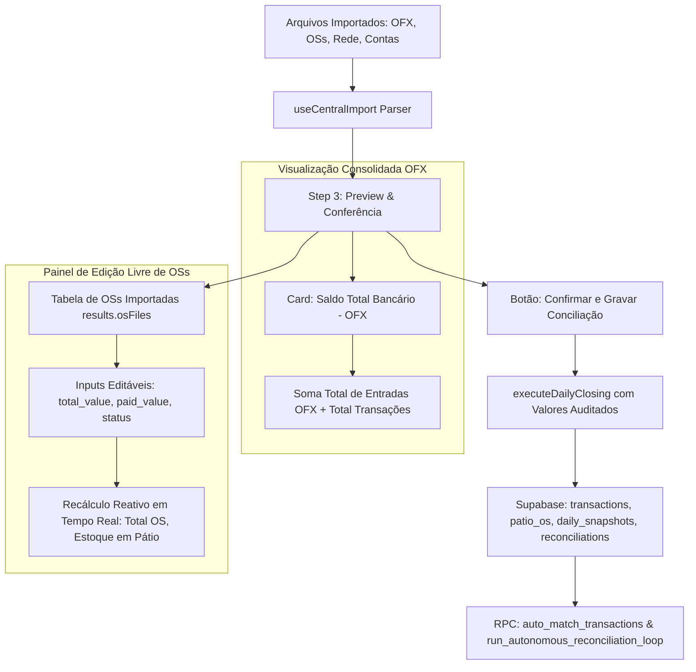

# Design: Saldo Total OFX e Tabela de Edição de OSs no Preview (261)

## Arquitetura Técnica

## Componentes / Hooks / Funções Modificadas

1. **`src/components/importacoes/CentralImportWizard.tsx`:**
   - **`updateImportedOs(fileName: string, osNumber: string, field: 'total_value' | 'paid_value' | 'status', value: any)`:**
     Atualiza o array `results.osFiles` no estado, recalculando instantaneamente:
     - `totalOs` (soma dos `paid_value` / `delta_paid`)
     - `totalPatioEstoqueGlobal` (soma dos `total_value`)
     - `filteredOsCount` e `allOsCount`
     - Previsões por loja (`rawOsMaq`, `storePatioValor`)
   - **Tabela de OSs Importadas:**
     - Tabela dedicada com cabeçalho contendo Busca, Seletor de Loja e Seletor de Status (Todas, Em Aberto, Pagas Parcialmente, Finalizadas).
     - Exibição de: Loja, OS / Placa, Data Abertura, Valor Total (Input R$), Total Pago (Input R$), Saldo Pendente (R$ calculado) e Status (Select).
     - Realce visual nos registros alterados.
   - **Card de OFX:**
     - Nomenclatura atualizada para `Saldo Total Bancário (OFX)` / `Total Extratos (OFX)`.
