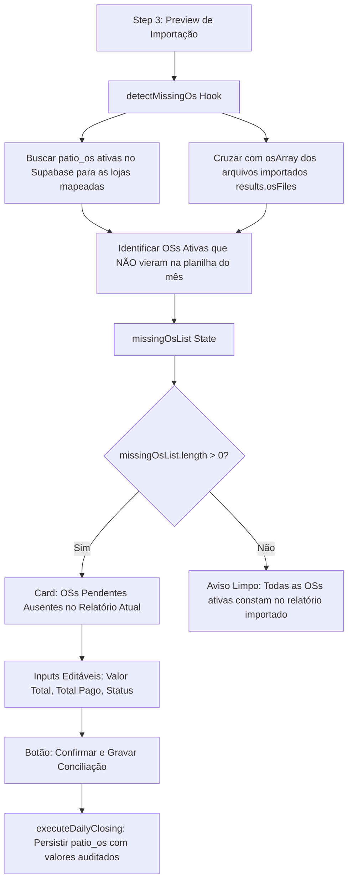

# Design: Restaurar Tabela Exclusiva de OSs Ausentes no Preview (262)

## Arquitetura Técnica



## Componentes / Hooks Modificados

1. **`src/components/importacoes/CentralImportWizard.tsx`:**
   - **`detectMissingOs()`:**
     Executado sempre que `step === 3`.
     ```typescript
     const { data: dbActiveOs } = await supabase
       .from('patio_os')
       .select('id, os_number, plate, store_id, store_name, total_value, paid_value, status, opened_at, days_open')
       .in('store_id', mappedStoreIds)
       .or('status.ilike.%aberto%,status.ilike.%parcial%,status.ilike.%pendente%');
     ```
   - **Tabela no Step 3:**
     - Renderização focada exclusivamente em `missingOsList`.
     - Inputs para `total_value`, `paid_value` e `status`.
     - Exibição de: Loja, OS / Placa, Data Abertura, Valor Total (R$), Total Pago (R$), Saldo Pendente (R$) e Status.
     - Destaque em âmbar nas linhas alteradas (`isModified`).
   - **`executeDailyClosing()`:**
     - Grava as alterações de `missingOsList` no Supabase antes de concluir.

## Cenários de Verificação
- **Cenário 1 (OSs presentes no arquivo):** Planilha contém 250 OSs que batem com o banco → Tabela de OSs ausentes fica vazia/limpa sem poluir a tela.
- **Cenário 2 (OS aberta que não veio na planilha):** OS #5544 consta em aberto no banco mas não veio na planilha de 21/08 → Aparece na tabela de OSs ausentes → Operador altera o status para `finalizado` ou edita o valor pago → Ao salvar, banco é atualizado.
