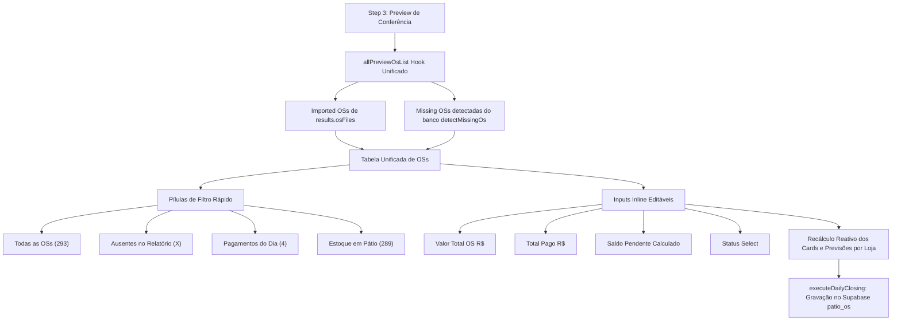

# Design: Tabela Unificada de OSs no Preview com Filtros Rápidos e Edição Livre (263)

## Arquitetura Técnica

## Componentes / Hooks Modificados

1. **`src/components/importacoes/CentralImportWizard.tsx`:**
   - **`allPreviewOsList` (Memoizado):**
     Agrupa todas as ordens de serviço (tanto as importadas da planilha quanto as detectadas do banco como ausentes), marcando a flag `origin: 'file' | 'db_missing'`.
   - **Filtros e Paginação:**
     - `osTabFilter`: `'ALL' | 'MISSING' | 'PAID_TODAY' | 'OPEN_YARD'`
     - `osStoreFilter`: `'ALL' | store_id`
     - `osSearchQuery`: string
     - `osPage`: number (50 itens por página)
   - **Handler `updateOsRow(osId, field, value)`:**
     - Se for de arquivo importado: atualiza `results.osFiles` imutavelmente via `setResults` (atualizando `delta_paid` e `is_edited`).
     - Se for de OS ausente do banco: atualiza `missingOsList`.
   - **Interface da Tabela:**
     - Cabeçalho com pílulas de filtro dinâmicas mostrando as contagens exatas.
     - Barra de busca e select de filiais.
     - Inputs para `total_value` e `paid_value` com formatação e status selector.
     - Badge visual: `Planilha do Dia`, `Ausente no Relatório` ou `Editado`.

## Cenários de Verificação
- **Cenário 1 (Visualização Padrão):** Operador importa 293 OSs → A tabela é renderizada imediatamente com as 293 ordens paginadas e campos editáveis.
- **Cenário 2 (Filtro de Ausentes):** Operador clica na pílula "Ausentes no Relatório" → A tabela filtra na hora apenas as ordens ativas no banco que não vieram na planilha.
- **Cenário 3 (Edição de Valor Total / Pago):** Operador altera o Valor Pago de uma OS de R$ 0,00 para R$ 1.500,00 → O card "Total OS (Recebimentos do Dia)" atualiza instantaneamente para R$ 1.500,00 e o saldo da loja correspondente é recalculado.
