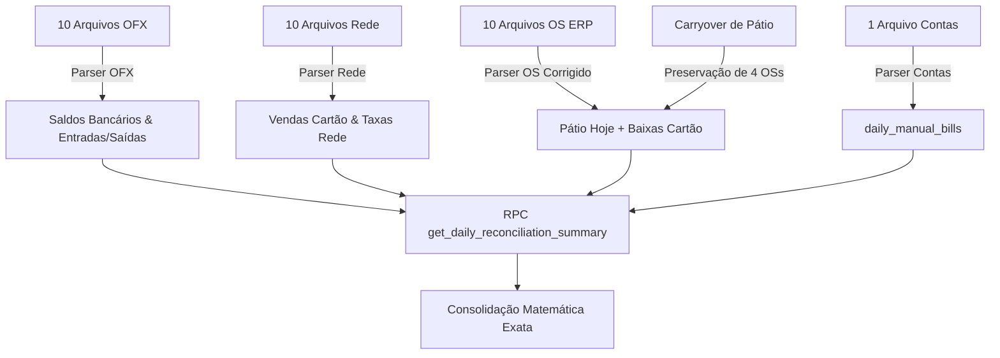

# Design: Motor de Cálculo Direto das Fontes Brutas e Desduplicação de Contas (Spec 278)

## Fluxo de Processamento Direto das Fontes



---

## 1. Correção no Parser de OS (`src/hooks/useOsImportProcessor.ts`)

Substituir a detecção ambígua de `colMap.totalValue` por prioridade estrita:
- Prioridade 1: Coluna com texto `total da os`, `r$ total da os`, `valor da os`, `vl total`
- Ignorar colunas que contenham `total no financeiro` ou `restante na os`.
- Capturar `restante na os` como `restValue` para apurar saldo em aberto diretamente.

---

## 2. Correção na RPC `get_daily_reconciliation_summary`

Eliminar a duplicação entre `contas_base` e `contas_extras`:

```sql
    -- 4. Contas a Pagar
    -- Se existem lançamentos detalhados em daily_manual_bills, eles representam as contas reais
    SELECT COALESCE(SUM(amount), 0) INTO v_contas_extras 
    FROM daily_manual_bills 
    WHERE date = p_date;

    IF v_contas_extras > 0 THEN
        v_contas_manual := v_contas_extras;
    ELSE
        v_contas_manual := COALESCE(v_snapshot.contas_a_pagar, 0);
    END IF;
```

---

## 3. Comportamento do Carryover no Wizard (`MissingPatioOsEditor.tsx`)

- O componente deve listar as OSs de dias anteriores mantendo-as no pátio por padrão (`status = original_status`).
- Evitar que o operador dê baixa em veículos em conserto.
