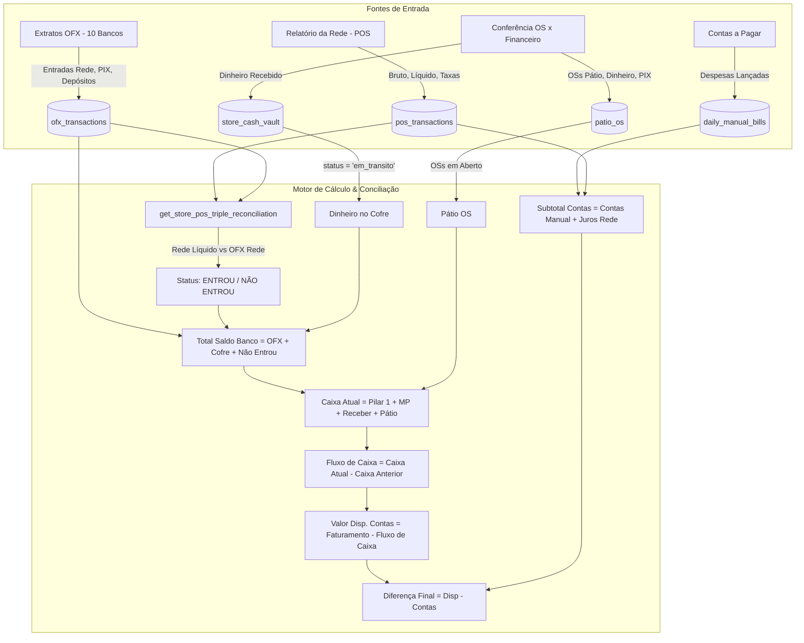

# Design: Arquitetura & Lógica de Match da Rede, PIX, Dinheiro e Contabilização do Saldo Total (281)

## 1. Fluxo de Dados Ponta a Ponta

---

## 2. As 3 Regras de Ouro da Conciliação

1. **Regra de Ouro da Rede:**
   * A venda de cartão só é considerada **"NÃO ENTROU"** se o valor líquido total que passou na maquininha for **maior** do que o lote depositado pela Rede na conta bancária daquela filial.
   * Se for igual ou menor, o status é **`ENTROU`** e o saldo bancário OFX já contém todo o dinheiro.

2. **Regra de Ouro do Dinheiro (Cofre):**
   * Dinheiro que foi levado ao banco e creditado no mesmo dia $\rightarrow$ `status = 'depositado'` (já está dentro do saldo OFX).
   * Dinheiro guardado na gaveta/cofre da loja que ainda não foi ao banco $\rightarrow$ `status = 'em_transito'` (soma no Pilar 1 para não perder patrimônio).

3. **Regra de Ouro do PIX:**
   * O PIX cai na hora na conta corrente. Ele já faz parte do extrato bancário OFX e é identificado pelo valor e nome do cliente para dar baixa na respectiva OS.
