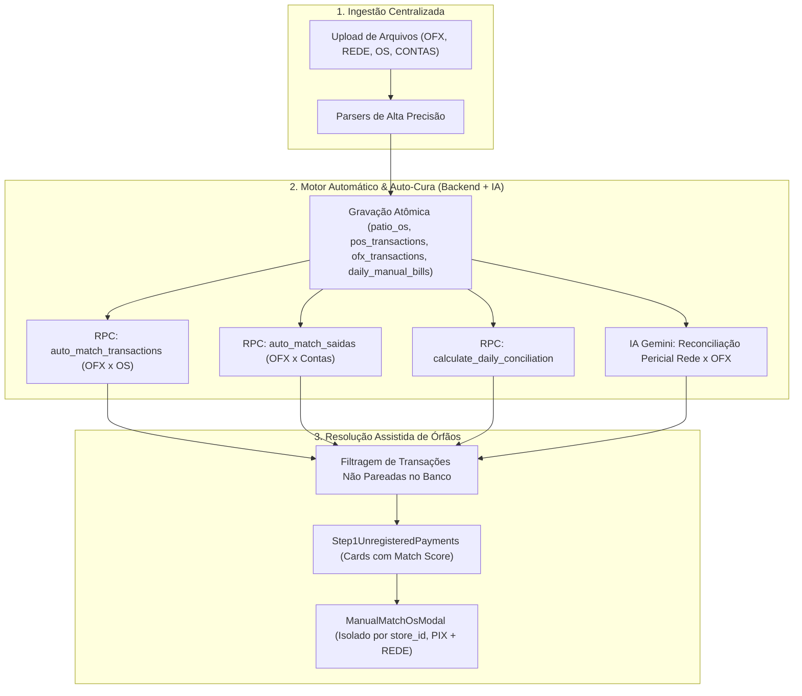

# Design: Inversão do Pipeline de Ingestão com Motor Automático + IA e Unificação do Vínculo Manual PIX & REDE (321)

## Arquitetura e Fluxo de Dados

## Mutações em Arquivos Existentes [MODIFY]
1. `supabase/migrations/20260831000007_create_link_manual_pix_and_rede_rpcs.sql`:
   - Cria as RPCs `link_manual_pix_to_os`, `link_manual_rede_to_os` e `unlink_manual_os_match`.
2. `src/hooks/useManualMatch.ts`:
   - Estende `useManualMatch` para suportar chamadas a `link_manual_pix_to_os` e `link_manual_rede_to_os`.
3. `src/components/conciliacao/ManualMatchOsModal.tsx`:
   - Aceita transações tanto do tipo `ofx` quanto `rede`, calculando os scores contextuais.
4. `src/components/importacoes/CentralImportWizard.tsx`:
   - Executa a gravação e todas as automações/IA no Step de Processamento antes de abrir o Step de Órfãos.
5. `src/components/importacoes/wizard/Step1UnregisteredPayments.tsx`:
   - Integrado com `ManualMatchOsModal` e filtrado por loja.

## Cenários de Verificação (SCAN → INFER → VERIFY → FIX)
- **Cenário 1 (Auto-Match & IA Primeiro)**:
  - SCAN: Processar arquivos no `CentralImportWizard`.
  - INFER: O Step 2 grava os arquivos e executa `auto_match_transactions`, `auto_match_saidas` e IA.
  - VERIFY: Ao chegar no Step 4, apenas as transações sem correspondência são listadas.
- **Cenário 2 (Vínculo Manual de REDE e PIX no Modal)**:
  - SCAN: Clicar em "Vincular à OS" em uma transação pendente de PIX ou REDE.
  - INFER: O `ManualMatchOsModal` abre com as OSs da loja da transação e Match Score ordenado.
  - VERIFY: Ao clicar em vincular, o registro é salvo no banco e desaparece da lista.
